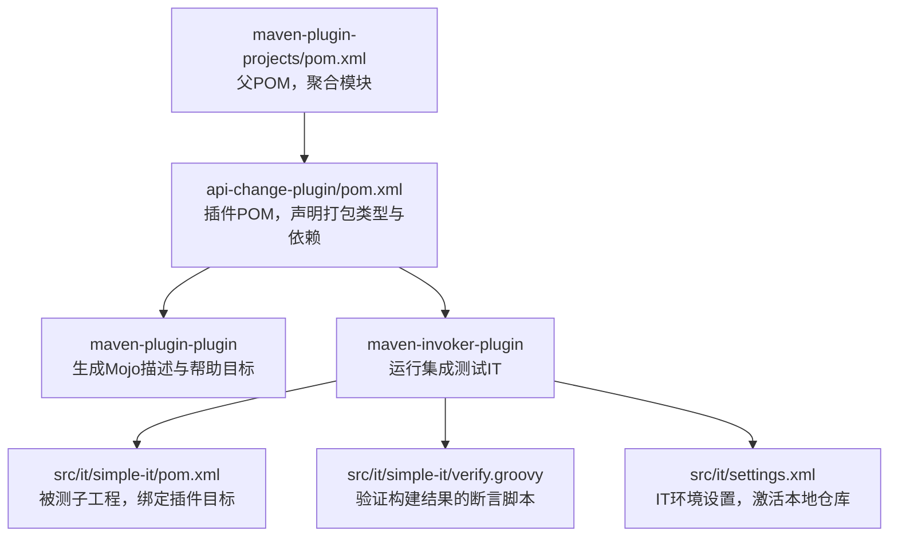
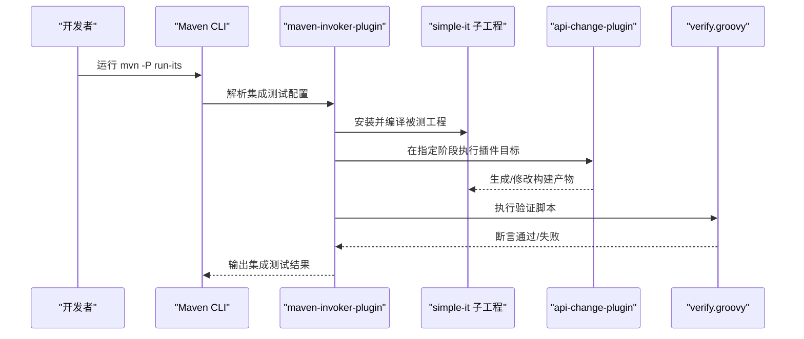
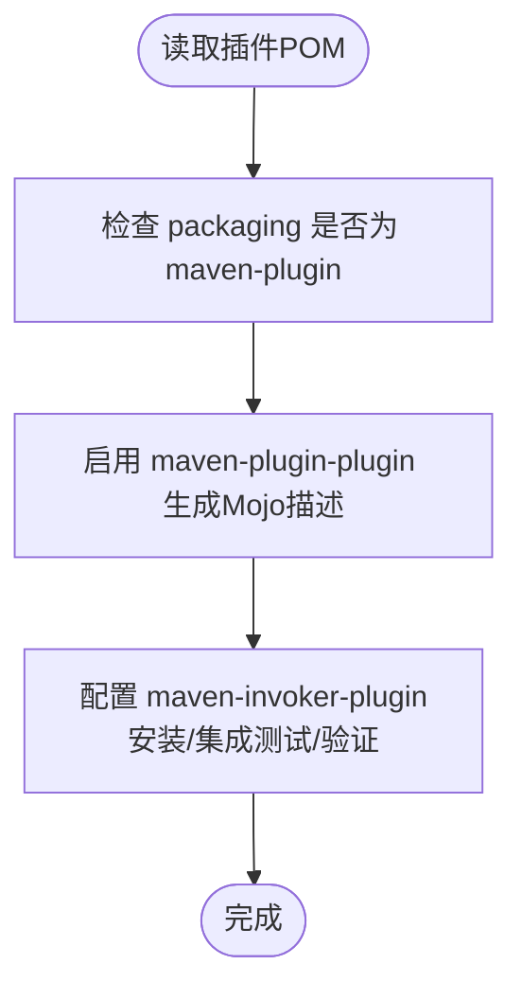
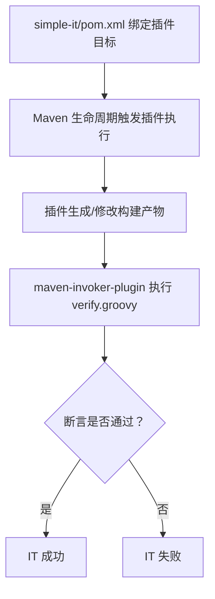
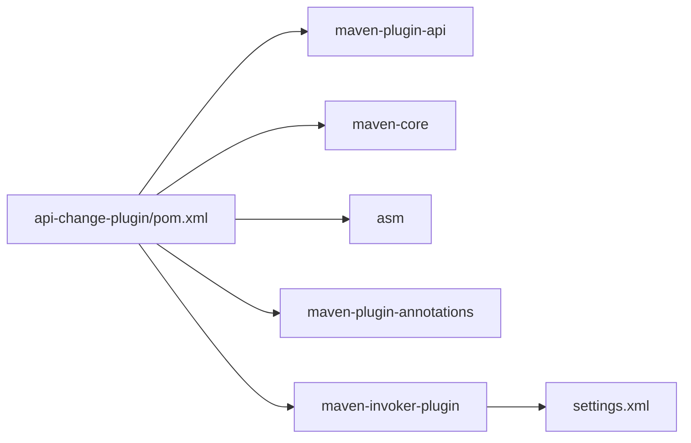

# Maven插件

<cite>
**本文引用的文件**
- [maven-plugin-projects/pom.xml](file://maven-plugin-projects/pom.xml)
- [maven-plugin-projects/api-change-plugin/pom.xml](file://maven-plugin-projects/api-change-plugin/pom.xml)
- [maven-plugin-projects/api-change-plugin/src/it/simple-it/pom.xml](file://maven-plugin-projects/api-change-plugin/src/it/simple-it/pom.xml)
- [maven-plugin-projects/api-change-plugin/src/it/simple-it/verify.groovy](file://maven-plugin-projects/api-change-plugin/src/it/simple-it/verify.groovy)
- [maven-plugin-projects/api-change-plugin/src/it/settings.xml](file://maven-plugin-projects/api-change-plugin/src/it/settings.xml)
</cite>

## 目录
1. [引言](#引言)
2. [项目结构](#项目结构)
3. [核心组件](#核心组件)
4. [架构总览](#架构总览)
5. [详细组件分析](#详细组件分析)
6. [依赖分析](#依赖分析)
7. [性能考虑](#性能考虑)
8. [故障排查指南](#故障排查指南)
9. [结论](#结论)
10. [附录](#附录)

## 引言
本文件围绕“api-change-plugin”在Maven生态中的定位与实践展开，目标是帮助读者理解该插件在Maven构建生命周期中的作用、如何通过集成测试（verify.groovy）验证接口兼容性，并说明其在持续集成流程中的价值：确保服务演进过程中不会破坏现有客户端。同时，文档将梳理插件的配置参数及其对构建结果的影响，给出将其纳入标准化发布流程的建议，以保障API稳定性。

需要特别说明的是：当前仓库中的api-change-plugin模块为一个轻量级示例，主要包含集成测试骨架与基础POM配置，尚未包含具体的API变更检测实现代码。因此，本文将以该模块的实际内容为基础进行解读，并提供可操作的集成与使用建议，以便团队在后续迭代中逐步完善插件能力。

## 项目结构
api-change-plugin模块采用Maven插件的标准目录组织方式，核心由以下部分组成：
- 插件POM：定义插件打包类型、依赖、插件描述生成与集成测试执行配置
- 集成测试（IT）：包含一个最小化场景，演示如何在构建生命周期中绑定插件目标（goal），并通过verify脚本断言构建产物
- 设置文件：为IT环境提供本地仓库镜像与插件仓库激活

图表来源
- [maven-plugin-projects/pom.xml](file://maven-plugin-projects/pom.xml#L1-L22)
- [maven-plugin-projects/api-change-plugin/pom.xml](file://maven-plugin-projects/api-change-plugin/pom.xml#L1-L126)
- [maven-plugin-projects/api-change-plugin/src/it/simple-it/pom.xml](file://maven-plugin-projects/api-change-plugin/src/it/simple-it/pom.xml#L1-L35)
- [maven-plugin-projects/api-change-plugin/src/it/simple-it/verify.groovy](file://maven-plugin-projects/api-change-plugin/src/it/simple-it/verify.groovy#L1-L4)
- [maven-plugin-projects/api-change-plugin/src/it/settings.xml](file://maven-plugin-projects/api-change-plugin/src/it/settings.xml#L1-L56)

章节来源
- [maven-plugin-projects/pom.xml](file://maven-plugin-projects/pom.xml#L1-L22)
- [maven-plugin-projects/api-change-plugin/pom.xml](file://maven-plugin-projects/api-change-plugin/pom.xml#L1-L126)

## 核心组件
- 插件POM（api-change-plugin/pom.xml）
  - 打包类型：maven-plugin
  - 关键依赖：maven-plugin-api、maven-core、asm、maven-plugin-annotations（provided）
  - 插件描述生成：maven-plugin-plugin，生成Mojo描述与帮助目标
  - 集成测试：maven-invoker-plugin，负责安装、集成测试与验证阶段
- 集成测试场景（simple-it）
  - 被测子工程：绑定插件目标到构建生命周期的某个阶段（如validate），用于触发插件行为
  - 验证脚本：verify.groovy，断言构建产物的存在或状态
- IT设置（settings.xml）
  - 激活本地中央仓库镜像，确保IT在离线或隔离环境中也能解析到本地安装的插件

章节来源
- [maven-plugin-projects/api-change-plugin/pom.xml](file://maven-plugin-projects/api-change-plugin/pom.xml#L1-L126)
- [maven-plugin-projects/api-change-plugin/src/it/simple-it/pom.xml](file://maven-plugin-projects/api-change-plugin/src/it/simple-it/pom.xml#L1-L35)
- [maven-plugin-projects/api-change-plugin/src/it/simple-it/verify.groovy](file://maven-plugin-projects/api-change-plugin/src/it/simple-it/verify.groovy#L1-L4)
- [maven-plugin-projects/api-change-plugin/src/it/settings.xml](file://maven-plugin-projects/api-change-plugin/src/it/settings.xml#L1-L56)

## 架构总览
下图展示了api-change-plugin在Maven生命周期中的典型交互路径，以及IT验证的执行顺序。

图表来源
- [maven-plugin-projects/api-change-plugin/pom.xml](file://maven-plugin-projects/api-change-plugin/pom.xml#L85-L124)
- [maven-plugin-projects/api-change-plugin/src/it/simple-it/pom.xml](file://maven-plugin-projects/api-change-plugin/src/it/simple-it/pom.xml#L16-L31)
- [maven-plugin-projects/api-change-plugin/src/it/simple-it/verify.groovy](file://maven-plugin-projects/api-change-plugin/src/it/simple-it/verify.groovy#L1-L4)

## 详细组件分析

### 组件A：插件POM与Mojo描述生成
- 目标与职责
  - 声明插件打包类型为maven-plugin
  - 提供Mojo描述生成与帮助目标，便于用户了解可用目标与参数
  - 通过maven-invoker-plugin配置IT执行链路，包括安装、集成测试与验证阶段
- 关键点
  - goalPrefix：统一前缀，便于CLI调用
  - skipErrorNoDescriptorsFound：允许在缺少Mojo描述时继续构建
  - postBuildHookScript：指定IT后置钩子脚本名称（verify）

图表来源
- [maven-plugin-projects/api-change-plugin/pom.xml](file://maven-plugin-projects/api-change-plugin/pom.xml#L58-L84)
- [maven-plugin-projects/api-change-plugin/pom.xml](file://maven-plugin-projects/api-change-plugin/pom.xml#L85-L124)

章节来源
- [maven-plugin-projects/api-change-plugin/pom.xml](file://maven-plugin-projects/api-change-plugin/pom.xml#L1-L126)

### 组件B：集成测试场景（simple-it）
- 目标与职责
  - 展示如何在被测工程中绑定插件目标到生命周期阶段
  - 通过verify.groovy断言构建产物，验证插件执行效果
- 关键点
  - 插件绑定：在validate阶段执行插件目标
  - 验证逻辑：断言目标目录下存在特定文件

图表来源
- [maven-plugin-projects/api-change-plugin/src/it/simple-it/pom.xml](file://maven-plugin-projects/api-change-plugin/src/it/simple-it/pom.xml#L16-L31)
- [maven-plugin-projects/api-change-plugin/src/it/simple-it/verify.groovy](file://maven-plugin-projects/api-change-plugin/src/it/simple-it/verify.groovy#L1-L4)

章节来源
- [maven-plugin-projects/api-change-plugin/src/it/simple-it/pom.xml](file://maven-plugin-projects/api-change-plugin/src/it/simple-it/pom.xml#L1-L35)
- [maven-plugin-projects/api-change-plugin/src/it/simple-it/verify.groovy](file://maven-plugin-projects/api-change-plugin/src/it/simple-it/verify.groovy#L1-L4)

### 组件C：IT设置（settings.xml）
- 目标与职责
  - 在IT环境中激活本地中央仓库镜像，确保插件与依赖可从本地仓库解析
- 关键点
  - profile激活默认开启
  - 同时配置repository与pluginRepository指向同一本地URL

章节来源
- [maven-plugin-projects/api-change-plugin/src/it/settings.xml](file://maven-plugin-projects/api-change-plugin/src/it/settings.xml#L1-L56)

## 依赖分析
- 插件依赖
  - maven-plugin-api：提供Mojo开发所需的基础API
  - maven-core：访问Maven核心服务（如项目模型、构建上下文等）
  - asm：字节码分析/处理（用于API变更检测的常见手段）
  - maven-plugin-annotations：注解驱动的Mojo声明（provided）
- IT执行依赖
  - maven-invoker-plugin：驱动IT生命周期与验证脚本
  - settings.xml：为IT提供本地仓库镜像

图表来源
- [maven-plugin-projects/api-change-plugin/pom.xml](file://maven-plugin-projects/api-change-plugin/pom.xml#L24-L57)
- [maven-plugin-projects/api-change-plugin/pom.xml](file://maven-plugin-projects/api-change-plugin/pom.xml#L85-L124)
- [maven-plugin-projects/api-change-plugin/src/it/settings.xml](file://maven-plugin-projects/api-change-plugin/src/it/settings.xml#L22-L55)

章节来源
- [maven-plugin-projects/api-change-plugin/pom.xml](file://maven-plugin-projects/api-change-plugin/pom.xml#L1-L126)
- [maven-plugin-projects/api-change-plugin/src/it/settings.xml](file://maven-plugin-projects/api-change-plugin/src/it/settings.xml#L1-L56)

## 性能考虑
- IT执行成本
  - maven-invoker-plugin会克隆测试工程、安装本地依赖，建议仅在必要时启用run-its Profile
- 并行与缓存
  - 在CI中可结合Maven并行构建与本地仓库缓存策略，减少重复下载
- 插件目标粒度
  - 将插件目标绑定到较早生命周期阶段（如validate）有助于尽早发现问题，但需避免引入不必要的编译负担

## 故障排查指南
- IT无法解析插件或依赖
  - 确认已通过maven-invoker-plugin安装插件至本地仓库
  - 检查settings.xml中本地仓库URL是否正确
- 验证脚本断言失败
  - 查看verify.groovy断言条件，确认插件是否按预期生成/修改了目标产物
- 生命周期阶段绑定问题
  - 确认simple-it中插件目标绑定的阶段与期望一致

章节来源
- [maven-plugin-projects/api-change-plugin/src/it/settings.xml](file://maven-plugin-projects/api-change-plugin/src/it/settings.xml#L22-L55)
- [maven-plugin-projects/api-change-plugin/src/it/simple-it/pom.xml](file://maven-plugin-projects/api-change-plugin/src/it/simple-it/pom.xml#L16-L31)
- [maven-plugin-projects/api-change-plugin/src/it/simple-it/verify.groovy](file://maven-plugin-projects/api-change-plugin/src/it/simple-it/verify.groovy#L1-L4)

## 结论
当前仓库中的api-change-plugin模块提供了Maven插件的最小可行骨架：通过maven-plugin-plugin生成Mojo描述，借助maven-invoker-plugin运行IT场景，并以verify.groovy进行断言。尽管该模块尚未包含具体的API变更检测实现，但其结构清晰地展示了如何将插件集成到Maven生命周期并在CI中执行验证。团队可在现有基础上扩展插件功能，实现API变更检测与兼容性校验，从而在服务演进过程中保障客户端稳定。

## 附录

### 如何在标准发布流程中集成
- 在插件中新增Mojo目标，用于扫描类/方法签名变化、统计API差异
- 将Mojo绑定到合适的生命周期阶段（如test-compile或verify），确保在CI中自动执行
- 在verify.groovy中增加断言：若检测到不兼容变更则抛出异常，使CI失败
- 在CI流水线中启用run-its Profile，保证每次提交都执行IT验证

### 可能的配置参数与影响
- maven-plugin-plugin
  - goalPrefix：统一命令前缀，便于CLI调用
  - skipErrorNoDescriptorsFound：允许在缺少Mojo描述时继续构建
- maven-invoker-plugin
  - cloneProjectsTo：IT工程克隆路径
  - postBuildHookScript：验证脚本名称
  - localRepositoryPath：IT使用的本地仓库路径
  - settingsFile：IT使用的settings文件
  - goals：IT执行的目标序列（如clean、test-compile）

章节来源
- [maven-plugin-projects/api-change-plugin/pom.xml](file://maven-plugin-projects/api-change-plugin/pom.xml#L58-L84)
- [maven-plugin-projects/api-change-plugin/pom.xml](file://maven-plugin-projects/api-change-plugin/pom.xml#L85-L124)