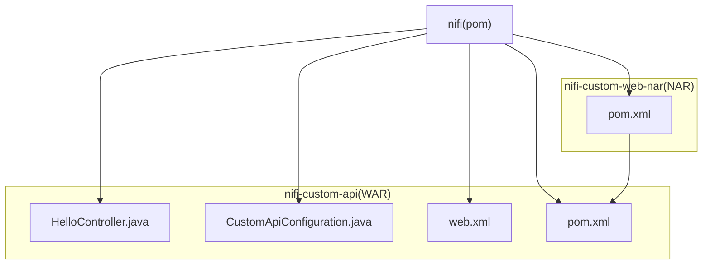
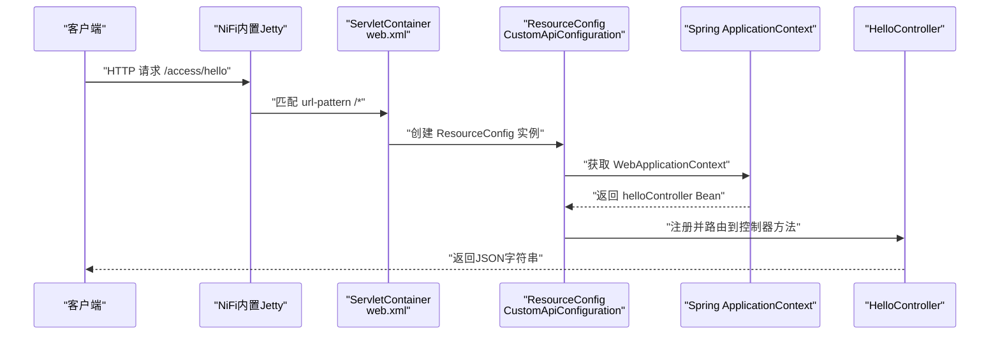
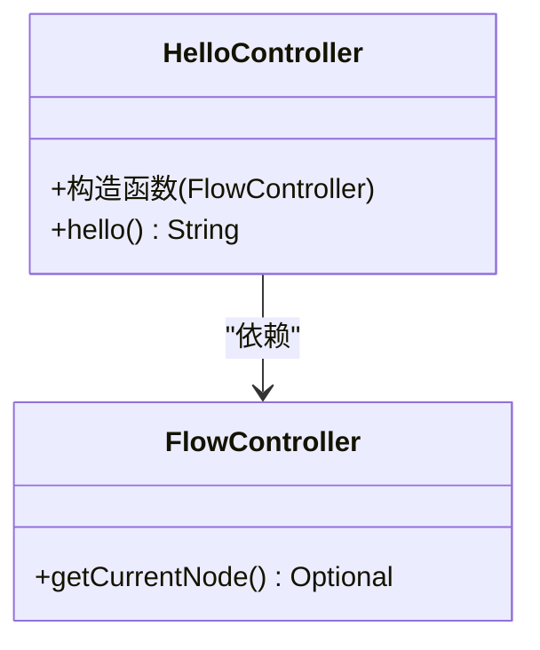
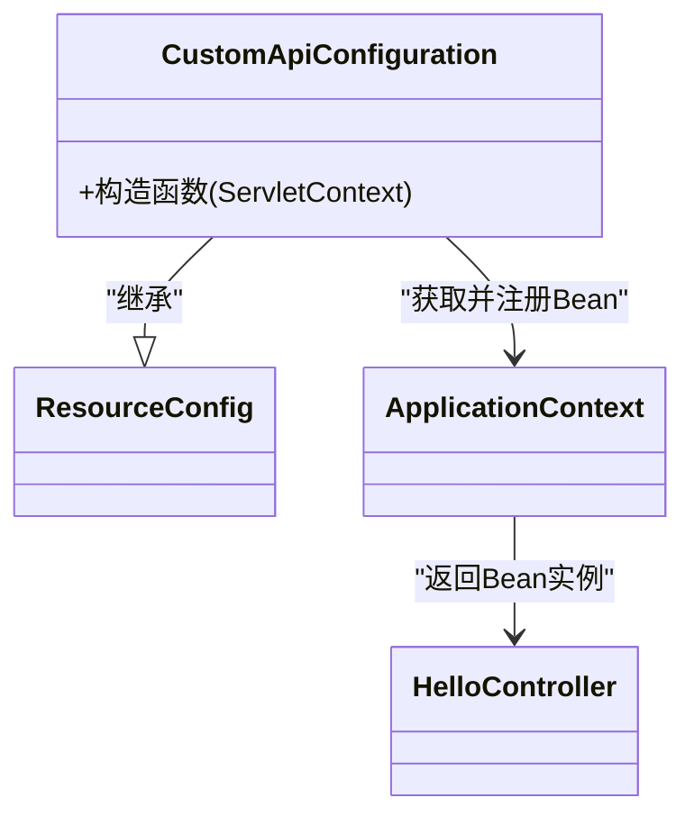
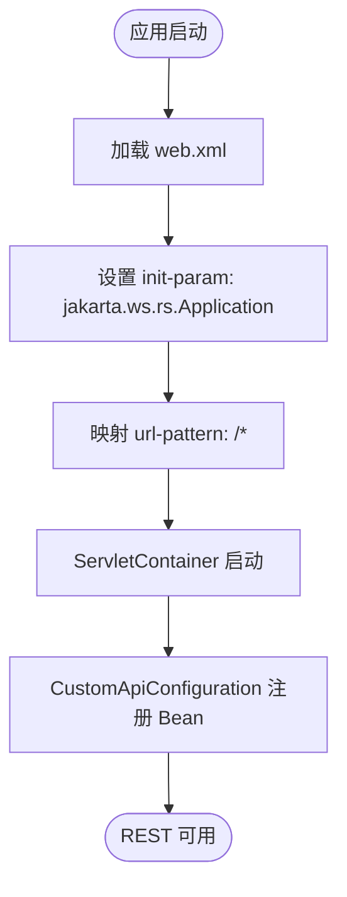
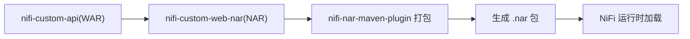
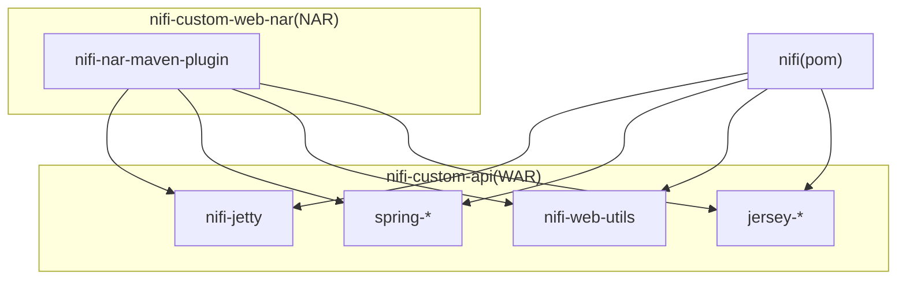

# NiFi扩展开发

<cite>
**本文引用的文件**
- [nifi/nifi-custom-api/src/main/java/org/apache/nifi/api/HelloController.java](file://nifi/nifi-custom-api/src/main/java/org/apache/nifi/api/HelloController.java)
- [nifi/nifi-custom-api/src/main/java/org/apache/nifi/custom/CustomApiConfiguration.java](file://nifi/nifi-custom-api/src/main/java/org/apache/nifi/custom/CustomApiConfiguration.java)
- [nifi/nifi-custom-api/src/main/webapp/WEB-INF/web.xml](file://nifi/nifi-custom-api/src/main/webapp/WEB-INF/web.xml)
- [nifi/nifi-custom-api/pom.xml](file://nifi/nifi-custom-api/pom.xml)
- [nifi/nifi-custom-web-nar/pom.xml](file://nifi/nifi-custom-web-nar/pom.xml)
- [nifi/pom.xml](file://nifi/pom.xml)
</cite>

## 目录
1. [简介](#简介)
2. [项目结构](#项目结构)
3. [核心组件](#核心组件)
4. [架构总览](#架构总览)
5. [详细组件分析](#详细组件分析)
6. [依赖关系分析](#依赖关系分析)
7. [性能考虑](#性能考虑)
8. [故障排查指南](#故障排查指南)
9. [结论](#结论)
10. [附录](#附录)

## 简介
本指南面向希望在Apache NiFi中构建自定义API扩展的开发者，围绕以下目标展开：
- 解析HelloController作为REST端点的实现方式：请求映射、参数处理与响应生成。
- 说明CustomApiConfiguration类如何通过Spring配置机制加载外部属性并初始化相关Bean。
- 解释web.xml中Servlet容器的配置要点及其与NiFi运行时环境的集成方式。
- 演示如何将此模块打包为NAR（NiFi Archive），并在NiFi集群中部署使用。
- 提供调试与日志追踪的最佳实践。

## 项目结构
该仓库包含一个用于演示NiFi自定义API扩展的子模块，以及将其打包为NAR的聚合模块。核心文件位于nifi-custom-api模块中，采用WAR打包；通过nifi-custom-web-nar模块使用nifi-nar-maven-plugin生成NAR包，便于在NiFi运行时加载。

图表来源
- [nifi/pom.xml](file://nifi/pom.xml#L15-L19)
- [nifi/nifi-custom-api/pom.xml](file://nifi/nifi-custom-api/pom.xml#L1-L20)
- [nifi/nifi-custom-web-nar/pom.xml](file://nifi/nifi-custom-web-nar/pom.xml#L1-L20)

章节来源
- [nifi/pom.xml](file://nifi/pom.xml#L15-L19)
- [nifi/nifi-custom-api/pom.xml](file://nifi/nifi-custom-api/pom.xml#L1-L20)
- [nifi/nifi-custom-web-nar/pom.xml](file://nifi/nifi-custom-web-nar/pom.xml#L1-L20)

## 核心组件
- HelloController：基于Jakarta RS注解的REST控制器，暴露“/access/hello”端点，返回当前节点信息。
- CustomApiConfiguration：继承Jersey ResourceConfig，从WebApplicationContext获取并注册HelloController Bean。
- web.xml：声明Jersey ServletContainer，并将所有路径交由该容器处理。
- NAR打包：通过nifi-nar-maven-plugin将WAR打包为NAR，以便NiFi运行时加载。

章节来源
- [nifi/nifi-custom-api/src/main/java/org/apache/nifi/api/HelloController.java](file://nifi/nifi-custom-api/src/main/java/org/apache/nifi/api/HelloController.java#L23-L54)
- [nifi/nifi-custom-api/src/main/java/org/apache/nifi/custom/CustomApiConfiguration.java](file://nifi/nifi-custom-api/src/main/java/org/apache/nifi/custom/CustomApiConfiguration.java#L13-L23)
- [nifi/nifi-custom-api/src/main/webapp/WEB-INF/web.xml](file://nifi/nifi-custom-api/src/main/webapp/WEB-INF/web.xml#L7-L19)
- [nifi/nifi-custom-api/pom.xml](file://nifi/nifi-custom-api/pom.xml#L1-L20)
- [nifi/nifi-custom-web-nar/pom.xml](file://nifi/nifi-custom-web-nar/pom.xml#L1-L20)

## 架构总览
下图展示了从浏览器或客户端发起请求到NiFi运行时的调用链路，以及Spring与Jersey在其中的角色。

图表来源
- [nifi/nifi-custom-api/src/main/webapp/WEB-INF/web.xml](file://nifi/nifi-custom-api/src/main/webapp/WEB-INF/web.xml#L7-L19)
- [nifi/nifi-custom-api/src/main/java/org/apache/nifi/custom/CustomApiConfiguration.java](file://nifi/nifi-custom-api/src/main/java/org/apache/nifi/custom/CustomApiConfiguration.java#L13-L23)
- [nifi/nifi-custom-api/src/main/java/org/apache/nifi/api/HelloController.java](file://nifi/nifi-custom-api/src/main/java/org/apache/nifi/api/HelloController.java#L23-L54)

## 详细组件分析

### HelloController：REST端点实现
- 路径与方法映射
  - 类级路径：使用注解声明根路径为“/access”，结合方法级@Path可形成完整路径“/access/hello”。
  - 方法映射：GET请求，返回类型为字符串，生产JSON媒体类型。
- 参数处理
  - 当前实现未显式接收查询参数或请求体；如需参数，请在方法签名中添加对应注解（例如@QueryParam、@PathParam、@RequestBody等）。
- 响应生成
  - 返回值为字符串，由Jersey自动序列化为JSON响应。
  - 使用OpenAPI注解描述接口行为与可能的响应码，便于文档生成与测试。
- 依赖注入
  - 通过构造函数注入FlowController，用于获取当前节点信息，体现对NiFi运行时能力的访问。

图表来源
- [nifi/nifi-custom-api/src/main/java/org/apache/nifi/api/HelloController.java](file://nifi/nifi-custom-api/src/main/java/org/apache/nifi/api/HelloController.java#L23-L54)

章节来源
- [nifi/nifi-custom-api/src/main/java/org/apache/nifi/api/HelloController.java](file://nifi/nifi-custom-api/src/main/java/org/apache/nifi/api/HelloController.java#L23-L54)

### CustomApiConfiguration：Spring与Jersey集成
- 角色定位
  - 继承Jersey ResourceConfig，负责扫描并注册REST资源。
- Spring上下文获取
  - 通过WebApplicationContextUtils从ServletContext获取ApplicationContext。
  - 从上下文中取出名为“helloController”的Bean并注册到Jersey容器。
- 初始化时机
  - 由ServletContainer在启动时调用构造函数，完成资源注册。

图表来源
- [nifi/nifi-custom-api/src/main/java/org/apache/nifi/custom/CustomApiConfiguration.java](file://nifi/nifi-custom-api/src/main/java/org/apache/nifi/custom/CustomApiConfiguration.java#L13-L23)
- [nifi/nifi-custom-api/src/main/java/org/apache/nifi/api/HelloController.java](file://nifi/nifi-custom-api/src/main/java/org/apache/nifi/api/HelloController.java#L23-L54)

章节来源
- [nifi/nifi-custom-api/src/main/java/org/apache/nifi/custom/CustomApiConfiguration.java](file://nifi/nifi-custom-api/src/main/java/org/apache/nifi/custom/CustomApiConfiguration.java#L13-L23)

### web.xml：Servlet容器配置与NiFi集成
- Servlet声明
  - 名称为“jerseySpring1”，类为Jersey ServletContainer。
- 初始化参数
  - 指定jakarta.ws.rs.Application为CustomApiConfiguration，确保启动时由自定义ResourceConfig接管REST资源注册。
- URL映射
  - url-pattern为“/*”，表示将所有请求交由Jersey处理，从而与NiFi内置的其他服务共存于同一上下文。
- 启动顺序
  - load-on-startup为1，确保在应用启动阶段尽早初始化REST层。

图表来源
- [nifi/nifi-custom-api/src/main/webapp/WEB-INF/web.xml](file://nifi/nifi-custom-api/src/main/webapp/WEB-INF/web.xml#L7-L19)
- [nifi/nifi-custom-api/src/main/java/org/apache/nifi/custom/CustomApiConfiguration.java](file://nifi/nifi-custom-api/src/main/java/org/apache/nifi/custom/CustomApiConfiguration.java#L13-L23)

章节来源
- [nifi/nifi-custom-api/src/main/webapp/WEB-INF/web.xml](file://nifi/nifi-custom-api/src/main/webapp/WEB-INF/web.xml#L7-L19)

### NAR打包与部署流程
- WAR到NAR
  - nifi-custom-web-nar模块依赖nifi-custom-api的WAR产物，并通过nifi-nar-maven-plugin生成NAR。
- 版本与坐标
  - 顶层pom统一管理nifi版本号，确保依赖一致性。
- 部署建议
  - 将生成的NAR放置于NiFi的lib目录或通过NiFi Registry进行分发，重启或热加载后生效。

图表来源
- [nifi/nifi-custom-web-nar/pom.xml](file://nifi/nifi-custom-web-nar/pom.xml#L1-L40)
- [nifi/nifi-custom-api/pom.xml](file://nifi/nifi-custom-api/pom.xml#L1-L20)
- [nifi/pom.xml](file://nifi/pom.xml#L21-L33)

章节来源
- [nifi/nifi-custom-web-nar/pom.xml](file://nifi/nifi-custom-web-nar/pom.xml#L1-L40)
- [nifi/nifi-custom-api/pom.xml](file://nifi/nifi-custom-api/pom.xml#L1-L20)
- [nifi/pom.xml](file://nifi/pom.xml#L21-L33)

## 依赖关系分析
- WAR模块依赖
  - nifi-jetty：提供嵌入式Web服务器能力。
  - Spring相关：spring-beans、spring-context、spring-web，用于Bean生命周期与Web上下文集成。
  - nifi-web-utils：提供与NiFi Web层相关的工具与实体。
  - Jersey相关：jersey-server、jersey-common、jersey-container-servlet-core，用于REST服务实现。
- NAR模块依赖
  - 依赖nifi-custom-api的WAR产物，通过nifi-nar-maven-plugin打包为NAR。

图表来源
- [nifi/nifi-custom-api/pom.xml](file://nifi/nifi-custom-api/pom.xml#L17-L72)
- [nifi/nifi-custom-web-nar/pom.xml](file://nifi/nifi-custom-web-nar/pom.xml#L20-L40)
- [nifi/pom.xml](file://nifi/pom.xml#L21-L103)

章节来源
- [nifi/nifi-custom-api/pom.xml](file://nifi/nifi-custom-api/pom.xml#L17-L72)
- [nifi/nifi-custom-web-nar/pom.xml](file://nifi/nifi-custom-web-nar/pom.xml#L20-L40)
- [nifi/pom.xml](file://nifi/pom.xml#L21-L103)

## 性能考虑
- 资源注册开销
  - ResourceConfig在启动时一次性注册Bean，避免在请求路径上重复查找与实例化。
- 媒体类型与序列化
  - 控制器返回字符串，序列化成本低；若改为复杂对象，建议使用Jackson等高效序列化库并合理缓存。
- 并发与线程模型
  - 在高并发场景下，注意控制器方法无状态且避免阻塞操作；必要时引入异步处理或线程池。
- 依赖注入与作用域
  - FlowController等NiFi运行时对象通常为单例或受控实例，确保线程安全与不可变性。

## 故障排查指南
- 端点无法访问
  - 检查web.xml中的url-pattern是否覆盖目标路径；确认CustomApiConfiguration已成功注册Bean。
- 404/405错误
  - 确认类路径与方法路径拼接正确；检查HTTP方法与Content-Type是否匹配。
- 启动失败
  - 查看NiFi启动日志，定位Jersey初始化异常或Spring上下文未加载问题。
- 日志追踪
  - 在控制器方法前后记录关键参数与返回值摘要，避免泄露敏感信息。
  - 结合NiFi日志级别调整，必要时开启DEBUG以捕获请求链路。

## 结论
本示例展示了在NiFi中通过Jersey与Spring集成的方式快速构建REST API扩展，并以NAR形式交付。通过明确的请求映射、Bean注册与Servlet容器配置，开发者可以在此基础上扩展更多业务端点，满足集群管理、数据导出、状态查询等需求。

## 附录

### 开发与调试最佳实践
- 使用OpenAPI注解完善接口文档，便于联调与测试。
- 对外暴露的端点尽量保持幂等与无副作用，必要时增加鉴权与限流。
- 在本地或测试环境先验证端点可用性，再逐步迁移至预生产与生产。
- 关注NiFi版本兼容性，确保依赖版本与运行时一致。