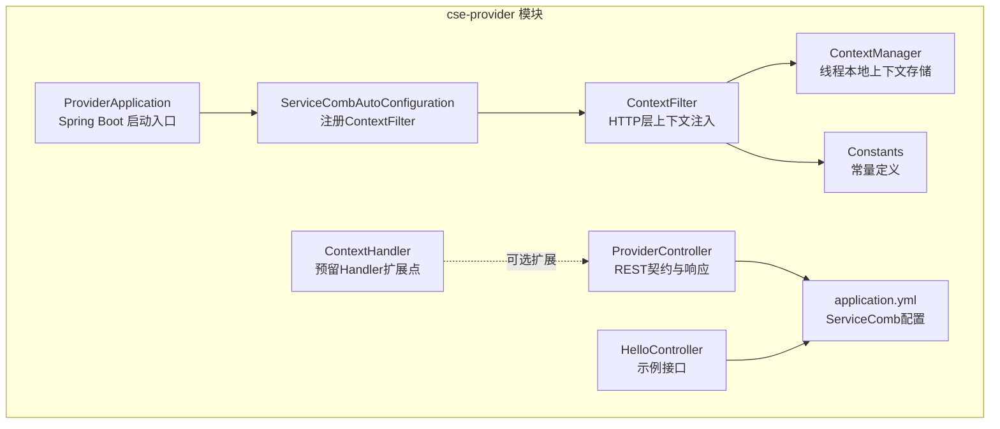
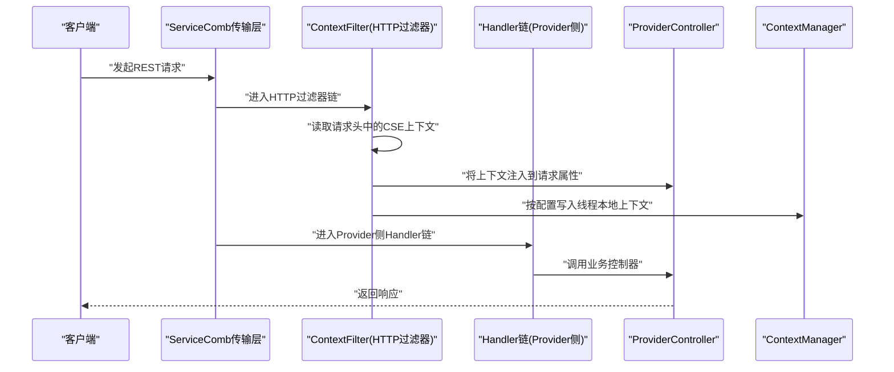
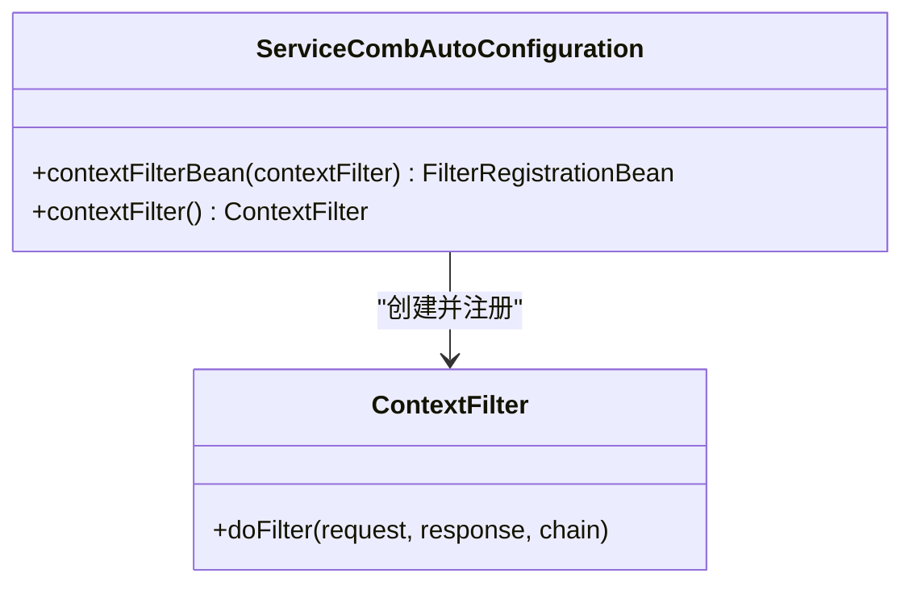
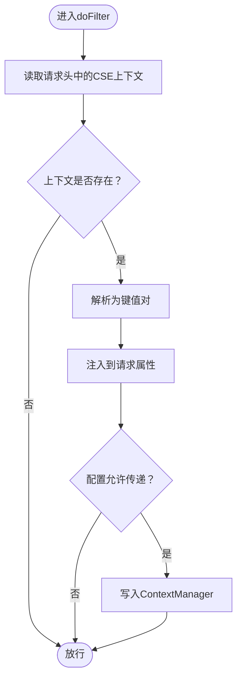
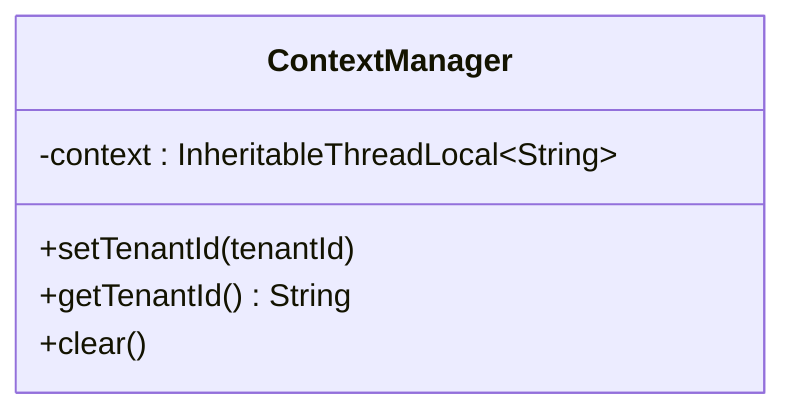
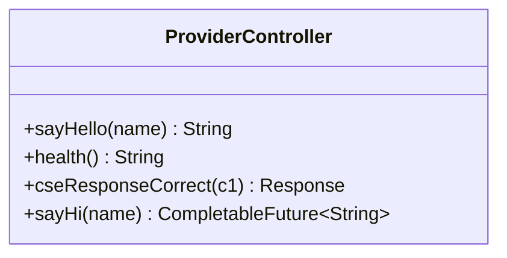
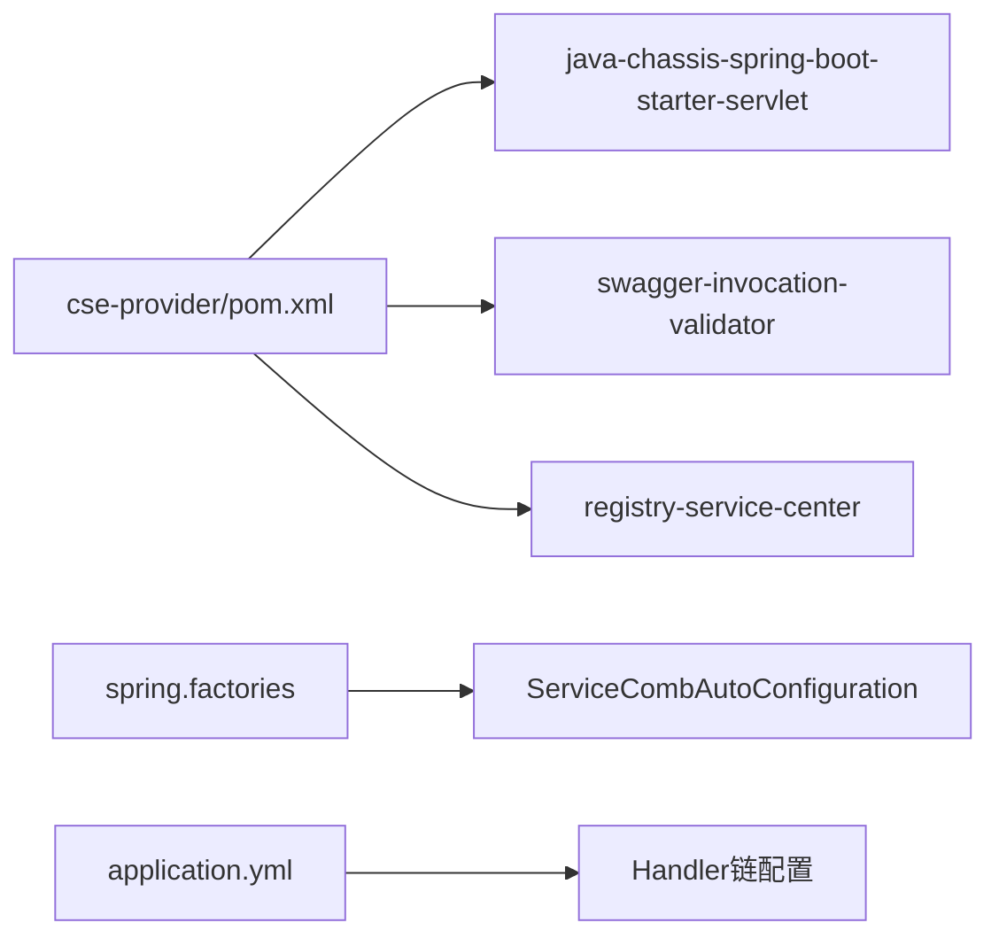

# ServiceComb服务集成

<cite>
**本文引用的文件列表**
- [ServiceCombAutoConfiguration.java](file://servicecomb-project/cse-provider/src/main/java/com/castile/autoconfig/ServiceCombAutoConfiguration.java)
- [ContextFilter.java](file://servicecomb-project/cse-provider/src/main/java/com/castile/samples/filter/ContextFilter.java)
- [ContextManager.java](file://servicecomb-project/cse-provider/src/main/java/com/castile/context/ContextManager.java)
- [application.yml](file://servicecomb-project/cse-provider/src/main/resources/application.yml)
- [ProviderApplication.java](file://servicecomb-project/cse-provider/src/main/java/com/castile/ProviderApplication.java)
- [ProviderController.java](file://servicecomb-project/cse-provider/src/main/java/com/castile/samples/ProviderController.java)
- [HelloController.java](file://servicecomb-project/cse-provider/src/main/java/com/castile/samples/HelloController.java)
- [Constants.java](file://servicecomb-project/cse-provider/src/main/java/com/castile/Constants.java)
- [ContextHandler.java](file://servicecomb-project/cse-provider/src/main/java/com/castile/samples/handler/ContextHandler.java)
- [pom.xml（cse-provider）](file://servicecomb-project/cse-provider/pom.xml)
- [pom.xml（根项目）](file://servicecomb-project/pom.xml)
- [spring.factories](file://servicecomb-project/cse-provider/src/main/resources/META-INF/spring.factories)
</cite>

## 目录
1. [简介](#简介)
2. [项目结构](#项目结构)
3. [核心组件](#核心组件)
4. [架构总览](#架构总览)
5. [详细组件分析](#详细组件分析)
6. [依赖关系分析](#依赖关系分析)
7. [性能与治理特性](#性能与治理特性)
8. [故障排查指南](#故障排查指南)
9. [结论](#结论)
10. [附录：配置与使用示例路径](#附录配置与使用示例路径)

## 简介
本文件面向希望在Spring Boot应用中集成Apache ServiceComb的开发者，系统性阐述以下内容：
- 如何通过ServiceCombAutoConfiguration注册ContextFilter以实现跨服务调用的上下文传递；
- 请求过滤器的注册机制与执行顺序控制；
- 分布式环境下ContextManager的上下文管理职责及其与ServiceComb治理能力（负载均衡、限流、熔断等）的协同方式；
- 结合application.yml中的关键配置项，解释服务注册、契约定义、传输协议等核心概念的实际配置方法；
- 提供服务暴露、消费者调用及异常处理的完整代码示例路径。

## 项目结构
该仓库包含一个基于ServiceComb的示例模块（cse-provider），其核心由Spring Boot引导类、ServiceComb自动装配、上下文过滤器与控制器组成。下图展示模块内关键文件与职责映射。

图表来源
- [ProviderApplication.java](file://servicecomb-project/cse-provider/src/main/java/com/castile/ProviderApplication.java#L1-L32)
- [ServiceCombAutoConfiguration.java](file://servicecomb-project/cse-provider/src/main/java/com/castile/autoconfig/ServiceCombAutoConfiguration.java#L1-L31)
- [ContextFilter.java](file://servicecomb-project/cse-provider/src/main/java/com/castile/samples/filter/ContextFilter.java#L1-L52)
- [ContextManager.java](file://servicecomb-project/cse-provider/src/main/java/com/castile/context/ContextManager.java#L1-L36)
- [ProviderController.java](file://servicecomb-project/cse-provider/src/main/java/com/castile/samples/ProviderController.java#L1-L79)
- [HelloController.java](file://servicecomb-project/cse-provider/src/main/java/com/castile/samples/HelloController.java#L1-L22)
- [application.yml](file://servicecomb-project/cse-provider/src/main/resources/application.yml#L1-L65)
- [Constants.java](file://servicecomb-project/cse-provider/src/main/java/com/castile/Constants.java#L1-L13)
- [ContextHandler.java](file://servicecomb-project/cse-provider/src/main/java/com/castile/samples/handler/ContextHandler.java#L1-L32)

章节来源
- [ProviderApplication.java](file://servicecomb-project/cse-provider/src/main/java/com/castile/ProviderApplication.java#L1-L32)
- [pom.xml（cse-provider）](file://servicecomb-project/cse-provider/pom.xml#L1-L68)
- [pom.xml（根项目）](file://servicecomb-project/pom.xml#L1-L69)

## 核心组件
- ServiceCombAutoConfiguration：负责注册Servlet层的ContextFilter，使其参与HTTP请求生命周期。
- ContextFilter：从请求头读取ServiceComb上下文，将其注入到HttpServletRequest属性中；根据配置决定是否将租户ID写入ContextManager。
- ContextManager：提供线程安全的上下文存储，用于在当前线程链路中传递租户ID等信息。
- ProviderController：通过@RestSchema暴露REST契约，返回标准响应或异步结果。
- HelloController：提供简单示例接口，便于验证服务可用性。
- application.yml：集中配置ServiceComb的服务名、版本、注册中心地址、传输协议、日志与治理链等。

章节来源
- [ServiceCombAutoConfiguration.java](file://servicecomb-project/cse-provider/src/main/java/com/castile/autoconfig/ServiceCombAutoConfiguration.java#L1-L31)
- [ContextFilter.java](file://servicecomb-project/cse-provider/src/main/java/com/castile/samples/filter/ContextFilter.java#L1-L52)
- [ContextManager.java](file://servicecomb-project/cse-provider/src/main/java/com/castile/context/ContextManager.java#L1-L36)
- [ProviderController.java](file://servicecomb-project/cse-provider/src/main/java/com/castile/samples/ProviderController.java#L1-L79)
- [HelloController.java](file://servicecomb-project/cse-provider/src/main/java/com/castile/samples/HelloController.java#L1-L22)
- [application.yml](file://servicecomb-project/cse-provider/src/main/resources/application.yml#L1-L65)

## 架构总览
下图展示了从客户端到Provider的调用链路，重点体现上下文在HTTP过滤器阶段被注入、在ServiceComb治理链中传递，并最终在Provider端被消费的过程。

图表来源
- [ContextFilter.java](file://servicecomb-project/cse-provider/src/main/java/com/castile/samples/filter/ContextFilter.java#L1-L52)
- [ContextManager.java](file://servicecomb-project/cse-provider/src/main/java/com/castile/context/ContextManager.java#L1-L36)
- [ProviderController.java](file://servicecomb-project/cse-provider/src/main/java/com/castile/samples/ProviderController.java#L1-L79)
- [application.yml](file://servicecomb-project/cse-provider/src/main/resources/application.yml#L43-L55)

## 详细组件分析

### 组件一：ServiceCombAutoConfiguration与过滤器注册
- 职责：通过FilterRegistrationBean注册ContextFilter，使其参与HTTP请求生命周期。
- 注册机制：自动装配类中声明两个Bean：一个返回FilterRegistrationBean，另一个返回ContextFilter实例。
- 执行顺序：FilterRegistrationBean可设置URL模式与优先级，从而控制过滤器在过滤器链中的先后顺序。

图表来源
- [ServiceCombAutoConfiguration.java](file://servicecomb-project/cse-provider/src/main/java/com/castile/autoconfig/ServiceCombAutoConfiguration.java#L1-L31)
- [ContextFilter.java](file://servicecomb-project/cse-provider/src/main/java/com/castile/samples/filter/ContextFilter.java#L1-L52)

章节来源
- [ServiceCombAutoConfiguration.java](file://servicecomb-project/cse-provider/src/main/java/com/castile/autoconfig/ServiceCombAutoConfiguration.java#L1-L31)
- [spring.factories](file://servicecomb-project/cse-provider/src/main/resources/META-INF/spring.factories#L1-L2)

### 组件二：ContextFilter与上下文传递
- 输入：从请求头读取ServiceComb上下文（键为CSE_CONTEXT），解析为键值对后注入到HttpServletRequest属性中。
- 条件写入：当配置项servicecomb.server.context.pass为true时，将租户ID写入ContextManager。
- 配置项：通过@Value绑定application.yml中的servicecomb.server.context.pass。

图表来源
- [ContextFilter.java](file://servicecomb-project/cse-provider/src/main/java/com/castile/samples/filter/ContextFilter.java#L1-L52)
- [application.yml](file://servicecomb-project/cse-provider/src/main/resources/application.yml#L16-L19)
- [Constants.java](file://servicecomb-project/cse-provider/src/main/java/com/castile/Constants.java#L1-L13)

章节来源
- [ContextFilter.java](file://servicecomb-project/cse-provider/src/main/java/com/castile/samples/filter/ContextFilter.java#L1-L52)
- [application.yml](file://servicecomb-project/cse-provider/src/main/resources/application.yml#L16-L19)
- [Constants.java](file://servicecomb-project/cse-provider/src/main/java/com/castile/Constants.java#L1-L13)

### 组件三：ContextManager在线程本地的上下文管理
- 数据结构：使用InheritableThreadLocal存储当前线程的上下文（如租户ID）。
- 能力：提供set/get/clear操作，支持父子线程继承场景。
- 使用场景：在过滤器中写入，在后续Handler或业务逻辑中读取。

图表来源
- [ContextManager.java](file://servicecomb-project/cse-provider/src/main/java/com/castile/context/ContextManager.java#L1-L36)

章节来源
- [ContextManager.java](file://servicecomb-project/cse-provider/src/main/java/com/castile/context/ContextManager.java#L1-L36)

### 组件四：ProviderController与契约暴露
- 契约定义：通过@RestSchema(schemaId)和@RequestMapping/@GetMapping等注解暴露REST接口。
- 返回类型：支持同步字符串、异步CompletableFuture、标准Response对象。
- 上下文使用：可通过InvocationContext读取调用上下文，向响应头注入自定义字段。

图表来源
- [ProviderController.java](file://servicecomb-project/cse-provider/src/main/java/com/castile/samples/ProviderController.java#L1-L79)

章节来源
- [ProviderController.java](file://servicecomb-project/cse-provider/src/main/java/com/castile/samples/ProviderController.java#L1-L79)

### 组件五：HelloController与消费者调用示例
- 示例接口：提供简单的/hello接口，便于快速验证服务可用性。
- 调用示例：注释中展示了如何使用RestTemplateBuilder进行跨微服务调用（例如调用自身健康检查接口）。

章节来源
- [HelloController.java](file://servicecomb-project/cse-provider/src/main/java/com/castile/samples/HelloController.java#L1-L22)

## 依赖关系分析
- Maven依赖：cse-provider引入java-chassis-spring-boot-starter-servlet、swagger-invocation-validator、registry-service-center等，确保ServiceComb核心能力可用。
- Spring Factories：通过spring.factories启用ServiceCombAutoConfiguration，实现自动装配。
- Handler链：application.yml中配置了Consumer/Provider两端的Handler链，默认包含context、qps-flowcontrol、loadbalance等，体现ServiceComb的治理能力。

图表来源
- [pom.xml（cse-provider）](file://servicecomb-project/cse-provider/pom.xml#L1-L68)
- [spring.factories](file://servicecomb-project/cse-provider/src/main/resources/META-INF/spring.factories#L1-L2)
- [application.yml](file://servicecomb-project/cse-provider/src/main/resources/application.yml#L43-L55)

章节来源
- [pom.xml（cse-provider）](file://servicecomb-project/cse-provider/pom.xml#L1-L68)
- [pom.xml（根项目）](file://servicecomb-project/pom.xml#L1-L69)
- [spring.factories](file://servicecomb-project/cse-provider/src/main/resources/META-INF/spring.factories#L1-L2)
- [application.yml](file://servicecomb-project/cse-provider/src/main/resources/application.yml#L43-L55)

## 性能与治理特性
- 负载均衡：Provider端Handler链默认包含loadbalance，结合ServiceCenter实现服务发现与路由。
- 限流与QPS控制：qps-flowcontrol-*处理器在Consumer/Provider两端分别生效，限制请求速率。
- 传输协议：rest.address与rest.servlet.urlPattern共同定义传输协议与URL映射，确保与Web容器兼容。
- 日志：server.accesslog与client.request日志均可配置，便于问题定位与审计。

章节来源
- [application.yml](file://servicecomb-project/cse-provider/src/main/resources/application.yml#L1-L65)

## 故障排查指南
- 上下文未传递
  - 检查请求头是否包含CSE_CONTEXT；确认ContextFilter已注册且URL匹配。
  - 确认application.yml中servicecomb.server.context.pass配置为true时才会写入ContextManager。
- 租户ID缺失
  - 检查CSE_CONTEXT中是否包含x-biz-tenantId键；确认Constants中键名一致。
- Handler链不生效
  - 检查application.yml中handler.chain.Consumer/Provider的default链是否包含context、qps-flowcontrol、loadbalance等。
- 服务不可见
  - 检查registry.sc.address是否可达；确认servicecomb.service.name与version正确。

章节来源
- [ContextFilter.java](file://servicecomb-project/cse-provider/src/main/java/com/castile/samples/filter/ContextFilter.java#L1-L52)
- [application.yml](file://servicecomb-project/cse-provider/src/main/resources/application.yml#L1-L65)
- [Constants.java](file://servicecomb-project/cse-provider/src/main/java/com/castile/Constants.java#L1-L13)

## 结论
本方案通过ServiceCombAutoConfiguration注册ContextFilter，实现了HTTP层上下文的自动注入与传递；结合ContextManager在分布式链路中保持上下文一致性；配合application.yml中的Handler链配置，ServiceComb的负载均衡、限流等治理能力得以有效落地。通过ProviderController与HelloController的示例，开发者可以快速完成服务暴露、消费者调用与异常处理的实践。

## 附录：配置与使用示例路径
- 服务注册与契约
  - 服务元数据：servicecomb.service.application、servicecomb.service.name、servicecomb.service.version
  - 注册中心：registry.sc.address
  - 参考路径：[application.yml](file://servicecomb-project/cse-provider/src/main/resources/application.yml#L29-L42)
- 传输协议与URL映射
  - rest.address、rest.servlet.urlPattern
  - 参考路径：[application.yml](file://servicecomb-project/cse-provider/src/main/resources/application.yml#L43-L48)
- 上下文传递开关
  - servicecomb.server.context.pass
  - 参考路径：[application.yml](file://servicecomb-project/cse-provider/src/main/resources/application.yml#L16-L19)
- Handler链（负载均衡、限流）
  - handler.chain.Consumer.default、handler.chain.Provider.default
  - 参考路径：[application.yml](file://servicecomb-project/cse-provider/src/main/resources/application.yml#L49-L55)
- 过滤器注册与执行顺序
  - ServiceCombAutoConfiguration注册ContextFilter
  - 参考路径：[ServiceCombAutoConfiguration.java](file://servicecomb-project/cse-provider/src/main/java/com/castile/autoconfig/ServiceCombAutoConfiguration.java#L1-L31)
- 上下文注入与写入
  - ContextFilter从请求头读取CSE_CONTEXT并注入请求属性；按配置写入ContextManager
  - 参考路径：[ContextFilter.java](file://servicecomb-project/cse-provider/src/main/java/com/castile/samples/filter/ContextFilter.java#L1-L52)
- 上下文管理
  - ContextManager提供set/get/clear
  - 参考路径：[ContextManager.java](file://servicecomb-project/cse-provider/src/main/java/com/castile/context/ContextManager.java#L1-L36)
- 服务暴露与调用示例
  - ProviderController暴露REST契约；HelloController提供示例接口与跨服务调用注释
  - 参考路径：[ProviderController.java](file://servicecomb-project/cse-provider/src/main/java/com/castile/samples/ProviderController.java#L1-L79)，[HelloController.java](file://servicecomb-project/cse-provider/src/main/java/com/castile/samples/HelloController.java#L1-L22)
- 常量定义
  - x-biz-tenantId键名
  - 参考路径：[Constants.java](file://servicecomb-project/cse-provider/src/main/java/com/castile/Constants.java#L1-L13)
- Handler扩展点（可选）
  - ContextHandler预留扩展位置
  - 参考路径：[ContextHandler.java](file://servicecomb-project/cse-provider/src/main/java/com/castile/samples/handler/ContextHandler.java#L1-L32)