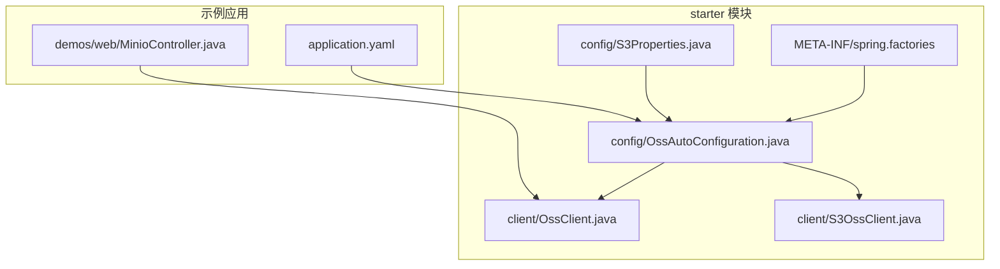
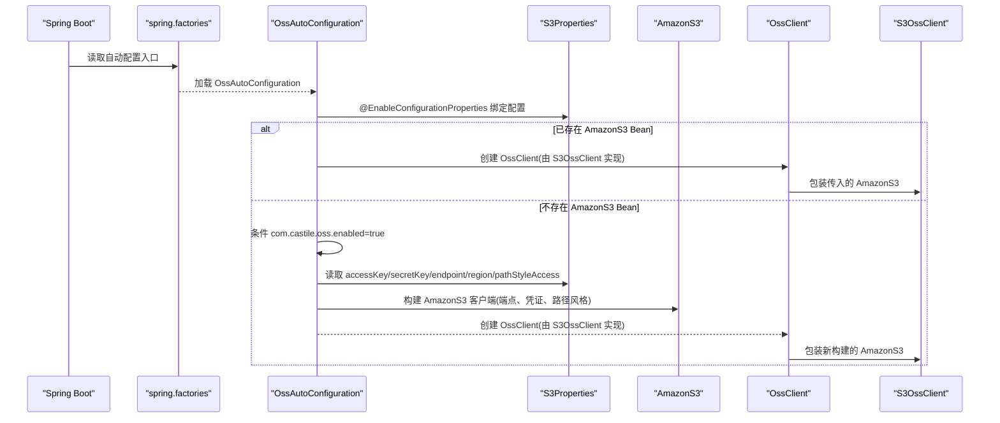
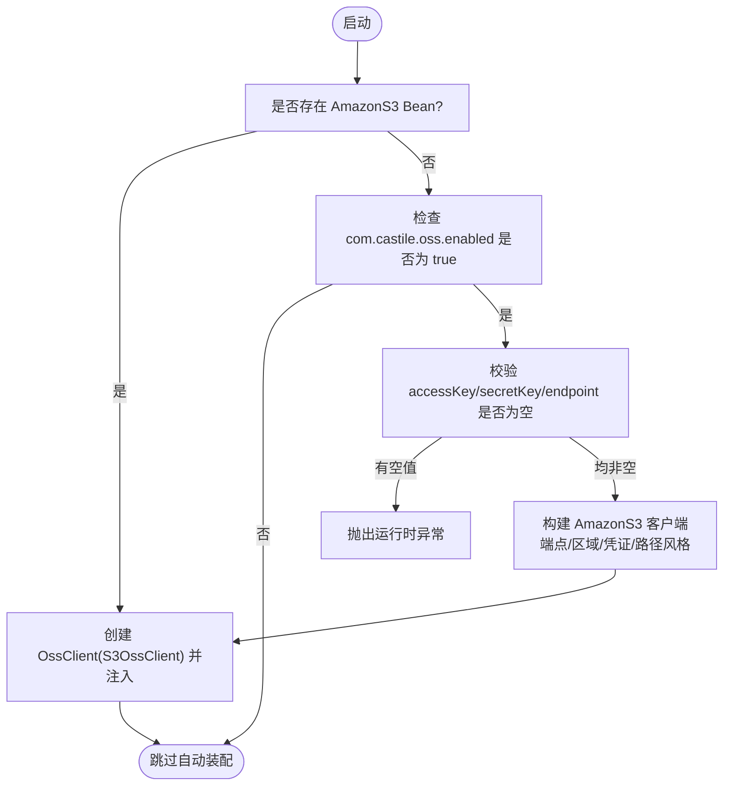
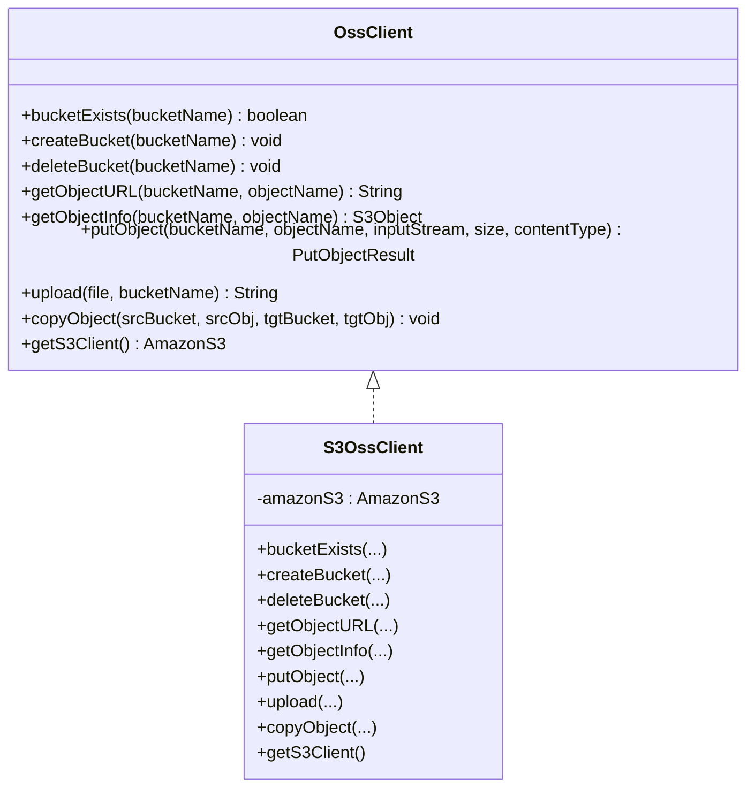
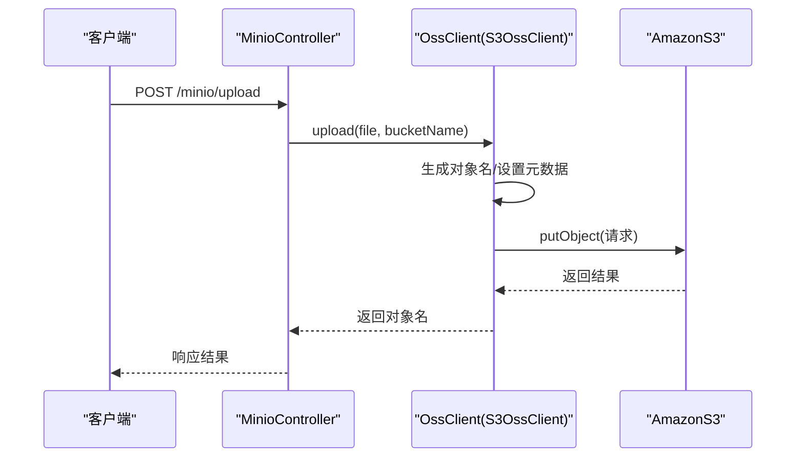
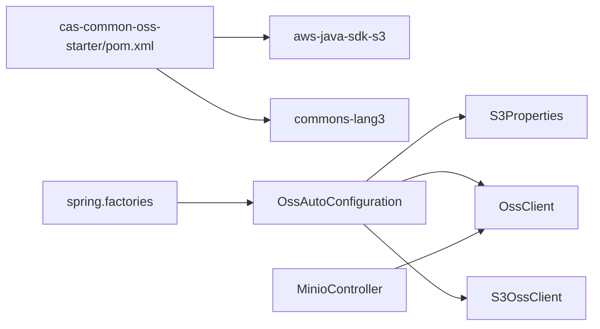

# OSS Starter集成

<cite>
**本文引用的文件**
- [OssAutoConfiguration.java](file://castile-system-center/cas-common-starters/cas-common-oss-starter/src/main/java/com/castile/common/oss/config/OssAutoConfiguration.java)
- [S3Properties.java](file://castile-system-center/cas-common-starters/cas-common-oss-starter/src/main/java/com/castile/common/oss/config/S3Properties.java)
- [S3OssClient.java](file://castile-system-center/cas-common-starters/cas-common-oss-starter/src/main/java/com/castile/common/oss/client/S3OssClient.java)
- [OssClient.java](file://castile-system-center/cas-common-starters/cas-common-oss-starter/src/main/java/com/castile/common/oss/client/OssClient.java)
- [spring.factories](file://castile-system-center/cas-common-starters/cas-common-oss-starter/src/main/resources/META-INF/spring.factories)
- [application.yaml](file://castile-system-center/cas-spring-boot-web/src/main/resources/application.yaml)
- [MinioController.java](file://castile-system-center/cas-spring-boot-web/src/main/java/com/castile/casspringbootweb/demos/web/MinioController.java)
- [pom.xml](file://castile-system-center/cas-common-starters/cas-common-oss-starter/pom.xml)
</cite>

## 目录
1. [简介](#简介)
2. [项目结构](#项目结构)
3. [核心组件](#核心组件)
4. [架构总览](#架构总览)
5. [组件详解](#组件详解)
6. [依赖关系分析](#依赖关系分析)
7. [性能与安全考量](#性能与安全考量)
8. [故障排查指南](#故障排查指南)
9. [结论](#结论)
10. [附录](#附录)

## 简介
本文件面向使用 Spring Boot 的开发者，系统性说明 OSS Starter 的自动装配与使用方式，重点覆盖：
- OssAutoConfiguration 如何通过 @EnableConfigurationProperties 加载 S3Properties，并基于条件化注解实现 AmazonS3 客户端的自动装配
- S3OssClient 对 AWS SDK v1 的封装逻辑，包括端点配置、凭证校验、路径风格访问等安全与连接控制机制
- application.yaml 中 com.castile.oss 配置项的完整示例与最佳实践
- 注入 OssClient 进行文件上传、下载、删除与桶管理的操作指引
- 启用 OSS 功能时的异常处理策略与运维建议（如环境变量管理敏感信息、连接超时与重试）

## 项目结构
OSS Starter 位于模块 cas-common-starters 下的 cas-common-oss-starter，包含配置与客户端两个包：
- config：自动装配与属性定义
- client：OSS 客户端接口与实现

图表来源
- [OssAutoConfiguration.java](file://castile-system-center/cas-common-starters/cas-common-oss-starter/src/main/java/com/castile/common/oss/config/OssAutoConfiguration.java#L1-L61)
- [S3Properties.java](file://castile-system-center/cas-common-starters/cas-common-oss-starter/src/main/java/com/castile/common/oss/config/S3Properties.java#L1-L66)
- [OssClient.java](file://castile-system-center/cas-common-starters/cas-common-oss-starter/src/main/java/com/castile/common/oss/client/OssClient.java#L1-L70)
- [S3OssClient.java](file://castile-system-center/cas-common-starters/cas-common-oss-starter/src/main/java/com/castile/common/oss/client/S3OssClient.java#L1-L94)
- [spring.factories](file://castile-system-center/cas-common-starters/cas-common-oss-starter/src/main/resources/META-INF/spring.factories#L1-L3)
- [application.yaml](file://castile-system-center/cas-spring-boot-web/src/main/resources/application.yaml#L1-L33)
- [MinioController.java](file://castile-system-center/cas-spring-boot-web/src/main/java/com/castile/casspringbootweb/demos/web/MinioController.java#L1-L64)

章节来源
- [spring.factories](file://castile-system-center/cas-common-starters/cas-common-oss-starter/src/main/resources/META-INF/spring.factories#L1-L3)
- [pom.xml](file://castile-system-center/cas-common-starters/cas-common-oss-starter/pom.xml#L1-L64)

## 核心组件
- 自动装配配置：OssAutoConfiguration 负责根据条件创建 AmazonS3 或包装为 OssClient
- 属性模型：S3Properties 提供 com.castile.oss 前缀的配置项映射
- 客户端接口：OssClient 抽象了桶与对象的基本操作
- 实现类：S3OssClient 封装 AWS SDK v1 的具体调用

章节来源
- [OssAutoConfiguration.java](file://castile-system-center/cas-common-starters/cas-common-oss-starter/src/main/java/com/castile/common/oss/config/OssAutoConfiguration.java#L1-L61)
- [S3Properties.java](file://castile-system-center/cas-common-starters/cas-common-oss-starter/src/main/java/com/castile/common/oss/config/S3Properties.java#L1-L66)
- [OssClient.java](file://castile-system-center/cas-common-starters/cas-common-oss-starter/src/main/java/com/castile/common/oss/client/OssClient.java#L1-L70)
- [S3OssClient.java](file://castile-system-center/cas-common-starters/cas-common-oss-starter/src/main/java/com/castile/common/oss/client/S3OssClient.java#L1-L94)

## 架构总览
下图展示了从 Spring Boot 启动到自动装配 AmazonS3 与 OssClient 的关键流程。

图表来源
- [spring.factories](file://castile-system-center/cas-common-starters/cas-common-oss-starter/src/main/resources/META-INF/spring.factories#L1-L3)
- [OssAutoConfiguration.java](file://castile-system-center/cas-common-starters/cas-common-oss-starter/src/main/java/com/castile/common/oss/config/OssAutoConfiguration.java#L1-L61)
- [S3Properties.java](file://castile-system-center/cas-common-starters/cas-common-oss-starter/src/main/java/com/castile/common/oss/config/S3Properties.java#L1-L66)
- [OssClient.java](file://castile-system-center/cas-common-starters/cas-common-oss-starter/src/main/java/com/castile/common/oss/client/OssClient.java#L1-L70)
- [S3OssClient.java](file://castile-system-center/cas-common-starters/cas-common-oss-starter/src/main/java/com/castile/common/oss/client/S3OssClient.java#L1-L94)

## 组件详解

### 自动装配与条件化注解
- @EnableConfigurationProperties(S3Properties.class)：将 com.castile.oss 前缀的配置绑定到 S3Properties
- @ConditionalOnMissingBean(AmazonS3.class)：当容器中不存在 AmazonS3 Bean 时才创建
- @ConditionalOnProperty(prefix = "com.castile.oss", name = "enabled", havingValue = "true")：仅当配置开关开启时才创建 AmazonS3
- @ConditionalOnBean(AmazonS3.class)：当已存在 AmazonS3 Bean 时，直接包装为 OssClient

图表来源
- [OssAutoConfiguration.java](file://castile-system-center/cas-common-starters/cas-common-oss-starter/src/main/java/com/castile/common/oss/config/OssAutoConfiguration.java#L1-L61)

章节来源
- [OssAutoConfiguration.java](file://castile-system-center/cas-common-starters/cas-common-oss-starter/src/main/java/com/castile/common/oss/config/OssAutoConfiguration.java#L1-L61)

### S3Properties 配置项
- enabled：是否启用自动装配，默认 true
- accessKey/secretKey：访问凭证
- endpoint：服务端点
- region：区域
- pathStyleAccess：是否启用路径风格访问

章节来源
- [S3Properties.java](file://castile-system-center/cas-common-starters/cas-common-oss-starter/src/main/java/com/castile/common/oss/config/S3Properties.java#L1-L66)

### S3OssClient 封装逻辑
- 桶管理：存在性判断、创建、删除
- 对象操作：获取 URL、获取对象信息、上传、拷贝
- 上传细节：设置 Content-Length、Content-Type；限制读取长度；返回结果占位
- 与 AWS SDK 的对接：通过 AmazonS3 实例执行具体操作

图表来源
- [OssClient.java](file://castile-system-center/cas-common-starters/cas-common-oss-starter/src/main/java/com/castile/common/oss/client/OssClient.java#L1-L70)
- [S3OssClient.java](file://castile-system-center/cas-common-starters/cas-common-oss-starter/src/main/java/com/castile/common/oss/client/S3OssClient.java#L1-L94)

章节来源
- [OssClient.java](file://castile-system-center/cas-common-starters/cas-common-oss-starter/src/main/java/com/castile/common/oss/client/OssClient.java#L1-L70)
- [S3OssClient.java](file://castile-system-center/cas-common-starters/cas-common-oss-starter/src/main/java/com/castile/common/oss/client/S3OssClient.java#L1-L94)

### AmazonS3 客户端构建要点
- 端点与区域：通过 EndpointConfiguration 设置 endpoint 与 region
- 凭证：BasicAWSCredentials + AWSStaticCredentialsProvider
- 连接控制：禁用分块编码；可选路径风格访问
- 异常：若 accessKey/secretKey/endpoint 任一为空，抛出运行时异常

章节来源
- [OssAutoConfiguration.java](file://castile-system-center/cas-common-starters/cas-common-oss-starter/src/main/java/com/castile/common/oss/config/OssAutoConfiguration.java#L1-L61)

### 使用示例：注入 OssClient 执行操作
- 控制器示例：MinioController 展示了桶存在性判断、创建、删除、上传、列出桶、拷贝对象等操作
- 上传流程：控制器注入 OssClient，调用 upload(file, bucketName)，内部生成对象名并上传

图表来源
- [MinioController.java](file://castile-system-center/cas-spring-boot-web/src/main/java/com/castile/casspringbootweb/demos/web/MinioController.java#L1-L64)
- [OssClient.java](file://castile-system-center/cas-common-starters/cas-common-oss-starter/src/main/java/com/castile/common/oss/client/OssClient.java#L1-L70)
- [S3OssClient.java](file://castile-system-center/cas-common-starters/cas-common-oss-starter/src/main/java/com/castile/common/oss/client/S3OssClient.java#L1-L94)

章节来源
- [MinioController.java](file://castile-system-center/cas-spring-boot-web/src/main/java/com/castile/casspringbootweb/demos/web/MinioController.java#L1-L64)

## 依赖关系分析
- starter 依赖 AWS SDK v1 S3 与 Apache Commons Lang3
- 自动装配通过 spring.factories 注册
- 示例应用通过 @ConditionalOnBean(AmazonS3.class) 保证仅在存在客户端时暴露控制器

图表来源
- [pom.xml](file://castile-system-center/cas-common-starters/cas-common-oss-starter/pom.xml#L1-L64)
- [spring.factories](file://castile-system-center/cas-common-starters/cas-common-oss-starter/src/main/resources/META-INF/spring.factories#L1-L3)
- [OssAutoConfiguration.java](file://castile-system-center/cas-common-starters/cas-common-oss-starter/src/main/java/com/castile/common/oss/config/OssAutoConfiguration.java#L1-L61)
- [OssClient.java](file://castile-system-center/cas-common-starters/cas-common-oss-starter/src/main/java/com/castile/common/oss/client/OssClient.java#L1-L70)
- [S3OssClient.java](file://castile-system-center/cas-common-starters/cas-common-oss-starter/src/main/java/com/castile/common/oss/client/S3OssClient.java#L1-L94)
- [MinioController.java](file://castile-system-center/cas-spring-boot-web/src/main/java/com/castile/casspringbootweb/demos/web/MinioController.java#L1-L64)

章节来源
- [pom.xml](file://castile-system-center/cas-common-starters/cas-common-oss-starter/pom.xml#L1-L64)
- [spring.factories](file://castile-system-center/cas-common-starters/cas-common-oss-starter/src/main/resources/META-INF/spring.factories#L1-L3)

## 性能与安全考量
- 连接与传输
  - 禁用分块编码以减少网络开销（在某些场景下更稳定）
  - 路径风格访问可通过 pathStyleAccess 控制，适配不同服务端点行为
- 凭证与密钥
  - 建议通过环境变量或配置中心管理 accessKey/secretKey，避免硬编码
  - 在 CI/CD 中使用只读最小权限的凭证
- 超时与重试
  - 当前自动装配未内置连接超时与重试配置；可在外部扩展或自定义 AmazonS3 Bean 时补充
- 日志与可观测性
  - 可在业务层增加上传/下载的埋点与异常告警

[本节为通用指导，不直接分析具体文件]

## 故障排查指南
- 配置缺失导致异常
  - 现象：启动时报错“oss 配置错误，请检查”
  - 原因：accessKey/secretKey/endpoint 任一为空
  - 处理：补齐配置或关闭自动装配开关
- 未启用自动装配
  - 现象：OssClient 不可用
  - 原因：com.castile.oss.enabled=false 或已存在 AmazonS3 Bean 但未满足条件
  - 处理：开启开关或移除外部 AmazonS3 Bean 以触发自动装配
- 服务端点不兼容
  - 现象：连接失败或路径风格访问异常
  - 原因：endpoint/region/pathStyleAccess 配置不当
  - 处理：核对 endpoint 与 region，必要时调整 pathStyleAccess

章节来源
- [OssAutoConfiguration.java](file://castile-system-center/cas-common-starters/cas-common-oss-starter/src/main/java/com/castile/common/oss/config/OssAutoConfiguration.java#L1-L61)

## 结论
OSS Starter 通过轻量的自动装配与条件化注解，实现了对 AWS SDK v1 S3 的无缝集成。S3Properties 提供清晰的配置入口，S3OssClient 则将常见操作抽象为统一接口。配合示例应用中的控制器，开发者可以快速完成桶与对象的管理与文件上传等操作。建议在生产环境中结合环境变量管理敏感信息，并按需扩展连接超时与重试策略。

[本节为总结性内容，不直接分析具体文件]

## 附录

### 配置项参考与示例
- application.yaml 中 com.castile.oss 的关键字段
  - enabled：是否启用自动装配
  - access-key：访问密钥
  - secret-key：私有密钥
  - endpoint：服务端点
  - region：区域
  - path-style-access：是否启用路径风格访问

章节来源
- [application.yaml](file://castile-system-center/cas-spring-boot-web/src/main/resources/application.yaml#L1-L33)
- [S3Properties.java](file://castile-system-center/cas-common-starters/cas-common-oss-starter/src/main/java/com/castile/common/oss/config/S3Properties.java#L1-L66)

### 使用步骤提示
- 在示例应用中，MinioController 展示了如何注入 OssClient 并执行桶与对象操作
- 若已有 AmazonS3 Bean，控制器会自动生效；否则需要开启开关并正确填写配置

章节来源
- [MinioController.java](file://castile-system-center/cas-spring-boot-web/src/main/java/com/castile/casspringbootweb/demos/web/MinioController.java#L1-L64)