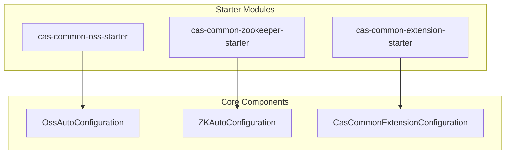
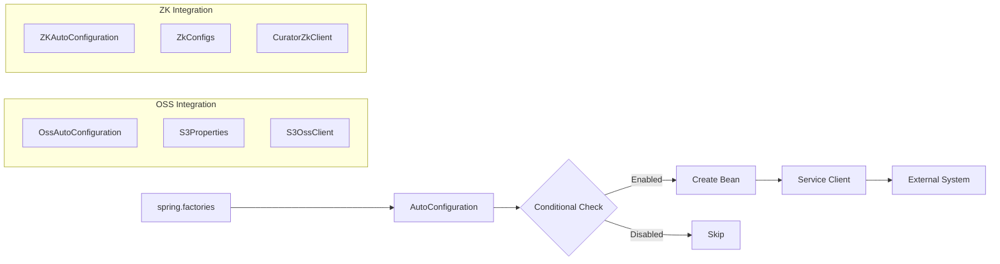
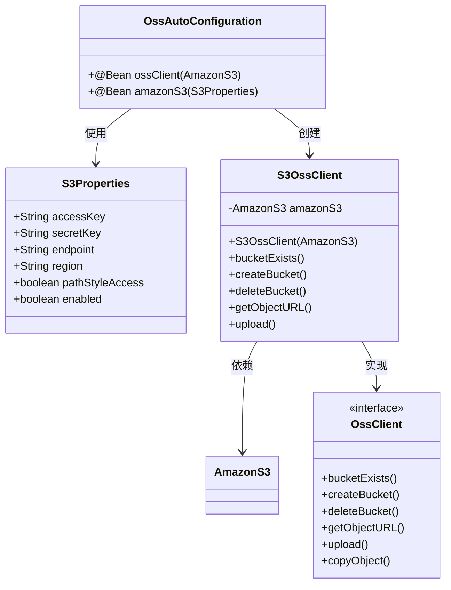
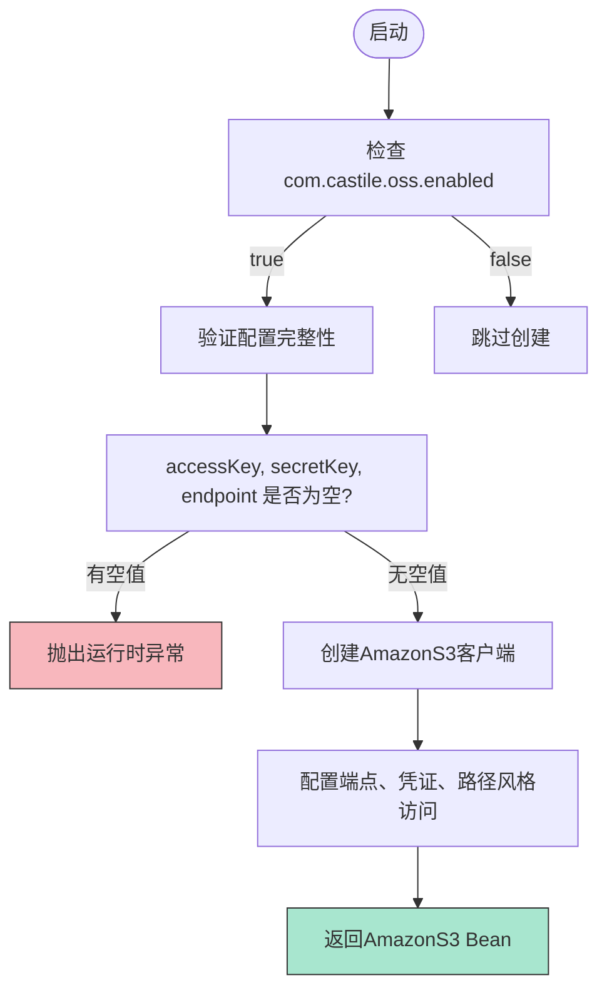
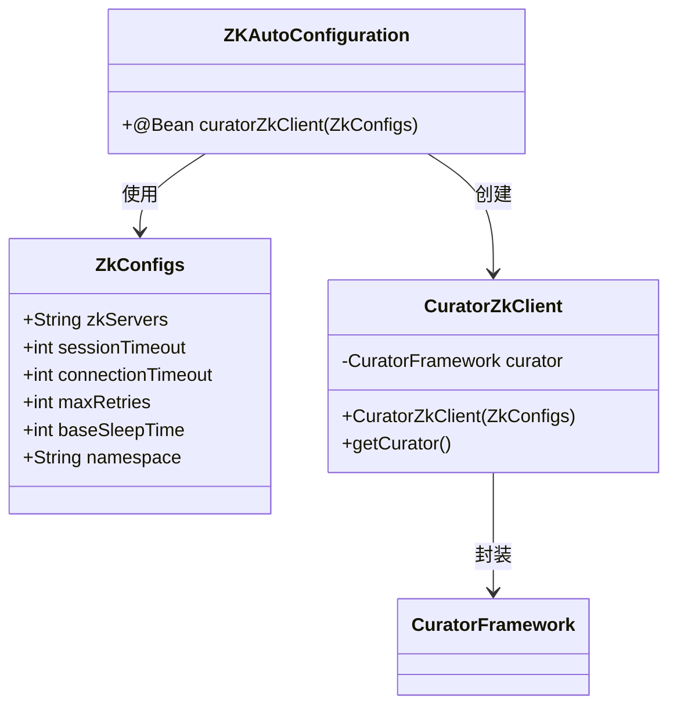
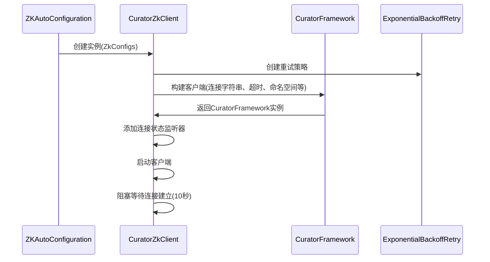
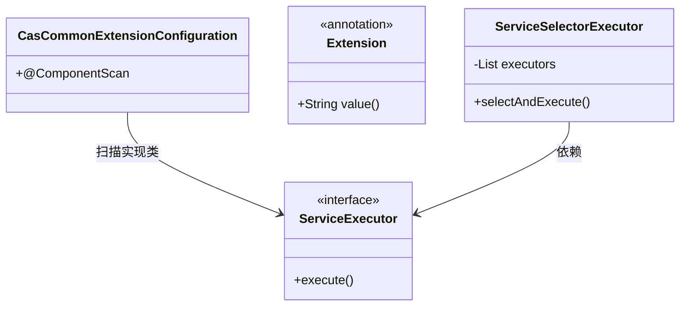
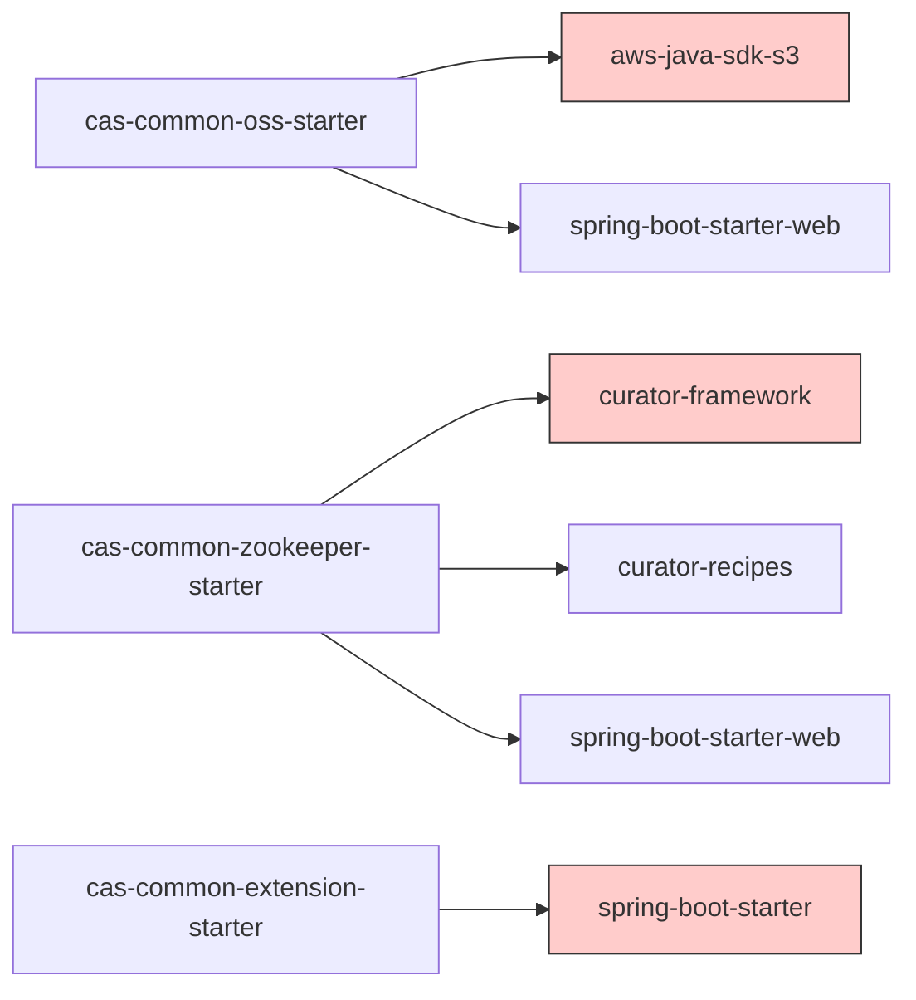

# Spring Boot Starter组件

<cite>
**本文档中引用的文件**  
- [OssAutoConfiguration.java](file://castile-system-center/cas-common-starters/cas-common-oss-starter/src/main/java/com/castile/common/oss/config/OssAutoConfiguration.java)
- [S3Properties.java](file://castile-system-center/cas-common-starters/cas-common-oss-starter/src/main/java/com/castile/common/oss/config/S3Properties.java)
- [spring.factories](file://castile-system-center/cas-common-starters/cas-common-oss-starter/src/main/resources/META-INF/spring.factories)
- [ZKAutoConfiguration.java](file://castile-system-center/cas-common-starters/cas-common-zookeeper-starter/src/main/java/com/castile/common/zk/config/ZKAutoConfiguration.java)
- [ZkConfigs.java](file://castile-system-center/cas-common-starters/cas-common-zookeeper-starter/src/main/java/com/castile/common/zk/config/ZkConfigs.java)
- [CuratorZkClient.java](file://castile-system-center/cas-common-starters/cas-common-zookeeper-starter/src/main/java/com/castile/common/zk/client/CuratorZkClient.java)
- [S3OssClient.java](file://castile-system-center/cas-common-starters/cas-common-oss-starter/src/main/java/com/castile/common/oss/client/S3OssClient.java)
- [OssClient.java](file://castile-system-center/cas-common-starters/cas-common-oss-starter/src/main/java/com/castile/common/oss/client/OssClient.java)
- [application.yaml](file://castile-system-center/cas-spring-boot-web/src/main/resources/application.yaml)
- [cas-common-extension-starter](file://castile-system-center/cas-common-starters/cas-common-extension-starter/)
</cite>

## 目录
1. [简介](#简介)
2. [项目结构](#项目结构)
3. [核心组件](#核心组件)
4. [架构概述](#架构概述)
5. [详细组件分析](#详细组件分析)
6. [依赖分析](#依赖分析)
7. [性能考虑](#性能考虑)
8. [故障排查指南](#故障排查指南)
9. [结论](#结论)

## 简介
本文档系统性地文档化了自定义Spring Boot Starter的实现原理与使用方法，重点分析OssAutoConfiguration如何通过条件化Bean注册实现与AWS S3的无缝集成，包括AmazonS3客户端的初始化逻辑、凭证管理及端点配置验证机制。同样解析ZKAutoConfiguration对Curator框架的封装方式及其在服务发现中的作用。说明各Starter如何利用spring.factories机制实现自动装配，并指导开发者如何通过application.yaml进行参数定制。提供最佳实践建议，如敏感信息加密、连接池配置和故障恢复策略。

## 项目结构
本项目包含多个自定义Spring Boot Starter模块，主要分为OSS对象存储集成、Zookeeper服务协调以及通用扩展机制三大核心功能模块。每个Starter都遵循Spring Boot自动配置规范，通过独立的Maven模块进行组织。

**图示来源**  
- [cas-common-oss-starter](file://castile-system-center/cas-common-starters/cas-common-oss-starter/)
- [cas-common-zookeeper-starter](file://castile-system-center/cas-common-starters/cas-common-zookeeper-starter/)
- [cas-common-extension-starter](file://castile-system-center/cas-common-starters/cas-common-extension-starter/)

**本节来源**  
- [project_structure](file://project_structure)

## 核心组件
本项目的核心组件包括基于AWS S3的对象存储集成、Zookeeper分布式协调服务集成以及可扩展的服务执行框架。这些组件通过Spring Boot的自动配置机制实现即插即用的功能特性。

**本节来源**  
- [OssAutoConfiguration.java](file://castile-system-center/cas-common-starters/cas-common-oss-starter/src/main/java/com/castile/common/oss/config/OssAutoConfiguration.java)
- [ZKAutoConfiguration.java](file://castile-system-center/cas-common-starters/cas-common-zookeeper-starter/src/main/java/com/castile/common/zk/config/ZKAutoConfiguration.java)
- [CasCommonExtensionConfiguration.java](file://castile-system-center/cas-common-starters/cas-common-extension-starter/src/main/java/com/castile/common/extension/config/CasCommonExtensionConfiguration.java)

## 架构概述
整个系统采用模块化设计，各个Starter独立封装特定功能，通过Spring Boot的自动装配机制集成到主应用中。自动配置类负责根据条件判断是否创建相应的Bean实例。

**图示来源**  
- [OssAutoConfiguration.java](file://castile-system-center/cas-common-starters/cas-common-oss-starter/src/main/java/com/castile/common/oss/config/OssAutoConfiguration.java)
- [ZKAutoConfiguration.java](file://castile-system-center/cas-common-starters/cas-common-zookeeper-starter/src/main/java/com/castile/common/zk/config/ZKAutoConfiguration.java)
- [spring.factories](file://castile-system-center/cas-common-starters/cas-common-oss-starter/src/main/resources/META-INF/spring.factories)

## 详细组件分析

### OSS自动配置分析
OSS自动配置模块实现了与AWS S3兼容的对象存储服务集成，支持MinIO等兼容S3协议的存储系统。

#### 自动装配机制

**图示来源**  
- [OssAutoConfiguration.java](file://castile-system-center/cas-common-starters/cas-common-oss-starter/src/main/java/com/castile/common/oss/config/OssAutoConfiguration.java#L25-L61)
- [S3Properties.java](file://castile-system-center/cas-common-starters/cas-common-oss-starter/src/main/java/com/castile/common/oss/config/S3Properties.java#L1-L66)
- [S3OssClient.java](file://castile-system-center/cas-common-starters/cas-common-oss-starter/src/main/java/com/castile/common/oss/client/S3OssClient.java#L1-L95)

#### 条件化Bean注册流程

**图示来源**  
- [OssAutoConfiguration.java](file://castile-system-center/cas-common-starters/cas-common-oss-starter/src/main/java/com/castile/common/oss/config/OssAutoConfiguration.java#L37-L60)

**本节来源**  
- [OssAutoConfiguration.java](file://castile-system-center/cas-common-starters/cas-common-oss-starter/src/main/java/com/castile/common/oss/config/OssAutoConfiguration.java)
- [S3Properties.java](file://castile-system-center/cas-common-starters/cas-common-oss-starter/src/main/java/com/castile/common/oss/config/S3Properties.java)
- [S3OssClient.java](file://castile-system-center/cas-common-starters/cas-common-oss-starter/src/main/java/com/castile/common/oss/client/S3OssClient.java)

### Zookeeper自动配置分析
Zookeeper自动配置模块封装了Curator框架，提供了简化的分布式协调服务客户端。

#### Curator客户端封装

**图示来源**  
- [ZKAutoConfiguration.java](file://castile-system-center/cas-common-starters/cas-common-zookeeper-starter/src/main/java/com/castile/common/zk/config/ZKAutoConfiguration.java#L1-L23)
- [ZkConfigs.java](file://castile-system-center/cas-common-starters/cas-common-zookeeper-starter/src/main/java/com/castile/common/zk/config/ZkConfigs.java#L1-L69)
- [CuratorZkClient.java](file://castile-system-center/cas-common-starters/cas-common-zookeeper-starter/src/main/java/com/castile/common/zk/client/CuratorZkClient.java#L1-L67)

#### 连接初始化流程

**图示来源**  
- [CuratorZkClient.java](file://castile-system-center/cas-common-starters/cas-common-zookeeper-starter/src/main/java/com/castile/common/zk/client/CuratorZkClient.java#L27-L62)

**本节来源**  
- [ZKAutoConfiguration.java](file://castile-system-center/cas-common-starters/cas-common-zookeeper-starter/src/main/java/com/castile/common/zk/config/ZKAutoConfiguration.java)
- [ZkConfigs.java](file://castile-system-center/cas-common-starters/cas-common-zookeeper-starter/src/main/java/com/castile/common/zk/config/ZkConfigs.java)
- [CuratorZkClient.java](file://castile-system-center/cas-common-starters/cas-common-zookeeper-starter/src/main/java/com/castile/common/zk/client/CuratorZkClient.java)

### 扩展Starter分析
扩展Starter提供了一种基于注解的可扩展服务执行机制。

**图示来源**  
- [CasCommonExtensionConfiguration.java](file://castile-system-center/cas-common-starters/cas-common-extension-starter/src/main/java/com/castile/common/extension/config/CasCommonExtensionConfiguration.java#L1-L14)

**本节来源**  
- [CasCommonExtensionConfiguration.java](file://castile-system-center/cas-common-starters/cas-common-extension-starter/src/main/java/com/castile/common/extension/config/CasCommonExtensionConfiguration.java)

## 依赖分析
各Starter模块通过标准的Maven依赖管理引入必要的第三方库，并通过spring.factories机制注册自动配置类。

**图示来源**  
- [cas-common-oss-starter/pom.xml](file://castile-system-center/cas-common-starters/cas-common-oss-starter/pom.xml)
- [cas-common-zookeeper-starter/pom.xml](file://castile-system-center/cas-common-starters/cas-common-zookeeper-starter/pom.xml)

**本节来源**  
- [cas-common-oss-starter/pom.xml](file://castile-system-center/cas-common-starters/cas-common-oss-starter/pom.xml)
- [cas-common-zookeeper-starter/pom.xml](file://castile-system-center/cas-common-starters/cas-common-zookeeper-starter/pom.xml)

## 性能考虑
在使用这些Starter时，需要注意以下性能相关事项：
- OSS客户端应复用AmazonS3实例，避免频繁创建销毁
- Zookeeper连接应合理设置会话超时和重试策略
- 对于高并发场景，建议对OSS操作添加适当的缓存机制
- 网络配置方面，确保endpoint正确配置以减少网络延迟

## 故障排查指南
常见问题及解决方案：

| 问题现象 | 可能原因 | 解决方案 |
|---------|--------|---------|
| OSS配置错误异常 | accessKey、secretKey或endpoint为空 | 检查application.yaml中的配置项 |
| 无法连接Zookeeper | 连接超时或服务器地址错误 | 验证zkServers配置和网络连通性 |
| 自动配置未生效 | spring.factories未正确配置 | 检查META-INF/spring.factories文件内容 |
| Bean创建冲突 | 多个配置类尝试创建相同类型的Bean | 使用@ConditionalOnMissingBean等条件注解 |

**本节来源**  
- [OssAutoConfiguration.java](file://castile-system-center/cas-common-starters/cas-common-oss-starter/src/main/java/com/castile/common/oss/config/OssAutoConfiguration.java)
- [ZKAutoConfiguration.java](file://castile-system-center/cas-common-starters/cas-common-zookeeper-starter/src/main/java/com/castile/common/zk/config/ZKAutoConfiguration.java)
- [application.yaml](file://castile-system-center/cas-spring-boot-web/src/main/resources/application.yaml)

## 结论
本文档详细分析了自定义Spring Boot Starter的实现原理，包括OSS和Zookeeper两个核心模块的自动配置机制。通过条件化Bean注册、外部化配置和自动装配等Spring Boot特性，实现了开箱即用的集成体验。开发者可以通过简单的YAML配置即可使用这些功能，同时保留了足够的扩展性以满足特定需求。