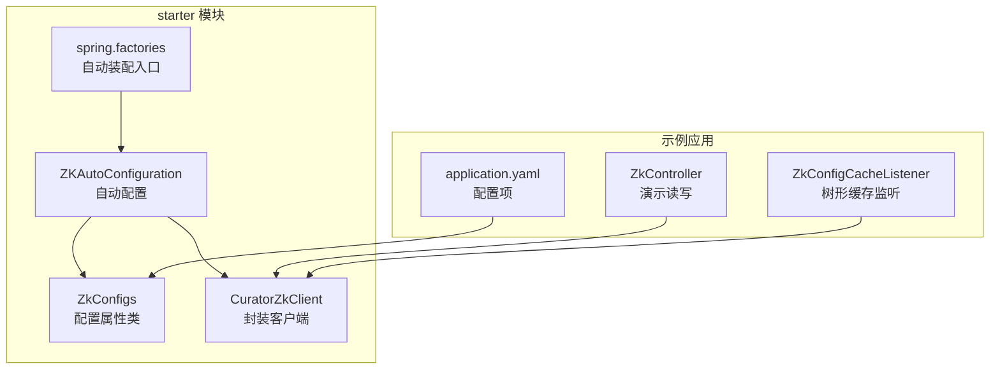
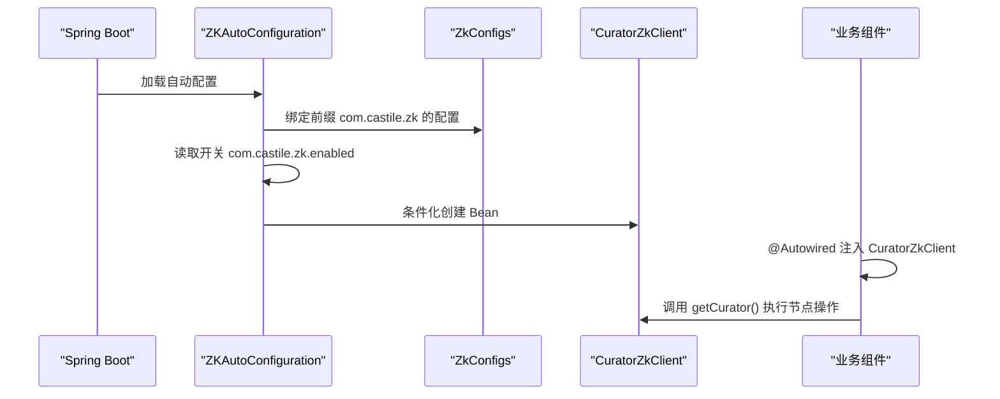
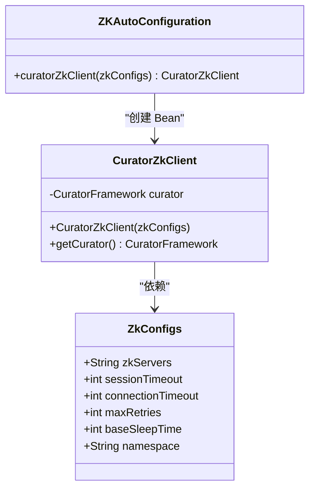
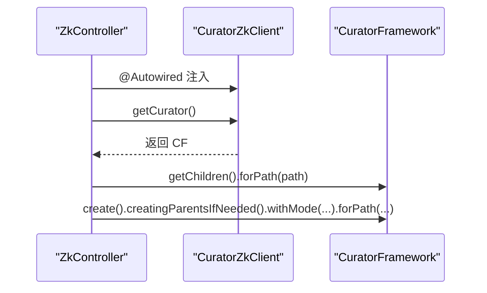
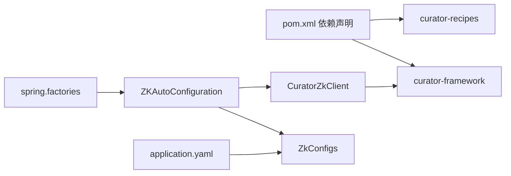

# ZooKeeper Starter集成

<cite>
**本文引用的文件列表**
- [ZKAutoConfiguration.java](file://castile-system-center/cas-common-starters/cas-common-zookeeper-starter/src/main/java/com/castile/common/zk/config/ZKAutoConfiguration.java)
- [ZkConfigs.java](file://castile-system-center/cas-common-starters/cas-common-zookeeper-starter/src/main/java/com/castile/common/zk/config/ZkConfigs.java)
- [CuratorZkClient.java](file://castile-system-center/cas-common-starters/cas-common-zookeeper-starter/src/main/java/com/castile/common/zk/client/CuratorZkClient.java)
- [spring.factories](file://castile-system-center/cas-common-starters/cas-common-zookeeper-starter/src/main/resources/META-INF/spring.factories)
- [application.yaml](file://castile-system-center/cas-spring-boot-web/src/main/resources/application.yaml)
- [ZkController.java](file://castile-system-center/cas-spring-boot-web/src/main/java/com/castile/casspringbootweb/demos/zk/ZkController.java)
- [ZkConfigCacheListener.java](file://castile-system-center/cas-spring-boot-web/src/main/java/com/castile/casspringbootweb/demos/zk/ZkConfigCacheListener.java)
- [cas-common-zookeeper-starter/pom.xml](file://castile-system-center/cas-common-starters/cas-common-zookeeper-starter/pom.xml)
</cite>

## 目录
1. [简介](#简介)
2. [项目结构](#项目结构)
3. [核心组件](#核心组件)
4. [架构总览](#架构总览)
5. [组件深度解析](#组件深度解析)
6. [依赖关系分析](#依赖关系分析)
7. [性能与可靠性考量](#性能与可靠性考量)
8. [故障排查指南](#故障排查指南)
9. [结论](#结论)
10. [附录：使用示例与最佳实践](#附录使用示例与最佳实践)

## 简介
本文件系统性解析 ZooKeeper Starter 的集成机制，重点围绕以下目标：
- 解释 ZKAutoConfiguration 如何通过 @EnableConfigurationProperties 引入 ZkConfigs 配置类，并利用 @ConditionalOnProperty 控制 CuratorZkClient 的条件化注册。
- 说明 ZkConfigs 中连接字符串、会话超时、连接超时、最大重试次数、基础睡眠时间、命名空间等核心参数的作用与影响。
- 深入阐述 CuratorZkClient 对 Apache Curator 的封装方式，包括客户端初始化、连接状态监听、重试策略、以及基于 CuratorFramework 的节点操作与缓存监听。
- 提供在 Spring 应用中通过 @Autowired 获取 CuratorZkClient 实例进行服务注册与发现的实践路径与注意事项。
- 强调分布式环境下 ZooKeeper 客户端的线程安全性、连接状态监听与故障恢复的最佳实践，如合理设置 sessionTimeout 与 connectionTimeout。

## 项目结构
该 Starter 位于 cas-common-starters 子模块中，核心文件组织如下：
- 自动配置与配置类：ZKAutoConfiguration、ZkConfigs
- 封装客户端：CuratorZkClient
- Spring 自动装配入口：spring.factories
- 使用示例：ZkController、ZkConfigCacheListener
- 依赖声明：cas-common-zookeeper-starter/pom.xml
- 应用配置：application.yaml

图表来源
- [ZKAutoConfiguration.java](file://castile-system-center/cas-common-starters/cas-common-zookeeper-starter/src/main/java/com/castile/common/zk/config/ZKAutoConfiguration.java#L1-L24)
- [ZkConfigs.java](file://castile-system-center/cas-common-starters/cas-common-zookeeper-starter/src/main/java/com/castile/common/zk/config/ZkConfigs.java#L1-L70)
- [CuratorZkClient.java](file://castile-system-center/cas-common-starters/cas-common-zookeeper-starter/src/main/java/com/castile/common/zk/client/CuratorZkClient.java#L1-L68)
- [spring.factories](file://castile-system-center/cas-common-starters/cas-common-zookeeper-starter/src/main/resources/META-INF/spring.factories#L1-L3)
- [application.yaml](file://castile-system-center/cas-spring-boot-web/src/main/resources/application.yaml#L1-L33)
- [ZkController.java](file://castile-system-center/cas-spring-boot-web/src/main/java/com/castile/casspringbootweb/demos/zk/ZkController.java#L1-L57)
- [ZkConfigCacheListener.java](file://castile-system-center/cas-spring-boot-web/src/main/java/com/castile/casspringbootweb/demos/zk/ZkConfigCacheListener.java#L1-L42)

章节来源
- [ZKAutoConfiguration.java](file://castile-system-center/cas-common-starters/cas-common-zookeeper-starter/src/main/java/com/castile/common/zk/config/ZKAutoConfiguration.java#L1-L24)
- [spring.factories](file://castile-system-center/cas-common-starters/cas-common-zookeeper-starter/src/main/resources/META-INF/spring.factories#L1-L3)

## 核心组件
- ZKAutoConfiguration：定义自动配置，启用 ZkConfigs 并按开关条件注册 CuratorZkClient Bean。
- ZkConfigs：承载 ZooKeeper 连接与重试相关配置，支持命名空间隔离。
- CuratorZkClient：对 CuratorFramework 的轻量封装，负责构建客户端、注册连接状态监听、阻塞等待连接成功。
- 示例控制器与监听器：展示如何在业务中注入并使用 CuratorZkClient 进行节点读写与树形缓存监听。

章节来源
- [ZKAutoConfiguration.java](file://castile-system-center/cas-common-starters/cas-common-zookeeper-starter/src/main/java/com/castile/common/zk/config/ZKAutoConfiguration.java#L1-L24)
- [ZkConfigs.java](file://castile-system-center/cas-common-starters/cas-common-zookeeper-starter/src/main/java/com/castile/common/zk/config/ZkConfigs.java#L1-L70)
- [CuratorZkClient.java](file://castile-system-center/cas-common-starters/cas-common-zookeeper-starter/src/main/java/com/castile/common/zk/client/CuratorZkClient.java#L1-L68)
- [ZkController.java](file://castile-system-center/cas-spring-boot-web/src/main/java/com/castile/casspringbootweb/demos/zk/ZkController.java#L1-L57)
- [ZkConfigCacheListener.java](file://castile-system-center/cas-spring-boot-web/src/main/java/com/castile/casspringbootweb/demos/zk/ZkConfigCacheListener.java#L1-L42)

## 架构总览
下图展示了从 Spring Boot 启动到业务使用 CuratorZkClient 的关键流程。

图表来源
- [ZKAutoConfiguration.java](file://castile-system-center/cas-common-starters/cas-common-zookeeper-starter/src/main/java/com/castile/common/zk/config/ZKAutoConfiguration.java#L1-L24)
- [ZkConfigs.java](file://castile-system-center/cas-common-starters/cas-common-zookeeper-starter/src/main/java/com/castile/common/zk/config/ZkConfigs.java#L1-L70)
- [CuratorZkClient.java](file://castile-system-center/cas-common-starters/cas-common-zookeeper-starter/src/main/java/com/castile/common/zk/client/CuratorZkClient.java#L1-L68)
- [application.yaml](file://castile-system-center/cas-spring-boot-web/src/main/resources/application.yaml#L1-L33)

## 组件深度解析

### ZKAutoConfiguration：条件化注册与配置绑定
- 通过 @EnableConfigurationProperties({ZkConfigs.class}) 将配置类纳入 Spring 管理，使 application.yaml 中的 com.castile.zk 前缀键值生效。
- 通过 @ConditionalOnProperty(prefix = "com.castile.zk", name = "enabled", havingValue = "true") 控制是否注册 CuratorZkClient Bean，便于按环境或功能开关启用/禁用。
- Bean 方法接收 ZkConfigs 参数，构造 CuratorZkClient 并返回，完成依赖注入。

章节来源
- [ZKAutoConfiguration.java](file://castile-system-center/cas-common-starters/cas-common-zookeeper-starter/src/main/java/com/castile/common/zk/config/ZKAutoConfiguration.java#L1-L24)
- [spring.factories](file://castile-system-center/cas-common-starters/cas-common-zookeeper-starter/src/main/resources/META-INF/spring.factories#L1-L3)

### ZkConfigs：配置参数与作用
- 连接字符串：用于指定 ZooKeeper 集群地址。
- 会话超时：决定客户端与服务端会话的有效期，影响心跳与会话丢失判定。
- 连接超时：建立初始连接的最大等待时间。
- 最大重试次数：指数退避重试策略中的最大重试轮数。
- 基础睡眠时间：指数退避重试的基础等待时间。
- 命名空间：为所有路径添加统一前缀，实现逻辑隔离。

章节来源
- [ZkConfigs.java](file://castile-system-center/cas-common-starters/cas-common-zookeeper-starter/src/main/java/com/castile/common/zk/config/ZkConfigs.java#L1-L70)
- [application.yaml](file://castile-system-center/cas-spring-boot-web/src/main/resources/application.yaml#L1-L33)

### CuratorZkClient：对 Curator 的封装
- 初始化：使用 CuratorFrameworkFactory.builder() 构建客户端，设置连接串、会话/连接超时、重试策略与命名空间。
- 重试策略：采用 ExponentialBackoffRetry，结合 baseSleepTime 与 maxRetries 实现指数退避。
- 连接状态监听：注册 ConnectionStateListener，在 CONNECTED/LOST/RECONNECTED 等状态变化时输出日志。
- 连接阻塞：blockUntilConnected 在限定时间内等待连接成功，否则记录错误。
- 外部访问：提供 getCurator() 返回底层 CuratorFramework，供业务直接使用。

图表来源
- [ZkConfigs.java](file://castile-system-center/cas-common-starters/cas-common-zookeeper-starter/src/main/java/com/castile/common/zk/config/ZkConfigs.java#L1-L70)
- [CuratorZkClient.java](file://castile-system-center/cas-common-starters/cas-common-zookeeper-starter/src/main/java/com/castile/common/zk/client/CuratorZkClient.java#L1-L68)
- [ZKAutoConfiguration.java](file://castile-system-center/cas-common-starters/cas-common-zookeeper-starter/src/main/java/com/castile/common/zk/config/ZKAutoConfiguration.java#L1-L24)

章节来源
- [CuratorZkClient.java](file://castile-system-center/cas-common-starters/cas-common-zookeeper-starter/src/main/java/com/castile/common/zk/client/CuratorZkClient.java#L1-L68)

### 业务使用：通过 @Autowired 获取 CuratorZkClient
- 控制器示例：ZkController 通过 @Autowired 注入 CuratorZkClient，并使用 getCurator() 执行子节点查询与节点创建。
- 缓存监听示例：ZkConfigCacheListener 通过 @Autowired 注入 CuratorZkClient，基于 CuratorCache 构建树形缓存并监听事件。

图表来源
- [ZkController.java](file://castile-system-center/cas-spring-boot-web/src/main/java/com/castile/casspringbootweb/demos/zk/ZkController.java#L1-L57)
- [CuratorZkClient.java](file://castile-system-center/cas-common-starters/cas-common-zookeeper-starter/src/main/java/com/castile/common/zk/client/CuratorZkClient.java#L1-L68)

章节来源
- [ZkController.java](file://castile-system-center/cas-spring-boot-web/src/main/java/com/castile/casspringbootweb/demos/zk/ZkController.java#L1-L57)
- [ZkConfigCacheListener.java](file://castile-system-center/cas-spring-boot-web/src/main/java/com/castile/casspringbootweb/demos/zk/ZkConfigCacheListener.java#L1-L42)

## 依赖关系分析
- 自动装配入口：spring.factories 中声明 EnableAutoConfiguration 指向 ZKAutoConfiguration，确保启动时加载。
- 依赖声明：pom.xml 引入 curator-framework 与 curator-recipes，保证封装客户端具备所需能力。
- 配置绑定：application.yaml 中 com.castile.zk.* 键值映射到 ZkConfigs 字段，驱动客户端初始化。

图表来源
- [cas-common-zookeeper-starter/pom.xml](file://castile-system-center/cas-common-starters/cas-common-zookeeper-starter/pom.xml#L1-L83)
- [spring.factories](file://castile-system-center/cas-common-starters/cas-common-zookeeper-starter/src/main/resources/META-INF/spring.factories#L1-L3)
- [ZKAutoConfiguration.java](file://castile-system-center/cas-common-starters/cas-common-zookeeper-starter/src/main/java/com/castile/common/zk/config/ZKAutoConfiguration.java#L1-L24)
- [ZkConfigs.java](file://castile-system-center/cas-common-starters/cas-common-zookeeper-starter/src/main/java/com/castile/common/zk/config/ZkConfigs.java#L1-L70)
- [application.yaml](file://castile-system-center/cas-spring-boot-web/src/main/resources/application.yaml#L1-L33)

章节来源
- [cas-common-zookeeper-starter/pom.xml](file://castile-system-center/cas-common-starters/cas-common-zookeeper-starter/pom.xml#L1-L83)
- [spring.factories](file://castile-system-center/cas-common-starters/cas-common-zookeeper-starter/src/main/resources/META-INF/spring.factories#L1-L3)

## 性能与可靠性考量
- 重试策略：指数退避可有效缓解瞬时网络抖动，但应避免过长的 baseSleepTime 与过多的 maxRetries 导致请求延迟放大。
- 超时参数：sessionTimeout 与 connectionTimeout 需结合集群性能与网络状况调整；过小可能导致频繁会话丢失，过大则延长故障感知时间。
- 连接状态监听：建议在 ConnectionStateListener 中实现更完善的日志与告警，必要时触发降级或熔断。
- 命名空间隔离：通过 namespace 为不同业务或环境划分逻辑路径，降低冲突风险。
- 线程安全：CuratorFramework 是线程安全的，可在多线程环境下复用同一实例；但业务侧仍需注意并发写入的幂等性与一致性。

[本节为通用指导，不直接分析具体文件]

## 故障排查指南
- 无法连接：检查 application.yaml 中 com.castile.zk.enabled 是否为 true，zk-servers 地址是否可达，connectionTimeout 是否足够。
- 连接不稳定：关注 ConnectionStateListener 输出，确认是否存在 LOST/RECONNECTED 频繁切换；适当增大 sessionTimeout 与 baseSleepTime。
- 节点创建失败：确认路径权限、父节点是否存在，以及是否使用了正确的 CreateMode；参考 ZkController 的创建流程。
- 缓存未生效：检查 CuratorCache 的根路径与选项，确认 cache.start() 已执行且监听器已注册。

章节来源
- [application.yaml](file://castile-system-center/cas-spring-boot-web/src/main/resources/application.yaml#L1-L33)
- [CuratorZkClient.java](file://castile-system-center/cas-common-starters/cas-common-zookeeper-starter/src/main/java/com/castile/common/zk/client/CuratorZkClient.java#L1-L68)
- [ZkController.java](file://castile-system-center/cas-spring-boot-web/src/main/java/com/castile/casspringbootweb/demos/zk/ZkController.java#L1-L57)
- [ZkConfigCacheListener.java](file://castile-system-center/cas-spring-boot-web/src/main/java/com/castile/casspringbootweb/demos/zk/ZkConfigCacheListener.java#L1-L42)

## 结论
该 Starter 通过简洁的自动配置与配置绑定，将 ZooKeeper 客户端的初始化、重试与命名空间隔离等关键能力封装在 CuratorZkClient 中，并以条件化注册的方式灵活启用。业务可通过 @Autowired 直接获取客户端实例，快速实现节点读写与缓存监听。在生产环境中，建议结合集群与网络状况合理设置超时与重试参数，并完善连接状态监控与告警，确保高可用与稳定性。

[本节为总结性内容，不直接分析具体文件]

## 附录：使用示例与最佳实践
- 使用示例路径
  - 控制器读写示例：[ZkController.java](file://castile-system-center/cas-spring-boot-web/src/main/java/com/castile/casspringbootweb/demos/zk/ZkController.java#L1-L57)
  - 树形缓存监听示例：[ZkConfigCacheListener.java](file://castile-system-center/cas-spring-boot-web/src/main/java/com/castile/casspringbootweb/demos/zk/ZkConfigCacheListener.java#L1-L42)
  - 自动配置与条件注册：[ZKAutoConfiguration.java](file://castile-system-center/cas-common-starters/cas-common-zookeeper-starter/src/main/java/com/castile/common/zk/config/ZKAutoConfiguration.java#L1-L24)
  - 配置绑定与参数说明：[ZkConfigs.java](file://castile-system-center/cas-common-starters/cas-common-zookeeper-starter/src/main/java/com/castile/common/zk/config/ZkConfigs.java#L1-L70)
  - 客户端封装与连接监听：[CuratorZkClient.java](file://castile-system-center/cas-common-starters/cas-common-zookeeper-starter/src/main/java/com/castile/common/zk/client/CuratorZkClient.java#L1-L68)
  - 应用配置项：[application.yaml](file://castile-system-center/cas-spring-boot-web/src/main/resources/application.yaml#L1-L33)
  - 依赖声明：[cas-common-zookeeper-starter/pom.xml](file://castile-system-center/cas-common-starters/cas-common-zookeeper-starter/pom.xml#L1-L83)

- 最佳实践清单
  - 明确开关：通过 com.castile.zk.enabled 控制是否启用 ZooKeeper 功能。
  - 合理设置超时：根据网络与集群性能调整 sessionTimeout 与 connectionTimeout。
  - 适度重试：平衡 baseSleepTime 与 maxRetries，避免过度重试导致延迟。
  - 命名空间隔离：为不同环境或业务设置独立 namespace，减少冲突。
  - 连接状态监控：在 ConnectionStateListener 中完善日志与告警，及时发现异常。
  - 并发安全：复用同一 CuratorFramework 实例，注意业务层面的幂等与一致性。

章节来源
- [ZkController.java](file://castile-system-center/cas-spring-boot-web/src/main/java/com/castile/casspringbootweb/demos/zk/ZkController.java#L1-L57)
- [ZkConfigCacheListener.java](file://castile-system-center/cas-spring-boot-web/src/main/java/com/castile/casspringbootweb/demos/zk/ZkConfigCacheListener.java#L1-L42)
- [ZKAutoConfiguration.java](file://castile-system-center/cas-common-starters/cas-common-zookeeper-starter/src/main/java/com/castile/common/zk/config/ZKAutoConfiguration.java#L1-L24)
- [ZkConfigs.java](file://castile-system-center/cas-common-starters/cas-common-zookeeper-starter/src/main/java/com/castile/common/zk/config/ZkConfigs.java#L1-L70)
- [CuratorZkClient.java](file://castile-system-center/cas-common-starters/cas-common-zookeeper-starter/src/main/java/com/castile/common/zk/client/CuratorZkClient.java#L1-L68)
- [application.yaml](file://castile-system-center/cas-spring-boot-web/src/main/resources/application.yaml#L1-L33)
- [cas-common-zookeeper-starter/pom.xml](file://castile-system-center/cas-common-starters/cas-common-zookeeper-starter/pom.xml#L1-L83)