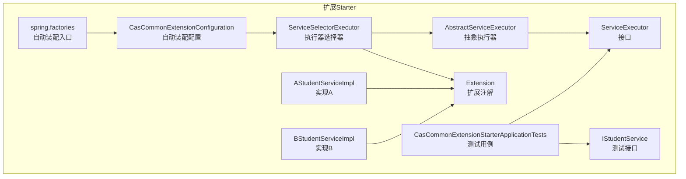
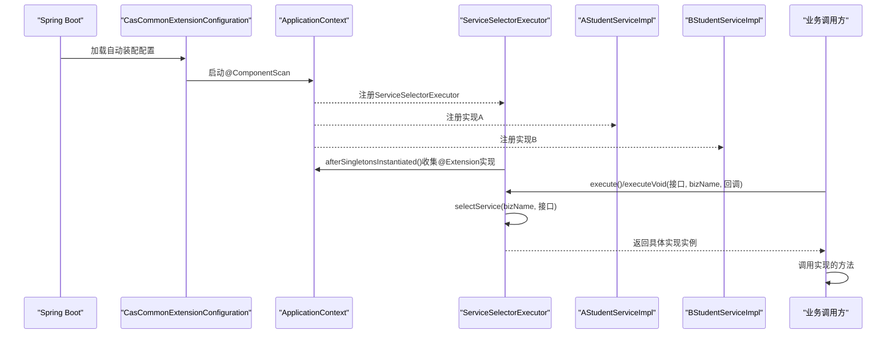
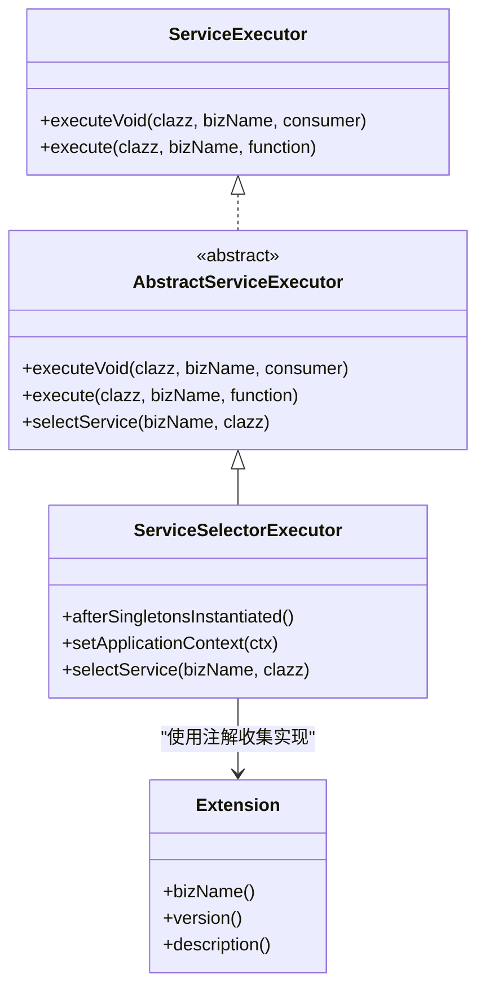
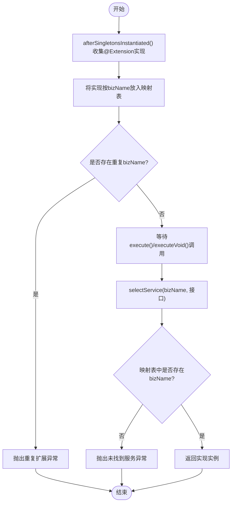
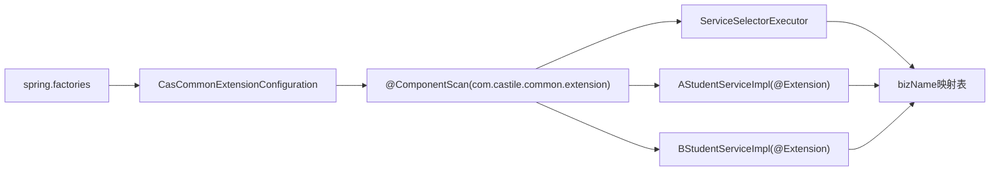

# 扩展服务Starter

<cite>
**本文引用的文件**
- [CasCommonExtensionConfiguration.java](file://castile-system-center/cas-common-starters/cas-common-extension-starter/src/main/java/com/castile/common/extension/config/CasCommonExtensionConfiguration.java)
- [ServiceSelectorExecutor.java](file://castile-system-center/cas-common-starters/cas-common-extension-starter/src/main/java/com/castile/common/extension/ServiceSelectorExecutor.java)
- [Extension.java](file://castile-system-center/cas-common-starters/cas-common-extension-starter/src/main/java/com/castile/common/extension/Extension.java)
- [ServiceExecutor.java](file://castile-system-center/cas-common-starters/cas-common-extension-starter/src/main/java/com/castile/common/extension/ServiceExecutor.java)
- [AbstractServiceExecutor.java](file://castile-system-center/cas-common-starters/cas-common-extension-starter/src/main/java/com/castile/common/extension/AbstractServiceExecutor.java)
- [IStudentService.java](file://castile-system-center/cas-common-starters/cas-common-extension-starter/src/test/java/com/castile/common/extension/IStudentService.java)
- [AStudentServiceImpl.java](file://castile-system-center/cas-common-starters/cas-common-extension-starter/src/test/java/com/castile/common/extension/AStudentServiceImpl.java)
- [BStudentServiceImpl.java](file://castile-system-center/cas-common-starters/cas-common-extension-starter/src/test/java/com/castile/common/extension/BStudentServiceImpl.java)
- [CasCommonExtensionStarterApplicationTests.java](file://castile-system-center/cas-common-starters/cas-common-extension-starter/src/test/java/com/castile/common/extension/CasCommonExtensionStarterApplicationTests.java)
- [spring.factories](file://castile-system-center/cas-common-starters/cas-common-extension-starter/src/main/resources/META-INF/spring.factories)
- [pom.xml](file://castile-system-center/cas-common-starters/cas-common-extension-starter/pom.xml)
- [App.java](file://castile-system-center/cas-common-starters/cas-common-extension-starter/src/test/java/com/castile/common/App.java)
- [ChainContext.java](file://castile-system-center/cas-common-chain/src/main/java/com/castile/common/chain/ChainContext.java)
</cite>

## 目录
1. [简介](#简介)
2. [项目结构](#项目结构)
3. [核心组件](#核心组件)
4. [架构总览](#架构总览)
5. [详细组件分析](#详细组件分析)
6. [依赖分析](#依赖分析)
7. [性能考虑](#性能考虑)
8. [故障排查指南](#故障排查指南)
9. [结论](#结论)
10. [附录](#附录)

## 简介
本文件系统性地文档化扩展服务Starter的设计与使用，围绕以下目标展开：
- 解释CasCommonExtensionConfiguration通过@ComponentScan自动扫描com.castile.common.extension包下的扩展组件，实现服务执行器（ServiceExecutor）的自动注册。
- 说明ServiceSelectorExecutor如何基于业务上下文选择合适的ServiceExecutor实现，体现策略模式的应用。
- 结合测试代码中的IStudentService、AStudentServiceImpl和BStudentServiceImpl示例，讲解如何定义扩展接口与实现类，并通过@Extension注解标记业务类型。
- 提供在实际业务链路中调用扩展服务的代码模板，包括上下文构建、执行器选择与结果处理。
- 阐述该机制在多租户、差异化业务逻辑场景下的优势，并给出性能优化建议，如缓存执行器选择结果、避免重复扫描。

## 项目结构
扩展Starter位于cas-common-starters模块下，核心代码集中在com.castile.common.extension包内；同时在resources/META-INF目录下声明了spring.factories以启用自动装配。测试代码位于同级包的test目录下，演示了扩展接口与实现类的定义及使用方式。

图表来源
- [CasCommonExtensionConfiguration.java](file://castile-system-center/cas-common-starters/cas-common-extension-starter/src/main/java/com/castile/common/extension/config/CasCommonExtensionConfiguration.java#L1-L15)
- [ServiceSelectorExecutor.java](file://castile-system-center/cas-common-starters/cas-common-extension-starter/src/main/java/com/castile/common/extension/ServiceSelectorExecutor.java#L1-L60)
- [AbstractServiceExecutor.java](file://castile-system-center/cas-common-starters/cas-common-extension-starter/src/main/java/com/castile/common/extension/AbstractServiceExecutor.java#L1-L36)
- [ServiceExecutor.java](file://castile-system-center/cas-common-starters/cas-common-extension-starter/src/main/java/com/castile/common/extension/ServiceExecutor.java#L1-L33)
- [Extension.java](file://castile-system-center/cas-common-starters/cas-common-extension-starter/src/main/java/com/castile/common/extension/Extension.java#L1-L21)
- [IStudentService.java](file://castile-system-center/cas-common-starters/cas-common-extension-starter/src/test/java/com/castile/common/extension/IStudentService.java#L1-L15)
- [AStudentServiceImpl.java](file://castile-system-center/cas-common-starters/cas-common-extension-starter/src/test/java/com/castile/common/extension/AStudentServiceImpl.java#L1-L25)
- [BStudentServiceImpl.java](file://castile-system-center/cas-common-starters/cas-common-extension-starter/src/test/java/com/castile/common/extension/BStudentServiceImpl.java#L1-L25)
- [CasCommonExtensionStarterApplicationTests.java](file://castile-system-center/cas-common-starters/cas-common-extension-starter/src/test/java/com/castile/common/extension/CasCommonExtensionStarterApplicationTests.java#L1-L38)
- [spring.factories](file://castile-system-center/cas-common-starters/cas-common-extension-starter/src/main/resources/META-INF/spring.factories#L1-L3)

章节来源
- [spring.factories](file://castile-system-center/cas-common-starters/cas-common-extension-starter/src/main/resources/META-INF/spring.factories#L1-L3)
- [pom.xml](file://castile-system-center/cas-common-starters/cas-common-extension-starter/pom.xml#L1-L87)

## 核心组件
- 自动装配配置：CasCommonExtensionConfiguration通过@ComponentScan扫描扩展包，确保后续组件被Spring容器管理。
- 执行器接口：ServiceExecutor定义了两类执行方法，分别用于无返回值与有返回值的业务调用。
- 抽象执行器：AbstractServiceExecutor封装通用流程（选择服务+调用），将“选择服务”的细节留给子类实现。
- 选择器实现：ServiceSelectorExecutor基于@Extension注解完成执行器的收集与选择，采用策略模式按bizName选择具体实现。
- 扩展注解：Extension用于为实现类标注业务类型bizName等元数据，便于运行时选择。

章节来源
- [CasCommonExtensionConfiguration.java](file://castile-system-center/cas-common-starters/cas-common-extension-starter/src/main/java/com/castile/common/extension/config/CasCommonExtensionConfiguration.java#L1-L15)
- [ServiceExecutor.java](file://castile-system-center/cas-common-starters/cas-common-extension-starter/src/main/java/com/castile/common/extension/ServiceExecutor.java#L1-L33)
- [AbstractServiceExecutor.java](file://castile-system-center/cas-common-starters/cas-common-extension-starter/src/main/java/com/castile/common/extension/AbstractServiceExecutor.java#L1-L36)
- [ServiceSelectorExecutor.java](file://castile-system-center/cas-common-starters/cas-common-extension-starter/src/main/java/com/castile/common/extension/ServiceSelectorExecutor.java#L1-L60)
- [Extension.java](file://castile-system-center/cas-common-starters/cas-common-extension-starter/src/main/java/com/castile/common/extension/Extension.java#L1-L21)

## 架构总览
扩展Starter采用“自动装配+注解驱动+策略选择”的架构：
- 自动装配：spring.factories声明EnableAutoConfiguration，加载CasCommonExtensionConfiguration，进而扫描扩展包并注册组件。
- 注解驱动：实现类通过@Extension标注bizName，选择器在容器初始化完成后收集这些实现。
- 策略选择：AbstractServiceExecutor统一调度，ServiceSelectorExecutor按bizName从已收集的实现中选择具体实例。

图表来源
- [spring.factories](file://castile-system-center/cas-common-starters/cas-common-extension-starter/src/main/resources/META-INF/spring.factories#L1-L3)
- [CasCommonExtensionConfiguration.java](file://castile-system-center/cas-common-starters/cas-common-extension-starter/src/main/java/com/castile/common/extension/config/CasCommonExtensionConfiguration.java#L1-L15)
- [ServiceSelectorExecutor.java](file://castile-system-center/cas-common-starters/cas-common-extension-starter/src/main/java/com/castile/common/extension/ServiceSelectorExecutor.java#L1-L60)
- [AStudentServiceImpl.java](file://castile-system-center/cas-common-starters/cas-common-extension-starter/src/test/java/com/castile/common/extension/AStudentServiceImpl.java#L1-L25)
- [BStudentServiceImpl.java](file://castile-system-center/cas-common-starters/cas-common-extension-starter/src/test/java/com/castile/common/extension/BStudentServiceImpl.java#L1-L25)

## 详细组件分析

### 组件一：自动装配与组件扫描
- CasCommonExtensionConfiguration通过@ComponentScan扫描com.castile.common.extension包，确保该包内的组件（如ServiceSelectorExecutor、@Extension标注的实现类）被Spring容器发现并注册。
- spring.factories中声明EnableAutoConfiguration，使Spring Boot在启动时自动加载该配置类，无需手动引入。

章节来源
- [CasCommonExtensionConfiguration.java](file://castile-system-center/cas-common-starters/cas-common-extension-starter/src/main/java/com/castile/common/extension/config/CasCommonExtensionConfiguration.java#L1-L15)
- [spring.factories](file://castile-system-center/cas-common-starters/cas-common-extension-starter/src/main/resources/META-INF/spring.factories#L1-L3)

### 组件二：执行器接口与抽象实现
- ServiceExecutor定义两类执行方法：
  - executeVoid：传入接口类型、业务名、回调Consumer，内部完成选择与调用。
  - execute：传入接口类型、业务名、回调Function，内部完成选择与调用并返回结果。
- AbstractServiceExecutor将“选择服务”抽象为selectService方法，子类负责实现选择逻辑。

图表来源
- [ServiceExecutor.java](file://castile-system-center/cas-common-starters/cas-common-extension-starter/src/main/java/com/castile/common/extension/ServiceExecutor.java#L1-L33)
- [AbstractServiceExecutor.java](file://castile-system-center/cas-common-starters/cas-common-extension-starter/src/main/java/com/castile/common/extension/AbstractServiceExecutor.java#L1-L36)
- [ServiceSelectorExecutor.java](file://castile-system-center/cas-common-starters/cas-common-extension-starter/src/main/java/com/castile/common/extension/ServiceSelectorExecutor.java#L1-L60)
- [Extension.java](file://castile-system-center/cas-common-starters/cas-common-extension-starter/src/main/java/com/castile/common/extension/Extension.java#L1-L21)

章节来源
- [ServiceExecutor.java](file://castile-system-center/cas-common-starters/cas-common-extension-starter/src/main/java/com/castile/common/extension/ServiceExecutor.java#L1-L33)
- [AbstractServiceExecutor.java](file://castile-system-center/cas-common-starters/cas-common-extension-starter/src/main/java/com/castile/common/extension/AbstractServiceExecutor.java#L1-L36)

### 组件三：执行器选择器（策略模式）
- ServiceSelectorExecutor在容器初始化完成后，扫描所有带有@Extension注解的Bean，提取bizName并建立映射表。
- 选择策略：
  - 若不存在对应bizName，抛出异常提示未找到服务。
  - 若存在多个相同bizName，抛出重复扩展异常。
  - 选择成功则返回对应实现实例，由AbstractServiceExecutor统一调用。

图表来源
- [ServiceSelectorExecutor.java](file://castile-system-center/cas-common-starters/cas-common-extension-starter/src/main/java/com/castile/common/extension/ServiceSelectorExecutor.java#L1-L60)

章节来源
- [ServiceSelectorExecutor.java](file://castile-system-center/cas-common-starters/cas-common-extension-starter/src/main/java/com/castile/common/extension/ServiceSelectorExecutor.java#L1-L60)

### 组件四：扩展注解与实现类
- Extension注解包含bizName、version、description等字段，bizName用于运行时选择。
- 实现类通过@Service或@Component等注解注册到Spring容器，同时使用@Extension标注bizName。
- 测试中提供了IStudentService接口以及AStudentServiceImpl、BStudentServiceImpl两个实现，分别标注bizName为“A”和“B”。

章节来源
- [Extension.java](file://castile-system-center/cas-common-starters/cas-common-extension-starter/src/main/java/com/castile/common/extension/Extension.java#L1-L21)
- [AStudentServiceImpl.java](file://castile-system-center/cas-common-starters/cas-common-extension-starter/src/test/java/com/castile/common/extension/AStudentServiceImpl.java#L1-L25)
- [BStudentServiceImpl.java](file://castile-system-center/cas-common-starters/cas-common-extension-starter/src/test/java/com/castile/common/extension/BStudentServiceImpl.java#L1-L25)
- [IStudentService.java](file://castile-system-center/cas-common-starters/cas-common-extension-starter/src/test/java/com/castile/common/extension/IStudentService.java#L1-L15)

### 组件五：测试用例与使用示例
- 测试用例通过@Autowired注入ServiceExecutor，分别以“A”和“B”bizName调用IStudentService的不同实现，验证执行流程与返回结果。
- 示例展示了executeVoid与execute两种调用方式，分别用于无返回值与有返回值的场景。

章节来源
- [CasCommonExtensionStarterApplicationTests.java](file://castile-system-center/cas-common-starters/cas-common-extension-starter/src/test/java/com/castile/common/extension/CasCommonExtensionStarterApplicationTests.java#L1-L38)

## 依赖分析
- 自动装配依赖：spring.factories声明EnableAutoConfiguration，加载CasCommonExtensionConfiguration。
- 包扫描依赖：CasCommonExtensionConfiguration使用@ComponentScan扫描扩展包。
- 运行时依赖：ServiceSelectorExecutor在SmartInitializingSingleton阶段扫描@Extension实现，建立bizName到实现的映射。
- 模块依赖：扩展starter依赖cas-common-chain模块（pom中可见）。

图表来源
- [spring.factories](file://castile-system-center/cas-common-starters/cas-common-extension-starter/src/main/resources/META-INF/spring.factories#L1-L3)
- [CasCommonExtensionConfiguration.java](file://castile-system-center/cas-common-starters/cas-common-extension-starter/src/main/java/com/castile/common/extension/config/CasCommonExtensionConfiguration.java#L1-L15)
- [ServiceSelectorExecutor.java](file://castile-system-center/cas-common-starters/cas-common-extension-starter/src/main/java/com/castile/common/extension/ServiceSelectorExecutor.java#L1-L60)
- [AStudentServiceImpl.java](file://castile-system-center/cas-common-starters/cas-common-extension-starter/src/test/java/com/castile/common/extension/AStudentServiceImpl.java#L1-L25)
- [BStudentServiceImpl.java](file://castile-system-center/cas-common-starters/cas-common-extension-starter/src/test/java/com/castile/common/extension/BStudentServiceImpl.java#L1-L25)

章节来源
- [pom.xml](file://castile-system-center/cas-common-starters/cas-common-extension-starter/pom.xml#L1-L87)

## 性能考虑
- 缓存执行器选择结果：ServiceSelectorExecutor已将实现按bizName缓存至内存映射表，后续选择直接O(1)命中，避免重复扫描。
- 避免重复扫描：SmartInitializingSingleton仅在容器完全初始化后执行一次扫描，确保不会在运行期重复扫描。
- 代理类处理：当实现类被AOP代理时，选择器会通过ClassUtils.getUserClass获取原始类，再读取@Extension注解，保证注解解析正确。
- 并发安全：当前实现未显式加锁，若业务场景中存在动态替换实现的需求，可在映射表更新处增加同步控制或使用并发安全的数据结构。

章节来源
- [ServiceSelectorExecutor.java](file://castile-system-center/cas-common-starters/cas-common-extension-starter/src/main/java/com/castile/common/extension/ServiceSelectorExecutor.java#L1-L60)

## 故障排查指南
- 未找到服务异常：当bizName不存在时，选择器会抛出异常。请检查：
  - 实现类是否使用@Extension标注bizName。
  - bizName是否拼写正确且与调用侧一致。
- 重复扩展异常：当存在多个相同bizName的实现时，选择器会抛出重复扩展异常。请检查：
  - 是否为不同实现配置了相同的bizName。
  - 是否存在多个实现类同时标注同一bizName。
- 代理类导致注解缺失：若实现类被AOP代理，需确保选择器能正确识别原始类并读取@Extension注解（当前实现已处理此问题）。
- 自动装配未生效：确认spring.factories已正确声明自动装配配置，且Starter已打包进应用。

章节来源
- [ServiceSelectorExecutor.java](file://castile-system-center/cas-common-starters/cas-common-extension-starter/src/main/java/com/castile/common/extension/ServiceSelectorExecutor.java#L1-L60)
- [spring.factories](file://castile-system-center/cas-common-starters/cas-common-extension-starter/src/main/resources/META-INF/spring.factories#L1-L3)

## 结论
该扩展服务Starter通过自动装配、注解驱动与策略选择，实现了在不改变调用方代码的前提下，按业务上下文动态切换具体实现的能力。其设计简洁、可扩展性强，适用于多租户、差异化业务逻辑场景。配合缓存与一次性扫描，具备良好的运行时性能表现。

## 附录

### 使用示例与代码模板
- 定义扩展接口与实现类
  - 接口：参考IStudentService。
  - 实现类：参考AStudentServiceImpl与BStudentServiceImpl，均使用@Service与@Extension标注bizName。
- 在业务链路中调用扩展服务
  - 无返回值调用：参考CasCommonExtensionStarterApplicationTests中的executeVoid示例。
  - 有返回值调用：参考CasCommonExtensionStarterApplicationTests中的execute示例。
- 应用入口
  - 参考App.java，作为Spring Boot应用入口启动。

章节来源
- [IStudentService.java](file://castile-system-center/cas-common-starters/cas-common-extension-starter/src/test/java/com/castile/common/extension/IStudentService.java#L1-L15)
- [AStudentServiceImpl.java](file://castile-system-center/cas-common-starters/cas-common-extension-starter/src/test/java/com/castile/common/extension/AStudentServiceImpl.java#L1-L25)
- [BStudentServiceImpl.java](file://castile-system-center/cas-common-starters/cas-common-extension-starter/src/test/java/com/castile/common/extension/BStudentServiceImpl.java#L1-L25)
- [CasCommonExtensionStarterApplicationTests.java](file://castile-system-center/cas-common-starters/cas-common-extension-starter/src/test/java/com/castile/common/extension/CasCommonExtensionStarterApplicationTests.java#L1-L38)
- [App.java](file://castile-system-center/cas-common-starters/cas-common-extension-starter/src/test/java/com/castile/common/App.java#L1-L16)

### 与处理链上下文的结合
- 当业务链路需要根据上下文动态选择扩展实现时，可将ChainContext中的业务编码与bizName关联，由ServiceSelectorExecutor按bizName选择对应实现，实现“上下文驱动的策略选择”。

章节来源
- [ChainContext.java](file://castile-system-center/cas-common-chain/src/main/java/com/castile/common/chain/ChainContext.java#L1-L33)