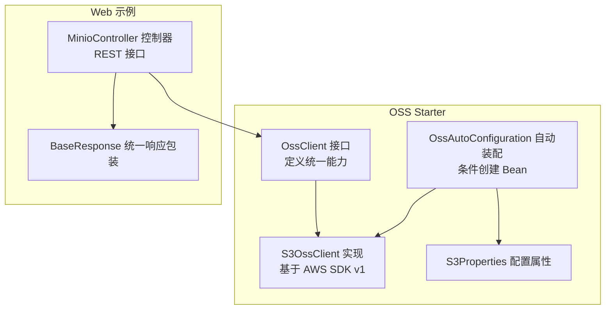
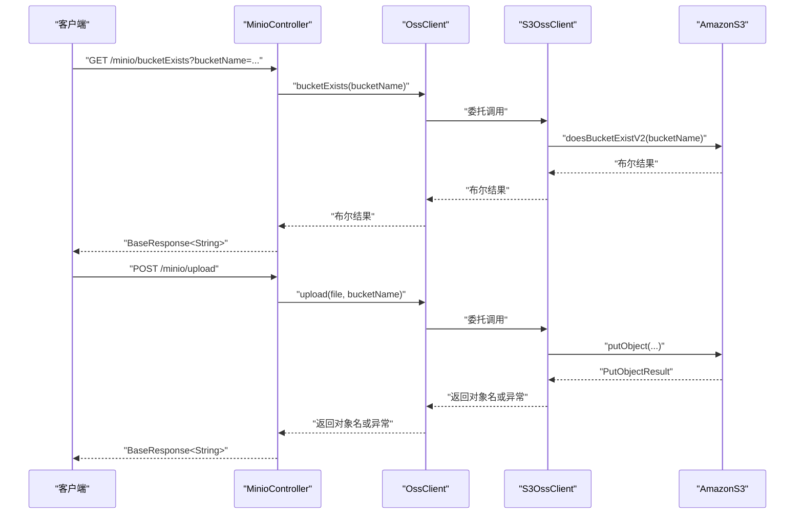
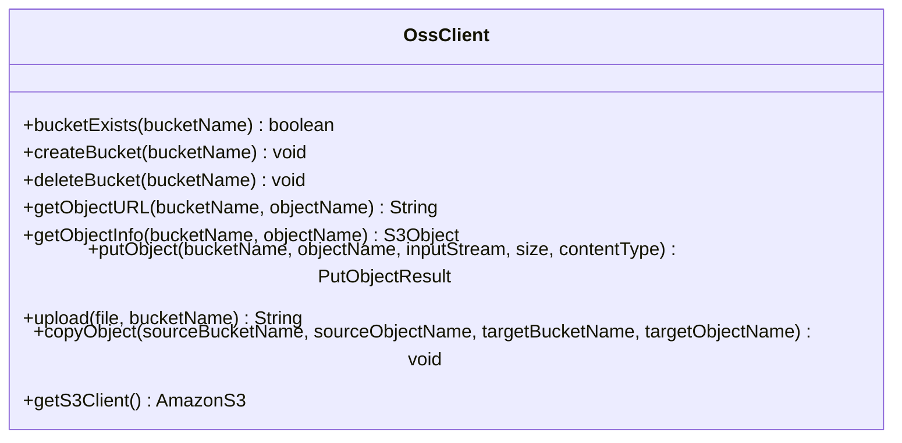
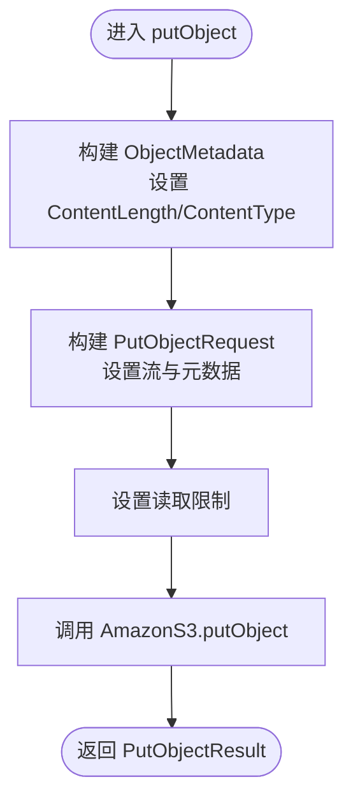
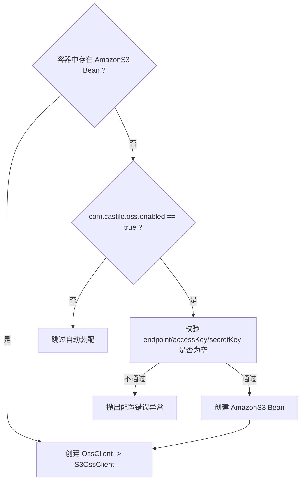
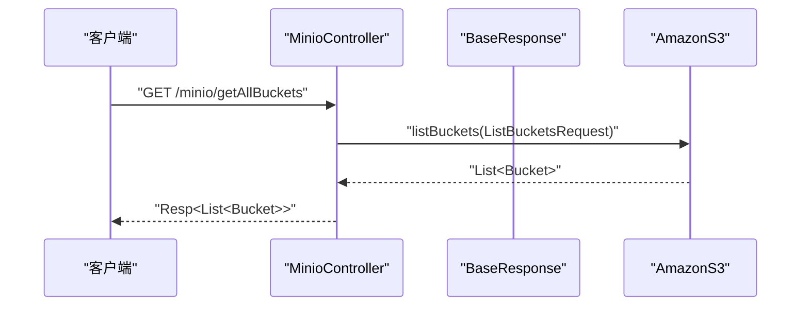
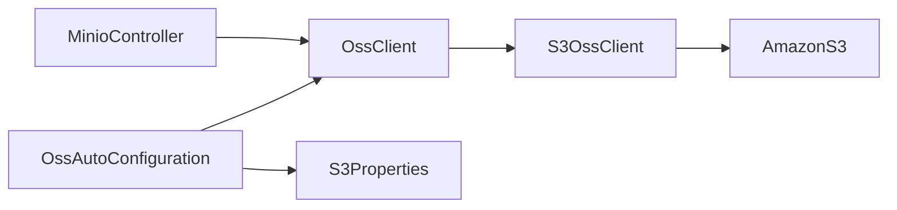

# OSS 集成实现

<cite>
**本文引用的文件**
- [OssClient.java](file://castile-system-center/cas-common-starters/cas-common-oss-starter/src/main/java/com/castile/common/oss/client/OssClient.java)
- [S3OssClient.java](file://castile-system-center/cas-common-starters/cas-common-oss-starter/src/main/java/com/castile/common/oss/client/S3OssClient.java)
- [OssAutoConfiguration.java](file://castile-system-center/cas-common-starters/cas-common-oss-starter/src/main/java/com/castile/common/oss/config/OssAutoConfiguration.java)
- [S3Properties.java](file://castile-system-center/cas-common-starters/cas-common-oss-starter/src/main/java/com/castile/common/oss/config/S3Properties.java)
- [MinioController.java](file://castile-system-center/cas-spring-boot-web/src/main/java/com/castile/casspringbootweb/demos/web/MinioController.java)
- [BaseResponse.java](file://castile-system-center/cas-spring-boot-web/src/main/java/com/castile/casspringbootweb/demos/web/BaseResponse.java)
- [spring.factories](file://castile-system-center/cas-common-starters/cas-common-oss-starter/src/main/resources/META-INF/spring.factories)
- [application.yaml](file://castile-system-center/cas-spring-boot-web/src/main/resources/application.yaml)
- [pom.xml](file://castile-system-center/cas-common-starters/cas-common-oss-starter/pom.xml)
</cite>

## 目录
1. [简介](#简介)
2. [项目结构](#项目结构)
3. [核心组件](#核心组件)
4. [架构总览](#架构总览)
5. [详细组件分析](#详细组件分析)
6. [依赖关系分析](#依赖关系分析)
7. [性能与可扩展性](#性能与可扩展性)
8. [故障排查指南](#故障排查指南)
9. [结论](#结论)
10. [附录：接口与配置参考](#附录接口与配置参考)

## 简介
本文件系统性阐述了如何通过 OssClient 抽象接口与 S3OssClient 实现类集成 AWS S3 兼容的对象存储服务（以 MinIO 为例）。文档覆盖：
- MinioController 提供的 REST 接口：bucketExists、makeBucket、deleteBucket、uploadFile、getAllBuckets、copyFile 的请求参数、响应格式与异常处理机制
- OssClient 抽象层如何屏蔽底层 SDK 差异，实现多云存储的可扩展性
- 文件上传、分片拷贝、桶管理等操作的使用示例
- ConditionalOnBean 注解如何确保组件按条件加载
- 配置项 endpoint、accessKey、secretKey 的设置方法
- 常见问题如权限拒绝、网络超时的排查步骤

## 项目结构
该仓库采用模块化组织，OSS 能力封装在独立 starter 中，Web 示例控制器位于 web 模块中：
- cas-common-oss-starter：OSS 客户端抽象与自动装配
- cas-spring-boot-web：演示控制器与应用配置

图表来源
- [OssClient.java](file://castile-system-center/cas-common-starters/cas-common-oss-starter/src/main/java/com/castile/common/oss/client/OssClient.java#L1-L71)
- [S3OssClient.java](file://castile-system-center/cas-common-starters/cas-common-oss-starter/src/main/java/com/castile/common/oss/client/S3OssClient.java#L1-L95)
- [OssAutoConfiguration.java](file://castile-system-center/cas-common-starters/cas-common-oss-starter/src/main/java/com/castile/common/oss/config/OssAutoConfiguration.java#L1-L62)
- [S3Properties.java](file://castile-system-center/cas-common-starters/cas-common-oss-starter/src/main/java/com/castile/common/oss/config/S3Properties.java#L1-L67)
- [MinioController.java](file://castile-system-center/cas-spring-boot-web/src/main/java/com/castile/casspringbootweb/demos/web/MinioController.java#L1-L64)
- [BaseResponse.java](file://castile-system-center/cas-spring-boot-web/src/main/java/com/castile/casspringbootweb/demos/web/BaseResponse.java#L1-L17)

章节来源
- [spring.factories](file://castile-system-center/cas-common-starters/cas-common-oss-starter/src/main/resources/META-INF/spring.factories#L1-L3)
- [pom.xml](file://castile-system-center/cas-common-starters/cas-common-oss-starter/pom.xml#L1-L64)

## 核心组件
- OssClient：定义统一的 OSS 能力接口，包括桶管理、对象读取、上传、拷贝、URL 获取、底层 S3 客户端访问等
- S3OssClient：基于 AWS SDK v1 的具体实现，封装对 AmazonS3 的调用
- OssAutoConfiguration：根据是否存在 AmazonS3 Bean 或是否启用配置，动态装配 OssClient 与 AmazonS3
- S3Properties：封装 OSS 连接配置（endpoint、accessKey、secretKey、region、pathStyleAccess）
- MinioController：对外暴露 REST 接口，调用 OssClient 执行桶与文件操作
- BaseResponse：统一响应包装

章节来源
- [OssClient.java](file://castile-system-center/cas-common-starters/cas-common-oss-starter/src/main/java/com/castile/common/oss/client/OssClient.java#L1-L71)
- [S3OssClient.java](file://castile-system-center/cas-common-starters/cas-common-oss-starter/src/main/java/com/castile/common/oss/client/S3OssClient.java#L1-L95)
- [OssAutoConfiguration.java](file://castile-system-center/cas-common-starters/cas-common-oss-starter/src/main/java/com/castile/common/oss/config/OssAutoConfiguration.java#L1-L62)
- [S3Properties.java](file://castile-system-center/cas-common-starters/cas-common-oss-starter/src/main/java/com/castile/common/oss/config/S3Properties.java#L1-L67)
- [MinioController.java](file://castile-system-center/cas-spring-boot-web/src/main/java/com/castile/casspringbootweb/demos/web/MinioController.java#L1-L64)
- [BaseResponse.java](file://castile-system-center/cas-spring-boot-web/src/main/java/com/castile/casspringbootweb/demos/web/BaseResponse.java#L1-L17)

## 架构总览
下图展示了从 Web 控制器到抽象接口再到具体实现与 AWS SDK 的交互路径，以及自动装配如何按条件加载组件。

图表来源
- [MinioController.java](file://castile-system-center/cas-spring-boot-web/src/main/java/com/castile/casspringbootweb/demos/web/MinioController.java#L1-L64)
- [OssClient.java](file://castile-system-center/cas-common-starters/cas-common-oss-starter/src/main/java/com/castile/common/oss/client/OssClient.java#L1-L71)
- [S3OssClient.java](file://castile-system-center/cas-common-starters/cas-common-oss-starter/src/main/java/com/castile/common/oss/client/S3OssClient.java#L1-L95)

## 详细组件分析

### OssClient 接口设计
- 能力范围：桶存在性判断、创建、删除；对象 URL 获取；对象信息获取；对象上传；文件上传；对象拷贝；底层 S3 客户端访问
- 设计要点：通过接口隔离不同云厂商的 SDK 差异，便于替换实现（例如未来新增其他云厂商实现）

图表来源
- [OssClient.java](file://castile-system-center/cas-common-starters/cas-common-oss-starter/src/main/java/com/castile/common/oss/client/OssClient.java#L1-L71)

章节来源
- [OssClient.java](file://castile-system-center/cas-common-starters/cas-common-oss-starter/src/main/java/com/castile/common/oss/client/OssClient.java#L1-L71)

### S3OssClient 实现细节
- 桶管理：基于 SDK 的 doesBucketExistV2、createBucket、deleteBucket
- 对象上传：构造 ObjectMetadata 与 PutObjectRequest，设置读取限制，调用 putObject
- 文件上传：对 MultipartFile 进行重命名与日期目录组织，调用 putObject
- 对象拷贝：直接委托 SDK 的 copyObject
- URL 获取：通过 getUrl 生成公开访问地址
- 底层客户端：提供 getS3Client 以便直接使用 SDK 能力

图表来源
- [S3OssClient.java](file://castile-system-center/cas-common-starters/cas-common-oss-starter/src/main/java/com/castile/common/oss/client/S3OssClient.java#L1-L95)

章节来源
- [S3OssClient.java](file://castile-system-center/cas-common-starters/cas-common-oss-starter/src/main/java/com/castile/common/oss/client/S3OssClient.java#L1-L95)

### 自动装配与条件加载
- 当容器中已存在 AmazonS3 Bean 时，自动装配 OssClient 并注入 S3OssClient
- 当不存在 AmazonS3 Bean 且配置 com.castile.oss.enabled=true 时，根据 S3Properties 创建 AmazonS3 Bean
- 配置校验：若 endpoint、accessKey、secretKey 任一为 null，抛出运行时异常提示配置错误
- Spring Factories：通过 META-INF/spring.factories 自动注册 OssAutoConfiguration

图表来源
- [OssAutoConfiguration.java](file://castile-system-center/cas-common-starters/cas-common-oss-starter/src/main/java/com/castile/common/oss/config/OssAutoConfiguration.java#L1-L62)
- [S3Properties.java](file://castile-system-center/cas-common-starters/cas-common-oss-starter/src/main/java/com/castile/common/oss/config/S3Properties.java#L1-L67)
- [spring.factories](file://castile-system-center/cas-common-starters/cas-common-oss-starter/src/main/resources/META-INF/spring.factories#L1-L3)

章节来源
- [OssAutoConfiguration.java](file://castile-system-center/cas-common-starters/cas-common-oss-starter/src/main/java/com/castile/common/oss/config/OssAutoConfiguration.java#L1-L62)
- [S3Properties.java](file://castile-system-center/cas-common-starters/cas-common-oss-starter/src/main/java/com/castile/common/oss/config/S3Properties.java#L1-L67)
- [spring.factories](file://castile-system-center/cas-common-starters/cas-common-oss-starter/src/main/resources/META-INF/spring.factories#L1-L3)

### MinioController REST 接口
- bucketExists：GET /minio/bucketExists?bucketName=...
  - 请求参数：bucketName（查询参数）
  - 响应：BaseResponse<String>，返回“bucket exists”或“bucket not exists”
- makeBucket：GET /minio/makeBucket?bucketName=...
  - 请求参数：bucketName（查询参数）
  - 响应：无（200 OK）
- deleteBucket：GET /minio/deleteBucket?bucketName=...
  - 请求参数：bucketName（查询参数）
  - 响应：无（200 OK）
- uploadFile：POST /minio/upload（multipart/form-data）
  - 请求体：MultipartFile
  - 响应：BaseResponse<String>，返回对象名
- getAllBuckets：GET /minio/getAllBuckets
  - 请求：无
  - 响应：List<Bucket>（直接调用底层 S3 客户端）
- copyFile：GET /minio/copyFile
  - 请求：无
  - 响应：无（200 OK），内部调用 copyObject

图表来源
- [MinioController.java](file://castile-system-center/cas-spring-boot-web/src/main/java/com/castile/casspringbootweb/demos/web/MinioController.java#L1-L64)
- [BaseResponse.java](file://castile-system-center/cas-spring-boot-web/src/main/java/com/castile/casspringbootweb/demos/web/BaseResponse.java#L1-L17)

章节来源
- [MinioController.java](file://castile-system-center/cas-spring-boot-web/src/main/java/com/castile/casspringbootweb/demos/web/MinioController.java#L1-L64)
- [BaseResponse.java](file://castile-system-center/cas-spring-boot-web/src/main/java/com/castile/casspringbootweb/demos/web/BaseResponse.java#L1-L17)

## 依赖关系分析
- OssClient 与 S3OssClient：实现与抽象分离，S3OssClient 依赖 AmazonS3
- OssAutoConfiguration：根据条件创建 OssClient 与 AmazonS3 Bean
- MinioController：依赖 OssClient，受 ConditionalOnBean 保护，仅当存在 AmazonS3 Bean 时才加载
- S3Properties：被 OssAutoConfiguration 使用，用于构建 AmazonS3

图表来源
- [OssAutoConfiguration.java](file://castile-system-center/cas-common-starters/cas-common-oss-starter/src/main/java/com/castile/common/oss/config/OssAutoConfiguration.java#L1-L62)
- [OssClient.java](file://castile-system-center/cas-common-starters/cas-common-oss-starter/src/main/java/com/castile/common/oss/client/OssClient.java#L1-L71)
- [S3OssClient.java](file://castile-system-center/cas-common-starters/cas-common-oss-starter/src/main/java/com/castile/common/oss/client/S3OssClient.java#L1-L95)
- [MinioController.java](file://castile-system-center/cas-spring-boot-web/src/main/java/com/castile/casspringbootweb/demos/web/MinioController.java#L1-L64)
- [S3Properties.java](file://castile-system-center/cas-common-starters/cas-common-oss-starter/src/main/java/com/castile/common/oss/config/S3Properties.java#L1-L67)

章节来源
- [OssAutoConfiguration.java](file://castile-system-center/cas-common-starters/cas-common-oss-starter/src/main/java/com/castile/common/oss/config/OssAutoConfiguration.java#L1-L62)
- [MinioController.java](file://castile-system-center/cas-spring-boot-web/src/main/java/com/castile/casspringbootweb/demos/web/MinioController.java#L1-L64)

## 性能与可扩展性
- 可扩展性：通过 OssClient 抽象，未来可新增其他云厂商实现（如 AliyunOssClient），只需实现相同接口即可无缝替换
- 性能建议：
  - 上传大文件时优先使用分片上传（需在具体实现中扩展），当前 S3OssClient 使用单次 putObject
  - 合理设置读取限制与超时参数，避免内存压力
  - 复用 AmazonS3 客户端实例，避免频繁创建
- 依赖版本：aws-java-sdk-s3 版本固定，注意与目标 S3 兼容性

章节来源
- [pom.xml](file://castile-system-center/cas-common-starters/cas-common-oss-starter/pom.xml#L1-L64)

## 故障排查指南
- 权限拒绝
  - 现象：上传/拷贝/列出桶失败
  - 排查：确认 accessKey/secretKey 正确；确认桶策略允许相应操作；确认 endpoint 与 region 配置正确
  - 参考：OssAutoConfiguration 在配置缺失时会抛出异常，先检查配置
- 网络超时
  - 现象：连接 S3 服务超时
  - 排查：检查 endpoint 可达性；调整客户端超时参数；确认防火墙放行
- 未加载控制器
  - 现象：访问 /minio/* 返回 404
  - 排查：确认容器中存在 AmazonS3 Bean；或开启 com.castile.oss.enabled=true 并正确配置 S3Properties
- 上传失败
  - 现象：uploadFile 返回空或异常
  - 排查：检查文件名合法性；查看 S3OssClient 中对原始文件名的处理逻辑；确认桶存在且有写入权限

章节来源
- [OssAutoConfiguration.java](file://castile-system-center/cas-common-starters/cas-common-oss-starter/src/main/java/com/castile/common/oss/config/OssAutoConfiguration.java#L1-L62)
- [S3OssClient.java](file://castile-system-center/cas-common-starters/cas-common-oss-starter/src/main/java/com/castile/common/oss/client/S3OssClient.java#L1-L95)
- [MinioController.java](file://castile-system-center/cas-spring-boot-web/src/main/java/com/castile/casspringbootweb/demos/web/MinioController.java#L1-L64)

## 结论
该实现通过 OssClient 抽象屏蔽底层 SDK 差异，结合条件装配与配置属性，实现了对 AWS S3 兼容对象存储的统一接入。MinioController 提供了桶管理与文件上传等常用接口，配合统一响应包装，便于前端消费。未来可通过扩展 OssClient 实现来支持更多云厂商，保持上层业务代码稳定不变。

## 附录：接口与配置参考

### REST 接口一览
- GET /minio/bucketExists?bucketName=...
  - 功能：检测桶是否存在
  - 响应：BaseResponse<String>
- GET /minio/makeBucket?bucketName=...
  - 功能：创建桶
  - 响应：无
- GET /minio/deleteBucket?bucketName=...
  - 功能：删除桶
  - 响应：无
- POST /minio/upload
  - 功能：上传文件
  - 请求体：multipart/form-data（MultipartFile）
  - 响应：BaseResponse<String>（对象名）
- GET /minio/getAllBuckets
  - 功能：列出所有桶
  - 响应：List<Bucket>
- GET /minio/copyFile
  - 功能：拷贝对象
  - 响应：无

章节来源
- [MinioController.java](file://castile-system-center/cas-spring-boot-web/src/main/java/com/castile/casspringbootweb/demos/web/MinioController.java#L1-L64)
- [BaseResponse.java](file://castile-system-center/cas-spring-boot-web/src/main/java/com/castile/casspringbootweb/demos/web/BaseResponse.java#L1-L17)

### 配置项说明
- com.castile.oss.enabled：是否启用自动装配（默认 true）
- com.castile.oss.access-key：访问密钥
- com.castile.oss.secret-key：私有密钥
- com.castile.oss.endpoint：S3 兼容服务端点
- com.castile.oss.region：区域（默认值由 SDK 决定）
- com.castile.oss.path-style-access：是否启用路径风格访问（默认 true）

章节来源
- [S3Properties.java](file://castile-system-center/cas-common-starters/cas-common-oss-starter/src/main/java/com/castile/common/oss/config/S3Properties.java#L1-L67)
- [application.yaml](file://castile-system-center/cas-spring-boot-web/src/main/resources/application.yaml#L1-L33)

### 使用示例（步骤说明）
- 准备环境
  - 若已有 AmazonS3 Bean，则无需额外配置
  - 若无 AmazonS3 Bean，设置 com.castile.oss.enabled=true，并填写 access-key、secret-key、endpoint、region、path-style-access
- 访问接口
  - 创建桶：GET /minio/makeBucket?bucketName=your-bucket
  - 上传文件：POST /minio/upload（multipart/form-data）
  - 列出桶：GET /minio/getAllBuckets
  - 拷贝对象：GET /minio/copyFile
- 异常处理
  - 配置错误：OssAutoConfiguration 将抛出异常，检查配置项是否齐全
  - 上传异常：S3OssClient 中对原始文件名为空的情况抛出异常，检查文件参数

章节来源
- [OssAutoConfiguration.java](file://castile-system-center/cas-common-starters/cas-common-oss-starter/src/main/java/com/castile/common/oss/config/OssAutoConfiguration.java#L1-L62)
- [S3OssClient.java](file://castile-system-center/cas-common-starters/cas-common-oss-starter/src/main/java/com/castile/common/oss/client/S3OssClient.java#L1-L95)
- [MinioController.java](file://castile-system-center/cas-spring-boot-web/src/main/java/com/castile/casspringbootweb/demos/web/MinioController.java#L1-L64)