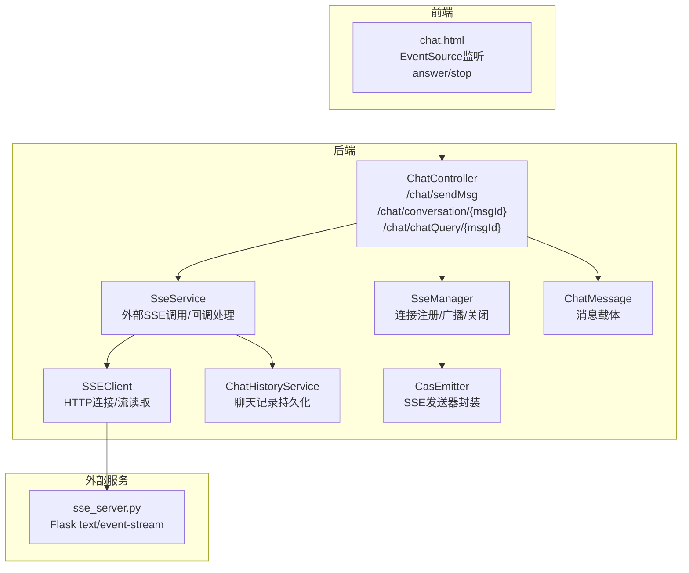
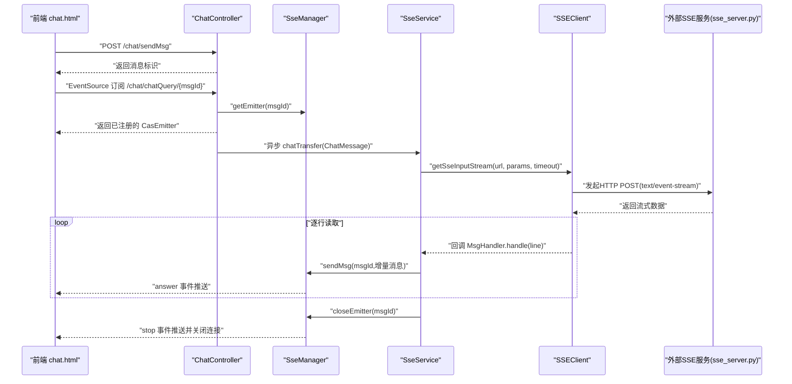
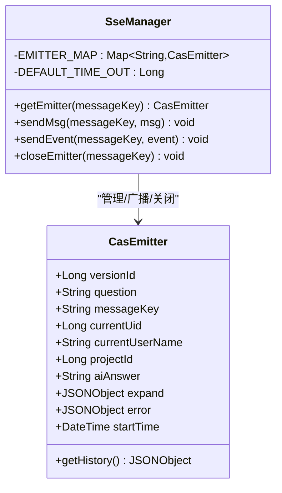
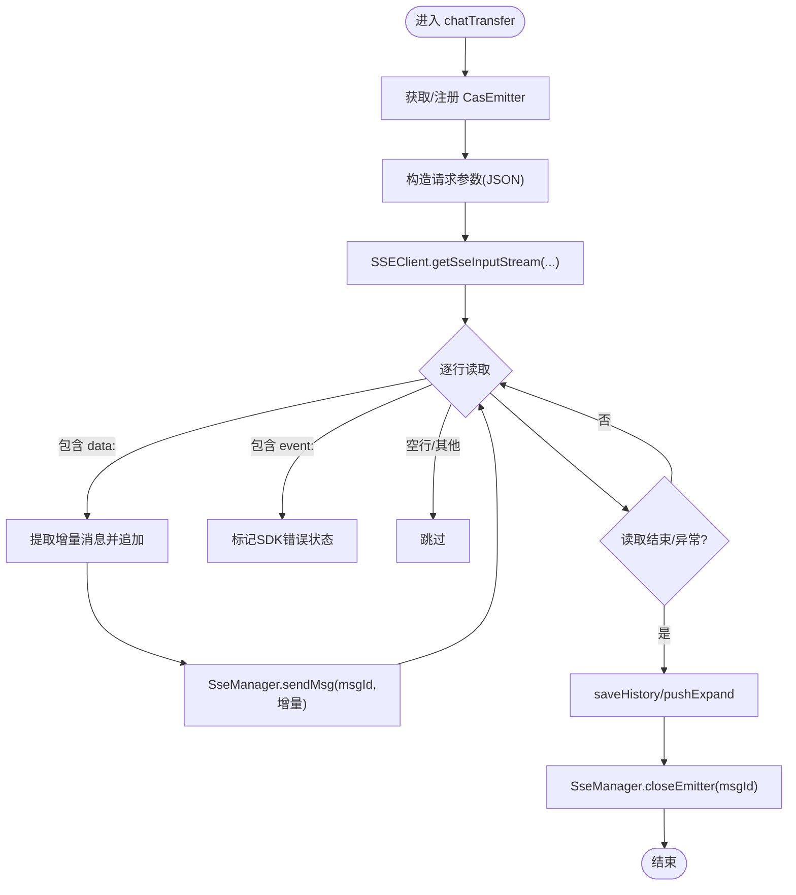
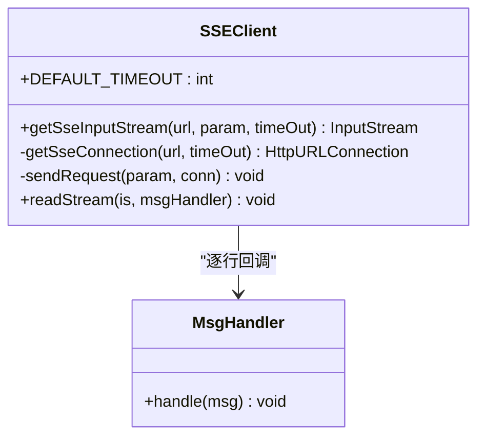
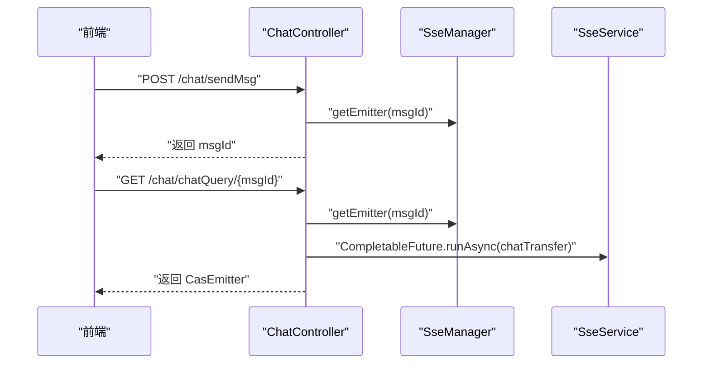
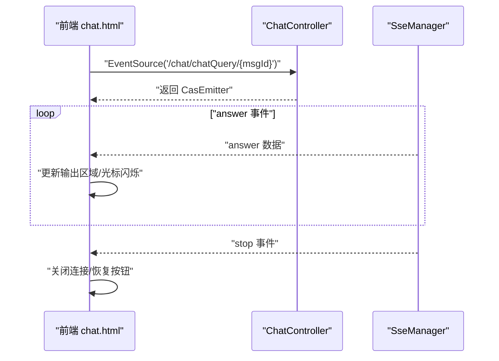
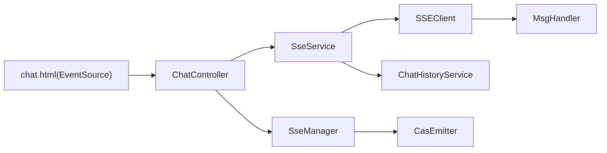

# SSE 实现机制

<cite>
**本文引用的文件**
- [SseManager.java](file://castile-system-center/cas-spring-boot-web/src/main/java/com/castile/casspringbootweb/demos/sse/cbb/SseManager.java)
- [SseService.java](file://castile-system-center/cas-spring-boot-web/src/main/java/com/castile/casspringbootweb/demos/sse/cbb/SseService.java)
- [SSEClient.java](file://castile-system-center/cas-spring-boot-web/src/main/java/com/castile/casspringbootweb/demos/sse/cbb/SSEClient.java)
- [CasEmitter.java](file://castile-system-center/cas-spring-boot-web/src/main/java/com/castile/casspringbootweb/demos/sse/cbb/CasEmitter.java)
- [ChatHistoryService.java](file://castile-system-center/cas-spring-boot-web/src/main/java/com/castile/casspringbootweb/demos/sse/cbb/ChatHistoryService.java)
- [MsgHandler.java](file://castile-system-center/cas-spring-boot-web/src/main/java/com/castile/casspringbootweb/demos/sse/cbb/MsgHandler.java)
- [ChatController.java](file://castile-system-center/cas-spring-boot-web/src/main/java/com/castile/casspringbootweb/demos/sse/ChatController.java)
- [ChatMessage.java](file://castile-system-center/cas-spring-boot-web/src/main/java/com/castile/casspringbootweb/demos/sse/ChatMessage.java)
- [chat.html](file://castile-system-center/cas-spring-boot-web/src/main/resources/static/chat.html)
- [sse_server.py](file://castile-system-center/cas-spring-boot-web/src/main/resources/python/sse_server.py)
</cite>

## 目录
1. [引言](#引言)
2. [项目结构](#项目结构)
3. [核心组件](#核心组件)
4. [架构总览](#架构总览)
5. [详细组件分析](#详细组件分析)
6. [依赖关系分析](#依赖关系分析)
7. [性能考量](#性能考量)
8. [故障排查指南](#故障排查指南)
9. [结论](#结论)
10. [附录](#附录)

## 引言
本文件围绕基于 Server-Sent Events（SSE）的实时消息推送机制进行深入解析，重点覆盖以下方面：
- SseManager 如何通过并发映射管理 CasEmitter 实例，实现客户端连接的注册、消息广播与连接关闭的全生命周期管理；
- SseService 中如何调用 SSEClient 与外部服务建立 SSE 流式连接，并通过回调函数逐行处理响应数据，结合 ChatHistoryService 完成聊天记录的持久化存储；
- MsgHandler 接口在消息处理流程中的扩展作用；
- 前端 chat.html 中 EventSource JavaScript API 的使用，展示前端如何监听 answer、stop 等自定义事件并动态更新 UI；
- 常见问题（连接超时、异常重连、跨域配置）的解决方案与性能优化建议（连接池管理与消息压缩）。

## 项目结构
本示例位于 Spring Boot Web 模块中，SSE 相关代码集中在 demos/sse/cbb 包下，配合控制器 ChatController 提供 SSE 端点；前端静态资源位于 static/chat.html；同时提供 Python 示例服务 sse_server.py 以演示标准 text/event-stream 格式的流式输出。

图表来源
- [ChatController.java](file://castile-system-center/cas-spring-boot-web/src/main/java/com/castile/casspringbootweb/demos/sse/ChatController.java#L1-L97)
- [SseManager.java](file://castile-system-center/cas-spring-boot-web/src/main/java/com/castile/casspringbootweb/demos/sse/cbb/SseManager.java#L1-L97)
- [SseService.java](file://castile-system-center/cas-spring-boot-web/src/main/java/com/castile/casspringbootweb/demos/sse/cbb/SseService.java#L1-L103)
- [SSEClient.java](file://castile-system-center/cas-spring-boot-web/src/main/java/com/castile/casspringbootweb/demos/sse/cbb/SSEClient.java#L1-L88)
- [CasEmitter.java](file://castile-system-center/cas-spring-boot-web/src/main/java/com/castile/casspringbootweb/demos/sse/cbb/CasEmitter.java#L1-L84)
- [ChatHistoryService.java](file://castile-system-center/cas-spring-boot-web/src/main/java/com/castile/casspringbootweb/demos/sse/cbb/ChatHistoryService.java#L1-L23)
- [ChatMessage.java](file://castile-system-center/cas-spring-boot-web/src/main/java/com/castile/casspringbootweb/demos/sse/ChatMessage.java#L1-L21)
- [chat.html](file://castile-system-center/cas-spring-boot-web/src/main/resources/static/chat.html#L90-L160)
- [sse_server.py](file://castile-system-center/cas-spring-boot-web/src/main/resources/python/sse_server.py#L1-L135)

章节来源
- [ChatController.java](file://castile-system-center/cas-spring-boot-web/src/main/java/com/castile/casspringbootweb/demos/sse/ChatController.java#L1-L97)
- [chat.html](file://castile-system-center/cas-spring-boot-web/src/main/resources/static/chat.html#L90-L160)

## 核心组件
- SseManager：维护消息键到 CasEmitter 的并发映射，提供获取、发送消息、发送事件、关闭连接的能力，支持默认超时配置。
- SseService：负责与外部 SSE 服务交互，通过 SSEClient 读取流式数据，按行解析并转发至前端；在 finally 中确保关闭连接与持久化。
- SSEClient：封装 HTTP 连接与流读取逻辑，支持设置超时、请求头、POST 参数，并提供基于回调的逐行读取接口。
- CasEmitter：继承 SseEmitter，扩展消息上下文字段（版本、问题、消息键、用户、项目、AI 回答、扩展信息、错误、起始时间），并提供历史消息聚合方法。
- ChatHistoryService：负责聊天记录的保存与扩展消息推送（占位实现，便于接入数据库或缓存）。
- MsgHandler：消息处理回调接口，SSEClient 在读取到每一行时调用，便于解耦业务处理。
- ChatController：对外暴露消息提交与 SSE 订阅端点，异步触发 SseService 并立即返回已注册的 CasEmitter。
- ChatMessage：前后端通用的消息载体。

章节来源
- [SseManager.java](file://castile-system-center/cas-spring-boot-web/src/main/java/com/castile/casspringbootweb/demos/sse/cbb/SseManager.java#L1-L97)
- [SseService.java](file://castile-system-center/cas-spring-boot-web/src/main/java/com/castile/casspringbootweb/demos/sse/cbb/SseService.java#L1-L103)
- [SSEClient.java](file://castile-system-center/cas-spring-boot-web/src/main/java/com/castile/casspringbootweb/demos/sse/cbb/SSEClient.java#L1-L88)
- [CasEmitter.java](file://castile-system-center/cas-spring-boot-web/src/main/java/com/castile/casspringbootweb/demos/sse/cbb/CasEmitter.java#L1-L84)
- [ChatHistoryService.java](file://castile-system-center/cas-spring-boot-web/src/main/java/com/castile/casspringbootweb/demos/sse/cbb/ChatHistoryService.java#L1-L23)
- [MsgHandler.java](file://castile-system-center/cas-spring-boot-web/src/main/java/com/castile/casspringbootweb/demos/sse/cbb/MsgHandler.java#L1-L16)
- [ChatController.java](file://castile-system-center/cas-spring-boot-web/src/main/java/com/castile/casspringbootweb/demos/sse/ChatController.java#L1-L97)
- [ChatMessage.java](file://castile-system-center/cas-spring-boot-web/src/main/java/com/castile/casspringbootweb/demos/sse/ChatMessage.java#L1-L21)

## 架构总览
SSE 端到端流程如下：
- 前端通过 chat.html 发送消息，后端返回消息标识；
- 前端使用 EventSource 订阅后端 SSE 端点；
- 后端 ChatController 注册 CasEmitter 并异步触发 SseService；
- SseService 通过 SSEClient 连接外部 SSE 服务，逐行读取响应；
- 解析后的增量消息通过 SseManager 广播到前端；
- 结束事件触发后，SseManager 关闭连接并清理映射。

图表来源
- [ChatController.java](file://castile-system-center/cas-spring-boot-web/src/main/java/com/castile/casspringbootweb/demos/sse/ChatController.java#L38-L96)
- [SseManager.java](file://castile-system-center/cas-spring-boot-web/src/main/java/com/castile/casspringbootweb/demos/sse/cbb/SseManager.java#L37-L96)
- [SseService.java](file://castile-system-center/cas-spring-boot-web/src/main/java/com/castile/casspringbootweb/demos/sse/cbb/SseService.java#L28-L102)
- [SSEClient.java](file://castile-system-center/cas-spring-boot-web/src/main/java/com/castile/casspringbootweb/demos/sse/cbb/SSEClient.java#L25-L88)
- [chat.html](file://castile-system-center/cas-spring-boot-web/src/main/resources/static/chat.html#L99-L150)
- [sse_server.py](file://castile-system-center/cas-spring-boot-web/src/main/resources/python/sse_server.py#L21-L44)

## 详细组件分析

### SseManager：连接注册、广播与关闭
- 并发映射：以消息键为键，CasEmitter 为值，保证多线程安全。
- 生命周期管理：
  - 注册：首次访问时创建并放入映射；
  - 广播：支持发送“answer”事件与“stop”事件；
  - 关闭：发送停止事件、完成连接并移除映射。
- 超时策略：默认超时约 30 分钟，避免长时间占用资源。

图表来源
- [SseManager.java](file://castile-system-center/cas-spring-boot-web/src/main/java/com/castile/casspringbootweb/demos/sse/cbb/SseManager.java#L1-L97)
- [CasEmitter.java](file://castile-system-center/cas-spring-boot-web/src/main/java/com/castile/casspringbootweb/demos/sse/cbb/CasEmitter.java#L1-L84)

章节来源
- [SseManager.java](file://castile-system-center/cas-spring-boot-web/src/main/java/com/castile/casspringbootweb/demos/sse/cbb/SseManager.java#L1-L97)

### SseService：外部 SSE 连接与逐行解析
- 外部连接：通过 SSEClient 建立到外部 SSE 服务的 HTTP 连接，设置超时与请求头；
- 逐行解析：基于 MsgHandler 回调，识别 data 行与 event 行，拼接增量消息；
- 广播与持久化：将增量消息通过 SseManager 广播到前端；在 finally 中保存历史并关闭连接。

图表来源
- [SseService.java](file://castile-system-center/cas-spring-boot-web/src/main/java/com/castile/casspringbootweb/demos/sse/cbb/SseService.java#L28-L102)
- [SSEClient.java](file://castile-system-center/cas-spring-boot-web/src/main/java/com/castile/casspringbootweb/demos/sse/cbb/SSEClient.java#L67-L88)
- [SseManager.java](file://castile-system-center/cas-spring-boot-web/src/main/java/com/castile/casspringbootweb/demos/sse/cbb/SseManager.java#L57-L96)

章节来源
- [SseService.java](file://castile-system-center/cas-spring-boot-web/src/main/java/com/castile/casspringbootweb/demos/sse/cbb/SseService.java#L1-L103)
- [SSEClient.java](file://castile-system-center/cas-spring-boot-web/src/main/java/com/castile/casspringbootweb/demos/sse/cbb/SSEClient.java#L1-L88)

### SSEClient：HTTP 连接与流读取
- 连接建立：设置请求方法、头部（JSON、字符集、keep-alive、accept text/event-stream）、读超时；
- 流读取：基于 BufferedReader 逐行读取，回调 MsgHandler.handle 处理；
- 资源释放：在 finally 中关闭 Reader 与 InputStream。

图表来源
- [SSEClient.java](file://castile-system-center/cas-spring-boot-web/src/main/java/com/castile/casspringbootweb/demos/sse/cbb/SSEClient.java#L1-L88)
- [MsgHandler.java](file://castile-system-center/cas-spring-boot-web/src/main/java/com/castile/casspringbootweb/demos/sse/cbb/MsgHandler.java#L1-L16)

章节来源
- [SSEClient.java](file://castile-system-center/cas-spring-boot-web/src/main/java/com/castile/casspringbootweb/demos/sse/cbb/SSEClient.java#L1-L88)
- [MsgHandler.java](file://castile-system-center/cas-spring-boot-web/src/main/java/com/castile/casspringbootweb/demos/sse/cbb/MsgHandler.java#L1-L16)

### ChatController：消息提交与 SSE 订阅
- 提交消息：生成消息标识，写入内存映射，预注册 CasEmitter；
- 订阅端点：返回已注册的 CasEmitter，前端使用 EventSource 订阅；
- 异步处理：启动异步任务触发 SseService，不阻塞响应。

图表来源
- [ChatController.java](file://castile-system-center/cas-spring-boot-web/src/main/java/com/castile/casspringbootweb/demos/sse/ChatController.java#L38-L96)
- [SseManager.java](file://castile-system-center/cas-spring-boot-web/src/main/java/com/castile/casspringbootweb/demos/sse/cbb/SseManager.java#L37-L49)

章节来源
- [ChatController.java](file://castile-system-center/cas-spring-boot-web/src/main/java/com/castile/casspringbootweb/demos/sse/ChatController.java#L1-L97)

### 前端 EventSource：answer 与 stop 事件
- 前端通过 chat.html 发送消息后，使用 EventSource 订阅后端 SSE 端点；
- 监听 open、answer、error、stop 等事件；
- 动态更新 UI：answer 事件拼接内容并滚动到底部，stop 事件关闭连接并恢复按钮状态。

图表来源
- [chat.html](file://castile-system-center/cas-spring-boot-web/src/main/resources/static/chat.html#L99-L150)
- [SseManager.java](file://castile-system-center/cas-spring-boot-web/src/main/java/com/castile/casspringbootweb/demos/sse/cbb/SseManager.java#L57-L96)
- [ChatController.java](file://castile-system-center/cas-spring-boot-web/src/main/java/com/castile/casspringbootweb/demos/sse/ChatController.java#L77-L96)

章节来源
- [chat.html](file://castile-system-center/cas-spring-boot-web/src/main/resources/static/chat.html#L90-L160)

### 外部 SSE 服务：Python 示例
- sse_server.py 提供 text/event-stream 输出，可作为外部 SSE 服务的参考实现；
- 支持跨域配置，便于前端直接访问。

章节来源
- [sse_server.py](file://castile-system-center/cas-spring-boot-web/src/main/resources/python/sse_server.py#L1-L135)

## 依赖关系分析
- 控制层依赖服务层与管理器：ChatController 依赖 SseService 与 SseManager；
- 服务层依赖客户端与历史服务：SseService 依赖 SSEClient 与 ChatHistoryService；
- 客户端依赖回调接口：SSEClient 依赖 MsgHandler；
- 管理器依赖发送器封装：SseManager 管理 CasEmitter；
- 前端依赖后端 SSE 端点与事件名。

图表来源
- [ChatController.java](file://castile-system-center/cas-spring-boot-web/src/main/java/com/castile/casspringbootweb/demos/sse/ChatController.java#L1-L97)
- [SseService.java](file://castile-system-center/cas-spring-boot-web/src/main/java/com/castile/casspringbootweb/demos/sse/cbb/SseService.java#L1-L103)
- [SSEClient.java](file://castile-system-center/cas-spring-boot-web/src/main/java/com/castile/casspringbootweb/demos/sse/cbb/SSEClient.java#L1-L88)
- [MsgHandler.java](file://castile-system-center/cas-spring-boot-web/src/main/java/com/castile/casspringbootweb/demos/sse/cbb/MsgHandler.java#L1-L16)
- [SseManager.java](file://castile-system-center/cas-spring-boot-web/src/main/java/com/castile/casspringbootweb/demos/sse/cbb/SseManager.java#L1-L97)
- [CasEmitter.java](file://castile-system-center/cas-spring-boot-web/src/main/java/com/castile/casspringbootweb/demos/sse/cbb/CasEmitter.java#L1-L84)
- [ChatHistoryService.java](file://castile-system-center/cas-spring-boot-web/src/main/java/com/castile/casspringbootweb/demos/sse/cbb/ChatHistoryService.java#L1-L23)
- [chat.html](file://castile-system-center/cas-spring-boot-web/src/main/resources/static/chat.html#L90-L160)

## 性能考量
- 连接池管理
  - 建议对 SSEClient 的底层连接进行池化管理，避免频繁创建/销毁连接带来的开销；
  - 对外部 SSE 服务的连接设置合理的最大连接数与空闲超时，减少资源占用。
- 消息压缩
  - 若外部 SSE 返回数据量较大，可在上游服务侧启用 gzip/deflate 压缩，降低网络带宽；
  - 后端在转发前可评估是否需要解压与再编码，避免重复转换。
- 批量与节流
  - 前端可对 answer 事件进行节流合并，减少 DOM 更新频率；
  - 后端可对高频增量消息进行缓冲与批量推送，降低连接压力。
- 超时与心跳
  - 设置合理的读超时与连接超时，防止长尾请求占用资源；
  - 可考虑在服务端定期发送空行或 ping 事件维持连接活性。
- 内存与 GC
  - 长连接场景下注意避免大对象常驻，及时释放中间字符串与缓冲区；
  - 对历史消息与错误对象进行必要裁剪，避免内存泄漏。

## 故障排查指南
- 连接超时
  - 现象：SSEClient 读取超时或外部服务无响应；
  - 排查：检查 SSEClient 的读超时设置、网络连通性、外部服务健康状态；
  - 处理：适当增大超时或引入指数退避重试。
- 异常重连
  - 现象：EventSource 抛出 error，readyState 为 CONNECTING 或 CLOSED；
  - 排查：确认后端是否正确发送 stop 事件并关闭连接；
  - 处理：前端在 error 事件中判断 readyState 并决定是否重连。
- 跨域配置
  - 现象：浏览器报跨域错误；
  - 排查：确认后端是否允许跨域，或前端是否从同源访问；
  - 处理：在后端开启 CORS 或将前端部署到同源。
- 前端事件未触发
  - 现象：answer/stop 事件未被监听；
  - 排查：确认事件名与监听方式一致，检查后端是否正确发送；
  - 处理：核对后端 sendEvent 与前端 addEventListener 的事件名。
- 历史记录未持久化
  - 现象：聊天记录缺失；
  - 排查：确认 ChatHistoryService 是否被调用且实现完整；
  - 处理：完善 saveHistory/pushExpand 的具体实现。

章节来源
- [SSEClient.java](file://castile-system-center/cas-spring-boot-web/src/main/java/com/castile/casspringbootweb/demos/sse/cbb/SSEClient.java#L50-L65)
- [chat.html](file://castile-system-center/cas-spring-boot-web/src/main/resources/static/chat.html#L135-L149)
- [SseService.java](file://castile-system-center/cas-spring-boot-web/src/main/java/com/castile/casspringbootweb/demos/sse/cbb/SseService.java#L84-L102)

## 结论
本实现以 SseManager 为核心，结合 SseService 与 SSEClient，构建了从外部 SSE 服务到前端 EventSource 的完整链路。通过并发映射管理连接生命周期、基于回调的逐行解析与广播、以及前端事件驱动的 UI 更新，形成了清晰、可扩展的 SSE 实时推送方案。针对性能与稳定性，建议引入连接池、消息压缩、节流与重试策略，并完善跨域与异常处理。

## 附录
- 事件名约定
  - answer：增量消息事件；
  - stop：结束事件，前端收到后关闭连接。
- 前端注意事项
  - 使用 EventSource 订阅时，确保路径与后端端点一致；
  - 在 error 事件中根据 readyState 判断是否需要重连；
  - 在 stop 事件中关闭连接并恢复交互状态。