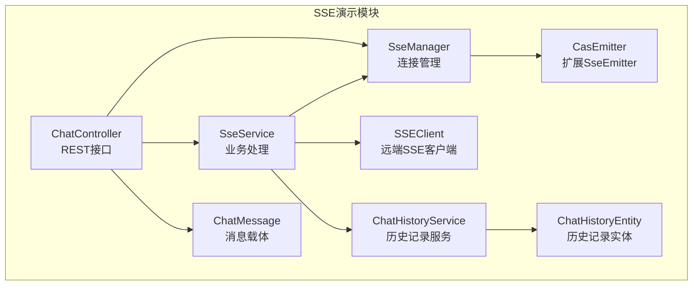
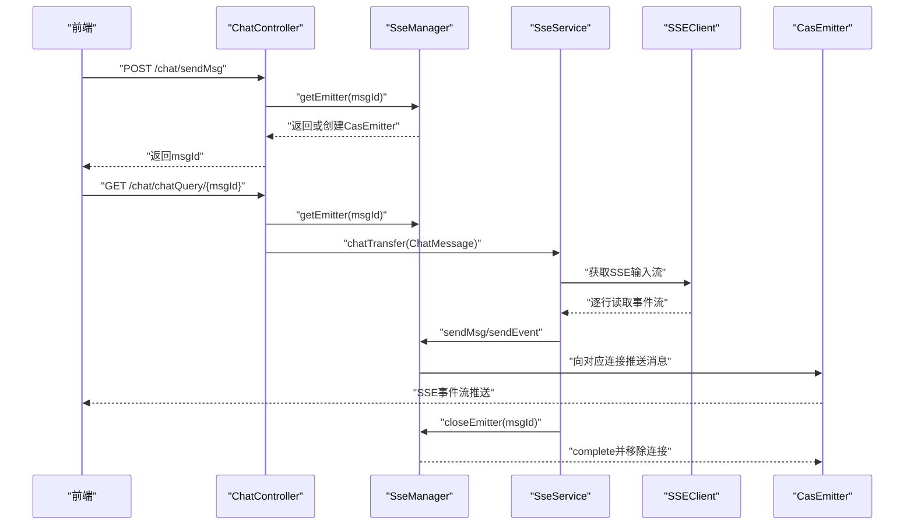
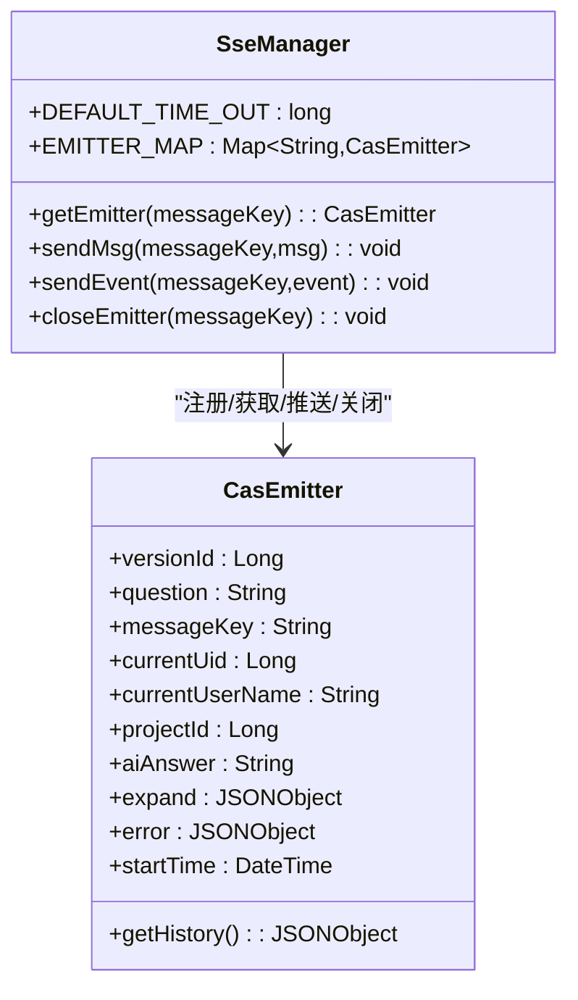
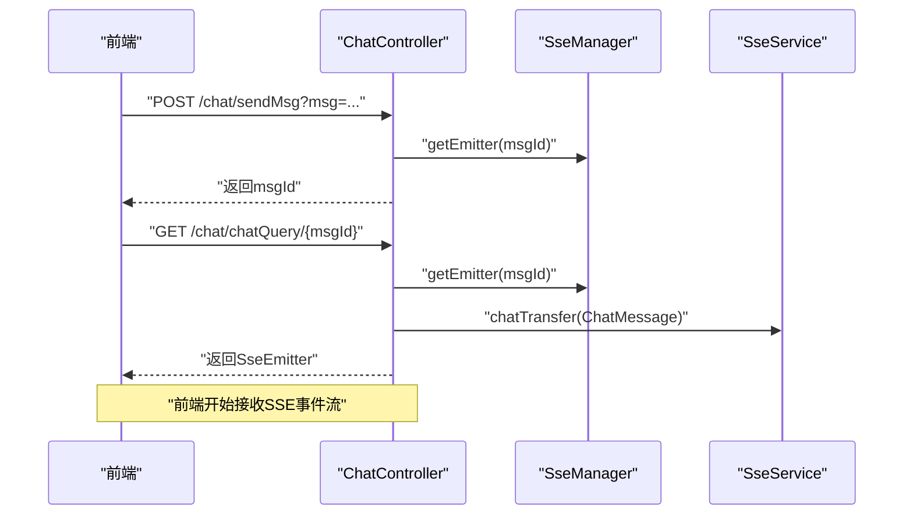
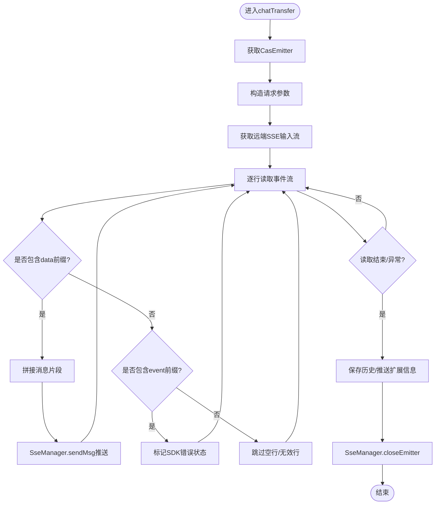
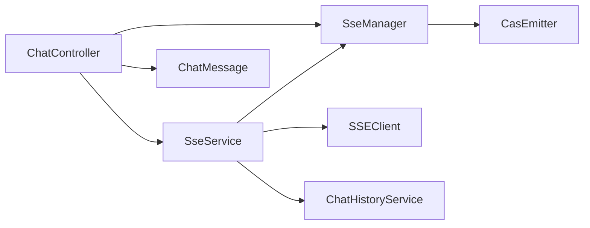

# SSE连接管理

<cite>
**本文引用的文件**
- [SseManager.java](file://castile-system-center/cas-spring-boot-web/src/main/java/com/castile/casspringbootweb/demos/sse/cbb/SseManager.java)
- [CasEmitter.java](file://castile-system-center/cas-spring-boot-web/src/main/java/com/castile/casspringbootweb/demos/sse/cbb/CasEmitter.java)
- [ChatController.java](file://castile-system-center/cas-spring-boot-web/src/main/java/com/castile/casspringbootweb/demos/sse/ChatController.java)
- [SseService.java](file://castile-system-center/cas-spring-boot-web/src/main/java/com/castile/casspringbootweb/demos/sse/cbb/SseService.java)
- [SSEClient.java](file://castile-system-center/cas-spring-boot-web/src/main/java/com/castile/casspringbootweb/demos/sse/cbb/SSEClient.java)
- [ChatMessage.java](file://castile-system-center/cas-spring-boot-web/src/main/java/com/castile/casspringbootweb/demos/sse/ChatMessage.java)
- [ChatHistoryService.java](file://castile-system-center/cas-spring-boot-web/src/main/java/com/castile/casspringbootweb/demos/sse/cbb/ChatHistoryService.java)
- [ChatHistoryEntity.java](file://castile-system-center/cas-spring-boot-web/src/main/java/com/castile/casspringbootweb/demos/sse/cbb/ChatHistoryEntity.java)
- [application.yaml](file://castile-system-center/cas-spring-boot-web/src/main/resources/application.yaml)
</cite>

## 目录
1. [引言](#引言)
2. [项目结构](#项目结构)
3. [核心组件](#核心组件)
4. [架构总览](#架构总览)
5. [详细组件分析](#详细组件分析)
6. [依赖关系分析](#依赖关系分析)
7. [性能考量](#性能考量)
8. [故障排查指南](#故障排查指南)
9. [结论](#结论)
10. [附录](#附录)

## 引言
本文件围绕SSE（Server-Sent Events）连接的全生命周期管理进行系统化解析，重点覆盖以下方面：
- SseManager如何通过静态ConcurrentHashMap实现CasEmitter实例的注册与线程安全访问
- DEFAULT_TIME_OUT设置为30分钟的超时策略及其影响
- CasEmitter继承SseEmitter并扩展业务属性（如messageKey、question、aiAnswer等）的设计意图
- 结合ChatController中的sendMsg与chatQuery接口，说明前端请求如何触发SseManager.getEmitter创建或获取现有连接，并通过SseEmitter实现服务端消息推送
- 连接泄漏预防、超时处理及并发访问优化的最佳实践

## 项目结构
该模块位于“cas-spring-boot-web”工程下，主要包含SSE演示与聊天对话功能的相关代码，涉及控制器、服务、SSE管理器、自定义SSE发射器以及辅助工具类。

图表来源
- [ChatController.java](file://castile-system-center/cas-spring-boot-web/src/main/java/com/castile/casspringbootweb/demos/sse/ChatController.java#L1-L97)
- [SseManager.java](file://castile-system-center/cas-spring-boot-web/src/main/java/com/castile/casspringbootweb/demos/sse/cbb/SseManager.java#L1-L97)
- [CasEmitter.java](file://castile-system-center/cas-spring-boot-web/src/main/java/com/castile/casspringbootweb/demos/sse/cbb/CasEmitter.java#L1-L84)
- [SseService.java](file://castile-system-center/cas-spring-boot-web/src/main/java/com/castile/casspringbootweb/demos/sse/cbb/SseService.java#L1-L103)
- [SSEClient.java](file://castile-system-center/cas-spring-boot-web/src/main/java/com/castile/casspringbootweb/demos/sse/cbb/SSEClient.java#L1-L88)
- [ChatMessage.java](file://castile-system-center/cas-spring-boot-web/src/main/java/com/castile/casspringbootweb/demos/sse/ChatMessage.java#L1-L21)
- [ChatHistoryService.java](file://castile-system-center/cas-spring-boot-web/src/main/java/com/castile/casspringbootweb/demos/sse/cbb/ChatHistoryService.java#L1-L23)
- [ChatHistoryEntity.java](file://castile-system-center/cas-spring-boot-web/src/main/java/com/castile/casspringbootweb/demos/sse/cbb/ChatHistoryEntity.java#L1-L9)

章节来源
- [application.yaml](file://castile-system-center/cas-spring-boot-web/src/main/resources/application.yaml#L1-L33)

## 核心组件
- SseManager：负责SSE连接的创建、注册、消息发送、事件发送与连接关闭；使用静态ConcurrentHashMap维护连接映射；默认超时30分钟。
- CasEmitter：在SseEmitter基础上扩展业务字段（messageKey、question、aiAnswer、currentUid/currentUserName、projectId、expand、error、startTime等），便于在服务端侧携带上下文信息。
- ChatController：对外提供REST接口，触发SseManager创建或获取连接，并返回SseEmitter以供前端订阅。
- SseService：封装业务逻辑，从外部SSE源拉取数据流，按行解析后通过SseManager向对应messageKey的连接推送消息。
- SSEClient：封装HTTP连接与SSE输入流读取，支持超时控制与逐行回调处理。
- ChatMessage：消息载体，包含角色、内容与消息标识。
- ChatHistoryService/ChatHistoryEntity：历史记录存取与扩展推送的占位实现。

章节来源
- [SseManager.java](file://castile-system-center/cas-spring-boot-web/src/main/java/com/castile/casspringbootweb/demos/sse/cbb/SseManager.java#L1-L97)
- [CasEmitter.java](file://castile-system-center/cas-spring-boot-web/src/main/java/com/castile/casspringbootweb/demos/sse/cbb/CasEmitter.java#L1-L84)
- [ChatController.java](file://castile-system-center/cas-spring-boot-web/src/main/java/com/castile/casspringbootweb/demos/sse/ChatController.java#L1-L97)
- [SseService.java](file://castile-system-center/cas-spring-boot-web/src/main/java/com/castile/casspringbootweb/demos/sse/cbb/SseService.java#L1-L103)
- [SSEClient.java](file://castile-system-center/cas-spring-boot-web/src/main/java/com/castile/casspringbootweb/demos/sse/cbb/SSEClient.java#L1-L88)
- [ChatMessage.java](file://castile-system-center/cas-spring-boot-web/src/main/java/com/castile/casspringbootweb/demos/sse/ChatMessage.java#L1-L21)
- [ChatHistoryService.java](file://castile-system-center/cas-spring-boot-web/src/main/java/com/castile/casspringbootweb/demos/sse/cbb/ChatHistoryService.java#L1-L23)
- [ChatHistoryEntity.java](file://castile-system-center/cas-spring-boot-web/src/main/java/com/castile/casspringbootweb/demos/sse/cbb/ChatHistoryEntity.java#L1-L9)

## 架构总览
SSE连接生命周期由“请求发起—连接注册—消息推送—连接关闭”构成。前端通过两个入口触发：
- sendMsg：生成消息ID并预热连接（注册到SseManager）
- chatQuery：基于消息ID获取CasEmitter并异步处理业务，随后立即返回SseEmitter供前端订阅

图表来源
- [ChatController.java](file://castile-system-center/cas-spring-boot-web/src/main/java/com/castile/casspringbootweb/demos/sse/ChatController.java#L38-L95)
- [SseManager.java](file://castile-system-center/cas-spring-boot-web/src/main/java/com/castile/casspringbootweb/demos/sse/cbb/SseManager.java#L37-L95)
- [SseService.java](file://castile-system-center/cas-spring-boot-web/src/main/java/com/castile/casspringbootweb/demos/sse/cbb/SseService.java#L28-L101)
- [SSEClient.java](file://castile-system-center/cas-spring-boot-web/src/main/java/com/castile/casspringbootweb/demos/sse/cbb/SSEClient.java#L25-L88)
- [CasEmitter.java](file://castile-system-center/cas-spring-boot-web/src/main/java/com/castile/casspringbootweb/demos/sse/cbb/CasEmitter.java#L1-L84)

## 详细组件分析

### SseManager：连接注册与线程安全访问
- 静态ConcurrentHashMap（EMITTER_MAP）：以messageKey为键，CasEmitter为值，保证多线程环境下的并发安全与快速查找。
- getEmitter(messageKey)：若不存在则创建新的CasEmitter（超时默认30分钟），并注册到EMITTER_MAP；存在则直接返回。
- sendMsg/messageKey,msg)：根据messageKey定位CasEmitter并发送“answer”事件及消息体。
- sendEvent(messageKey,event)：发送指定事件名（如“answer”、“stop”等）。
- closeEmitter(messageKey)：发送“stop”事件、complete完成连接、从EMITTER_MAP移除，防止连接泄漏。

图表来源
- [SseManager.java](file://castile-system-center/cas-spring-boot-web/src/main/java/com/castile/casspringbootweb/demos/sse/cbb/SseManager.java#L1-L97)
- [CasEmitter.java](file://castile-system-center/cas-spring-boot-web/src/main/java/com/castile/casspringbootweb/demos/sse/cbb/CasEmitter.java#L1-L84)

章节来源
- [SseManager.java](file://castile-system-center/cas-spring-boot-web/src/main/java/com/castile/casspringbootweb/demos/sse/cbb/SseManager.java#L18-L95)

### CasEmitter：扩展SseEmitter的业务属性
- 继承SseEmitter并新增字段：版本ID、问题、消息Key、当前用户信息、项目ID、AI回答、扩展信息、错误信息、开始时间等。
- 提供getHistory()聚合历史信息，便于在服务端侧统一输出或持久化。

设计意图
- 将“连接上下文”与“业务状态”绑定到同一个对象，避免跨方法传递散乱参数
- 便于在服务端侧进行统一的日志、统计与回放

章节来源
- [CasEmitter.java](file://castile-system-center/cas-spring-boot-web/src/main/java/com/castile/casspringbootweb/demos/sse/cbb/CasEmitter.java#L15-L84)

### ChatController：前端请求入口与连接返回
- sendMsg：生成消息ID，预热连接（调用SseManager.getEmitter），返回msgId给前端
- chatQuery：基于msgId获取CasEmitter，组装ChatMessage并异步交给SseService处理，随后立即返回SseManager.getEmitter，使前端可订阅SSE事件流
- conversation：演示性接口，直接返回SseEmitter并在后台线程推送模拟消息

图表来源
- [ChatController.java](file://castile-system-center/cas-spring-boot-web/src/main/java/com/castile/casspringbootweb/demos/sse/ChatController.java#L38-L95)
- [SseManager.java](file://castile-system-center/cas-spring-boot-web/src/main/java/com/castile/casspringbootweb/demos/sse/cbb/SseManager.java#L37-L49)

章节来源
- [ChatController.java](file://castile-system-center/cas-spring-boot-web/src/main/java/com/castile/casspringbootweb/demos/sse/ChatController.java#L38-L95)

### SseService：业务处理与SSE流解析
- chatTransfer：根据ChatMessage.id获取CasEmitter，构造参数并通过SSEClient获取远端SSE输入流
- 逐行读取远端SSE事件流，识别data与event行，拼接AI回答并调用SseManager.sendMsg推送
- 异常处理与finally块确保最终调用SseManager.closeEmitter关闭连接，防止泄漏

图表来源
- [SseService.java](file://castile-system-center/cas-spring-boot-web/src/main/java/com/castile/casspringbootweb/demos/sse/cbb/SseService.java#L28-L101)
- [SSEClient.java](file://castile-system-center/cas-spring-boot-web/src/main/java/com/castile/casspringbootweb/demos/sse/cbb/SSEClient.java#L25-L88)
- [SseManager.java](file://castile-system-center/cas-spring-boot-web/src/main/java/com/castile/casspringbootweb/demos/sse/cbb/SseManager.java#L57-L95)

章节来源
- [SseService.java](file://castile-system-center/cas-spring-boot-web/src/main/java/com/castile/casspringbootweb/demos/sse/cbb/SseService.java#L28-L101)
- [SSEClient.java](file://castile-system-center/cas-spring-boot-web/src/main/java/com/castile/casspringbootweb/demos/sse/cbb/SSEClient.java#L25-L88)

### SSEClient：远端SSE客户端
- 支持POST请求发送JSON参数，设置Accept为text/event-stream
- 读取输入流并逐行回调，finally确保资源释放
- 提供DEFAULT_TIMEOUT用于远端SSE读取超时控制

章节来源
- [SSEClient.java](file://castile-system-center/cas-spring-boot-web/src/main/java/com/castile/casspringbootweb/demos/sse/cbb/SSEClient.java#L15-L88)

### ChatMessage与历史记录
- ChatMessage：承载消息的角色、内容与消息ID
- ChatHistoryService/ChatHistoryEntity：占位实现，用于保存历史与推送扩展信息

章节来源
- [ChatMessage.java](file://castile-system-center/cas-spring-boot-web/src/main/java/com/castile/casspringbootweb/demos/sse/ChatMessage.java#L1-L21)
- [ChatHistoryService.java](file://castile-system-center/cas-spring-boot-web/src/main/java/com/castile/casspringbootweb/demos/sse/cbb/ChatHistoryService.java#L1-L23)
- [ChatHistoryEntity.java](file://castile-system-center/cas-spring-boot-web/src/main/java/com/castile/casspringbootweb/demos/sse/cbb/ChatHistoryEntity.java#L1-L9)

## 依赖关系分析
- ChatController依赖SseManager与SseService，负责对外暴露REST接口并返回SseEmitter
- SseService依赖SseManager、SSEClient、ChatHistoryService，负责业务处理与SSE流解析
- SseManager依赖CasEmitter与SseEmitter，负责连接注册、消息推送与关闭
- SSEClient独立于Spring容器，仅作为通用HTTP+SSE客户端工具

图表来源
- [ChatController.java](file://castile-system-center/cas-spring-boot-web/src/main/java/com/castile/casspringbootweb/demos/sse/ChatController.java#L1-L97)
- [SseManager.java](file://castile-system-center/cas-spring-boot-web/src/main/java/com/castile/casspringbootweb/demos/sse/cbb/SseManager.java#L1-L97)
- [SseService.java](file://castile-system-center/cas-spring-boot-web/src/main/java/com/castile/casspringbootweb/demos/sse/cbb/SseService.java#L1-L103)
- [SSEClient.java](file://castile-system-center/cas-spring-boot-web/src/main/java/com/castile/casspringbootweb/demos/sse/cbb/SSEClient.java#L1-L88)
- [CasEmitter.java](file://castile-system-center/cas-spring-boot-web/src/main/java/com/castile/casspringbootweb/demos/sse/cbb/CasEmitter.java#L1-L84)
- [ChatMessage.java](file://castile-system-center/cas-spring-boot-web/src/main/java/com/castile/casspringbootweb/demos/sse/ChatMessage.java#L1-L21)
- [ChatHistoryService.java](file://castile-system-center/cas-spring-boot-web/src/main/java/com/castile/casspringbootweb/demos/sse/cbb/ChatHistoryService.java#L1-L23)

## 性能考量
- 连接池与超时
  - 默认超时30分钟，适合长对话场景；若业务对实时性要求更高，可在创建CasEmitter时传入更短超时
  - 远端SSE读取超时由SSEClient.DEFAULT_TIMEOUT控制，默认约100秒
- 并发与线程安全
  - 使用ConcurrentHashMap保证多线程环境下连接注册与查询的原子性
  - 对外接口返回SseEmitter时应避免阻塞主线程，已通过CompletableFuture异步处理
- 资源释放
  - finally块中统一调用closeEmitter，确保异常路径也能释放连接
- 流式解析
  - SSEClient逐行读取，避免一次性加载大段文本，降低内存峰值

章节来源
- [SseManager.java](file://castile-system-center/cas-spring-boot-web/src/main/java/com/castile/casspringbootweb/demos/sse/cbb/SseManager.java#L18-L20)
- [SSEClient.java](file://castile-system-center/cas-spring-boot-web/src/main/java/com/castile/casspringbootweb/demos/sse/cbb/SSEClient.java#L15-L17)
- [SseService.java](file://castile-system-center/cas-spring-boot-web/src/main/java/com/castile/casspringbootweb/demos/sse/cbb/SseService.java#L84-L101)
- [ChatController.java](file://castile-system-center/cas-spring-boot-web/src/main/java/com/castile/casspringbootweb/demos/sse/ChatController.java#L89-L95)

## 故障排查指南
- 连接未返回或长时间无响应
  - 检查SseManager.getEmitter是否被正确调用（chatQuery中应先获取再异步处理）
  - 确认SseService中finally块是否执行closeEmitter，避免连接泄漏
- 前端未收到消息
  - 检查SseService逐行解析逻辑，确认data/event前缀匹配
  - 确认SseManager.sendMsg与sendEvent调用链路是否被执行
- 连接提前断开
  - 检查DEFAULT_TIME_OUT与远端SSE读取超时配置
  - 确认SSEClient读取异常时的finally是否关闭输入流
- 日志与追踪
  - 在SseService与SSEClient中增加关键日志点，定位消息丢失或异常位置

章节来源
- [SseService.java](file://castile-system-center/cas-spring-boot-web/src/main/java/com/castile/casspringbootweb/demos/sse/cbb/SseService.java#L41-L101)
- [SSEClient.java](file://castile-system-center/cas-spring-boot-web/src/main/java/com/castile/casspringbootweb/demos/sse/cbb/SSEClient.java#L67-L88)
- [SseManager.java](file://castile-system-center/cas-spring-boot-web/src/main/java/com/castile/casspringbootweb/demos/sse/cbb/SseManager.java#L57-L95)

## 结论
该SSE连接管理方案通过“控制器—管理器—服务—客户端”的分层设计，实现了消息ID驱动的连接生命周期闭环：
- 使用ConcurrentHashMap实现线程安全的连接注册与访问
- 通过CasEmitter扩展业务上下文，提升服务端侧的可维护性
- 采用异步处理与finally资源回收，有效避免连接泄漏
- 以DEFAULT_TIME_OUT与远端SSE读取超时共同保障稳定性

建议在生产环境中进一步完善：
- 连接健康检查与自动清理策略
- 更细粒度的错误分类与重试机制
- 对SSE事件命名与数据格式进行标准化

## 附录
- 接口清单
  - POST /chat/sendMsg：生成消息ID并预热连接
  - GET /chat/chatQuery/{msgId}：获取SseEmitter并异步处理业务
- 关键配置
  - server.port与context-path见application.yaml

章节来源
- [ChatController.java](file://castile-system-center/cas-spring-boot-web/src/main/java/com/castile/casspringbootweb/demos/sse/ChatController.java#L38-L95)
- [application.yaml](file://castile-system-center/cas-spring-boot-web/src/main/resources/application.yaml#L1-L33)