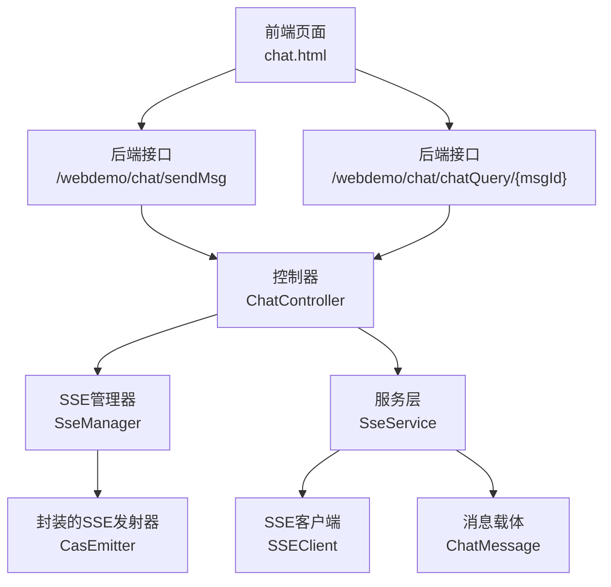
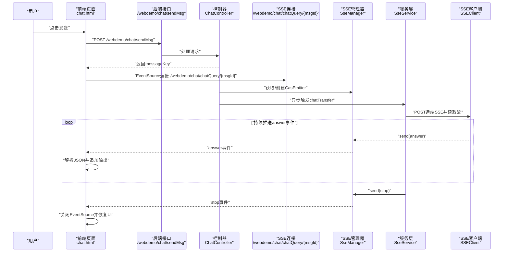
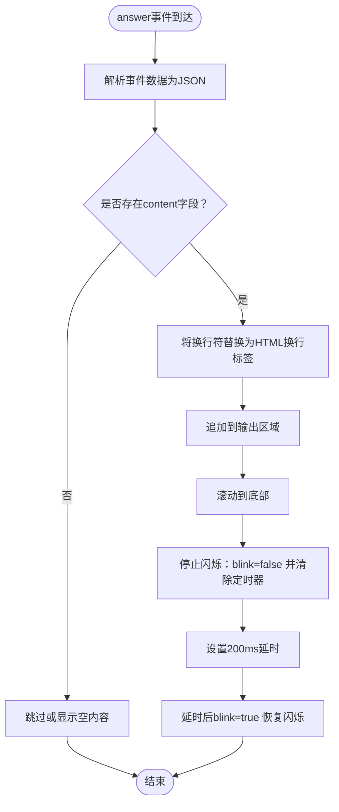
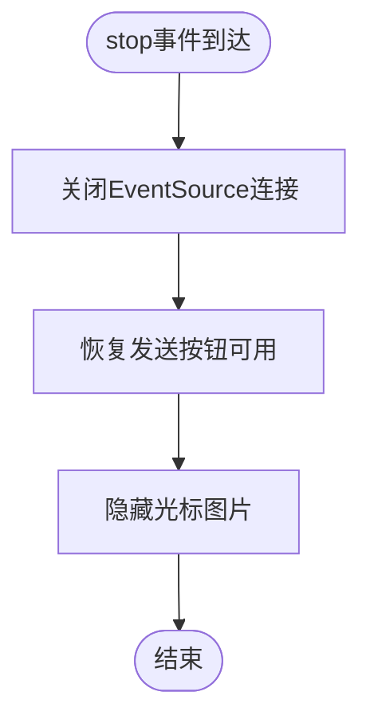
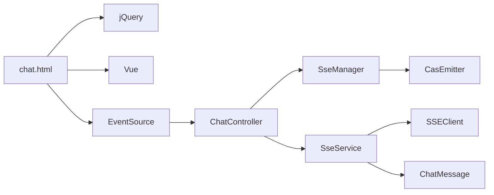

# 前后端通信协议与事件处理

<cite>
**本文引用的文件**
- [chat.html](file://castile-system-center/cas-spring-boot-web/src/main/resources/static/chat.html)
- [ChatController.java](file://castile-system-center/cas-spring-boot-web/src/main/java/com/castile/casspringbootweb/demos/sse/ChatController.java)
- [SseManager.java](file://castile-system-center/cas-spring-boot-web/src/main/java/com/castile/casspringbootweb/demos/sse/cbb/SseManager.java)
- [SseService.java](file://castile-system-center/cas-spring-boot-web/src/main/java/com/castile/casspringbootweb/demos/sse/cbb/SseService.java)
- [CasEmitter.java](file://castile-system-center/cas-spring-boot-web/src/main/java/com/castile/casspringbootweb/demos/sse/cbb/CasEmitter.java)
- [SSEClient.java](file://castile-system-center/cas-spring-boot-web/src/main/java/com/castile/casspringbootweb/demos/sse/cbb/SSEClient.java)
- [ChatMessage.java](file://castile-system-center/cas-spring-boot-web/src/main/java/com/castile/casspringbootweb/demos/sse/ChatMessage.java)
</cite>

## 目录
1. [简介](#简介)
2. [项目结构](#项目结构)
3. [核心组件](#核心组件)
4. [架构总览](#架构总览)
5. [详细组件分析](#详细组件分析)
6. [依赖关系分析](#依赖关系分析)
7. [性能考量](#性能考量)
8. [故障排查指南](#故障排查指南)
9. [结论](#结论)

## 简介
本文件围绕基于EventSource（Server-Sent Events，SSE）的前端实时通信实现进行深入解析，重点覆盖以下方面：
- 前端如何通过jQuery向后端发起/sendMsg以获取messageKey；
- 前端如何使用EventSource连接/chatQuery/{msgId}建立SSE长连接；
- 前端对answer、stop、error等自定义事件的监听与处理流程；
- answer事件中JSON数据解析与动态更新输出区域的流式输出机制；
- stop事件中EventSource关闭与UI交互状态恢复；
- 光标闪烁动画（cursor-img）的控制逻辑（blink变量与setTimeout配合）；
- 后端事件命名规范（MSG_EVENT_PREFIX）与前端事件监听的对应关系，确保协议一致性。

## 项目结构
该功能涉及前端静态页面与后端Spring MVC控制器、SSE管理器、服务层以及SSE客户端等模块协同工作。下图展示与SSE实时通信直接相关的文件与职责划分。

图表来源
- [chat.html](file://castile-system-center/cas-spring-boot-web/src/main/resources/static/chat.html#L100-L155)
- [ChatController.java](file://castile-system-center/cas-spring-boot-web/src/main/java/com/castile/casspringbootweb/demos/sse/ChatController.java#L38-L95)
- [SseManager.java](file://castile-system-center/cas-spring-boot-web/src/main/java/com/castile/casspringbootweb/demos/sse/cbb/SseManager.java#L17-L96)
- [SseService.java](file://castile-system-center/cas-spring-boot-web/src/main/java/com/castile/casspringbootweb/demos/sse/cbb/SseService.java#L24-L102)
- [SSEClient.java](file://castile-system-center/cas-spring-boot-web/src/main/java/com/castile/casspringbootweb/demos/sse/cbb/SSEClient.java#L15-L88)
- [CasEmitter.java](file://castile-system-center/cas-spring-boot-web/src/main/java/com/castile/casspringbootweb/demos/sse/cbb/CasEmitter.java#L15-L84)
- [ChatMessage.java](file://castile-system-center/cas-spring-boot-web/src/main/java/com/castile/casspringbootweb/demos/sse/ChatMessage.java#L10-L21)

章节来源
- [chat.html](file://castile-system-center/cas-spring-boot-web/src/main/resources/static/chat.html#L1-L160)
- [ChatController.java](file://castile-system-center/cas-spring-boot-web/src/main/java/com/castile/casspringbootweb/demos/sse/ChatController.java#L18-L96)

## 核心组件
- 前端页面chat.html：负责用户输入、AJAX提交、EventSource连接、answer/stop/error事件监听、输出区域动态更新与光标动画控制。
- 控制器ChatController：提供/sendMsg生成messageKey并缓存；提供/chatQuery/{msgId}返回SSE连接，异步触发SseService进行上游数据拉取。
- SSE管理器SseManager：维护CasEmitter实例、统一发送answer事件与stop事件、关闭连接。
- 服务层SseService：封装上游SSE客户端SSEClient，按行解析远端流，将answer事件推送到前端；最终发送stop事件并完成连接。
- 封装的SSE发射器CasEmitter：扩展SseEmitter，承载消息上下文（如messageKey、question、history等）。
- SSE客户端SSEClient：向远端服务发起POST请求并读取text/event-stream流，逐行回调处理。
- 消息载体ChatMessage：前后端约定的数据结构，承载角色、内容与消息标识。

章节来源
- [chat.html](file://castile-system-center/cas-spring-boot-web/src/main/resources/static/chat.html#L87-L155)
- [ChatController.java](file://castile-system-center/cas-spring-boot-web/src/main/java/com/castile/casspringbootweb/demos/sse/ChatController.java#L38-L95)
- [SseManager.java](file://castile-system-center/cas-spring-boot-web/src/main/java/com/castile/casspringbootweb/demos/sse/cbb/SseManager.java#L17-L96)
- [SseService.java](file://castile-system-center/cas-spring-boot-web/src/main/java/com/castile/casspringbootweb/demos/sse/cbb/SseService.java#L24-L102)
- [SSEClient.java](file://castile-system-center/cas-spring-boot-web/src/main/java/com/castile/casspringbootweb/demos/sse/cbb/SSEClient.java#L15-L88)
- [CasEmitter.java](file://castile-system-center/cas-spring-boot-web/src/main/java/com/castile/casspringbootweb/demos/sse/cbb/CasEmitter.java#L15-L84)
- [ChatMessage.java](file://castile-system-center/cas-spring-boot-web/src/main/java/com/castile/casspringbootweb/demos/sse/ChatMessage.java#L10-L21)

## 架构总览
下图展示了从用户点击“发送”到前端接收answer流、最终停止连接的完整时序。

图表来源
- [chat.html](file://castile-system-center/cas-spring-boot-web/src/main/resources/static/chat.html#L100-L155)
- [ChatController.java](file://castile-system-center/cas-spring-boot-web/src/main/java/com/castile/casspringbootweb/demos/sse/ChatController.java#L38-L95)
- [SseManager.java](file://castile-system-center/cas-spring-boot-web/src/main/java/com/castile/casspringbootweb/demos/sse/cbb/SseManager.java#L57-L96)
- [SseService.java](file://castile-system-center/cas-spring-boot-web/src/main/java/com/castile/casspringbootweb/demos/sse/cbb/SseService.java#L28-L102)
- [SSEClient.java](file://castile-system-center/cas-spring-boot-web/src/main/java/com/castile/casspringbootweb/demos/sse/cbb/SSEClient.java#L15-L88)

## 详细组件分析

### 前端：EventSource连接与事件监听
- 发送消息与获取messageKey
  - 前端通过jQuery发起POST请求至/sendMsg，携带用户输入文本，后端返回messageKey。
  - 参考路径：[chat.html](file://castile-system-center/cas-spring-boot-web/src/main/resources/static/chat.html#L100-L107)
- 建立SSE长连接
  - 使用EventSource连接/chatQuery/{msgId}，并在open事件中记录连接成功日志。
  - 参考路径：[chat.html](file://castile-system-center/cas-spring-boot-web/src/main/resources/static/chat.html#L107-L111)
- answer事件处理
  - 解析事件数据为JSON，提取content字段并替换换行符为HTML换行标签，追加到输出区域。
  - 自动滚动到底部，保证最新内容可见。
  - 参考路径：[chat.html](file://castile-system-center/cas-spring-boot-web/src/main/resources/static/chat.html#L112-L125)
- stop事件处理
  - 收到stop事件后，关闭EventSource，恢复发送按钮可用状态，隐藏光标图片。
  - 参考路径：[chat.html](file://castile-system-center/cas-spring-boot-web/src/main/resources/static/chat.html#L144-L149)
- error事件处理
  - 监听readyState状态，区分CLOSED与CONNECTING，便于调试与重连策略。
  - 参考路径：[chat.html](file://castile-system-center/cas-spring-boot-web/src/main/resources/static/chat.html#L135-L143)
- 光标闪烁动画控制
  - 在answer事件中将blink设为false并清除定时器，随后设置200ms延时将blink置回true，形成闪烁效果。
  - 参考路径：[chat.html](file://castile-system-center/cas-spring-boot-web/src/main/resources/static/chat.html#L126-L134)

章节来源
- [chat.html](file://castile-system-center/cas-spring-boot-web/src/main/resources/static/chat.html#L87-L155)

### 后端：控制器与SSE管理
- /webdemo/chat/sendMsg
  - 生成messageKey并缓存，返回给前端。
  - 参考路径：[ChatController.java](file://castile-system-center/cas-spring-boot-web/src/main/java/com/castile/casspringbootweb/demos/sse/ChatController.java#L38-L45)
- /webdemo/chat/chatQuery/{msgId}
  - 通过SseManager获取或创建CasEmitter并立即返回，避免阻塞。
  - 异步调用SseService进行上游数据拉取，完成后由SseManager发送stop并complete。
  - 参考路径：[ChatController.java](file://castile-system-center/cas-spring-boot-web/src/main/java/com/castile/casspringbootweb/demos/sse/ChatController.java#L77-L95)

章节来源
- [ChatController.java](file://castile-system-center/cas-spring-boot-web/src/main/java/com/castile/casspringbootweb/demos/sse/ChatController.java#L38-L95)

### 后端：SSE管理器与事件命名规范
- 事件命名前缀
  - SseManager定义了MSG_EVENT_PREFIX用于事件名识别，确保与SSE客户端解析逻辑一致。
  - 参考路径：[SseManager.java](file://castile-system-center/cas-spring-boot-web/src/main/java/com/castile/casspringbootweb/demos/sse/cbb/SseManager.java#L28-L30)
- 发送answer事件
  - sendMsg方法以“answer”作为事件名推送消息体。
  - 参考路径：[SseManager.java](file://castile-system-center/cas-spring-boot-web/src/main/java/com/castile/casspringbootweb/demos/sse/cbb/SseManager.java#L57-L64)
- 发送自定义事件
  - sendEvent方法支持任意事件名，用于stop等控制事件。
  - 参考路径：[SseManager.java](file://castile-system-center/cas-spring-boot-web/src/main/java/com/castile/casspringbootweb/demos/sse/cbb/SseManager.java#L72-L77)
- 关闭连接
  - closeEmitter在发送stop事件后complete并移除映射。
  - 参考路径：[SseManager.java](file://castile-system-center/cas-spring-boot-web/src/main/java/com/castile/casspringbootweb/demos/sse/cbb/SseManager.java#L84-L96)

章节来源
- [SseManager.java](file://castile-system-center/cas-spring-boot-web/src/main/java/com/castile/casspringbootweb/demos/sse/cbb/SseManager.java#L28-L96)

### 后端：服务层与SSE客户端
- 流式数据拉取与事件分发
  - SseService通过SSEClient读取远端SSE流，按行解析，遇到MSG_DATA_PREFIX时推送answer事件，遇到MSG_EVENT_PREFIX时标记错误并可做错误处理。
  - 参考路径：[SseService.java](file://castile-system-center/cas-spring-boot-web/src/main/java/com/castile/casspringbootweb/demos/sse/cbb/SseService.java#L41-L77)
- 完整生命周期
  - 最终调用closeEmitter发送stop并完成连接，同时持久化对话历史。
  - 参考路径：[SseService.java](file://castile-system-center/cas-spring-boot-web/src/main/java/com/castile/casspringbootweb/demos/sse/cbb/SseService.java#L90-L102)
- 远端SSE客户端
  - SSEClient以POST方式请求远端URL，设置accept为text/event-stream，读取逐行数据并回调处理。
  - 参考路径：[SSEClient.java](file://castile-system-center/cas-spring-boot-web/src/main/java/com/castile/casspringbootweb/demos/sse/cbb/SSEClient.java#L15-L88)

章节来源
- [SseService.java](file://castile-system-center/cas-spring-boot-web/src/main/java/com/castile/casspringbootweb/demos/sse/cbb/SseService.java#L24-L102)
- [SSEClient.java](file://castile-system-center/cas-spring-boot-web/src/main/java/com/castile/casspringbootweb/demos/sse/cbb/SSEClient.java#L15-L88)

### 数据模型与封装
- ChatMessage
  - 角色、内容、消息标识三要素构成消息载体，用于answer事件的数据传输。
  - 参考路径：[ChatMessage.java](file://castile-system-center/cas-spring-boot-web/src/main/java/com/castile/casspringbootweb/demos/sse/ChatMessage.java#L10-L21)
- CasEmitter
  - 扩展SseEmitter，增加messageKey、question、history、error等上下文字段，便于会话管理与历史记录。
  - 参考路径：[CasEmitter.java](file://castile-system-center/cas-spring-boot-web/src/main/java/com/castile/casspringbootweb/demos/sse/cbb/CasEmitter.java#L15-L84)

章节来源
- [ChatMessage.java](file://castile-system-center/cas-spring-boot-web/src/main/java/com/castile/casspringbootweb/demos/sse/ChatMessage.java#L10-L21)
- [CasEmitter.java](file://castile-system-center/cas-spring-boot-web/src/main/java/com/castile/casspringbootweb/demos/sse/cbb/CasEmitter.java#L15-L84)

### answer事件解析与流式输出流程

图表来源
- [chat.html](file://castile-system-center/cas-spring-boot-web/src/main/resources/static/chat.html#L112-L134)

章节来源
- [chat.html](file://castile-system-center/cas-spring-boot-web/src/main/resources/static/chat.html#L112-L134)

### stop事件与UI恢复流程

图表来源
- [chat.html](file://castile-system-center/cas-spring-boot-web/src/main/resources/static/chat.html#L144-L149)

章节来源
- [chat.html](file://castile-system-center/cas-spring-boot-web/src/main/resources/static/chat.html#L144-L149)

## 依赖关系分析
- 前端依赖
  - jQuery：发起AJAX请求与DOM操作；
  - Vue：双向绑定输入框、控制光标图片显示与闪烁状态；
  - EventSource：建立SSE长连接并监听自定义事件。
- 后端依赖
  - Spring MVC：REST接口与SSE返回；
  - SseManager：统一管理SSE发射器与事件发送；
  - SseService：封装上游SSE客户端与事件分发；
  - SSEClient：远端SSE流读取与逐行解析；
  - ChatMessage：前后端约定的数据结构。

图表来源
- [chat.html](file://castile-system-center/cas-spring-boot-web/src/main/resources/static/chat.html#L36-L65)
- [ChatController.java](file://castile-system-center/cas-spring-boot-web/src/main/java/com/castile/casspringbootweb/demos/sse/ChatController.java#L38-L95)
- [SseManager.java](file://castile-system-center/cas-spring-boot-web/src/main/java/com/castile/casspringbootweb/demos/sse/cbb/SseManager.java#L17-L96)
- [SseService.java](file://castile-system-center/cas-spring-boot-web/src/main/java/com/castile/casspringbootweb/demos/sse/cbb/SseService.java#L24-L102)
- [SSEClient.java](file://castile-system-center/cas-spring-boot-web/src/main/java/com/castile/casspringbootweb/demos/sse/cbb/SSEClient.java#L15-L88)
- [CasEmitter.java](file://castile-system-center/cas-spring-boot-web/src/main/java/com/castile/casspringbootweb/demos/sse/cbb/CasEmitter.java#L15-L84)
- [ChatMessage.java](file://castile-system-center/cas-spring-boot-web/src/main/java/com/castile/casspringbootweb/demos/sse/ChatMessage.java#L10-L21)

## 性能考量
- 非阻塞返回：后端在/chatQuery/{msgId}中立即返回SSE连接，异步执行上游数据拉取，避免阻塞HTTP响应。
- 流式推送：answer事件以增量形式推送，前端仅追加内容，减少DOM重绘开销。
- 自动滚动：每次answer事件后滚动到底部，避免长输出导致的滚动滞后。
- 超时与清理：SseManager默认超时时间较长，确保长时间对话不中断；stop事件后及时complete并移除映射，释放资源。

## 故障排查指南
- EventSource连接失败
  - 检查后端接口是否正确返回SSE连接（/webdemo/chat/chatQuery/{msgId}）。
  - 参考路径：[ChatController.java](file://castile-system-center/cas-spring-boot-web/src/main/java/com/castile/casspringbootweb/demos/sse/ChatController.java#L77-L95)
- answer事件未触发
  - 确认SseService是否正确解析远端SSE流并调用SseManager.sendMsg推送answer事件。
  - 参考路径：[SseService.java](file://castile-system-center/cas-spring-boot-web/src/main/java/com/castile/casspringbootweb/demos/sse/cbb/SseService.java#L41-L77)
  - 参考路径：[SseManager.java](file://castile-system-center/cas-spring-boot-web/src/main/java/com/castile/casspringbootweb/demos/sse/cbb/SseManager.java#L57-L64)
- stop事件未触发或UI未恢复
  - 检查SseService是否在finally块中调用closeEmitter发送stop并complete。
  - 参考路径：[SseService.java](file://castile-system-center/cas-spring-boot-web/src/main/java/com/castile/casspringbootweb/demos/sse/cbb/SseService.java#L90-L102)
  - 参考路径：[SseManager.java](file://castile-system-center/cas-spring-boot-web/src/main/java/com/castile/casspringbootweb/demos/sse/cbb/SseManager.java#L84-L96)
- 光标闪烁异常
  - 确保answer事件中blink=false并清除定时器，再设置200ms延时将blink置回true。
  - 参考路径：[chat.html](file://castile-system-center/cas-spring-boot-web/src/main/resources/static/chat.html#L126-L134)

章节来源
- [ChatController.java](file://castile-system-center/cas-spring-boot-web/src/main/java/com/castile/casspringbootweb/demos/sse/ChatController.java#L77-L95)
- [SseService.java](file://castile-system-center/cas-spring-boot-web/src/main/java/com/castile/casspringbootweb/demos/sse/cbb/SseService.java#L90-L102)
- [SseManager.java](file://castile-system-center/cas-spring-boot-web/src/main/java/com/castile/casspringbootweb/demos/sse/cbb/SseManager.java#L57-L96)
- [chat.html](file://castile-system-center/cas-spring-boot-web/src/main/resources/static/chat.html#L126-L134)

## 结论
本实现通过前后端协作，利用SSE实现了低延迟、高并发的流式对话体验。前端以EventSource监听answer、stop、error事件，answer事件负责增量渲染与自动滚动，stop事件负责连接关闭与UI恢复，error事件用于连接状态诊断。后端通过SseManager统一管理事件命名与发送，SseService负责上游SSE流解析与事件分发，SSEClient负责远端连接与逐行读取。整体设计遵循“协议一致性”原则，前端与后端在事件命名与数据格式上保持一致，确保通信稳定可靠。