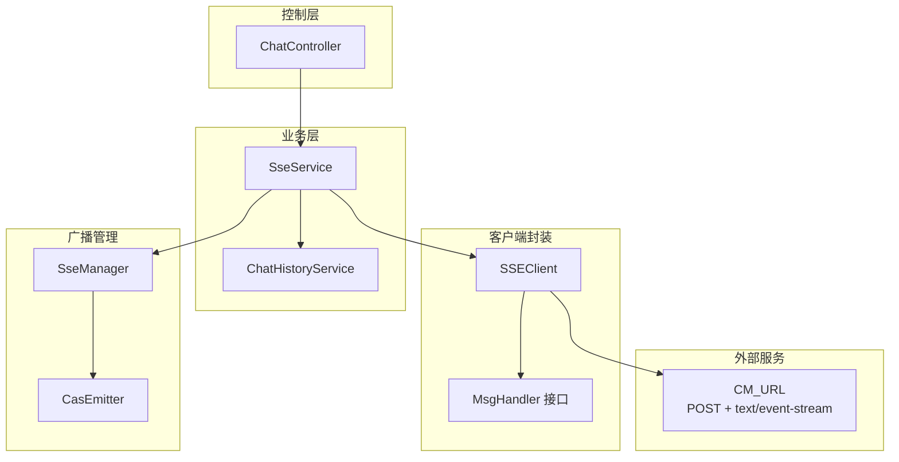
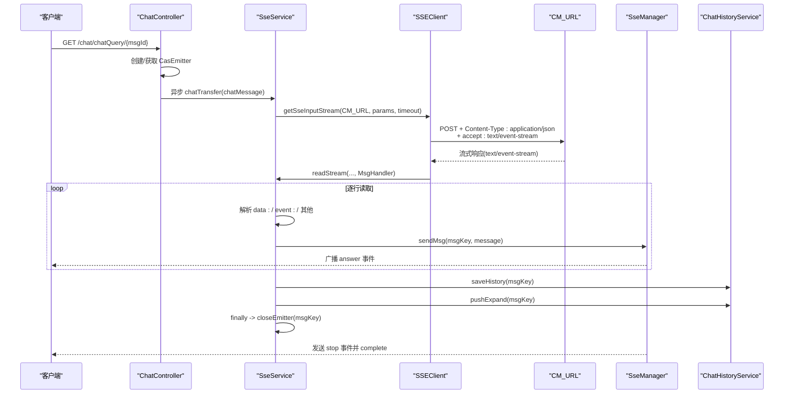
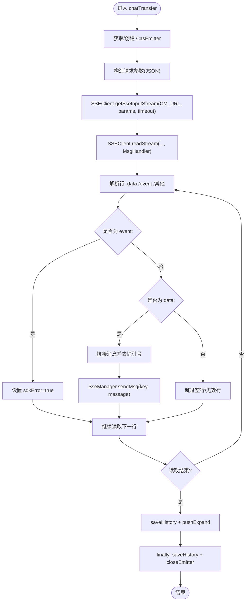
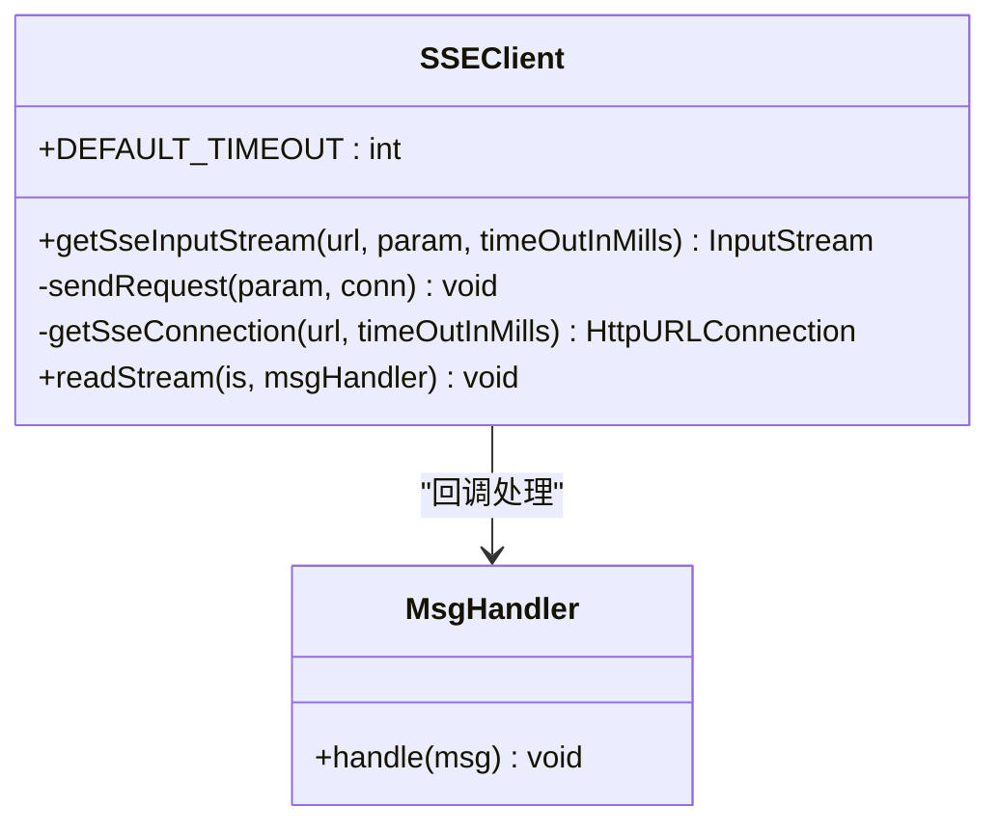
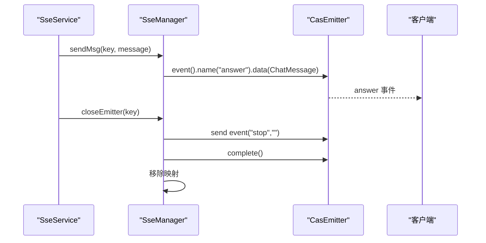
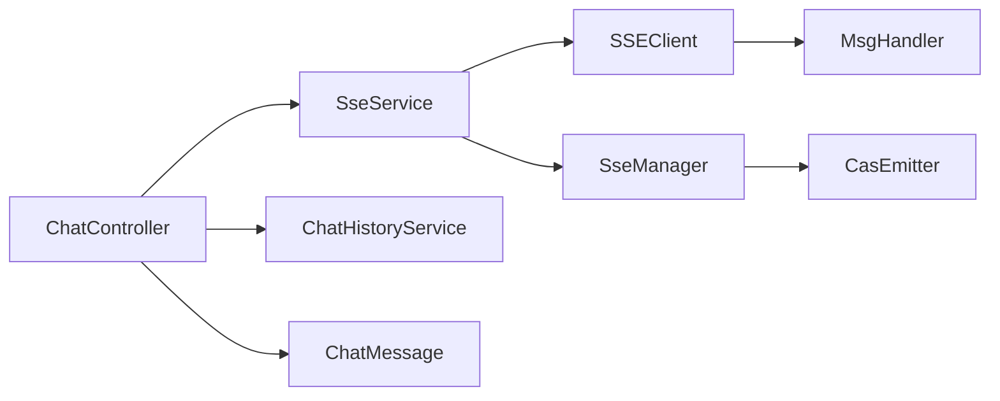

# 消息广播与处理逻辑

<cite>
**本文引用的文件列表**
- [SseService.java](file://castile-system-center/cas-spring-boot-web/src/main/java/com/castile/casspringbootweb/demos/sse/cbb/SseService.java)
- [SSEClient.java](file://castile-system-center/cas-spring-boot-web/src/main/java/com/castile/casspringbootweb/demos/sse/cbb/SSEClient.java)
- [SseManager.java](file://castile-system-center/cas-spring-boot-web/src/main/java/com/castile/casspringbootweb/demos/sse/cbb/SseManager.java)
- [MsgHandler.java](file://castile-system-center/cas-spring-boot-web/src/main/java/com/castile/casspringbootweb/demos/sse/cbb/MsgHandler.java)
- [ChatHistoryService.java](file://castile-system-center/cas-spring-boot-web/src/main/java/com/castile/casspringbootweb/demos/sse/cbb/ChatHistoryService.java)
- [CasEmitter.java](file://castile-system-center/cas-spring-boot-web/src/main/java/com/castile/casspringbootweb/demos/sse/cbb/CasEmitter.java)
- [ChatController.java](file://castile-system-center/cas-spring-boot-web/src/main/java/com/castile/casspringbootweb/demos/sse/ChatController.java)
- [ChatMessage.java](file://castile-system-center/cas-spring-boot-web/src/main/java/com/castile/casspringbootweb/demos/sse/ChatMessage.java)
</cite>

## 目录
1. [简介](#简介)
2. [项目结构](#项目结构)
3. [核心组件](#核心组件)
4. [架构总览](#架构总览)
5. [详细组件分析](#详细组件分析)
6. [依赖关系分析](#依赖关系分析)
7. [性能考量](#性能考量)
8. [故障排查指南](#故障排查指南)
9. [结论](#结论)

## 简介
本文件围绕SSE消息流的广播与处理流程进行系统性解析，重点覆盖以下方面：
- SseService 中 chatTransfer 如何通过 SSEClient 与外部服务（CM_URL）建立 POST 流式连接，并设置 accept 为 text/event-stream 的协议细节
- SSEClient.readStream 如何通过回调函数逐行读取响应数据，并结合 MsgHandler 实现非阻塞式消息处理
- SseManager.sendMsg 在接收到数据后如何向客户端广播“answer”事件
- ChatHistoryService 在消息流转过程中的持久化作用，包括 saveHistory 和 pushExpand 的调用时机
- 异常处理、资源释放及 finally 块中 closeEmitter 的保障机制

## 项目结构
该功能位于 Spring Boot Web 模块的演示目录下，采用分层与职责分离的设计：
- 控制层：ChatController 负责接收请求、触发异步处理并返回 SSE 连接
- 业务层：SseService 负责与外部 SSE 服务交互、解析流式数据并广播
- 客户端封装：SSEClient 提供 HTTP 连接与流读取能力
- 广播管理：SseManager 负责维护与广播消息
- 历史持久化：ChatHistoryService 负责消息历史的保存与扩展推送
- 数据模型：CasEmitter 扩展 SseEmitter，承载会话上下文；ChatMessage 表示消息载体

图表来源
- [ChatController.java](file://castile-system-center/cas-spring-boot-web/src/main/java/com/castile/casspringbootweb/demos/sse/ChatController.java#L77-L95)
- [SseService.java](file://castile-system-center/cas-spring-boot-web/src/main/java/com/castile/casspringbootweb/demos/sse/cbb/SseService.java#L28-L101)
- [SSEClient.java](file://castile-system-center/cas-spring-boot-web/src/main/java/com/castile/casspringbootweb/demos/sse/cbb/SSEClient.java#L25-L88)
- [SseManager.java](file://castile-system-center/cas-spring-boot-web/src/main/java/com/castile/casspringbootweb/demos/sse/cbb/SseManager.java#L37-L96)
- [CasEmitter.java](file://castile-system-center/cas-spring-boot-web/src/main/java/com/castile/casspringbootweb/demos/sse/cbb/CasEmitter.java#L15-L84)
- [ChatHistoryService.java](file://castile-system-center/cas-spring-boot-web/src/main/java/com/castile/casspringbootweb/demos/sse/cbb/ChatHistoryService.java#L14-L21)

章节来源
- [ChatController.java](file://castile-system-center/cas-spring-boot-web/src/main/java/com/castile/casspringbootweb/demos/sse/ChatController.java#L38-L95)
- [SseService.java](file://castile-system-center/cas-spring-boot-web/src/main/java/com/castile/casspringbootweb/demos/sse/cbb/SseService.java#L28-L101)
- [SSEClient.java](file://castile-system-center/cas-spring-boot-web/src/main/java/com/castile/casspringbootweb/demos/sse/cbb/SSEClient.java#L25-L88)
- [SseManager.java](file://castile-system-center/cas-spring-boot-web/src/main/java/com/castile/casspringbootweb/demos/sse/cbb/SseManager.java#L37-L96)
- [CasEmitter.java](file://castile-system-center/cas-spring-boot-web/src/main/java/com/castile/casspringbootweb/demos/sse/cbb/CasEmitter.java#L15-L84)
- [ChatHistoryService.java](file://castile-system-center/cas-spring-boot-web/src/main/java/com/castile/casspringbootweb/demos/sse/cbb/ChatHistoryService.java#L14-L21)

## 核心组件
- SseService：负责与外部 CM_URL 建立流式连接、解析响应、广播消息、持久化历史与扩展信息，并在 finally 中确保资源释放
- SSEClient：封装 HTTP 连接与流读取，设置 Content-Type 与 accept 为 text/event-stream，支持 POST 流式传输
- SseManager：维护 CasEmitter 映射、发送 answer 事件、发送通用事件、关闭连接
- MsgHandler：回调接口，用于逐行处理流式响应
- ChatHistoryService：提供 saveHistory 与 pushExpand 的占位实现，便于后续接入真实持久化
- CasEmitter：扩展 SseEmitter，携带会话上下文（消息键、问题、回答、扩展、错误等）
- ChatController：对外暴露接口，触发异步 chatTransfer 并返回 SSE 连接
- ChatMessage：消息载体对象

章节来源
- [SseService.java](file://castile-system-center/cas-spring-boot-web/src/main/java/com/castile/casspringbootweb/demos/sse/cbb/SseService.java#L28-L101)
- [SSEClient.java](file://castile-system-center/cas-spring-boot-web/src/main/java/com/castile/casspringbootweb/demos/sse/cbb/SSEClient.java#L25-L88)
- [SseManager.java](file://castile-system-center/cas-spring-boot-web/src/main/java/com/castile/casspringbootweb/demos/sse/cbb/SseManager.java#L37-L96)
- [MsgHandler.java](file://castile-system-center/cas-spring-boot-web/src/main/java/com/castile/casspringbootweb/demos/sse/cbb/MsgHandler.java#L12-L15)
- [ChatHistoryService.java](file://castile-system-center/cas-spring-boot-web/src/main/java/com/castile/casspringbootweb/demos/sse/cbb/ChatHistoryService.java#L14-L21)
- [CasEmitter.java](file://castile-system-center/cas-spring-boot-web/src/main/java/com/castile/casspringbootweb/demos/sse/cbb/CasEmitter.java#L15-L84)
- [ChatController.java](file://castile-system-center/cas-spring-boot-web/src/main/java/com/castile/casspringbootweb/demos/sse/ChatController.java#L77-L95)
- [ChatMessage.java](file://castile-system-center/cas-spring-boot-web/src/main/java/com/castile/casspringbootweb/demos/sse/ChatMessage.java#L10-L20)

## 架构总览
整体流程从 ChatController 触发，经由 SseService 与 SSEClient 与外部 CM_URL 建立 POST 流式连接，SSEClient.readStream 以回调方式逐行读取响应，SseService 解析并广播 answer 事件，同时调用 ChatHistoryService 进行持久化，最终在 finally 中统一关闭连接。

图表来源
- [ChatController.java](file://castile-system-center/cas-spring-boot-web/src/main/java/com/castile/casspringbootweb/demos/sse/ChatController.java#L77-L95)
- [SseService.java](file://castile-system-center/cas-spring-boot-web/src/main/java/com/castile/casspringbootweb/demos/sse/cbb/SseService.java#L28-L101)
- [SSEClient.java](file://castile-system-center/cas-spring-boot-web/src/main/java/com/castile/casspringbootweb/demos/sse/cbb/SSEClient.java#L25-L88)
- [SseManager.java](file://castile-system-center/cas-spring-boot-web/src/main/java/com/castile/casspringbootweb/demos/sse/cbb/SseManager.java#L57-L96)
- [ChatHistoryService.java](file://castile-system-center/cas-spring-boot-web/src/main/java/com/castile/casspringbootweb/demos/sse/cbb/ChatHistoryService.java#L14-L21)

## 详细组件分析

### SseService.chatTransfer：与外部服务建立流式连接与消息广播
- 建立连接
  - 使用 SSEClient.getSseInputStream(CM_URL, params, timeout) 发起 POST 请求，设置请求头 accept 为 text/event-stream，实现与外部服务的流式通信
  - 参数 params 作为 JSON 内容写入请求体，Content-Type 为 application/json
- 读取与解析
  - 通过 SSEClient.readStream 对输入流进行逐行读取，回调交给 MsgHandler.handle
  - 在回调中根据行内容判断是否为 data: 或 event:，并维护一个 sdkError 标志位
  - 当检测到 event: 时，将 sdkError 设为 true；随后遇到 data: 行则提取数据并去除多余引号
- 广播与持久化
  - 对于有效消息，调用 SseManager.sendMsg 广播 answer 事件
  - 在循环结束后，调用 ChatHistoryService.saveHistory 与 pushExpand 进行持久化
- 资源释放与异常处理
  - 捕获 IllegalStateException 与 IOException，并在 finally 中确保 saveHistory 与 closeEmitter 被调用，保证连接被正确关闭

图表来源
- [SseService.java](file://castile-system-center/cas-spring-boot-web/src/main/java/com/castile/casspringbootweb/demos/sse/cbb/SseService.java#L28-L101)
- [SSEClient.java](file://castile-system-center/cas-spring-boot-web/src/main/java/com/castile/casspringbootweb/demos/sse/cbb/SSEClient.java#L25-L88)
- [SseManager.java](file://castile-system-center/cas-spring-boot-web/src/main/java/com/castile/casspringbootweb/demos/sse/cbb/SseManager.java#L57-L96)
- [ChatHistoryService.java](file://castile-system-center/cas-spring-boot-web/src/main/java/com/castile/casspringbootweb/demos/sse/cbb/ChatHistoryService.java#L14-L21)

章节来源
- [SseService.java](file://castile-system-center/cas-spring-boot-web/src/main/java/com/castile/casspringbootweb/demos/sse/cbb/SseService.java#L28-L101)

### SSEClient：HTTP 连接与流读取
- 连接建立
  - 设置请求方法为 POST，Content-Type 为 application/json，charset 为 utf-8，Connection 为 keep-alive
  - 关键协议设置：accept 为 text/event-stream，表明期望接收服务器推送的事件流
  - 设置读取超时（毫秒），避免长时间阻塞
- 请求发送
  - 将 JSON 参数序列化为字节并写入输出流，随后 flush/close
- 流读取
  - 使用 BufferedReader 逐行读取，忽略空行
  - 将每行交由 MsgHandler.handle 处理
  - finally 中关闭 BufferedReader 与 InputStream，确保资源释放

图表来源
- [SSEClient.java](file://castile-system-center/cas-spring-boot-web/src/main/java/com/castile/casspringbootweb/demos/sse/cbb/SSEClient.java#L25-L88)
- [MsgHandler.java](file://castile-system-center/cas-spring-boot-web/src/main/java/com/castile/casspringbootweb/demos/sse/cbb/MsgHandler.java#L12-L15)

章节来源
- [SSEClient.java](file://castile-system-center/cas-spring-boot-web/src/main/java/com/castile/casspringbootweb/demos/sse/cbb/SSEClient.java#L25-L88)

### SseManager：广播与连接管理
- 发送 answer 事件
  - 通过 CasEmitter.event().name("answer").data(ChatMessage) 向客户端发送 answer 事件
- 发送通用事件
  - 支持 sendEvent(key, event)，用于发送自定义事件名（如“stop”）
- 连接关闭
  - closeEmitter(key) 会先发送“stop”事件，再 complete 结束连接，并从映射中移除

图表来源
- [SseService.java](file://castile-system-center/cas-spring-boot-web/src/main/java/com/castile/casspringbootweb/demos/sse/cbb/SseService.java#L71-L73)
- [SseManager.java](file://castile-system-center/cas-spring-boot-web/src/main/java/com/castile/casspringbootweb/demos/sse/cbb/SseManager.java#L57-L96)
- [CasEmitter.java](file://castile-system-center/cas-spring-boot-web/src/main/java/com/castile/casspringbootweb/demos/sse/cbb/CasEmitter.java#L15-L84)

章节来源
- [SseManager.java](file://castile-system-center/cas-spring-boot-web/src/main/java/com/castile/casspringbootweb/demos/sse/cbb/SseManager.java#L37-L96)

### ChatHistoryService：消息历史持久化
- saveHistory：占位实现，记录消息键并返回实体对象，便于后续接入真实持久化
- pushExpand：占位实现，用于推送扩展信息或后续动作

章节来源
- [ChatHistoryService.java](file://castile-system-center/cas-spring-boot-web/src/main/java/com/castile/casspringbootweb/demos/sse/cbb/ChatHistoryService.java#L14-L21)

### 控制层与消息模型
- ChatController
  - /chat/sendMsg：生成消息 ID 并预创建 CasEmitter
  - /chat/chatQuery/{msgId}：异步触发 SseService.chatTransfer，并立即返回 CasEmitter
- ChatMessage：消息载体，包含 role、content、id 字段

章节来源
- [ChatController.java](file://castile-system-center/cas-spring-boot-web/src/main/java/com/castile/casspringbootweb/demos/sse/ChatController.java#L38-L95)
- [ChatMessage.java](file://castile-system-center/cas-spring-boot-web/src/main/java/com/castile/casspringbootweb/demos/sse/ChatMessage.java#L10-L20)

## 依赖关系分析
- 控制层依赖业务层与历史服务
- 业务层依赖客户端封装与广播管理
- 客户端封装依赖 MsgHandler 回调
- 广播管理依赖 CasEmitter 扩展
- 控制层与业务层共同依赖消息模型

图表来源
- [ChatController.java](file://castile-system-center/cas-spring-boot-web/src/main/java/com/castile/casspringbootweb/demos/sse/ChatController.java#L38-L95)
- [SseService.java](file://castile-system-center/cas-spring-boot-web/src/main/java/com/castile/casspringbootweb/demos/sse/cbb/SseService.java#L28-L101)
- [SSEClient.java](file://castile-system-center/cas-spring-boot-web/src/main/java/com/castile/casspringbootweb/demos/sse/cbb/SSEClient.java#L25-L88)
- [SseManager.java](file://castile-system-center/cas-spring-boot-web/src/main/java/com/castile/casspringbootweb/demos/sse/cbb/SseManager.java#L37-L96)
- [CasEmitter.java](file://castile-system-center/cas-spring-boot-web/src/main/java/com/castile/casspringbootweb/demos/sse/cbb/CasEmitter.java#L15-L84)
- [ChatMessage.java](file://castile-system-center/cas-spring-boot-web/src/main/java/com/castile/casspringbootweb/demos/sse/ChatMessage.java#L10-L20)

## 性能考量
- 流式读取：使用 BufferedReader 逐行读取，避免一次性加载整个响应，降低内存占用
- 非阻塞处理：通过回调与异步任务（ChatController 中的 CompletableFuture）解耦，避免阻塞主线程
- 超时控制：SSEClient 设置读取超时，防止长时间挂起
- 连接复用：CasEmitter 作为长连接，减少频繁握手开销
- 建议优化
  - 在 SSEClient.readStream 中对异常连接进行更细粒度的判定，避免重复持久化
  - 对消息聚合策略进行配置化，减少频繁广播带来的客户端压力
  - 对 saveHistory/pushExpand 的调用频率进行节流，避免高频写入

## 故障排查指南
- 连接失败或超时
  - 检查 CM_URL 是否可达，确认 accept 已设置为 text/event-stream
  - 查看读取超时设置是否合理
- 流读取中断
  - 若客户端主动断开，SSEClient.readStream 会在 finally 中关闭流，避免资源泄露
- 广播未到达客户端
  - 确认 SseManager.sendMsg 的 key 与客户端订阅一致
  - 检查 CasEmitter 是否仍存在于映射中
- 异常处理
  - SseService 捕获 IllegalStateException 与 IOException，并在 finally 中尝试保存历史与关闭连接
  - 若 saveHistory 抛出异常，不影响连接关闭流程

章节来源
- [SSEClient.java](file://castile-system-center/cas-spring-boot-web/src/main/java/com/castile/casspringbootweb/demos/sse/cbb/SSEClient.java#L67-L88)
- [SseService.java](file://castile-system-center/cas-spring-boot-web/src/main/java/com/castile/casspringbootweb/demos/sse/cbb/SseService.java#L84-L99)
- [SseManager.java](file://castile-system-center/cas-spring-boot-web/src/main/java/com/castile/casspringbootweb/demos/sse/cbb/SseManager.java#L84-L96)

## 结论
该实现通过 SSEClient 与外部服务建立标准的 text/event-stream 流式连接，SseService 利用回调逐行解析并广播 answer 事件，SseManager 负责连接生命周期管理，ChatHistoryService 提供可扩展的历史持久化入口。整体流程清晰、职责明确，具备良好的可维护性与扩展性。建议后续完善异常分支与持久化策略，以提升稳定性与性能。