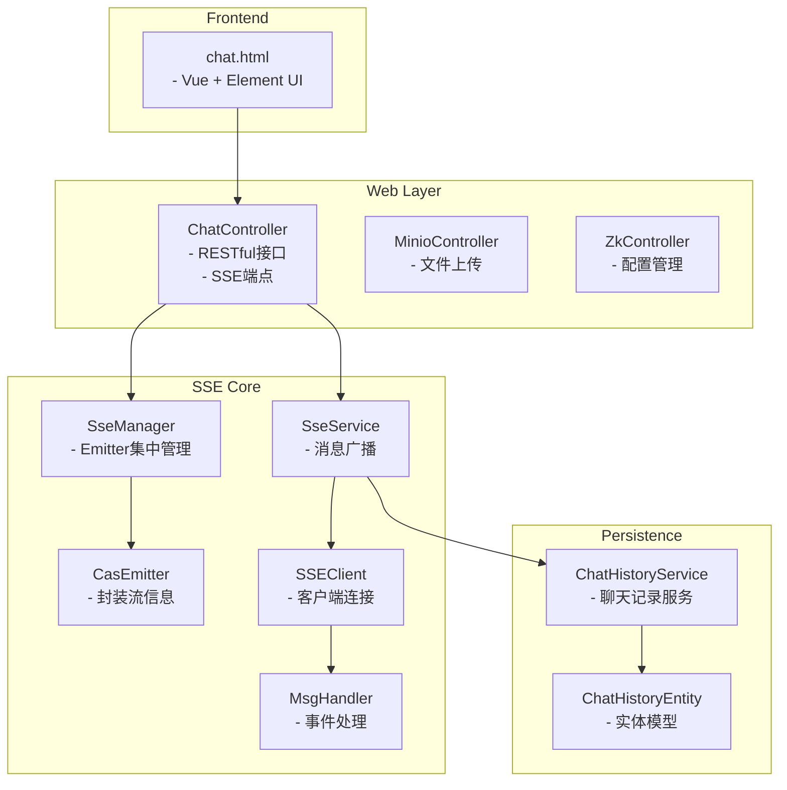

# Spring MVC 示例应用

<cite>
**本文档中引用的文件**   
- [CasSpringBootWebApplication.java](file://castile-system-center/cas-spring-boot-web/src/main/java/com/castile/casspringbootweb/CasSpringBootWebApplication.java)
- [ChatController.java](file://castile-system-center/cas-spring-boot-web/src/main/java/com/castile/casspringbootweb/demos/sse/ChatController.java)
- [SseManager.java](file://castile-system-center/cas-spring-boot-web/src/main/java/com/castile/casspringbootweb/demos/sse/cbb/SseManager.java)
- [SseService.java](file://castile-system-center/cas-spring-boot-web/src/main/java/com/castile/casspringbootweb/demos/sse/cbb/SseService.java)
- [MsgHandler.java](file://castile-system-center/cas-spring-boot-web/src/main/java/com/castile/casspringbootweb/demos/sse/cbb/MsgHandler.java)
- [ChatHistoryService.java](file://castile-system-center/cas-spring-boot-web/src/main/java/com/castile/casspringbootweb/demos/sse/cbb/ChatHistoryService.java)
- [ChatHistoryEntity.java](file://castile-system-center/cas-spring-boot-web/src/main/java/com/castile/casspringbootweb/demos/sse/cbb/ChatHistoryEntity.java)
- [CasEmitter.java](file://castile-system-center/cas-spring-boot-web/src/main/java/com/castile/casspringbootweb/demos/sse/cbb/CasEmitter.java)
- [SSEClient.java](file://castile-system-center/cas-spring-boot-web/src/main/java/com/castile/casspringbootweb/demos/sse/cbb/SSEClient.java)
- [ChatMessage.java](file://castile-system-center/cas-spring-boot-web/src/main/java/com/castile/casspringbootweb/demos/sse/ChatMessage.java)
- [chat.html](file://castile-system-center/cas-spring-boot-web/src/main/resources/static/chat.html)
- [MinioController.java](file://castile-system-center/cas-spring-boot-web/src/main/java/com/castile/casspringbootweb/demos/web/MinioController.java)
- [ZkController.java](file://castile-system-center/cas-spring-boot-web/src/main/java/com/castile/casspringbootweb/demos/zk/ZkController.java)
- [ZkConfigCacheListener.java](file://castile-system-center/cas-spring-boot-web/src/main/java/com/castile/casspringbootweb/demos/zk/ZkConfigCacheListener.java)
</cite>

## 目录
1. [简介](#简介)
2. [项目结构](#项目结构)
3. [核心组件](#核心组件)
4. [架构概览](#架构概览)
5. [详细组件分析](#详细组件分析)
6. [依赖分析](#依赖分析)
7. [性能考虑](#性能考虑)
8. [故障排除指南](#故障排除指南)
9. [结论](#结论)

## 简介
本项目是一个基于Spring MVC构建的阻塞式Web应用，重点实现了SSE（Server-Sent Events）技术用于实时消息推送。系统通过SseManager对SseEmitter进行集中管理，并结合SseService实现消息广播逻辑。前端通过EventSource API与后端建立长连接通信，实现类似ChatGPT的流式响应效果。同时集成了MinIO文件上传和ZooKeeper动态配置更新功能，构成了一个完整的实时交互式Web应用解决方案。

## 项目结构
该项目采用模块化设计，主要包含SSE实时通信、文件上传、ZooKeeper配置监听等核心功能模块。整体结构清晰，分层明确。



**图示来源**
- [ChatController.java](file://castile-system-center/cas-spring-boot-web/src/main/java/com/castile/casspringbootweb/demos/sse/ChatController.java)
- [SseManager.java](file://castile-system-center/cas-spring-boot-web/src/main/java/com/castile/casspringbootweb/demos/sse/cbb/SseManager.java)
- [SseService.java](file://castile-system-center/cas-spring-boot-web/src/main/java/com/castile/casspringbootweb/demos/sse/cbb/SseService.java)
- [ChatHistoryService.java](file://castile-system-center/cas-spring-boot-web/src/main/java/com/castile/casspringbootweb/demos/sse/cbb/ChatHistoryService.java)
- [chat.html](file://castile-system-center/cas-spring-boot-web/src/main/resources/static/chat.html)

**本节来源**
- [CasSpringBootWebApplication.java](file://castile-system-center/cas-spring-boot-web/src/main/java/com/castile/casspringbootweb/CasSpringBootWebApplication.java)
- [ChatController.java](file://castile-system-center/cas-spring-boot-web/src/main/java/com/castile/casspringbootweb/demos/sse/ChatController.java)

## 核心组件

本应用的核心在于SSE（Server-Sent Events）技术的实现，通过后端持续向客户端推送数据，实现服务器到客户端的实时消息传递。系统采用SseManager对所有SseEmitter实例进行集中管理，确保连接的有效性和可追踪性。SseService负责处理业务逻辑并调用外部服务获取流式响应，而MsgHandler则定义了消息处理的标准接口。

**本节来源**
- [SseManager.java](file://castile-system-center/cas-spring-boot-web/src/main/java/com/castile/casspringbootweb/demos/sse/cbb/SseManager.java)
- [SseService.java](file://castile-system-center/cas-spring-boot-web/src/main/java/com/castile/casspringbootweb/demos/sse/cbb/SseService.java)
- [MsgHandler.java](file://castile-system-center/cas-spring-boot-web/src/main/java/com/castile/casspringbootweb/demos/sse/cbb/MsgHandler.java)

## 架构概览

系统采用典型的分层架构，从前端页面到后端控制器，再到服务层和持久化层，形成完整的请求处理链路。


**图示来源**
- [ChatController.java](file://castile-system-center/cas-spring-boot-web/src/main/java/com/castile/casspringbootweb/demos/sse/ChatController.java)
- [SseManager.java](file://castile-system-center/cas-spring-boot-web/src/main/java/com/castile/casspringbootweb/demos/sse/cbb/SseManager.java)
- [SseService.java](file://castile-system-center/cas-spring-boot-web/src/main/java/com/castile/casspringbootweb/demos/sse/cbb/SseService.java)
- [SSEClient.java](file://castile-system-center/cas-spring-boot-web/src/main/java/com/castile/casspringbootweb/demos/sse/cbb/SSEClient.java)
- [ChatHistoryService.java](file://castile-system-center/cas-spring-boot-web/src/main/java/com/castile/casspringbootweb/demos/sse/cbb/ChatHistoryService.java)
- [chat.html](file://castile-system-center/cas-spring-boot-web/src/main/resources/static/chat.html)

## 详细组件分析

### SSE管理机制分析

#### SseManager与SseEmitter管理策略


**图示来源**
- [SseManager.java](file://castile-system-center/cas-spring-boot-web/src/main/java/com/castile/casspringbootweb/demos/sse/cbb/SseManager.java#L16-L97)
- [CasEmitter.java](file://castile-system-center/cas-spring-boot-web/src/main/java/com/castile/casspringbootweb/demos/sse/cbb/CasEmitter.java#L16-L84)

#### SseService消息广播逻辑


**图示来源**
- [SseService.java](file://castile-system-center/cas-spring-boot-web/src/main/java/com/castile/casspringbootweb/demos/sse/cbb/SseService.java#L23-L103)
- [SseManager.java](file://castile-system-center/cas-spring-boot-web/src/main/java/com/castile/casspringbootweb/demos/sse/cbb/SseManager.java)
- [ChatHistoryService.java](file://castile-system-center/cas-spring-boot-web/src/main/java/com/castile/casspringbootweb/demos/sse/cbb/ChatHistoryService.java)

#### MsgHandler事件处理职责
```mermaid
classDiagram
interface MsgHandler {
+handle(msg : String) : void
}
class SSEClient {
+getSseInputStream(url, param, timeout) : InputStream
+readStream(inputStream, handler) : void
+sendRequest(param, connection) : void
+getSseConnection(url, timeout) : HttpURLConnection
}
MsgHandler <|-- AnonymousInnerClass : "实现"
SSEClient --> MsgHandler : "依赖"
SSEClient ..> HttpURLConnection : "使用"
SSEClient ..> InputStream : "使用"
```

**图示来源**
- [MsgHandler.java](file://castile-system-center/cas-spring-boot-web/src/main/java/com/castile/casspringbootweb/demos/sse/cbb/MsgHandler.java#L12-L15)
- [SSEClient.java](file://castile-system-center/cas-spring-boot-web/src/main/java/com/castile/casspringbootweb/demos/sse/cbb/SSEClient.java#L15-L88)

**本节来源**
- [SseManager.java](file://castile-system-center/cas-spring-boot-web/src/main/java/com/castile/casspringbootweb/demos/sse/cbb/SseManager.java)
- [SseService.java](file://castile-system-center/cas-spring-boot-web/src/main/java/com/castile/casspringbootweb/demos/sse/cbb/SseService.java)
- [MsgHandler.java](file://castile-system-center/cas-spring-boot-web/src/main/java/com/castile/casspringbootweb/demos/sse/cbb/MsgHandler.java)
- [SSEClient.java](file://castile-system-center/cas-spring-boot-web/src/main/java/com/castile/casspringbootweb/demos/sse/cbb/SSEClient.java)
- [CasEmitter.java](file://castile-system-center/cas-spring-boot-web/src/main/java/com/castile/casspringbootweb/demos/sse/cbb/CasEmitter.java)

### 聊天记录持久化模型

#### ChatHistoryService与ChatHistoryEntity


**图示来源**
- [ChatHistoryService.java](file://castile-system-center/cas-spring-boot-web/src/main/java/com/castile/casspringbootweb/demos/sse/cbb/ChatHistoryService.java#L12-L23)
- [ChatHistoryEntity.java](file://castile-system-center/cas-spring-boot-web/src/main/java/com/castile/casspringbootweb/demos/sse/cbb/ChatHistoryEntity.java#L7-L9)

**本节来源**
- [ChatHistoryService.java](file://castile-system-center/cas-spring-boot-web/src/main/java/com/castile/casspringbootweb/demos/sse/cbb/ChatHistoryService.java)
- [ChatHistoryEntity.java](file://castile-system-center/cas-spring-boot-web/src/main/java/com/castile/casspringbootweb/demos/sse/cbb/ChatHistoryEntity.java)

### RESTful接口与SSE端点协同

#### ChatController协同工作流程


**图示来源**
- [ChatController.java](file://castile-system-center/cas-spring-boot-web/src/main/java/com/castile/casspringbootweb/demos/sse/ChatController.java#L24-L97)
- [SseManager.java](file://castile-system-center/cas-spring-boot-web/src/main/java/com/castile/casspringbootweb/demos/sse/cbb/SseManager.java)
- [SseService.java](file://castile-system-center/cas-spring-boot-web/src/main/java/com/castile/casspringbootweb/demos/sse/cbb/SseService.java)

**本节来源**
- [ChatController.java](file://castile-system-center/cas-spring-boot-web/src/main/java/com/castile/casspringbootweb/demos/sse/ChatController.java)

### 客户端连接管理机制

#### CasEmitter与SSEClient作用机制
CasEmitter继承自SseEmitter，扩展了业务相关的属性字段，如versionId、question、messageKey等，用于在流式通信过程中携带上下文信息。SSEClient作为服务端的SSE客户端，用于连接外部流式服务（如大模型服务），并通过MsgHandler处理返回的数据流。

**本节来源**
- [CasEmitter.java](file://castile-system-center/cas-spring-boot-web/src/main/java/com/castile/casspringbootweb/demos/sse/cbb/CasEmitter.java)
- [SSEClient.java](file://castile-system-center/cas-spring-boot-web/src/main/java/com/castile/casspringbootweb/demos/sse/cbb/SSEClient.java)

### 前端EventSource通信实现

#### JavaScript EventSource API实现


**图示来源**
- [chat.html](file://castile-system-center/cas-spring-boot-web/src/main/resources/static/chat.html#L68-L159)

**本节来源**
- [chat.html](file://castile-system-center/cas-spring-boot-web/src/main/resources/static/chat.html)

### 文件上传与动态配置

#### MinIO文件上传实现


**图示来源**
- [MinioController.java](file://castile-system-center/cas-spring-boot-web/src/main/java/com/castile/casspringbootweb/demos/web/MinioController.java)
- [BaseResponse.java](file://castile-system-center/cas-spring-boot-web/src/main/java/com/castile/casspringbootweb/demos/web/BaseResponse.java)

#### ZooKeeper动态配置更新


**图示来源**
- [ZkController.java](file://castile-system-center/cas-spring-boot-web/src/main/java/com/castile/casspringbootweb/demos/zk/ZkController.java)
- [ZkConfigCacheListener.java](file://castile-system-center/cas-spring-boot-web/src/main/java/com/castile/casspringbootweb/demos/zk/ZkConfigCacheListener.java)

**本节来源**
- [MinioController.java](file://castile-system-center/cas-spring-boot-web/src/main/java/com/castile/casspringbootweb/demos/web/MinioController.java)
- [ZkController.java](file://castile-system-center/cas-spring-boot-web/src/main/java/com/castile/casspringbootweb/demos/zk/ZkController.java)

## 依赖分析

系统各组件之间的依赖关系清晰，遵循了良好的分层架构原则。


**图示来源**
- [go.mod](file://castile-system-center/pom.xml)
- [ChatController.java](file://castile-system-center/cas-spring-boot-web/src/main/java/com/castile/casspringbootweb/demos/sse/ChatController.java)

**本节来源**
- [pom.xml](file://castile-system-center/pom.xml)

## 性能考虑

- **连接管理**：SseManager使用ConcurrentHashMap存储所有活跃的SseEmitter实例，保证线程安全的同时提供高效的查找性能。
- **超时设置**：默认设置30分钟超时时间（DEFAULT_TIME_OUT），避免连接长时间占用资源。
- **异步处理**：在chatQuery方法中使用CompletableFuture.runAsync()进行异步执行，防止阻塞HTTP响应。
- **流式传输**：通过SSE实现流式数据传输，减少客户端等待时间，提升用户体验。
- **资源释放**：在finally块中确保SseEmitter被正确关闭，防止连接泄漏。

**本节来源**
- [SseManager.java](file://castile-system-center/cas-spring-boot-web/src/main/java/com/castile/casspringbootweb/demos/sse/cbb/SseManager.java)
- [SseService.java](file://castile-system-center/cas-spring-boot-web/src/main/java/com/castile/casspringbootweb/demos/sse/cbb/SseService.java)
- [ChatController.java](file://castile-system-center/cas-spring-boot-web/src/main/java/com/castile/casspringbootweb/demos/sse/ChatController.java)

## 故障排除指南

### 启动命令
```bash
mvn spring-boot:run -pl cas-spring-boot-web
```

### 测试用例
1. 访问 `http://localhost:8080/webdemo/chat.html` 打开聊天界面
2. 输入消息并发送，观察流式响应效果
3. 检查控制台日志，确认SSE连接建立和关闭过程
4. 验证聊天记录是否正确保存

### 常见问题排查

#### 连接泄漏处理
- 确保每个SseEmitter在使用完毕后调用`complete()`或`completeWithError()`
- 在SseService的finally块中调用`SseManager.closeEmitter()`
- 监控EMITTER_MAP大小，异常增长可能表明存在泄漏

#### 跨域配置
如果需要跨域访问，需在Spring配置中添加：
```java
@Configuration
public class CorsConfig {
    @Bean
    public CorsFilter corsFilter() {
        UrlBasedCorsConfigurationSource source = new UrlBasedCorsConfigurationSource();
        CorsConfiguration config = new CorsConfiguration();
        config.setAllowCredentials(true);
        config.addAllowedOrigin("*");
        config.addAllowedHeader("*");
        config.addAllowedMethod("*");
        source.registerCorsConfiguration("/**", config);
        return new CorsFilter(source);
    }
}
```

#### SSE连接中断
- 检查网络稳定性
- 确认服务端没有抛出未捕获异常
- 查看浏览器控制台EventSource错误信息
- 验证服务端是否正确发送了`data:`前缀的消息

**本节来源**
- [SseManager.java](file://castile-system-center/cas-spring-boot-web/src/main/java/com/castile/casspringbootweb/demos/sse/cbb/SseManager.java)
- [SseService.java](file://castile-system-center/cas-spring-boot-web/src/main/java/com/castile/casspringbootweb/demos/sse/cbb/SseService.java)
- [ChatController.java](file://castile-system-center/cas-spring-boot-web/src/main/java/com/castile/casspringbootweb/demos/sse/ChatController.java)

## 结论
本项目成功实现了基于Spring MVC的SSE实时消息推送系统，通过SseManager对连接进行集中管理，SseService处理业务逻辑并与外部服务通信，前端通过EventSource API实现流畅的流式交互体验。系统架构清晰，组件职责分明，具备良好的扩展性和维护性。集成的MinIO文件上传和ZooKeeper动态配置功能进一步增强了系统的实用性。整体方案为构建实时Web应用提供了完整的参考实现。