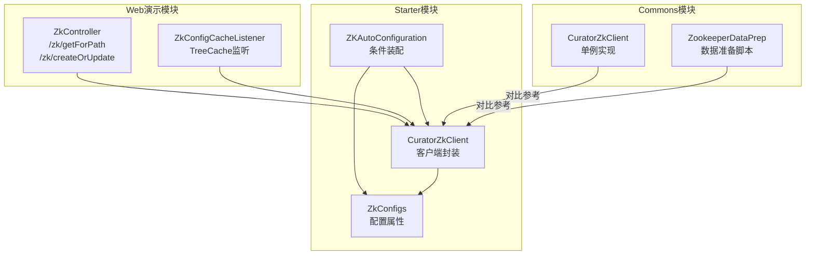
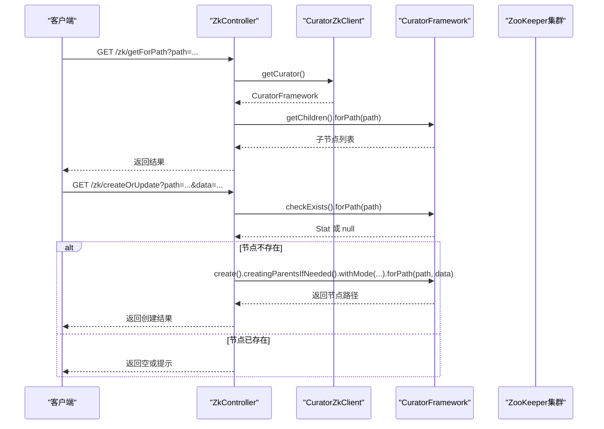
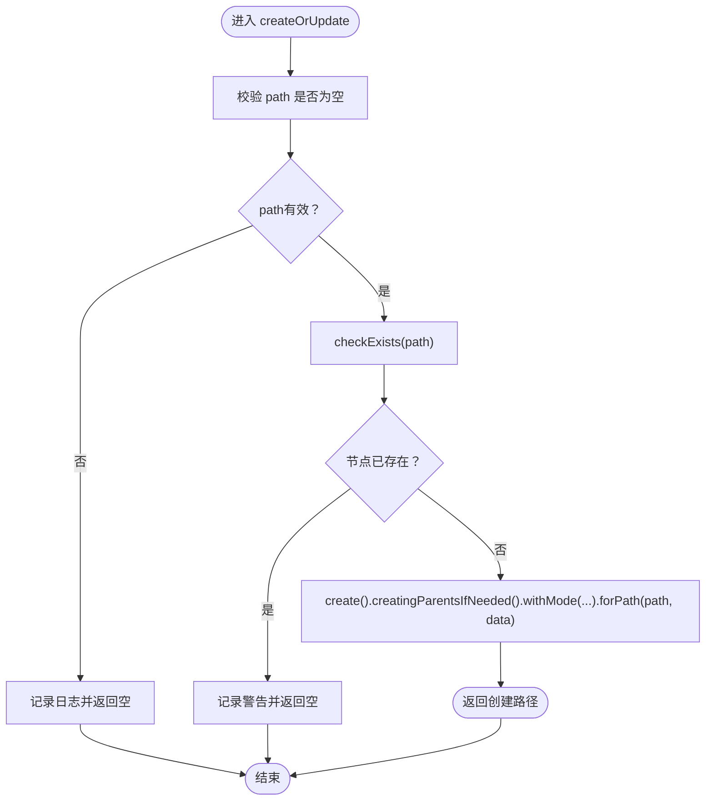
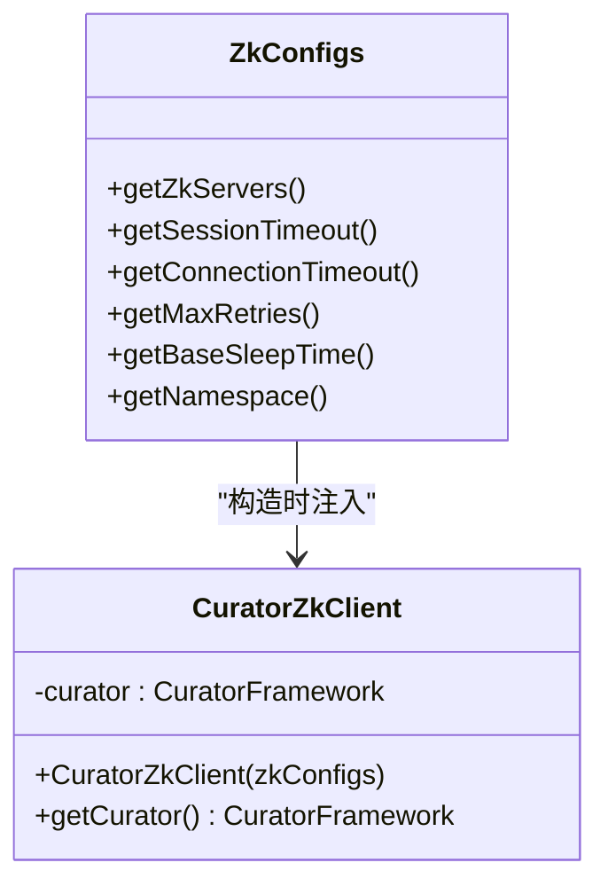
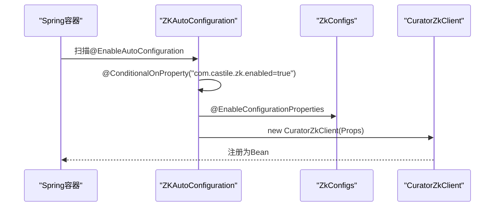
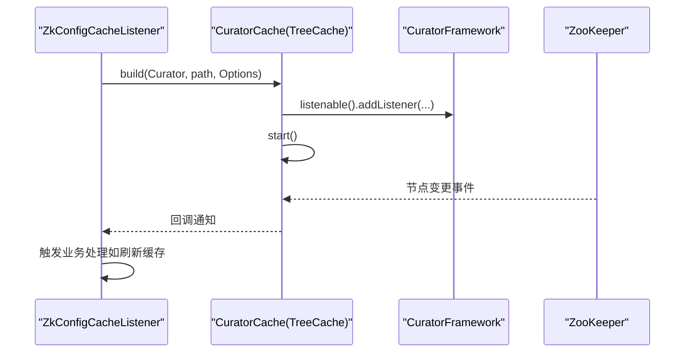
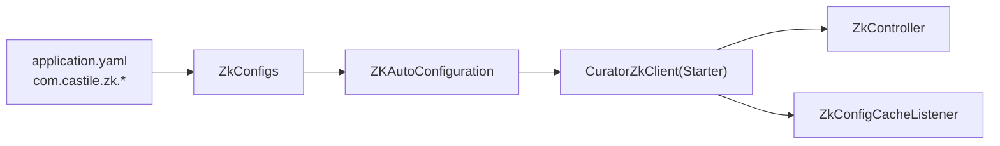

# ZooKeeper 集成实现

<cite>
**本文引用的文件列表**
- [ZkController.java](file://castile-system-center/cas-spring-boot-web/src/main/java/com/castile/casspringbootweb/demos/zk/ZkController.java)
- [ZkConfigCacheListener.java](file://castile-system-center/cas-spring-boot-web/src/main/java/com/castile/casspringbootweb/demos/zk/ZkConfigCacheListener.java)
- [CuratorZkClient.java](file://castile-system-center/cas-common-starters/cas-common-zookeeper-starter/src/main/java/com/castile/common/zk/client/CuratorZkClient.java)
- [ZKAutoConfiguration.java](file://castile-system-center/cas-common-starters/cas-common-zookeeper-starter/src/main/java/com/castile/common/zk/config/ZKAutoConfiguration.java)
- [ZkConfigs.java](file://castile-system-center/cas-common-starters/cas-common-zookeeper-starter/src/main/java/com/castile/common/zk/config/ZkConfigs.java)
- [application.yaml](file://castile-system-center/cas-spring-boot-web/src/main/resources/application.yaml)
- [spring.factories](file://castile-system-center/cas-common-starters/cas-common-zookeeper-starter/src/main/resources/META-INF/spring.factories)
- [CuratorZkClient.java](file://castile-system-center/cas-commons/src/main/java/com/castile/common/zk/CuratorZkClient.java)
- [ZookeeperDataPrep.java](file://castile-system-center/cas-commons/src/main/java/com/castile/common/zk/ZookeeperDataPrep.java)
</cite>

## 目录
1. [简介](#简介)
2. [项目结构](#项目结构)
3. [核心组件](#核心组件)
4. [架构总览](#架构总览)
5. [组件详解](#组件详解)
6. [依赖关系分析](#依赖关系分析)
7. [性能与可靠性](#性能与可靠性)
8. [故障排查指南](#故障排查指南)
9. [结论](#结论)
10. [附录](#附录)

## 简介
本文件围绕ZooKeeper在该工程中的集成实现展开，重点解析ZkController如何基于CuratorZkClient完成ZooKeeper节点的创建、查询与更新；深入说明getForPath与createOrUpdate接口的实现逻辑，涵盖路径校验、节点存在性检查、父节点自动创建（creatingParentsIfNeeded）等关键特性；阐述ZKAutoConfiguration如何通过Spring条件装配自动注入Curator客户端；结合Curator的缓存与事件监听能力，说明如何实现配置变更的实时监听与动态刷新；最后给出连接失败、会话过期等典型问题的处理策略，并总结ACL权限配置与集群部署的最佳实践。

## 项目结构
该项目采用模块化组织，ZooKeeper集成主要分布在以下位置：
- Web演示模块：提供ZkController与ZkConfigCacheListener，演示Curator客户端的使用与配置监听。
- Starter模块：封装Curator客户端、自动装配与配置属性，作为可复用的依赖。
- Commons模块：包含基础的CuratorZkClient与ZookeeperDataPrep示例，便于理解底层连接与数据准备。

图表来源
- [ZkController.java](file://castile-system-center/cas-spring-boot-web/src/main/java/com/castile/casspringbootweb/demos/zk/ZkController.java#L1-L56)
- [ZkConfigCacheListener.java](file://castile-system-center/cas-spring-boot-web/src/main/java/com/castile/casspringbootweb/demos/zk/ZkConfigCacheListener.java#L1-L41)
- [CuratorZkClient.java](file://castile-system-center/cas-common-starters/cas-common-zookeeper-starter/src/main/java/com/castile/common/zk/client/CuratorZkClient.java#L1-L67)
- [ZKAutoConfiguration.java](file://castile-system-center/cas-common-starters/cas-common-zookeeper-starter/src/main/java/com/castile/common/zk/config/ZKAutoConfiguration.java#L1-L23)
- [ZkConfigs.java](file://castile-system-center/cas-common-starters/cas-common-zookeeper-starter/src/main/java/com/castile/common/zk/config/ZkConfigs.java#L1-L69)
- [CuratorZkClient.java](file://castile-system-center/cas-commons/src/main/java/com/castile/common/zk/CuratorZkClient.java#L1-L39)
- [ZookeeperDataPrep.java](file://castile-system-center/cas-commons/src/main/java/com/castile/common/zk/ZookeeperDataPrep.java#L1-L66)

章节来源
- [ZkController.java](file://castile-system-center/cas-spring-boot-web/src/main/java/com/castile/casspringbootweb/demos/zk/ZkController.java#L1-L56)
- [ZkConfigCacheListener.java](file://castile-system-center/cas-spring-boot-web/src/main/java/com/castile/casspringbootweb/demos/zk/ZkConfigCacheListener.java#L1-L41)
- [CuratorZkClient.java](file://castile-system-center/cas-common-starters/cas-common-zookeeper-starter/src/main/java/com/castile/common/zk/client/CuratorZkClient.java#L1-L67)
- [ZKAutoConfiguration.java](file://castile-system-center/cas-common-starters/cas-common-zookeeper-starter/src/main/java/com/castile/common/zk/config/ZKAutoConfiguration.java#L1-L23)
- [ZkConfigs.java](file://castile-system-center/cas-common-starters/cas-common-zookeeper-starter/src/main/java/com/castile/common/zk/config/ZkConfigs.java#L1-L69)
- [CuratorZkClient.java](file://castile-system-center/cas-commons/src/main/java/com/castile/common/zk/CuratorZkClient.java#L1-L39)
- [ZookeeperDataPrep.java](file://castile-system-center/cas-commons/src/main/java/com/castile/common/zk/ZookeeperDataPrep.java#L1-L66)

## 核心组件
- ZkController：对外暴露HTTP接口，基于CuratorZkClient执行节点查询与创建/更新。
- ZkConfigCacheListener：基于Curator的TreeCache构建本地缓存，监听指定路径下的变更事件。
- CuratorZkClient（Starter）：封装CuratorFramework的创建、连接状态监听与阻塞等待连接成功。
- ZKAutoConfiguration：启用配置属性绑定并按条件装配CuratorZkClient Bean。
- ZkConfigs：定义ZooKeeper连接参数（服务器地址、会话/连接超时、重试策略、命名空间等）。
- application.yaml：提供com.castile.zk前缀的配置项，供ZkConfigs绑定。
- spring.factories：声明自动装配入口，使ZKAutoConfiguration生效。
- Commons模块的CuratorZkClient与ZookeeperDataPrep：提供单例客户端与数据准备示例，便于理解与对比。

章节来源
- [ZkController.java](file://castile-system-center/cas-spring-boot-web/src/main/java/com/castile/casspringbootweb/demos/zk/ZkController.java#L1-L56)
- [ZkConfigCacheListener.java](file://castile-system-center/cas-spring-boot-web/src/main/java/com/castile/casspringbootweb/demos/zk/ZkConfigCacheListener.java#L1-L41)
- [CuratorZkClient.java](file://castile-system-center/cas-common-starters/cas-common-zookeeper-starter/src/main/java/com/castile/common/zk/client/CuratorZkClient.java#L1-L67)
- [ZKAutoConfiguration.java](file://castile-system-center/cas-common-starters/cas-common-zookeeper-starter/src/main/java/com/castile/common/zk/config/ZKAutoConfiguration.java#L1-L23)
- [ZkConfigs.java](file://castile-system-center/cas-common-starters/cas-common-zookeeper-starter/src/main/java/com/castile/common/zk/config/ZkConfigs.java#L1-L69)
- [application.yaml](file://castile-system-center/cas-spring-boot-web/src/main/resources/application.yaml#L1-L33)
- [spring.factories](file://castile-system-center/cas-common-starters/cas-common-zookeeper-starter/src/main/resources/META-INF/spring.factories#L1-L3)
- [CuratorZkClient.java](file://castile-system-center/cas-commons/src/main/java/com/castile/common/zk/CuratorZkClient.java#L1-L39)
- [ZookeeperDataPrep.java](file://castile-system-center/cas-commons/src/main/java/com/castile/common/zk/ZookeeperDataPrep.java#L1-L66)

## 架构总览
下图展示了从Web控制器到Curator客户端、再到ZooKeeper服务的整体交互流程，以及自动装配与配置绑定的关键环节。

图表来源
- [ZkController.java](file://castile-system-center/cas-spring-boot-web/src/main/java/com/castile/casspringbootweb/demos/zk/ZkController.java#L29-L56)
- [CuratorZkClient.java](file://castile-system-center/cas-common-starters/cas-common-zookeeper-starter/src/main/java/com/castile/common/zk/client/CuratorZkClient.java#L27-L66)

章节来源
- [ZkController.java](file://castile-system-center/cas-spring-boot-web/src/main/java/com/castile/casspringbootweb/demos/zk/ZkController.java#L29-L56)
- [CuratorZkClient.java](file://castile-system-center/cas-common-starters/cas-common-zookeeper-starter/src/main/java/com/castile/common/zk/client/CuratorZkClient.java#L27-L66)

## 组件详解

### ZkController：查询与创建/更新
- getForPath接口
  - 功能：查询指定路径的子节点名称列表。
  - 实现要点：通过CuratorFramework的children API执行查询，返回结果。
  - 异常处理：捕获异常后向上抛出运行时异常，便于上层统一处理。
- createOrUpdate接口
  - 功能：在给定路径创建持久化节点（若不存在），支持自动创建父节点。
  - 实现要点：
    - 路径校验：对传入path进行非空判断。
    - 节点存在性检查：使用checkExists确认节点是否存在。
    - 自动创建父节点：通过creatingParentsIfNeeded实现。
    - 节点模式：默认持久化节点。
  - 返回值：返回创建的节点路径或空。

图表来源
- [ZkController.java](file://castile-system-center/cas-spring-boot-web/src/main/java/com/castile/casspringbootweb/demos/zk/ZkController.java#L40-L56)

章节来源
- [ZkController.java](file://castile-system-center/cas-spring-boot-web/src/main/java/com/castile/casspringbootweb/demos/zk/ZkController.java#L29-L56)

### CuratorZkClient（Starter）：客户端封装与连接状态监听
- 连接参数来源：从ZkConfigs读取zkServers、sessionTimeout、connectionTimeout、maxRetries、baseSleepTime、namespace等。
- 重试策略：使用指数回退重试策略，避免频繁重连导致压力过大。
- 连接状态监听：注册ConnectionStateListener，在CONNECTED/LOST/RECONNECTED时输出状态信息。
- 阻塞等待连接：blockUntilConnected等待连接建立，超时则记录错误日志。
- 对外提供：getCurator()以供业务使用。

图表来源
- [CuratorZkClient.java](file://castile-system-center/cas-common-starters/cas-common-zookeeper-starter/src/main/java/com/castile/common/zk/client/CuratorZkClient.java#L27-L66)
- [ZkConfigs.java](file://castile-system-center/cas-common-starters/cas-common-zookeeper-starter/src/main/java/com/castile/common/zk/config/ZkConfigs.java#L1-L69)

章节来源
- [CuratorZkClient.java](file://castile-system-center/cas-common-starters/cas-common-zookeeper-starter/src/main/java/com/castile/common/zk/client/CuratorZkClient.java#L27-L66)
- [ZkConfigs.java](file://castile-system-center/cas-common-starters/cas-common-zookeeper-starter/src/main/java/com/castile/common/zk/config/ZkConfigs.java#L1-L69)

### ZKAutoConfiguration：条件装配与自动注入
- 条件注解：@ConditionalOnProperty(prefix = "com.castile.zk", name = "enabled", havingValue = "true")，仅当配置com.castile.zk.enabled=true时才装配。
- 启用配置属性：@EnableConfigurationProperties({ZkConfigs.class})，允许ZkConfigs绑定application.yaml中的com.castile.zk前缀配置。
- Bean定义：返回CuratorZkClient实例，依赖ZkConfigs提供的参数。

图表来源
- [ZKAutoConfiguration.java](file://castile-system-center/cas-common-starters/cas-common-zookeeper-starter/src/main/java/com/castile/common/zk/config/ZKAutoConfiguration.java#L1-L23)
- [spring.factories](file://castile-system-center/cas-common-starters/cas-common-zookeeper-starter/src/main/resources/META-INF/spring.factories#L1-L3)
- [application.yaml](file://castile-system-center/cas-spring-boot-web/src/main/resources/application.yaml#L19-L31)

章节来源
- [ZKAutoConfiguration.java](file://castile-system-center/cas-common-starters/cas-common-zookeeper-starter/src/main/java/com/castile/common/zk/config/ZKAutoConfiguration.java#L1-L23)
- [spring.factories](file://castile-system-center/cas-common-starters/cas-common-zookeeper-starter/src/main/resources/META-INF/spring.factories#L1-L3)
- [application.yaml](file://castile-system-center/cas-spring-boot-web/src/main/resources/application.yaml#L19-L31)

### 配置监听与动态刷新：TreeCache与CuratorCache
- ZkConfigCacheListener通过CuratorCache构建树形缓存，监听指定路径下的事件（如节点增删改）。
- 使用CuratorCache.Options.SINGLE_NODE_CACHE可减少内存占用，适合小规模节点监听。
- 监听器回调中可进行业务处理（例如触发配置刷新、缓存重建等）。

图表来源
- [ZkConfigCacheListener.java](file://castile-system-center/cas-spring-boot-web/src/main/java/com/castile/casspringbootweb/demos/zk/ZkConfigCacheListener.java#L29-L41)

章节来源
- [ZkConfigCacheListener.java](file://castile-system-center/cas-spring-boot-web/src/main/java/com/castile/casspringbootweb/demos/zk/ZkConfigCacheListener.java#L1-L41)

### 数据准备与ACL参考：ZookeeperDataPrep
- 示例脚本展示了如何使用原生ZooKeeper客户端创建父节点与多级子节点，并设置OPEN_ACL_UNSAFE。
- 可作为ACL配置与层级结构设计的参考，便于理解节点创建与权限模型。

章节来源
- [ZookeeperDataPrep.java](file://castile-system-center/cas-commons/src/main/java/com/castile/common/zk/ZookeeperDataPrep.java#L1-L66)

## 依赖关系分析
- 组件耦合
  - ZkController依赖CuratorZkClient，通过@Autowired注入。
  - ZkConfigCacheListener同样依赖CuratorZkClient，且通过@ConditionalOnBean确保只有在存在客户端时才初始化。
  - ZKAutoConfiguration负责装配CuratorZkClient，并依赖ZkConfigs。
  - ZkConfigs由application.yaml中的com.castile.zk前缀配置驱动。
- 外部依赖
  - Curator Framework与Recipes版本由starter模块的pom引入。
- 循环依赖
  - 未发现循环依赖迹象，装配顺序清晰：spring.factories -> ZKAutoConfiguration -> CuratorZkClient -> ZkConfigs。

图表来源
- [application.yaml](file://castile-system-center/cas-spring-boot-web/src/main/resources/application.yaml#L19-L31)
- [ZkConfigs.java](file://castile-system-center/cas-common-starters/cas-common-zookeeper-starter/src/main/java/com/castile/common/zk/config/ZkConfigs.java#L1-L69)
- [ZKAutoConfiguration.java](file://castile-system-center/cas-common-starters/cas-common-zookeeper-starter/src/main/java/com/castile/common/zk/config/ZKAutoConfiguration.java#L1-L23)
- [CuratorZkClient.java](file://castile-system-center/cas-common-starters/cas-common-zookeeper-starter/src/main/java/com/castile/common/zk/client/CuratorZkClient.java#L27-L66)
- [ZkController.java](file://castile-system-center/cas-spring-boot-web/src/main/java/com/castile/casspringbootweb/demos/zk/ZkController.java#L24-L28)
- [ZkConfigCacheListener.java](file://castile-system-center/cas-spring-boot-web/src/main/java/com/castile/casspringbootweb/demos/zk/ZkConfigCacheListener.java#L18-L20)

章节来源
- [application.yaml](file://castile-system-center/cas-spring-boot-web/src/main/resources/application.yaml#L19-L31)
- [ZkConfigs.java](file://castile-system-center/cas-common-starters/cas-common-zookeeper-starter/src/main/java/com/castile/common/zk/config/ZkConfigs.java#L1-L69)
- [ZKAutoConfiguration.java](file://castile-system-center/cas-common-starters/cas-common-zookeeper-starter/src/main/java/com/castile/common/zk/config/ZKAutoConfiguration.java#L1-L23)
- [CuratorZkClient.java](file://castile-system-center/cas-common-starters/cas-common-zookeeper-starter/src/main/java/com/castile/common/zk/client/CuratorZkClient.java#L27-L66)
- [ZkController.java](file://castile-system-center/cas-spring-boot-web/src/main/java/com/castile/casspringbootweb/demos/zk/ZkController.java#L24-L28)
- [ZkConfigCacheListener.java](file://castile-system-center/cas-spring-boot-web/src/main/java/com/castile/casspringbootweb/demos/zk/ZkConfigCacheListener.java#L18-L20)

## 性能与可靠性
- 连接与重试
  - 使用指数回退重试策略，避免瞬时故障导致频繁重试。
  - 通过blockUntilConnected等待连接建立，降低首次请求失败概率。
- 缓存与监听
  - TreeCache适合热点路径的小规模监听，减少轮询开销。
  - 建议根据节点数量选择合适的Options，平衡内存与性能。
- 超时配置
  - sessionTimeout与connectionTimeout需结合网络状况与业务延迟合理设置，避免频繁会话超时或连接超时。
- 并发与线程安全
  - CuratorFramework为线程安全对象，可在多线程环境下共享使用。

[本节为通用建议，不直接分析具体文件]

## 故障排查指南
- 连接失败
  - 确认com.castile.zk.enabled=true且application.yaml中zookeeper地址正确。
  - 检查Curator客户端是否成功blockUntilConnected，关注日志输出。
  - 排查网络连通性与防火墙策略。
- 会话过期
  - 增大sessionTimeout，确保业务处理时间不超过会话周期。
  - 关注ConnectionStateListener输出，定位LOST/RECONNECTED时机。
- 节点创建冲突
  - createOrUpdate在节点存在时返回空或警告，避免重复创建。
  - 如需更新数据，应先读取再写入，或使用更新API。
- ACL权限问题
  - 示例脚本使用OPEN_ACL_UNSAFE，生产环境请配置严格的ACL策略。
  - 若出现权限不足，检查ZooKeeper ACL与认证配置。

章节来源
- [CuratorZkClient.java](file://castile-system-center/cas-common-starters/cas-common-zookeeper-starter/src/main/java/com/castile/common/zk/client/CuratorZkClient.java#L38-L66)
- [ZkController.java](file://castile-system-center/cas-spring-boot-web/src/main/java/com/castile/casspringbootweb/demos/zk/ZkController.java#L40-L56)
- [application.yaml](file://castile-system-center/cas-spring-boot-web/src/main/resources/application.yaml#L19-L31)
- [ZookeeperDataPrep.java](file://castile-system-center/cas-commons/src/main/java/com/castile/common/zk/ZookeeperDataPrep.java#L1-L66)

## 结论
该实现通过Starter模块将Curator客户端与Spring Boot自动装配无缝集成，ZkController与ZkConfigCacheListener分别覆盖了ZooKeeper的读写与监听场景。getForPath与createOrUpdate接口体现了路径校验、存在性检查与父节点自动创建等关键特性；ZKAutoConfiguration与ZkConfigs确保了配置驱动的可插拔性。结合TreeCache监听，可实现配置变更的实时感知与动态刷新。针对连接失败与会话过期等常见问题，可通过合理的超时配置与重试策略加以缓解。ACL权限与集群部署方面，建议参考示例脚本并结合生产环境的安全策略进行落地。

[本节为总结性内容，不直接分析具体文件]

## 附录
- 配置项说明（来自application.yaml与ZkConfigs）
  - com.castile.zk.zk-servers：ZooKeeper服务器地址列表。
  - com.castile.zk.connection-timeout：连接超时时间。
  - com.castile.zk.session-timeout：会话超时时间。
  - com.castile.zk.max-retries/base-sleep-time：重试策略参数。
  - com.castile.zk.enabled：是否启用ZooKeeper自动装配。
- 最佳实践
  - ACL：生产环境使用严格ACL，避免使用OPEN_ACL_UNSAFE。
  - 集群：使用多地址配置与负载均衡，提升可用性。
  - 监听：根据节点规模选择合适的缓存选项，避免内存压力。
  - 超时：结合业务延迟调整会话与连接超时，减少抖动。

章节来源
- [application.yaml](file://castile-system-center/cas-spring-boot-web/src/main/resources/application.yaml#L19-L31)
- [ZkConfigs.java](file://castile-system-center/cas-common-starters/cas-common-zookeeper-starter/src/main/java/com/castile/common/zk/config/ZkConfigs.java#L1-L69)
- [ZookeeperDataPrep.java](file://castile-system-center/cas-commons/src/main/java/com/castile/common/zk/ZookeeperDataPrep.java#L1-L66)