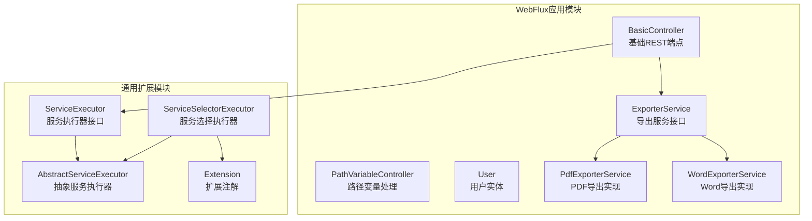
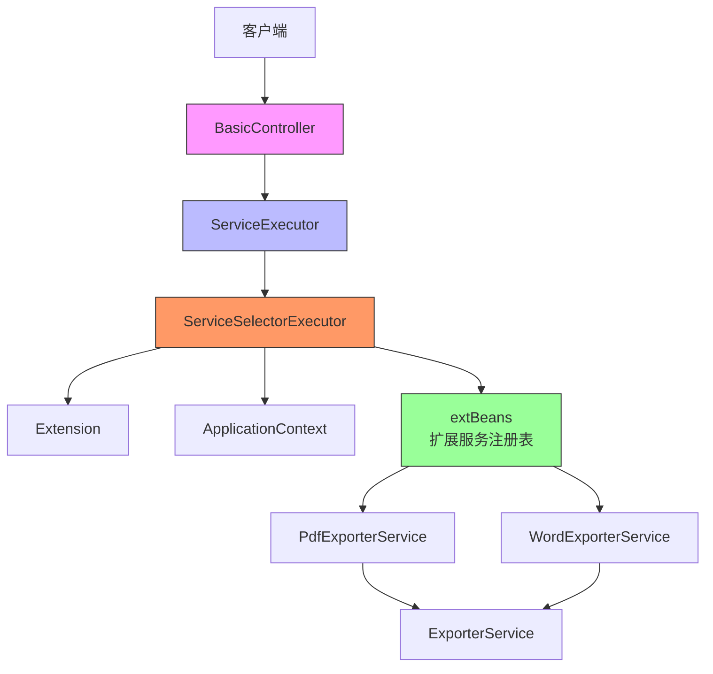
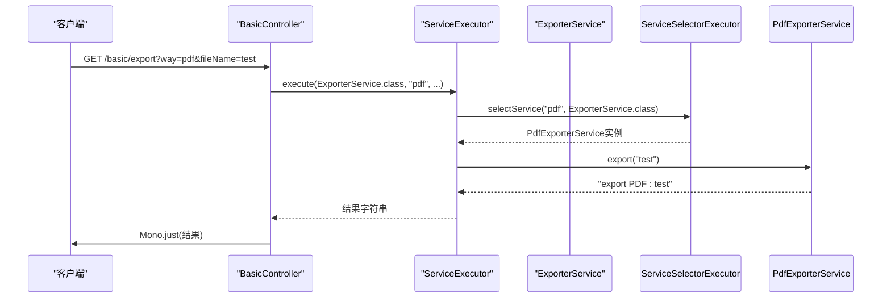
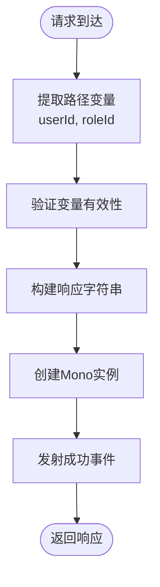
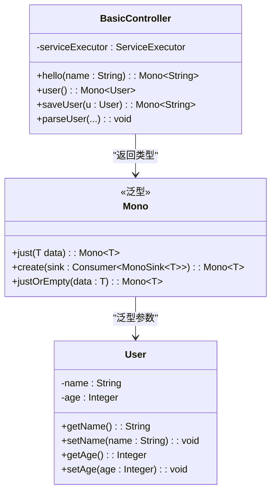
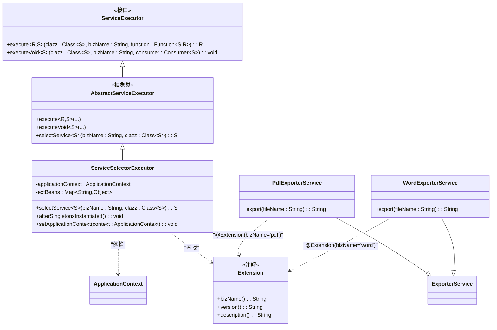
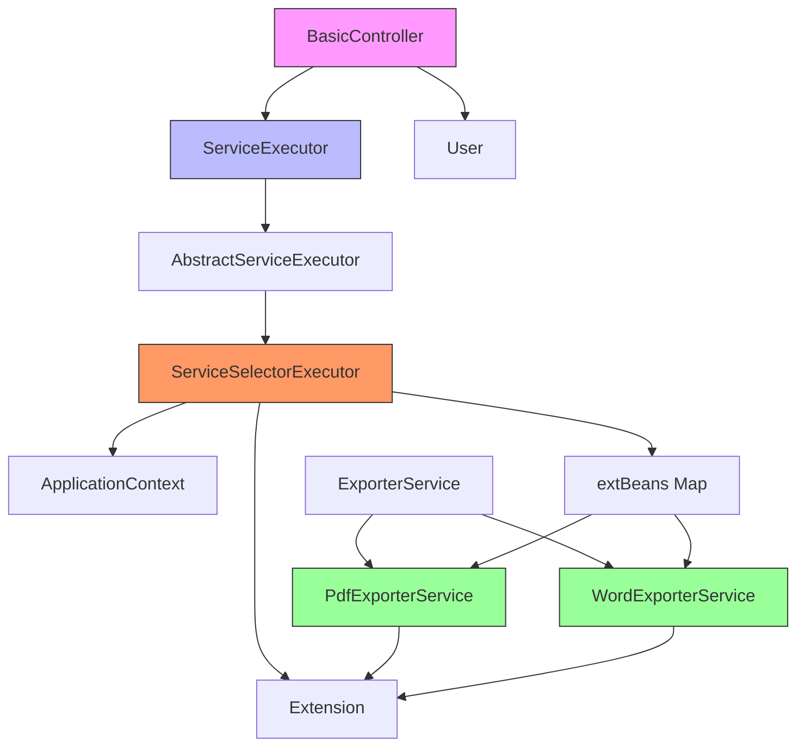

# Spring WebFlux 示例应用

<cite>
**本文档中引用的文件**  
- [BasicController.java](file://castile-system-center/cas-spring-boot-webflux/src/main/java/com/castile/cas/flux/web/BasicController.java)
- [PathVariableController.java](file://castile-system-center/cas-spring-boot-webflux/src/main/java/com/castile/cas/flux/web/PathVariableController.java)
- [User.java](file://castile-system-center/cas-spring-boot-webflux/src/main/java/com/castile/cas/flux/web/User.java)
- [ExporterService.java](file://castile-system-center/cas-spring-boot-webflux/src/main/java/com/castile/cas/flux/serevice/ExporterService.java)
- [PdfExporterService.java](file://castile-system-center/cas-spring-boot-webflux/src/main/java/com/castile/cas/flux/serevice/impl/PdfExporterService.java)
- [WordExporterService.java](file://castile-system-center/cas-spring-boot-webflux/src/main/java/com/castile/cas/flux/serevice/impl/WordExporterService.java)
- [ServiceExecutor.java](file://castile-system-center/cas-common-starters/cas-common-extension-starter/src/main/java/com/castile/common/extension/ServiceExecutor.java)
- [AbstractServiceExecutor.java](file://castile-system-center/cas-common-starters/cas-common-extension-starter/src/main/java/com/castile/common/extension/AbstractServiceExecutor.java)
- [ServiceSelectorExecutor.java](file://castile-system-center/cas-common-starters/cas-common-extension-starter/src/main/java/com/castile/common/extension/ServiceSelectorExecutor.java)
- [Extension.java](file://castile-system-center/cas-common-starters/cas-common-extension-starter/src/main/java/com/castile/common/extension/Extension.java)
- [CasSpriongBootDemoApplication.java](file://castile-system-center/cas-spring-boot-webflux/src/main/java/com/castile/cas/CasSpriongBootDemoApplication.java)
- [application.yaml](file://castile-system-center/cas-spring-boot-webflux/src/main/resources/application.yaml)
</cite>

## 目录
1. [简介](#简介)
2. [项目结构](#项目结构)
3. [核心组件](#核心组件)
4. [架构概览](#架构概览)
5. [详细组件分析](#详细组件分析)
6. [依赖分析](#依赖分析)
7. [性能考量](#性能考量)
8. [故障排除指南](#故障排除指南)
9. [结论](#结论)

## 简介
本文档全面解析基于Spring WebFlux构建的响应式非阻塞Web应用架构。深入讲解响应式REST端点的定义方式、路径变量处理、响应式数据流构建以及扩展服务调用链的实现机制。重点阐述WebFlux的函数式编程模型优势，并提供相关实践指导。

## 项目结构
该项目是一个基于Spring Boot和Spring WebFlux的响应式Web应用，采用模块化设计。核心WebFlux功能位于`cas-spring-boot-webflux`模块中，而通用扩展能力由`cas-common-extension-starter`提供。项目遵循典型的Spring Boot结构，包含控制器、服务、实体类和配置文件。

**图示来源**
- [BasicController.java](file://castile-system-center/cas-spring-boot-webflux/src/main/java/com/castile/cas/flux/web/BasicController.java)
- [ExporterService.java](file://castile-system-center/cas-spring-boot-webflux/src/main/java/com/castile/cas/flux/serevice/ExporterService.java)
- [ServiceExecutor.java](file://castile-system-center/cas-common-starters/cas-common-extension-starter/src/main/java/com/castile/common/extension/ServiceExecutor.java)
- [Extension.java](file://castile-system-center/cas-common-starters/cas-common-extension-starter/src/main/java/com/castile/common/extension/Extension.java)

**本节来源**
- [cas-spring-boot-webflux](file://castile-system-center/cas-spring-boot-webflux)
- [cas-common-extension-starter](file://castile-system-center/cas-common-starters/cas-common-extension-starter)

## 核心组件
本应用的核心组件包括基于注解的响应式控制器、响应式数据实体、扩展服务接口及其实现，以及基于泛型和函数式编程的服务执行框架。这些组件共同构成了一个高效、可扩展的响应式Web应用。

**本节来源**
- [BasicController.java](file://castile-system-center/cas-spring-boot-webflux/src/main/java/com/castile/cas/flux/web/BasicController.java#L28-L72)
- [User.java](file://castile-system-center/cas-spring-boot-webflux/src/main/java/com/castile/cas/flux/web/User.java#L22-L43)
- [ExporterService.java](file://castile-system-center/cas-spring-boot-webflux/src/main/java/com/castile/cas/flux/serevice/ExporterService.java#L7-L10)

## 架构概览
该应用采用典型的响应式分层架构，从前端控制器到服务执行器，再到具体服务实现，形成清晰的调用链。WebFlux提供非阻塞IO和背压支持，而自定义的扩展框架实现了运行时策略选择。

**图示来源**
- [BasicController.java](file://castile-system-center/cas-spring-boot-webflux/src/main/java/com/castile/cas/flux/web/BasicController.java#L30-L38)
- [ServiceExecutor.java](file://castile-system-center/cas-common-starters/cas-common-extension-starter/src/main/java/com/castile/common/extension/ServiceExecutor.java#L10-L31)
- [ServiceSelectorExecutor.java](file://castile-system-center/cas-common-starters/cas-common-extension-starter/src/main/java/com/castile/common/extension/ServiceSelectorExecutor.java#L25-L60)
- [Extension.java](file://castile-system-center/cas-common-starters/cas-common-extension-starter/src/main/java/com/castile/common/extension/Extension.java#L11-L20)

## 详细组件分析

### 响应式REST端点分析
`BasicController`类展示了如何使用Spring WebFlux定义响应式REST端点。所有方法返回`Mono<T>`类型，实现了异步非阻塞处理。`@ModelAttribute`注解用于在请求处理前预处理和绑定参数。

**图示来源**
- [BasicController.java](file://castile-system-center/cas-spring-boot-webflux/src/main/java/com/castile/cas/flux/web/BasicController.java#L35-L38)
- [ServiceExecutor.java](file://castile-system-center/cas-common-starters/cas-common-extension-starter/src/main/java/com/castile/common/extension/ServiceExecutor.java#L31-L31)
- [PdfExporterService.java](file://castile-system-center/cas-spring-boot-webflux/src/main/java/com/castile/cas/flux/serevice/impl/PdfExporterService.java#L15-L17)

**本节来源**
- [BasicController.java](file://castile-system-center/cas-spring-boot-webflux/src/main/java/com/castile/cas/flux/web/BasicController.java#L28-L72)

### 路径变量处理分析
`PathVariableController`展示了如何使用`@PathVariable`注解提取URL中的路径变量。该控制器使用`@Controller`而非`@RestController`，但通过`@ResponseBody`注解仍可返回响应体。

**图示来源**
- [PathVariableController.java](file://castile-system-center/cas-spring-boot-webflux/src/main/java/com/castile/cas/flux/web/PathVariableController.java#L30-L37)

**本节来源**
- [PathVariableController.java](file://castile-system-center/cas-spring-boot-webflux/src/main/java/com/castile/cas/flux/web/PathVariableController.java#L30-L38)

### 响应式数据流构建分析
`User`实体类作为响应式数据流的载体，在`BasicController`中被包装为`Mono<User>`。这展示了如何将普通POJO对象集成到响应式流中。

**图示来源**
- [User.java](file://castile-system-center/cas-spring-boot-webflux/src/main/java/com/castile/cas/flux/web/User.java#L22-L43)
- [BasicController.java](file://castile-system-center/cas-spring-boot-webflux/src/main/java/com/castile/cas/flux/web/BasicController.java#L50-L57)

**本节来源**
- [User.java](file://castile-system-center/cas-spring-boot-webflux/src/main/java/com/castile/cas/flux/web/User.java#L22-L43)
- [BasicController.java](file://castile-system-center/cas-spring-boot-webflux/src/main/java/com/castile/cas/flux/web/BasicController.java#L50-L57)

### 扩展服务调用链分析
扩展服务框架通过`ServiceExecutor`接口、`AbstractServiceExecutor`抽象类和`ServiceSelectorExecutor`具体实现，构建了一个基于注解的运行时服务选择机制。

**图示来源**
- [ServiceExecutor.java](file://castile-system-center/cas-common-starters/cas-common-extension-starter/src/main/java/com/castile/common/extension/ServiceExecutor.java#L10-L31)
- [AbstractServiceExecutor.java](file://castile-system-center/cas-common-starters/cas-common-extension-starter/src/main/java/com/castile/common/extension/AbstractServiceExecutor.java#L10-L35)
- [ServiceSelectorExecutor.java](file://castile-system-center/cas-common-starters/cas-common-extension-starter/src/main/java/com/castile/common/extension/ServiceSelectorExecutor.java#L25-L60)
- [Extension.java](file://castile-system-center/cas-common-starters/cas-common-extension-starter/src/main/java/com/castile/common/extension/Extension.java#L11-L20)
- [PdfExporterService.java](file://castile-system-center/cas-spring-boot-webflux/src/main/java/com/castile/cas/flux/serevice/impl/PdfExporterService.java#L11-L18)
- [WordExporterService.java](file://castile-system-center/cas-spring-boot-webflux/src/main/java/com/castile/cas/flux/serevice/impl/WordExporterService.java#L11-L18)

**本节来源**
- [ServiceExecutor.java](file://castile-system-center/cas-common-starters/cas-common-extension-starter/src/main/java/com/castile/common/extension/ServiceExecutor.java#L10-L31)
- [ServiceSelectorExecutor.java](file://castile-system-center/cas-common-starters/cas-common-extension-starter/src/main/java/com/castile/common/extension/ServiceSelectorExecutor.java#L25-L60)
- [Extension.java](file://castile-system-center/cas-common-starters/cas-common-extension-starter/src/main/java/com/castile/common/extension/Extension.java#L11-L20)

## 依赖分析
该应用的依赖关系清晰地展示了响应式编程和扩展框架的集成方式。Spring WebFlux提供基础的响应式Web能力，而自定义的扩展框架通过Spring的依赖注入和注解处理机制实现服务的动态选择。

**图示来源**
- [BasicController.java](file://castile-system-center/cas-spring-boot-webflux/src/main/java/com/castile/cas/flux/web/BasicController.java#L33-L38)
- [ServiceSelectorExecutor.java](file://castile-system-center/cas-common-starters/cas-common-extension-starter/src/main/java/com/castile/common/extension/ServiceSelectorExecutor.java#L27-L52)
- [PdfExporterService.java](file://castile-system-center/cas-spring-boot-webflux/src/main/java/com/castile/cas/flux/serevice/impl/PdfExporterService.java#L11-L13)
- [WordExporterService.java](file://castile-system-center/cas-spring-boot-webflux/src/main/java/com/castile/cas/flux/serevice/impl/WordExporterService.java#L11-L13)

**本节来源**
- [cas-spring-boot-webflux](file://castile-system-center/cas-spring-boot-webflux)
- [cas-common-extension-starter](file://castile-system-center/cas-common-starters/cas-common-extension-starter)

## 性能考量
Spring WebFlux的响应式模型提供了显著的性能优势。通过非阻塞IO和事件驱动架构，单个线程可以处理大量并发连接，大大提高了资源利用率。背压机制确保了生产者和消费者之间的流量控制，防止内存溢出。与传统MVC的阻塞IO模式相比，WebFlux在高并发场景下表现出更好的吞吐量和更低的延迟。

**本节来源**
- [BasicController.java](file://castile-system-center/cas-spring-boot-webflux/src/main/java/com/castile/cas/flux/web/BasicController.java)
- [application.yaml](file://castile-system-center/cas-spring-boot-webflux/src/main/resources/application.yaml)

## 故障排除指南
当遇到服务无法正确选择的问题时，应检查`@Extension`注解的`bizName`是否唯一且正确。确保相关服务类被Spring正确扫描并注册为Bean。对于响应式流的问题，可以使用`log()`操作符来跟踪数据流的执行过程。在配置方面，确认`application.yaml`中的WebFlux基础路径设置正确。

**本节来源**
- [ServiceSelectorExecutor.java](file://castile-system-center/cas-common-starters/cas-common-extension-starter/src/main/java/com/castile/common/extension/ServiceSelectorExecutor.java#L31-L34)
- [application.yaml](file://castile-system-center/cas-spring-boot-webflux/src/main/resources/application.yaml#L18-L19)

## 结论
本文档详细解析了基于Spring WebFlux的响应式Web应用架构。该应用成功整合了响应式编程模型和自定义扩展框架，展示了如何构建高效、可扩展的现代Web服务。通过`Mono<T>`返回类型、`@PathVariable`参数提取、`@ModelAttribute`参数预处理以及基于注解的服务选择机制，体现了响应式编程的强大能力和灵活性。这种架构特别适合需要处理大量并发请求、追求高资源利用率的微服务场景。