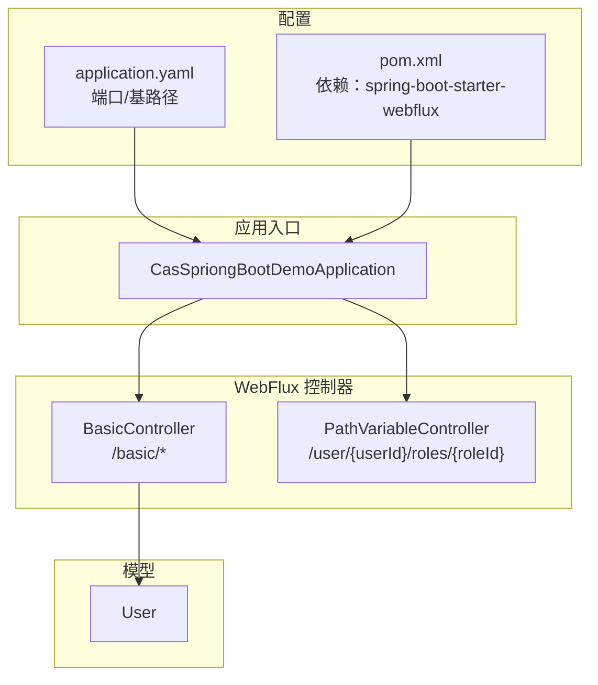
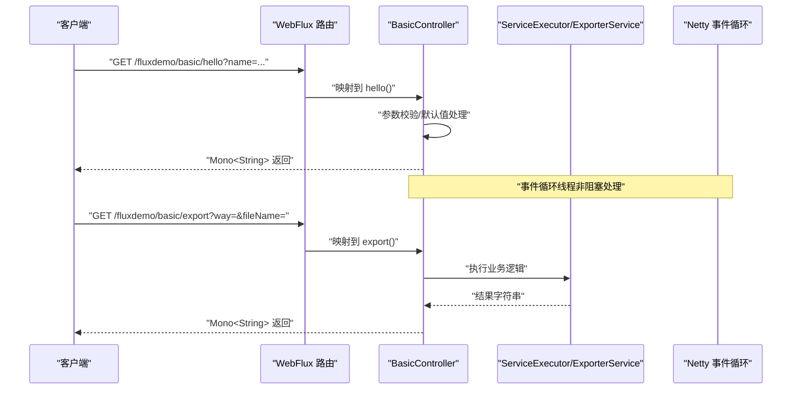
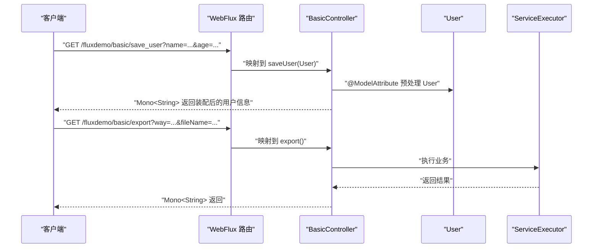
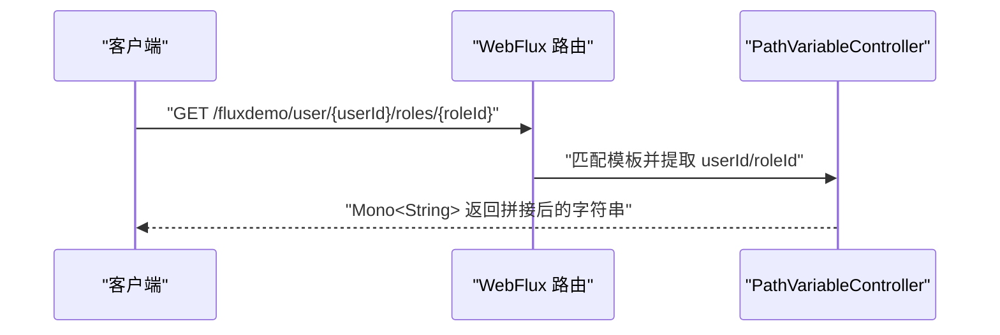
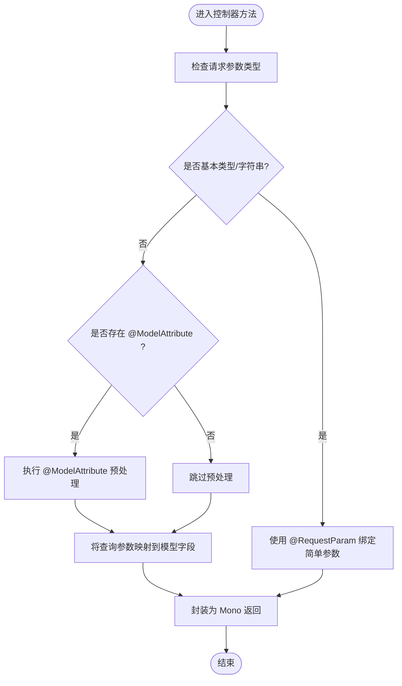
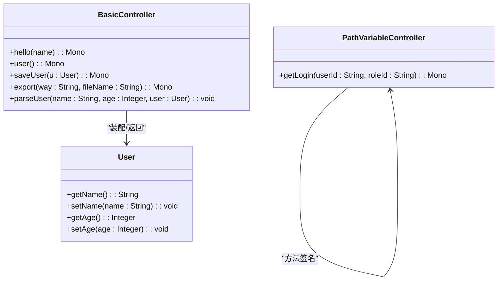
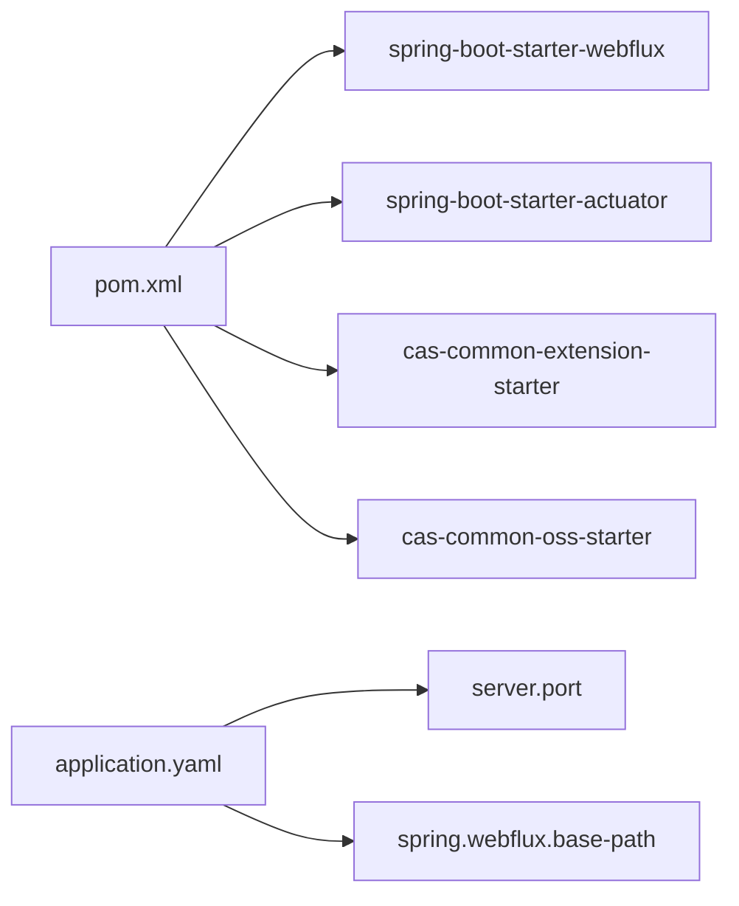

# 响应式控制器详解

<cite>
**本文引用的文件列表**
- [BasicController.java](file://castile-system-center/cas-spring-boot-webflux/src/main/java/com/castile/cas/flux/web/BasicController.java)
- [PathVariableController.java](file://castile-system-center/cas-spring-boot-webflux/src/main/java/com/castile/cas/flux/web/PathVariableController.java)
- [User.java](file://castile-system-center/cas-spring-boot-webflux/src/main/java/com/castile/cas/flux/web/User.java)
- [CasSpriongBootDemoApplication.java](file://castile-system-center/cas-spring-boot-webflux/src/main/java/com/castile/cas/CasSpriongBootDemoApplication.java)
- [application.yaml](file://castile-system-center/cas-spring-boot-webflux/src/main/resources/application.yaml)
- [pom.xml](file://castile-system-center/cas-spring-boot-webflux/pom.xml)
- [CasSpriongBootDemoApplicationTests.java](file://castile-system-center/cas-spring-boot-webflux/src/test/java/com/castile/cas/CasSpriongBootDemoApplicationTests.java)
- [TestReactor.java](file://castile-system-center/cas-spring-boot-webflux/src/test/java/com/castile/cas/reactor/TestReactor.java)
</cite>

## 目录
1. [简介](#简介)
2. [项目结构](#项目结构)
3. [核心组件](#核心组件)
4. [架构总览](#架构总览)
5. [组件深度解析](#组件深度解析)
6. [依赖关系分析](#依赖关系分析)
7. [性能考量](#性能考量)
8. [故障排查指南](#故障排查指南)
9. [结论](#结论)
10. [附录](#附录)

## 简介
本文件围绕 Spring WebFlux 中的响应式控制器设计与实现展开，重点解析：
- 基于注解的 REST 端点如何使用 Mono<T> 和 Flux<T> 实现非阻塞异步响应
- 在高并发场景下的性能优势与资源利用率
- 请求参数绑定机制（含 @ModelAttribute、@RequestBody 等）
- 路径变量提取逻辑与 URI 模板匹配原理（@PathVariable）
- 实际调用示例（GET、POST 等）与响应式处理流程
- WebFlux 异常传播机制与全局异常处理思路
- 对比传统 Spring MVC 的同步阻塞模型，突出 WebFlux 在 I/O 密集型应用中的优势

## 项目结构
该模块为 WebFlux 示例工程，包含基础控制器与路径变量控制器，以及一个简单的用户实体类。配置文件定义了服务端口与 WebFlux 基础路径，便于演示不同控制器的访问入口。

图表来源
- [CasSpriongBootDemoApplication.java](file://castile-system-center/cas-spring-boot-webflux/src/main/java/com/castile/cas/CasSpriongBootDemoApplication.java#L1-L14)
- [BasicController.java](file://castile-system-center/cas-spring-boot-webflux/src/main/java/com/castile/cas/flux/web/BasicController.java#L1-L73)
- [PathVariableController.java](file://castile-system-center/cas-spring-boot-webflux/src/main/java/com/castile/cas/flux/web/PathVariableController.java#L1-L39)
- [User.java](file://castile-system-center/cas-spring-boot-webflux/src/main/java/com/castile/cas/flux/web/User.java#L1-L44)
- [application.yaml](file://castile-system-center/cas-spring-boot-webflux/src/main/resources/application.yaml#L1-L20)
- [pom.xml](file://castile-system-center/cas-spring-boot-webflux/pom.xml#L1-L118)

章节来源
- [CasSpriongBootDemoApplication.java](file://castile-system-center/cas-spring-boot-webflux/src/main/java/com/castile/cas/CasSpriongBootDemoApplication.java#L1-L14)
- [application.yaml](file://castile-system-center/cas-spring-boot-webflux/src/main/resources/application.yaml#L1-L20)
- [pom.xml](file://castile-system-center/cas-spring-boot-webflux/pom.xml#L1-L118)

## 核心组件
- BasicController：演示响应式端点、参数绑定、模型对象装配与返回值包装
- PathVariableController：演示 URI 模板与路径变量提取
- User：简单数据模型，用于参数绑定与响应体
- 配置：application.yaml 定义端口与 WebFlux 基路径；pom.xml 引入 WebFlux 启动器

章节来源
- [BasicController.java](file://castile-system-center/cas-spring-boot-webflux/src/main/java/com/castile/cas/flux/web/BasicController.java#L1-L73)
- [PathVariableController.java](file://castile-system-center/cas-spring-boot-webflux/src/main/java/com/castile/cas/flux/web/PathVariableController.java#L1-L39)
- [User.java](file://castile-system-center/cas-spring-boot-webflux/src/main/java/com/castile/cas/flux/web/User.java#L1-L44)
- [application.yaml](file://castile-system-center/cas-spring-boot-webflux/src/main/resources/application.yaml#L1-L20)

## 架构总览
WebFlux 基于 Netty 的事件循环模型，采用 Reactor 的 Mono/Flux 发布者抽象，控制器方法返回响应式类型，请求处理在事件循环线程上非阻塞地推进，显著降低线程占用与上下文切换成本。

图表来源
- [BasicController.java](file://castile-system-center/cas-spring-boot-webflux/src/main/java/com/castile/cas/flux/web/BasicController.java#L1-L73)
- [application.yaml](file://castile-system-center/cas-spring-boot-webflux/src/main/resources/application.yaml#L1-L20)

## 组件深度解析

### BasicController：响应式端点与参数绑定
- 基础路径：/basic
- 方法概览
  - GET /basic/hello：接收查询参数 name，返回 Mono<String>
  - GET /basic/user：构造 User 并返回 Mono<User>
  - GET /basic/save_user：接收 User 参数并返回 Mono<String>
  - GET /basic/export：接收查询参数 way、fileName，委托业务执行并返回 Mono<String>
  - @ModelAttribute：预处理 User 参数（设置默认值）

- 参数绑定机制
  - @RequestParam：将查询参数绑定到方法形参或模型属性
  - @ModelAttribute：在控制器方法执行前对模型进行预处理，可注入默认值或转换
  - 模型装配：当方法参数类型为 User 时，WebFlux 会尝试将请求参数映射到 User 的字段（setter），从而完成对象装配
  - 返回值包装：所有方法均返回 Mono<T>，由 WebFlux 将响应式结果写入响应流，避免阻塞

- 非阻塞异步优势
  - 单线程事件循环处理多个请求，减少线程切换开销
  - I/O 密集型操作（如远程调用、数据库读取）通过背压与链式组合提升吞吐量
  - 在高并发下，线程池规模更小但能维持更高 QPS

- 实际调用示例
  - GET /fluxdemo/basic/hello?name=张三
  - GET /fluxdemo/basic/user
  - GET /fluxdemo/basic/save_user?name=李四&age=25
  - GET /fluxdemo/basic/export?way=pdf&fileName=test.pdf

图表来源
- [BasicController.java](file://castile-system-center/cas-spring-boot-webflux/src/main/java/com/castile/cas/flux/web/BasicController.java#L1-L73)
- [User.java](file://castile-system-center/cas-spring-boot-webflux/src/main/java/com/castile/cas/flux/web/User.java#L1-L44)

章节来源
- [BasicController.java](file://castile-system-center/cas-spring-boot-webflux/src/main/java/com/castile/cas/flux/web/BasicController.java#L1-L73)
- [User.java](file://castile-system-center/cas-spring-boot-webflux/src/main/java/com/castile/cas/flux/web/User.java#L1-L44)

### PathVariableController：路径变量与 URI 模板
- 路径模板：/user/{userId}/roles/{roleId}
- 提取逻辑：WebFlux 路由器根据模板匹配请求路径，将占位符映射到方法参数
- 注解：@PathVariable 指定参数与模板变量的对应关系
- 返回值：Mono<String> 包装提取到的变量

- URI 模板匹配原理
  - 路由器维护模板集合，按顺序匹配请求路径
  - 使用正则或分段匹配策略提取变量名与值
  - 将变量值注入到控制器方法参数中，完成类型转换（如字符串）

- 实际调用示例
  - GET /fluxdemo/user/123/roles/222

图表来源
- [PathVariableController.java](file://castile-system-center/cas-spring-boot-webflux/src/main/java/com/castile/cas/flux/web/PathVariableController.java#L1-L39)

章节来源
- [PathVariableController.java](file://castile-system-center/cas-spring-boot-webflux/src/main/java/com/castile/cas/flux/web/PathVariableController.java#L1-L39)

### 参数绑定与模型装配流程（算法视角）

图表来源
- [BasicController.java](file://castile-system-center/cas-spring-boot-webflux/src/main/java/com/castile/cas/flux/web/BasicController.java#L1-L73)

章节来源
- [BasicController.java](file://castile-system-center/cas-spring-boot-webflux/src/main/java/com/castile/cas/flux/web/BasicController.java#L1-L73)

### 类关系图（代码级）

图表来源
- [BasicController.java](file://castile-system-center/cas-spring-boot-webflux/src/main/java/com/castile/cas/flux/web/BasicController.java#L1-L73)
- [PathVariableController.java](file://castile-system-center/cas-spring-boot-webflux/src/main/java/com/castile/cas/flux/web/PathVariableController.java#L1-L39)
- [User.java](file://castile-system-center/cas-spring-boot-webflux/src/main/java/com/castile/cas/flux/web/User.java#L1-L44)

## 依赖关系分析
- 运行时依赖
  - spring-boot-starter-webflux：提供 WebFlux 核心能力（路由、响应式 HTTP）
  - spring-boot-starter-actuator：健康检查与监控
  - 自定义 starter（扩展、OSS）：演示业务侧集成
- 配置
  - server.port：服务监听端口
  - spring.webflux.base-path：统一前缀，便于区分不同演示模块

图表来源
- [pom.xml](file://castile-system-center/cas-spring-boot-webflux/pom.xml#L1-L118)
- [application.yaml](file://castile-system-center/cas-spring-boot-webflux/src/main/resources/application.yaml#L1-L20)

章节来源
- [pom.xml](file://castile-system-center/cas-spring-boot-webflux/pom.xml#L1-L118)
- [application.yaml](file://castile-system-center/cas-spring-boot-webflux/src/main/resources/application.yaml#L1-L20)

## 性能考量
- 线程模型
  - WebFlux 使用事件循环线程处理请求，避免大量线程上下文切换
  - 在 I/O 密集型场景（网络请求、数据库读取）中，线程占用显著降低
- 背压与背压传播
  - Reactor 的背压机制确保下游处理速度与上游生成速度相匹配，防止内存压力
- 并发与吞吐
  - 在高并发下，响应式模型通常能以更少的线程维持更高的 QPS
- 资源利用率
  - CPU 与内存占用更低，适合微服务与高并发网关场景

[本节为通用性能讨论，无需特定文件引用]

## 故障排查指南
- 端口与基路径
  - 确认 application.yaml 中的端口与 base-path 设置正确
  - 访问路径需加上 base-path 前缀
- 参数绑定问题
  - 查询参数名称与 @RequestParam 或模型字段不一致会导致绑定失败
  - 使用 @ModelAttribute 时，确保 setter 存在且类型兼容
- 返回值类型
  - 控制器方法必须返回 Mono/Flux 等响应式类型，否则 WebFlux 无法正确处理
- 测试与验证
  - 可参考测试类与 Reactor 示例，验证响应式序列行为

章节来源
- [application.yaml](file://castile-system-center/cas-spring-boot-webflux/src/main/resources/application.yaml#L1-L20)
- [CasSpriongBootDemoApplicationTests.java](file://castile-system-center/cas-spring-boot-webflux/src/test/java/com/castile/cas/CasSpriongBootDemoApplicationTests.java#L1-L14)
- [TestReactor.java](file://castile-system-center/cas-spring-boot-webflux/src/test/java/com/castile/cas/reactor/TestReactor.java#L1-L70)

## 结论
本示例清晰展示了 WebFlux 响应式控制器在参数绑定、路径变量提取与非阻塞返回方面的实践。通过 Mono<T> 包装响应，配合事件循环模型与背压机制，在 I/O 密集型场景下具备显著的资源利用率与吞吐优势。结合合理的参数绑定与模型装配，开发者可以快速构建高性能的响应式 REST 接口。

[本节为总结性内容，无需特定文件引用]

## 附录
- 启动与访问
  - 启动类：CasSpriongBootDemoApplication
  - 访问基路径：/fluxdemo
  - 示例端点
    - GET /fluxdemo/basic/hello?name=...
    - GET /fluxdemo/basic/user
    - GET /fluxdemo/basic/save_user?name=...&age=...
    - GET /fluxdemo/basic/export?way=...&fileName=...
    - GET /fluxdemo/user/{userId}/roles/{roleId}

章节来源
- [CasSpriongBootDemoApplication.java](file://castile-system-center/cas-spring-boot-webflux/src/main/java/com/castile/cas/CasSpriongBootDemoApplication.java#L1-L14)
- [application.yaml](file://castile-system-center/cas-spring-boot-webflux/src/main/resources/application.yaml#L1-L20)
- [BasicController.java](file://castile-system-center/cas-spring-boot-webflux/src/main/java/com/castile/cas/flux/web/BasicController.java#L1-L73)
- [PathVariableController.java](file://castile-system-center/cas-spring-boot-webflux/src/main/java/com/castile/cas/flux/web/PathVariableController.java#L1-L39)