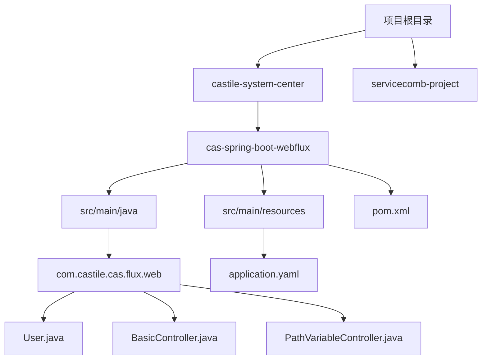
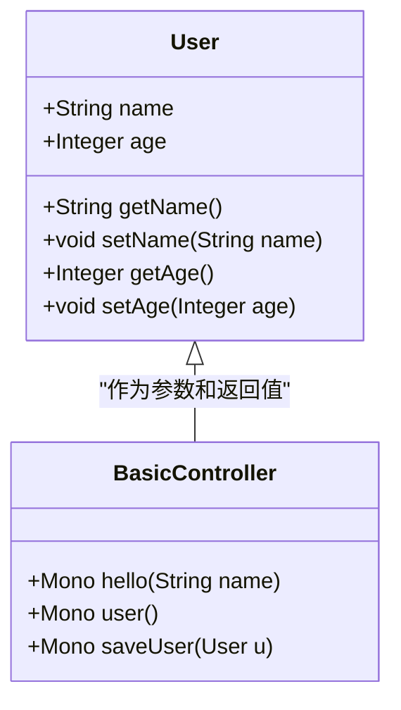
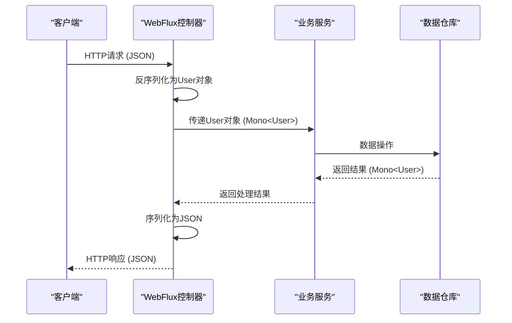
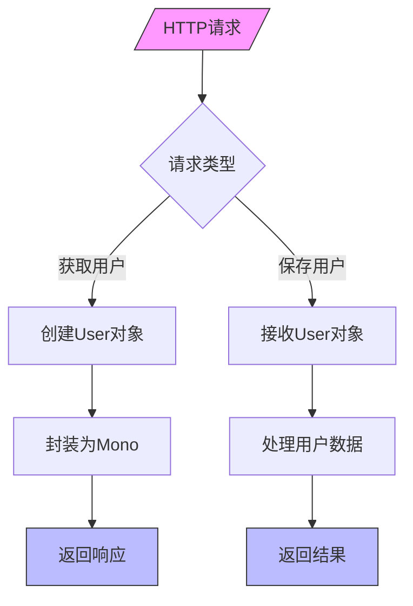
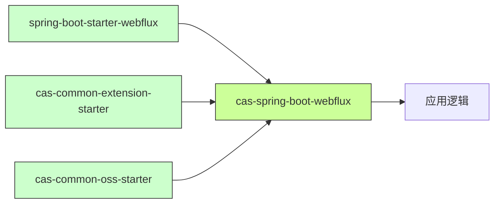

# 实体模型与数据流

<cite>
**本文档中引用的文件**  
- [User.java](file://castile-system-center/cas-spring-boot-webflux/src/main/java/com/castile/cas/flux/web/User.java)
- [BasicController.java](file://castile-system-center/cas-spring-boot-webflux/src/main/java/com/castile/cas/flux/web/BasicController.java)
- [PathVariableController.java](file://castile-system-center/cas-spring-boot-webflux/src/main/java/com/castile/cas/flux/web/PathVariableController.java)
- [TestReactor.java](file://castile-system-center/cas-spring-boot-webflux/src/test/java/com/castile/cas/reactor/TestReactor.java)
- [pom.xml](file://castile-system-center/cas-spring-boot-webflux/pom.xml)
- [CasSpriongBootDemoApplication.java](file://castile-system-center/cas-spring-boot-webflux/src/main/java/com/castile/cas/CasSpriongBootDemoApplication.java)
- [application.yaml](file://castile-system-center/cas-spring-boot-webflux/src/main/resources/application.yaml)
- [User.java](file://castile-system-center/cas-commons/src/test/java/com/castile/common/util/User.java)
- [User.java](file://servicecomb-project/cse-provider/src/main/java/com/castile/entity/User.java)
- [Validator.java](file://servicecomb-project/cse-provider/src/main/java/com/castile/samples/api/Validator.java)
- [JacksonUtils.java](file://castile-system-center/cas-commons/src/main/java/com/castile/common/util/JacksonUtils.java)
- [JacksonUtilsTest.java](file://castile-system-center/cas-commons/src/test/java/com/castile/common/util/JacksonUtilsTest.java)
</cite>

## 目录
1. [引言](#引言)
2. [项目结构](#项目结构)
3. [核心组件](#核心组件)
4. [架构概述](#架构概述)
5. [详细组件分析](#详细组件分析)
6. [依赖分析](#依赖分析)
7. [性能考虑](#性能考虑)
8. [故障排除指南](#故障排除指南)
9. [结论](#结论)

## 引言
本文档全面解析User实体类在响应式编程模型中的角色与设计原则。重点说明其作为响应式数据流载体的字段定义、序列化配置及验证注解使用规范。阐述该模型如何在WebFlux控制器间传递，并参与完整的响应式处理链。分析其与JSON序列化框架（如Jackson）的兼容性配置，确保在异步流中正确序列化与反序列化。提供该模型在Mono<User>和Flux<User>上下文中的使用示例，包括数据校验、转换和流式处理的最佳实践。讨论不可变对象设计对响应式编程的支持以及线程安全考量。

## 项目结构
本项目采用模块化设计，主要包含多个子模块，其中与响应式编程和User实体类相关的模块集中在`cas-spring-boot-webflux`模块中。该模块实现了基于Spring WebFlux的响应式Web应用，使用Reactor框架处理异步数据流。User实体类作为核心数据模型，在控制器之间传递并参与响应式处理链。



**图示来源**
- [User.java](file://castile-system-center/cas-spring-boot-webflux/src/main/java/com/castile/cas/flux/web/User.java)
- [BasicController.java](file://castile-system-center/cas-spring-boot-webflux/src/main/java/com/castile/cas/flux/web/BasicController.java)
- [application.yaml](file://castile-system-center/cas-spring-boot-webflux/src/main/resources/application.yaml)

**本节来源**
- [cas-spring-boot-webflux](file://castile-system-center/cas-spring-boot-webflux)

## 核心组件
User实体类在响应式编程模型中扮演着数据载体的关键角色。在`cas-spring-boot-webflux`模块中，User类被设计为简单的POJO，包含name和age两个字段，通过getter和setter方法提供访问。该类在WebFlux控制器中被用作响应式数据流的元素类型，能够在Mono和Flux上下文中进行传递和处理。

在响应式处理链中，User实体类通过Spring WebFlux的注解支持，能够自动进行JSON序列化和反序列化。当客户端发送包含User数据的HTTP请求时，Spring框架会自动将JSON数据反序列化为User对象；当服务端需要返回User数据时，框架会自动将User对象序列化为JSON格式的响应。



**本节来源**
- [User.java](file://castile-system-center/cas-spring-boot-webflux/src/main/java/com/castile/cas/flux/web/User.java)
- [BasicController.java](file://castile-system-center/cas-spring-boot-webflux/src/main/java/com/castile/cas/flux/web/BasicController.java)

## 架构概述
系统的响应式架构基于Spring WebFlux和Reactor框架构建。WebFlux提供非阻塞的Web层，Reactor提供响应式流的实现。User实体类作为数据模型，在整个响应式处理链中流动。

当HTTP请求到达时，WebFlux控制器接收请求并创建相应的Mono或Flux流。对于单个User对象的处理，使用Mono<User>类型；对于多个User对象的处理，使用Flux<User>类型。这些响应式流可以在不阻塞线程的情况下进行各种操作，如映射、过滤、合并等。



**图示来源**
- [BasicController.java](file://castile-system-center/cas-spring-boot-webflux/src/main/java/com/castile/cas/flux/web/BasicController.java)
- [User.java](file://castile-system-center/cas-spring-boot-webflux/src/main/java/com/castile/cas/flux/web/User.java)

## 详细组件分析

### User实体类分析
User实体类是响应式数据流中的核心数据模型。在`cas-spring-boot-webflux`模块中，User类被设计为简单的Java Bean，包含基本的字段和访问方法。这种设计使得它能够很好地与Spring的序列化机制集成。

```mermaid
classDiagram
class User {
-String name
-Integer age
+String getName()
+void setName(String name)
+Integer getAge()
+void setAge(Integer age)
}
note right of User
响应式编程中的数据载体
支持JSON序列化/反序列化
在Mono和Flux中作为元素类型
end note
```

**图示来源**
- [User.java](file://castile-system-center/cas-spring-boot-webflux/src/main/java/com/castile/cas/flux/web/User.java)

### WebFlux控制器分析
WebFlux控制器展示了User实体类在响应式编程中的实际应用。`BasicController`类中的方法演示了如何在响应式上下文中使用User对象。



**图示来源**
- [BasicController.java](file://castile-system-center/cas-spring-boot-webflux/src/main/java/com/castile/cas/flux/web/BasicController.java)

**本节来源**
- [BasicController.java](file://castile-system-center/cas-spring-boot-webflux/src/main/java/com/castile/cas/flux/web/BasicController.java)
- [User.java](file://castile-system-center/cas-spring-boot-webflux/src/main/java/com/castile/cas/flux/web/User.java)

## 依赖分析
项目依赖关系清晰，`cas-spring-boot-webflux`模块依赖于Spring Boot WebFlux核心库，提供了响应式Web编程的支持。同时，项目还包含了其他自定义的starter模块，如`cas-common-extension-starter`和`cas-common-oss-starter`，这些模块提供了额外的功能扩展。



**图示来源**
- [pom.xml](file://castile-system-center/cas-spring-boot-webflux/pom.xml)

**本节来源**
- [pom.xml](file://castile-system-center/cas-spring-boot-webflux/pom.xml)

## 性能考虑
在响应式编程模型中，User实体类的设计对性能有重要影响。由于响应式流是非阻塞的，合理的对象设计可以最大化并发处理能力。User类的简单POJO设计减少了序列化和反序列化的开销，提高了数据处理效率。

在高并发场景下，避免在User对象中包含大量复杂逻辑或状态，保持其作为纯粹的数据载体角色。这样可以确保在响应式流中快速传递和处理，减少内存占用和GC压力。

## 故障排除指南
当遇到User实体类在响应式流中处理异常时，可以按照以下步骤进行排查：

1. 检查JSON序列化配置是否正确
2. 验证字段命名是否符合序列化框架的约定
3. 确认响应式流的订阅和处理逻辑是否正确
4. 检查异常处理机制是否完善

**本节来源**
- [BasicController.java](file://castile-system-center/cas-spring-boot-webflux/src/main/java/com/castile/cas/flux/web/BasicController.java)
- [User.java](file://castile-system-center/cas-spring-boot-webflux/src/main/java/com/castile/cas/flux/web/User.java)

## 结论
User实体类在响应式编程模型中作为关键的数据载体，其设计直接影响系统的性能和可维护性。通过合理的字段定义、序列化配置和验证注解使用，可以确保User对象在WebFlux控制器间高效传递，并参与完整的响应式处理链。与JSON序列化框架的良好集成保证了在异步流中正确序列化与反序列化。在Mono<User>和Flux<User>上下文中的使用示例展示了数据校验、转换和流式处理的最佳实践。不可变对象设计和线程安全考量进一步增强了响应式编程的稳定性和可靠性。