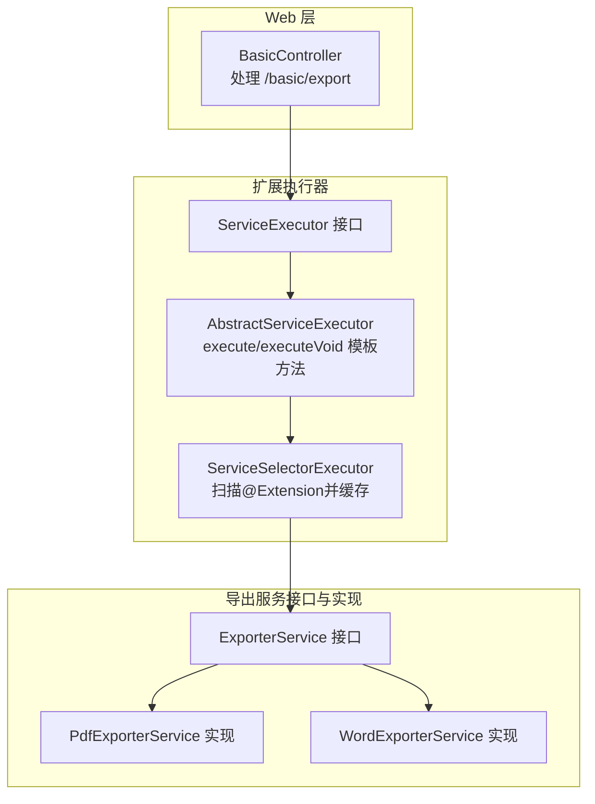
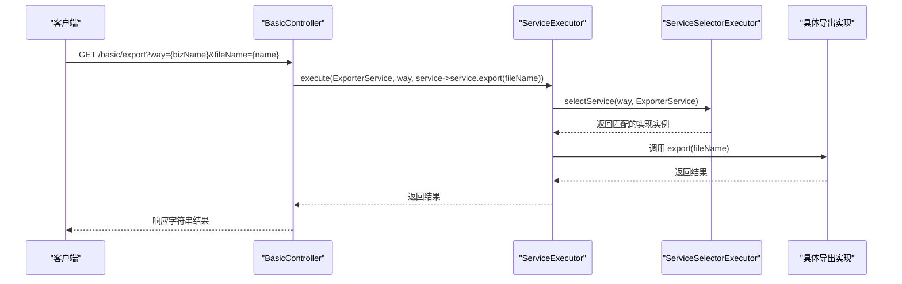
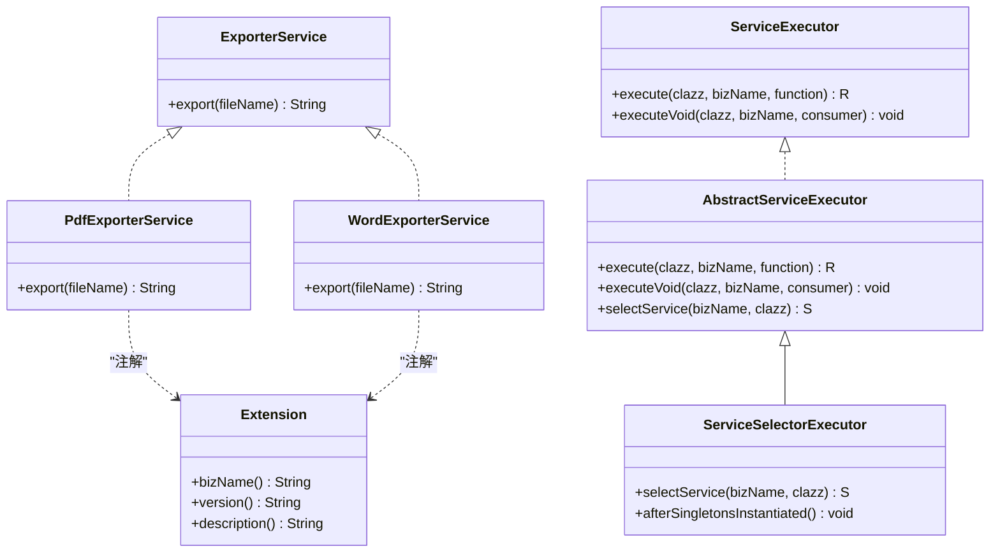

# 文档导出扩展服务

<cite>
**本文引用的文件列表**
- [ExporterService.java](file://castile-system-center/cas-spring-boot-webflux/src/main/java/com/castile/cas/flux/serevice/ExporterService.java)
- [PdfExporterService.java](file://castile-system-center/cas-spring-boot-webflux/src/main/java/com/castile/cas/flux/serevice/impl/PdfExporterService.java)
- [WordExporterService.java](file://castile-system-center/cas-spring-boot-webflux/src/main/java/com/castile/cas/flux/serevice/impl/WordExporterService.java)
- [BasicController.java](file://castile-system-center/cas-spring-boot-webflux/src/main/java/com/castile/cas/flux/web/BasicController.java)
- [ServiceExecutor.java](file://castile-system-center/cas-common-starters/cas-common-extension-starter/src/main/java/com/castile/common/extension/ServiceExecutor.java)
- [AbstractServiceExecutor.java](file://castile-system-center/cas-common-starters/cas-common-extension-starter/src/main/java/com/castile/common/extension/AbstractServiceExecutor.java)
- [ServiceSelectorExecutor.java](file://castile-system-center/cas-common-starters/cas-common-extension-starter/src/main/java/com/castile/common/extension/ServiceSelectorExecutor.java)
- [Extension.java](file://castile-system-center/cas-common-starters/cas-common-extension-starter/src/main/java/com/castile/common/extension/Extension.java)
- [CasCommonExtensionConfiguration.java](file://castile-system-center/cas-common-starters/cas-common-extension-starter/src/main/java/com/castile/common/extension/config/CasCommonExtensionConfiguration.java)
- [application.yaml](file://castile-system-center/cas-spring-boot-webflux/src/main/resources/application.yaml)
- [CasSpriongBootDemoApplication.java](file://castile-system-center/cas-spring-boot-webflux/src/main/java/com/castile/cas/CasSpriongBootDemoApplication.java)
</cite>

## 目录
1. [引言](#引言)
2. [项目结构](#项目结构)
3. [核心组件](#核心组件)
4. [架构总览](#架构总览)
5. [详细组件分析](#详细组件分析)
6. [依赖关系分析](#依赖关系分析)
7. [性能与可扩展性](#性能与可扩展性)
8. [故障排查指南](#故障排查指南)
9. [结论](#结论)

## 引言
本文件围绕“基于接口-实现模式”的文档导出服务展开，系统性解析以下主题：
- ExporterService 接口契约与在响应式流中的调用方式
- PdfExporterService 与 WordExporterService 的实现差异与职责边界
- 通过注解驱动与依赖注入实现的动态服务选择机制
- 如何扩展支持 Excel 等新格式导出
- 函数式编程思想在异步处理中的应用（以 Function 为核心）
- 服务调用链路跟踪、性能监控埋点建议
- 大文件导出的内存优化策略（分块写入与背压控制）

## 项目结构
该模块采用“接口-实现”与“扩展器”相结合的架构：
- 接口层：定义统一导出契约
- 实现层：按格式拆分具体导出实现
- 控制层：WebFlux 控制器负责接收请求并委托给扩展执行器
- 扩展执行器：基于注解扫描与业务名选择具体实现
- 配置层：启用自动装配与组件扫描

图表来源
- [BasicController.java](file://castile-system-center/cas-spring-boot-webflux/src/main/java/com/castile/cas/flux/web/BasicController.java#L35-L39)
- [ServiceExecutor.java](file://castile-system-center/cas-common-starters/cas-common-extension-starter/src/main/java/com/castile/common/extension/ServiceExecutor.java#L10-L32)
- [AbstractServiceExecutor.java](file://castile-system-center/cas-common-starters/cas-common-extension-starter/src/main/java/com/castile/common/extension/AbstractServiceExecutor.java#L10-L35)
- [ServiceSelectorExecutor.java](file://castile-system-center/cas-common-starters/cas-common-extension-starter/src/main/java/com/castile/common/extension/ServiceSelectorExecutor.java#L24-L60)
- [ExporterService.java](file://castile-system-center/cas-spring-boot-webflux/src/main/java/com/castile/cas/flux/serevice/ExporterService.java#L7-L10)
- [PdfExporterService.java](file://castile-system-center/cas-spring-boot-webflux/src/main/java/com/castile/cas/flux/serevice/impl/PdfExporterService.java#L11-L18)
- [WordExporterService.java](file://castile-system-center/cas-spring-boot-webflux/src/main/java/com/castile/cas/flux/serevice/impl/WordExporterService.java#L11-L18)

章节来源
- [application.yaml](file://castile-system-center/cas-spring-boot-webflux/src/main/resources/application.yaml#L1-L20)
- [CasSpriongBootDemoApplication.java](file://castile-system-center/cas-spring-boot-webflux/src/main/java/com/castile/cas/CasSpriongBootDemoApplication.java#L1-L14)

## 核心组件
- 导出接口 ExporterService：定义导出契约，当前为字符串返回值，便于演示。
- 具体实现 PdfExporterService 与 WordExporterService：分别通过注解标记业务名，用于扩展执行器按业务名选择。
- 扩展执行器 ServiceSelectorExecutor：扫描带有 @Extension 注解的 Bean，按 bizName 缓存并提供选择。
- 控制器 BasicController：接收请求参数（业务名与文件名），委托 ServiceExecutor 执行具体导出。

章节来源
- [ExporterService.java](file://castile-system-center/cas-spring-boot-webflux/src/main/java/com/castile/cas/flux/serevice/ExporterService.java#L7-L10)
- [PdfExporterService.java](file://castile-system-center/cas-spring-boot-webflux/src/main/java/com/castile/cas/flux/serevice/impl/PdfExporterService.java#L11-L18)
- [WordExporterService.java](file://castile-system-center/cas-spring-boot-webflux/src/main/java/com/castile/cas/flux/serevice/impl/WordExporterService.java#L11-L18)
- [ServiceSelectorExecutor.java](file://castile-system-center/cas-common-starters/cas-common-extension-starter/src/main/java/com/castile/common/extension/ServiceSelectorExecutor.java#L24-L60)
- [BasicController.java](file://castile-system-center/cas-spring-boot-webflux/src/main/java/com/castile/cas/flux/web/BasicController.java#L35-L39)

## 架构总览
下图展示了从 Web 请求到具体导出实现的完整调用链路，以及扩展执行器的内部工作流程。

图表来源
- [BasicController.java](file://castile-system-center/cas-spring-boot-webflux/src/main/java/com/castile/cas/flux/web/BasicController.java#L35-L39)
- [ServiceExecutor.java](file://castile-system-center/cas-common-starters/cas-common-extension-starter/src/main/java/com/castile/common/extension/ServiceExecutor.java#L10-L32)
- [AbstractServiceExecutor.java](file://castile-system-center/cas-common-starters/cas-common-extension-starter/src/main/java/com/castile/common/extension/AbstractServiceExecutor.java#L19-L25)
- [ServiceSelectorExecutor.java](file://castile-system-center/cas-common-starters/cas-common-extension-starter/src/main/java/com/castile/common/extension/ServiceSelectorExecutor.java#L29-L35)
- [PdfExporterService.java](file://castile-system-center/cas-spring-boot-webflux/src/main/java/com/castile/cas/flux/serevice/impl/PdfExporterService.java#L14-L17)
- [WordExporterService.java](file://castile-system-center/cas-spring-boot-webflux/src/main/java/com/castile/cas/flux/serevice/impl/WordExporterService.java#L14-L17)

## 详细组件分析

### 接口层：ExporterService
- 契约定义：提供单一导出方法，输入文件名，输出字符串结果。
- 设计意图：通过最小接口约束，便于后续扩展为返回字节数组或响应式流（见后续章节）。

章节来源
- [ExporterService.java](file://castile-system-center/cas-spring-boot-webflux/src/main/java/com/castile/cas/flux/serevice/ExporterService.java#L7-L10)

### 实现层：PdfExporterService 与 WordExporterService
- 注解绑定：两者均使用 @Extension 并设置 bizName，作为扩展执行器的选择键。
- 实现差异：当前实现仅返回拼接后的字符串，实际生产中可替换为具体的 PDF/Word 生成逻辑。
- 可扩展性：新增 Excel 等格式只需新增实现类并标注相同注解，即可被扩展执行器识别。

章节来源
- [PdfExporterService.java](file://castile-system-center/cas-spring-boot-webflux/src/main/java/com/castile/cas/flux/serevice/impl/PdfExporterService.java#L11-L18)
- [WordExporterService.java](file://castile-system-center/cas-spring-boot-webflux/src/main/java/com/castile/cas/flux/serevice/impl/WordExporterService.java#L11-L18)

### 扩展执行器：ServiceSelectorExecutor
- 初始化阶段：在单例初始化完成后扫描所有带 @Extension 的 Bean，提取 bizName 并缓存实例。
- 选择策略：根据业务名直接从缓存中取出对应实现。
- 错误处理：若未找到或重复注册，抛出明确异常，便于定位问题。

章节来源
- [ServiceSelectorExecutor.java](file://castile-system-center/cas-common-starters/cas-common-extension-starter/src/main/java/com/castile/common/extension/ServiceSelectorExecutor.java#L29-L53)
- [Extension.java](file://castile-system-center/cas-common-starters/cas-common-extension-starter/src/main/java/com/castile/common/extension/Extension.java#L11-L21)

### 抽象执行器：AbstractServiceExecutor
- 模板方法：execute/executeVoid 统一了“选择服务 + 调用”的流程，子类仅需实现 selectService。
- 函数式接口：execute 使用 Function，executeVoid 使用 Consumer，体现函数式编程思想。

章节来源
- [AbstractServiceExecutor.java](file://castile-system-center/cas-common-starters/cas-common-extension-starter/src/main/java/com/castile/common/extension/AbstractServiceExecutor.java#L10-L35)
- [ServiceExecutor.java](file://castile-system-center/cas-common-starters/cas-common-extension-starter/src/main/java/com/castile/common/extension/ServiceExecutor.java#L10-L32)

### 控制器：BasicController
- 路由与参数：接收 way（业务名）与 fileName（文件名）。
- 调用链路：通过 ServiceExecutor.execute 将导出任务委派给具体实现。
- 响应模型：当前返回 Mono<String>，便于演示；生产中可改为二进制流或分块流。

章节来源
- [BasicController.java](file://castile-system-center/cas-spring-boot-webflux/src/main/java/com/castile/cas/flux/web/BasicController.java#L35-L39)

### 类关系图

图表来源
- [ExporterService.java](file://castile-system-center/cas-spring-boot-webflux/src/main/java/com/castile/cas/flux/serevice/ExporterService.java#L7-L10)
- [PdfExporterService.java](file://castile-system-center/cas-spring-boot-webflux/src/main/java/com/castile/cas/flux/serevice/impl/PdfExporterService.java#L11-L18)
- [WordExporterService.java](file://castile-system-center/cas-spring-boot-webflux/src/main/java/com/castile/cas/flux/serevice/impl/WordExporterService.java#L11-L18)
- [ServiceExecutor.java](file://castile-system-center/cas-common-starters/cas-common-extension-starter/src/main/java/com/castile/common/extension/ServiceExecutor.java#L10-L32)
- [AbstractServiceExecutor.java](file://castile-system-center/cas-common-starters/cas-common-extension-starter/src/main/java/com/castile/common/extension/AbstractServiceExecutor.java#L10-L35)
- [ServiceSelectorExecutor.java](file://castile-system-center/cas-common-starters/cas-common-extension-starter/src/main/java/com/castile/common/extension/ServiceSelectorExecutor.java#L24-L60)
- [Extension.java](file://castile-system-center/cas-common-starters/cas-common-extension-starter/src/main/java/com/castile/common/extension/Extension.java#L11-L21)

## 依赖关系分析
- 控制器依赖 ServiceExecutor 接口，通过 Spring 容器注入具体实现（ServiceSelectorExecutor）。
- ServiceSelectorExecutor 依赖 Spring 上下文与注解元数据，完成 Bean 的扫描与缓存。
- 实现类通过 @Extension 注解与 bizName 进行绑定，确保扩展执行器能正确选择。

图表来源
- [BasicController.java](file://castile-system-center/cas-spring-boot-webflux/src/main/java/com/castile/cas/flux/web/BasicController.java#L32-L39)
- [ServiceExecutor.java](file://castile-system-center/cas-common-starters/cas-common-extension-starter/src/main/java/com/castile/common/extension/ServiceExecutor.java#L10-L32)
- [AbstractServiceExecutor.java](file://castile-system-center/cas-common-starters/cas-common-extension-starter/src/main/java/com/castile/common/extension/AbstractServiceExecutor.java#L10-L35)
- [ServiceSelectorExecutor.java](file://castile-system-center/cas-common-starters/cas-common-extension-starter/src/main/java/com/castile/common/extension/ServiceSelectorExecutor.java#L37-L53)
- [Extension.java](file://castile-system-center/cas-common-starters/cas-common-extension-starter/src/main/java/com/castile/common/extension/Extension.java#L11-L21)

章节来源
- [ServiceSelectorExecutor.java](file://castile-system-center/cas-common-starters/cas-common-extension-starter/src/main/java/com/castile/common/extension/ServiceSelectorExecutor.java#L37-L53)

## 性能与可扩展性

### 响应式流中的调用方式
- 当前控制器返回 Mono<String>，适合小体量文本结果。
- 若需要导出大文件，建议将导出逻辑迁移到响应式流中，例如返回 Flux<ByteBuffer> 或直接以 multipart 响应流式传输，避免一次性加载至内存。

章节来源
- [BasicController.java](file://castile-system-center/cas-spring-boot-webflux/src/main/java/com/castile/cas/flux/web/BasicController.java#L35-L39)

### 函数式编程与 Supplier<Mono<byte[]>> 的应用
- 现有执行器使用 Function<Service, R> 与 Consumer<Service>，已具备函数式风格。
- 若要提升异步灵活性，可在执行器层引入 Supplier<Mono<byte[]>> 形式的延迟计算，仅在订阅时触发生成，配合背压与分块策略，进一步降低峰值内存占用。

章节来源
- [ServiceExecutor.java](file://castile-system-center/cas-common-starters/cas-common-extension-starter/src/main/java/com/castile/common/extension/ServiceExecutor.java#L10-L32)
- [AbstractServiceExecutor.java](file://castile-system-center/cas-common-starters/cas-common-extension-starter/src/main/java/com/castile/common/extension/AbstractServiceExecutor.java#L19-L25)

### 大文件导出的内存优化策略
- 分块写入：将生成过程拆分为多个小块，边生成边输出，避免一次性持有完整字节缓冲。
- 背压控制：在响应式链路中利用下游的背压信号，限制上游生成速率，防止内存压力过大。
- 流式响应：优先采用 Flux<ByteBuffer> 或 multipart/form-data 流式响应，减少中间缓存。

### 服务扩展性设计（新增 Excel 导出）
- 新增实现类：实现 ExporterService 接口，并添加 @Extension 注解，bizName 与现有实现保持一致命名规范。
- 自动发现：ServiceSelectorExecutor 在初始化时扫描 @Extension 注解，无需额外注册代码。
- 业务路由：控制器通过 way 参数选择不同实现，无需修改控制器逻辑。

章节来源
- [PdfExporterService.java](file://castile-system-center/cas-spring-boot-webflux/src/main/java/com/castile/cas/flux/serevice/impl/PdfExporterService.java#L11-L18)
- [WordExporterService.java](file://castile-system-center/cas-spring-boot-webflux/src/main/java/com/castile/cas/flux/serevice/impl/WordExporterService.java#L11-L18)
- [ServiceSelectorExecutor.java](file://castile-system-center/cas-common-starters/cas-common-extension-starter/src/main/java/com/castile/common/extension/ServiceSelectorExecutor.java#L37-L53)

### 调用链路跟踪与性能监控埋点建议
- 链路追踪：在 ServiceSelectorExecutor 的 selectService 与具体实现的 export 方法处埋点，记录 bizName、实现类名、耗时与异常。
- 指标采集：统计各实现的调用次数、成功率、平均耗时，便于评估不同格式导出的性能表现。
- 日志分级：对异常与慢调用进行告警，结合业务名快速定位问题。

章节来源
- [ServiceSelectorExecutor.java](file://castile-system-center/cas-common-starters/cas-common-extension-starter/src/main/java/com/castile/common/extension/ServiceSelectorExecutor.java#L29-L35)
- [PdfExporterService.java](file://castile-system-center/cas-spring-boot-webflux/src/main/java/com/castile/cas/flux/serevice/impl/PdfExporterService.java#L14-L17)
- [WordExporterService.java](file://castile-system-center/cas-spring-boot-webflux/src/main/java/com/castile/cas/flux/serevice/impl/WordExporterService.java#L14-L17)

## 故障排查指南
- 未找到服务：当传入的 way 不存在时，扩展执行器会抛出非法状态异常，提示找不到对应服务。
- 重复注册：同一 bizName 注册多个实现会导致异常，需检查注解配置是否唯一。
- 类型代理：扩展执行器会处理 AOP 代理类，确保从用户类上读取注解元信息。

章节来源
- [ServiceSelectorExecutor.java](file://castile-system-center/cas-common-starters/cas-common-extension-starter/src/main/java/com/castile/common/extension/ServiceSelectorExecutor.java#L29-L53)

## 结论
该文档导出服务以“接口-实现+注解扩展”的方式实现了高内聚、低耦合的架构设计。通过 ServiceExecutor 的模板方法与 ServiceSelectorExecutor 的注解扫描，实现了按业务名动态选择具体实现的能力。当前示例以字符串返回为主，便于演示；在生产环境中，建议：
- 将导出逻辑迁移至响应式流，返回字节流或分块流
- 引入 Supplier<Mono<byte[]>> 等函数式接口，提升异步与惰性计算的灵活性
- 采用分块写入与背压控制，优化大文件导出的内存占用
- 通过埋点与指标体系完善可观测性，保障线上稳定性