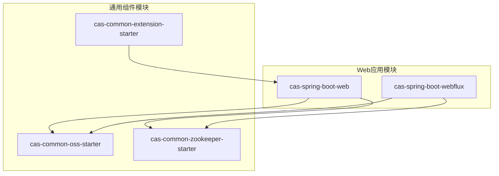
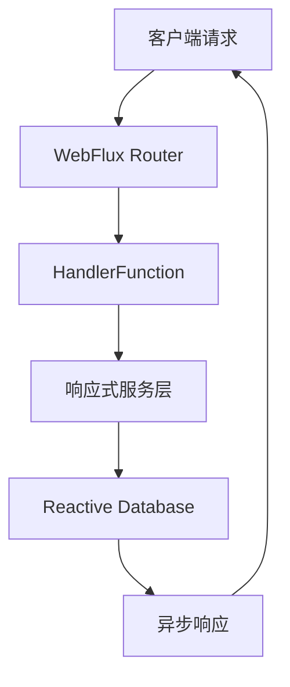
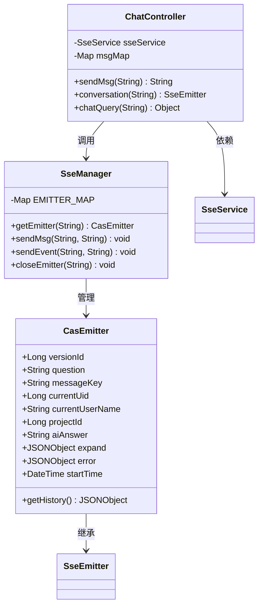
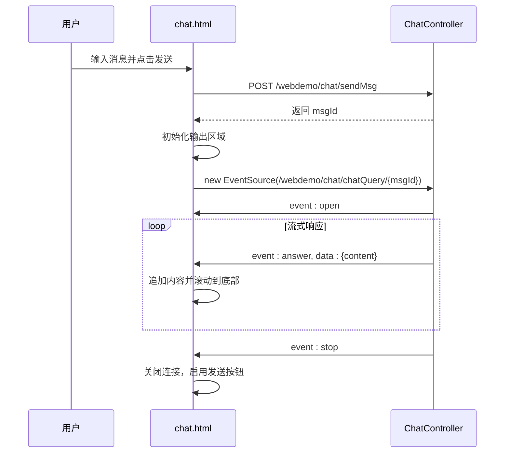

# Web应用示例

<cite>
**本文档中引用的文件**  
- [CasSpringBootWebApplication.java](file://castile-system-center/cas-spring-boot-web/src/main/java/com/castile/casspringbootweb/CasSpringBootWebApplication.java)
- [CasSpriongBootDemoApplication.java](file://castile-system-center/cas-spring-boot-webflux/src/main/java/com/castile/cas/CasSpriongBootDemoApplication.java)
- [ChatController.java](file://castile-system-center/cas-spring-boot-web/src/main/java/com/castile/casspringbootweb/demos/sse/ChatController.java)
- [SseManager.java](file://castile-system-center/cas-spring-boot-web/src/main/java/com/castile/casspringbootweb/demos/sse/cbb/SseManager.java)
- [SseService.java](file://castile-system-center/cas-spring-boot-web/src/main/java/com/castile/casspringbootweb/demos/sse/cbb/SseService.java)
- [CasEmitter.java](file://castile-system-center/cas-spring-boot-web/src/main/java/com/castile/casspringbootweb/demos/sse/cbb/CasEmitter.java)
- [chat.html](file://castile-system-center/cas-spring-boot-web/src/main/resources/static/chat.html)
- [application.yaml](file://castile-system-center/cas-spring-boot-web/src/main/resources/application.yaml)
- [application.yaml](file://castile-system-center/cas-spring-boot-webflux/src/main/resources/application.yaml)
- [BasicController.java](file://castile-system-center/cas-spring-boot-webflux/src/main/java/com/castile/cas/flux/web/BasicController.java)
- [MinioController.java](file://castile-system-center/cas-spring-boot-web/src/main/java/com/castile/casspringbootweb/demos/web/MinioController.java)
- [ZkController.java](file://castile-system-center/cas-spring-boot-web/src/main/java/com/castile/casspringbootweb/demos/zk/ZkController.java)
</cite>

## 目录
1. [简介](#简介)
2. [项目结构](#项目结构)
3. [基于Spring MVC的阻塞式Web应用](#基于spring-mvc的阻塞式web应用)
4. [基于Spring WebFlux的响应式Web应用](#基于spring-webflux的响应式web应用)
5. [SSE实现机制分析](#sse实现机制分析)
6. [MinIO文件上传功能](#minio文件上传功能)
7. [ZooKeeper配置监听](#zookeeper配置监听)
8. [启动与测试说明](#启动与测试说明)

## 简介
本文档全面介绍两个Spring Boot Web应用示例：基于传统Spring MVC的阻塞式应用 `CasSpringBootWebApplication` 和基于响应式编程模型的 `CasSpriongBootDemoApplication`。重点分析前者中Server-Sent Events（SSE）的实现机制，包括SseEmitter的管理、消息广播逻辑及前端交互设计；对比后者中WebFlux的函数式路由配置与响应式编程模型的应用。同时说明MinIO文件上传、ZooKeeper配置监听等功能的实现路径，并提供启动与测试指导。

## 项目结构
项目包含两个核心Web模块：`cas-spring-boot-web` 和 `cas-spring-boot-webflux`，分别代表阻塞式与响应式架构。此外还包括多个通用组件模块，如OSS、ZooKeeper等Starter组件。

**图示来源**
- [cas-spring-boot-web](file://castile-system-center/cas-spring-boot-web)
- [cas-spring-boot-webflux](file://castile-system-center/cas-spring-boot-webflux)
- [cas-common-oss-starter](file://castile-system-center/cas-common-starters/cas-common-oss-starter)
- [cas-common-zookeeper-starter](file://castile-system-center/cas-common-starters/cas-common-zookeeper-starter)

**本节来源**
- [project_structure](file://project_structure)

## 基于Spring MVC的阻塞式Web应用
该应用以 `CasSpringBootWebApplication` 为主入口，采用Spring MVC框架实现传统的同步阻塞式Web服务。通过 `@RestController` 注解暴露HTTP接口，支持SSE流式通信、MinIO文件上传和ZooKeeper配置监听。

### 应用入口
主类 `CasSpringBootWebApplication` 使用 `@SpringBootApplication` 注解启用自动配置，监听端口9101，上下文路径为 `/webdemo`。

**本节来源**
- [CasSpringBootWebApplication.java](file://castile-system-center/cas-spring-boot-web/src/main/java/com/castile/casspringbootweb/CasSpringBootWebApplication.java#L1-L14)
- [application.yaml](file://castile-system-center/cas-spring-boot-web/src/main/resources/application.yaml#L1-L33)

## 基于Spring WebFlux的响应式Web应用
该应用以 `CasSpriongBootDemoApplication` 为主入口，基于Spring WebFlux构建响应式非阻塞服务。其核心优势在于高并发下的资源利用率和响应性能。

### 函数式路由与响应式模型
`BasicController` 类展示了WebFlux的基本用法，支持响应式数据流处理。应用配置中通过 `spring.webflux.base-path` 设置基础路径 `/fluxdemo`，运行于端口9100。

**图示来源**
- [CasSpriongBootDemoApplication.java](file://castile-system-center/cas-spring-boot-webflux/src/main/java/com/castile/cas/CasSpriongBootDemoApplication.java#L1-L14)
- [BasicController.java](file://castile-system-center/cas-spring-boot-webflux/src/main/java/com/castile/cas/flux/web/BasicController.java)
- [application.yaml](file://castile-system-center/cas-spring-boot-webflux/src/main/resources/application.yaml#L1-L20)

**本节来源**
- [CasSpriongBootDemoApplication.java](file://castile-system-center/cas-spring-boot-webflux/src/main/java/com/castile/cas/CasSpriongBootDemoApplication.java#L1-L14)
- [application.yaml](file://castile-system-center/cas-spring-boot-webflux/src/main/resources/application.yaml#L1-L20)

## SSE实现机制分析
SSE（Server-Sent Events）用于实现服务器向客户端的单向实时消息推送。在 `CasSpringBootWebApplication` 中，通过 `SseEmitter` 实现流式响应。

### SseEmitter管理机制
`SseManager` 类负责管理所有活跃的 `CasEmitter` 实例（继承自 `SseEmitter`），使用 `ConcurrentHashMap` 存储以 `messageKey` 为键的连接会话，支持超时设置（默认30分钟）。

**图示来源**
- [CasEmitter.java](file://castile-system-center/cas-spring-boot-web/src/main/java/com/castile/casspringbootweb/demos/sse/cbb/CasEmitter.java#L1-L83)
- [SseManager.java](file://castile-system-center/cas-spring-boot-web/src/main/java/com/castile/casspringbootweb/demos/sse/cbb/SseManager.java#L1-L96)
- [ChatController.java](file://castile-system-center/cas-spring-boot-web/src/main/java/com/castile/casspringbootweb/demos/sse/ChatController.java#L1-L96)

### 消息广播逻辑
当客户端调用 `/chat/sendMsg` 发送消息后，服务端生成唯一 `msgId` 并创建对应的 `CasEmitter`。随后通过 `/chat/chatQuery/{msgId}` 建立SSE连接，异步调用 `SseService.chatTransfer()` 模拟流式响应，逐段发送数据事件（event: answer），最终发送 `stop` 事件关闭连接。

**本节来源**
- [SseService.java](file://castile-system-center/cas-spring-boot-web/src/main/java/com/castile/casspringbootweb/demos/sse/cbb/SseService.java#L1-L102)
- [SseManager.java](file://castile-system-center/cas-spring-boot-web/src/main/java/com/castile/casspringbootweb/demos/sse/cbb/SseManager.java#L57-L96)
- [ChatController.java](file://castile-system-center/cas-spring-boot-web/src/main/java/com/castile/casspringbootweb/demos/sse/ChatController.java#L77-L95)

### 前端HTML页面交互设计
`chat.html` 页面使用Vue.js和Element UI构建聊天界面，通过 `EventSource` 接收SSE流。用户输入消息后，先调用 `/chat/sendMsg` 获取 `msgId`，再建立 `/chat/chatQuery/{msgId}` 的SSE连接，动态更新输出区域并实现光标闪烁效果。

**图示来源**
- [chat.html](file://castile-system-center/cas-spring-boot-web/src/main/resources/static/chat.html#L1-L160)
- [ChatController.java](file://castile-system-center/cas-spring-boot-web/src/main/java/com/castile/casspringbootweb/demos/sse/ChatController.java#L38-L45)

**本节来源**
- [chat.html](file://castile-system-center/cas-spring-boot-web/src/main/resources/static/chat.html#L1-L160)

## MinIO文件上传功能
`MinioController` 提供文件上传接口 `/minio/upload`，接收多文件表单提交。该功能依赖 `cas-common-oss-starter` 模块中的 `OssClient` 实现与MinIO对象存储的交互。

**本节来源**
- [MinioController.java](file://castile-system-center/cas-spring-boot-web/src/main/java/com/castile/casspringbootweb/demos/web/MinioController.java)
- [cas-common-oss-starter](file://castile-system-center/cas-common-starters/cas-common-oss-starter)

## ZooKeeper配置监听
`ZkController` 提供ZooKeeper相关操作接口，`ZkConfigCacheListener` 实现配置变更监听。通过 `cas-common-zookeeper-starter` 自动装配 `CuratorZkClient`，实现配置的动态加载与通知。

**本节来源**
- [ZkController.java](file://castile-system-center/cas-spring-boot-web/src/main/java/com/castile/casspringbootweb/demos/zk/ZkController.java)
- [ZkConfigCacheListener.java](file://castile-system-center/cas-spring-boot-web/src/main/java/com/castile/casspringbootweb/demos/zk/ZkConfigCacheListener.java)
- [cas-common-zookeeper-starter](file://castile-system-center/cas-common-starters/cas-common-zookeeper-starter)

## 启动与测试说明
### 启动步骤
1. 构建项目：`mvn clean install`
2. 启动 `CasSpringBootWebApplication`：运行主类，服务监听 `http://localhost:9101/webdemo`
3. 启动 `CasSpriongBootDemoApplication`：运行主类，服务监听 `http://localhost:9100/fluxdemo`

### 功能测试
- **SSE聊天功能**：访问 `http://localhost:9101/webdemo/chat.html`，输入消息测试流式响应。
- **文件上传**：访问 `http://localhost:9101/webdemo/index.html`，选择文件并提交。
- **WebFlux接口**：访问 `http://localhost:9100/fluxdemo/hello` 验证响应式服务。

**本节来源**
- [CasSpringBootWebApplication.java](file://castile-system-center/cas-spring-boot-web/src/main/java/com/castile/casspringbootweb/CasSpringBootWebApplication.java#L1-L14)
- [CasSpriongBootDemoApplication.java](file://castile-system-center/cas-spring-boot-webflux/src/main/java/com/castile/cas/CasSpriongBootDemoApplication.java#L1-L14)
- [chat.html](file://castile-system-center/cas-spring-boot-web/src/main/resources/static/chat.html)
- [index.html](file://castile-system-center/cas-spring-boot-web/src/main/resources/static/index.html)