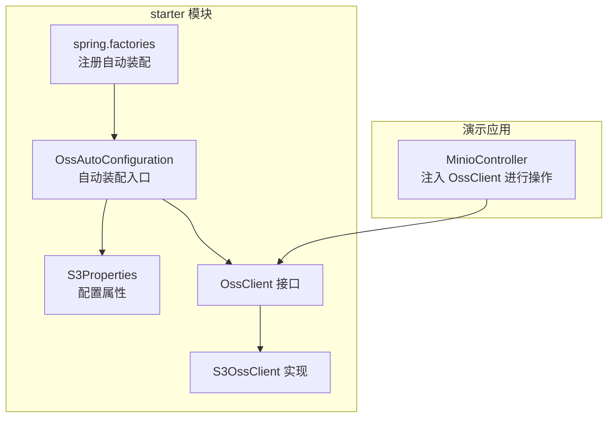
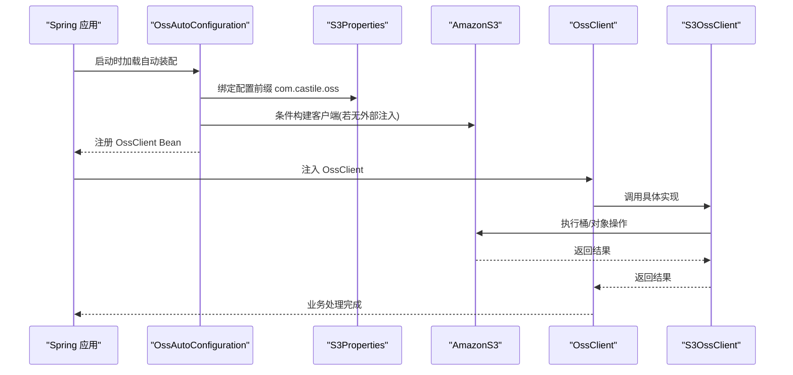
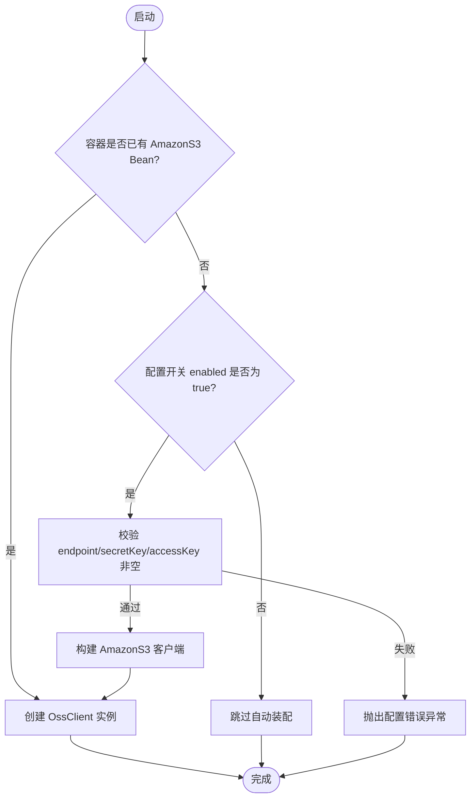
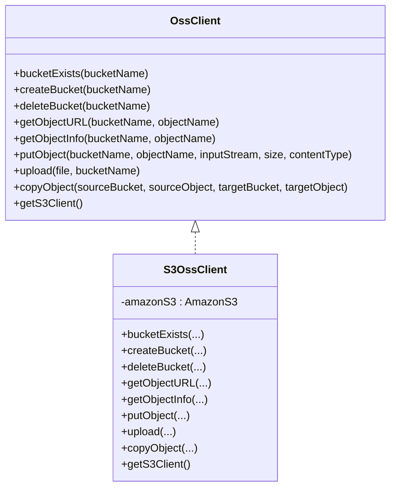
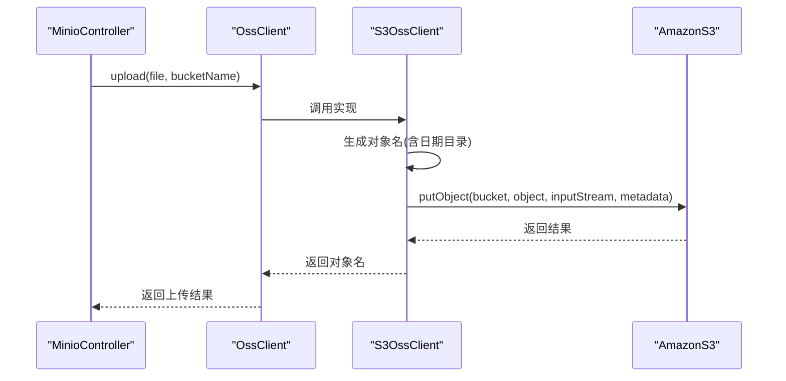
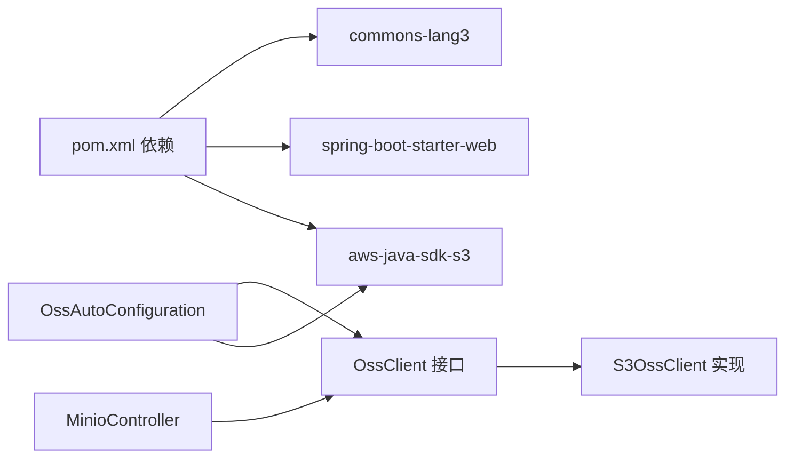

# OSS对象存储集成

<cite>
**本文引用的文件列表**
- [OssAutoConfiguration.java](file://castile-system-center/cas-common-starters/cas-common-oss-starter/src/main/java/com/castile/common/oss/config/OssAutoConfiguration.java)
- [S3Properties.java](file://castile-system-center/cas-common-starters/cas-common-oss-starter/src/main/java/com/castile/common/oss/config/S3Properties.java)
- [OssClient.java](file://castile-system-center/cas-common-starters/cas-common-oss-starter/src/main/java/com/castile/common/oss/client/OssClient.java)
- [S3OssClient.java](file://castile-system-center/cas-common-starters/cas-common-oss-starter/src/main/java/com/castile/common/oss/client/S3OssClient.java)
- [spring.factories](file://castile-system-center/cas-common-starters/cas-common-oss-starter/src/main/resources/META-INF/spring.factories)
- [MinioController.java](file://castile-system-center/cas-spring-boot-web/src/main/java/com/castile/casspringbootweb/demos/web/MinioController.java)
- [pom.xml](file://castile-system-center/cas-common-starters/cas-common-oss-starter/pom.xml)
</cite>

## 目录
1. [简介](#简介)
2. [项目结构](#项目结构)
3. [核心组件](#核心组件)
4. [架构总览](#架构总览)
5. [详细组件分析](#详细组件分析)
6. [依赖关系分析](#依赖关系分析)
7. [性能考量](#性能考量)
8. [故障排查指南](#故障排查指南)
9. [结论](#结论)
10. [附录：配置与使用示例](#附录配置与使用示例)

## 简介
本文件系统性解析了基于 Spring Boot 的 OSS 对象存储集成模块，重点说明：
- 自动装配机制：OssAutoConfiguration 如何根据 S3Properties 配置自动创建 AmazonS3 客户端，并暴露 OssClient 接口供业务使用。
- 抽象设计：OssClient 接口如何抽象出桶与对象的基本操作，便于适配不同云厂商的 S3 兼容存储。
- 配置参数：S3Properties 中各字段的语义与用法，涵盖 endpoint、region、accessKey、secretKey、pathStyleAccess 等。
- 核心操作封装：以 S3OssClient 实现为例，展示上传、下载、删除、拷贝等常用操作的封装逻辑。
- 安全与性能：凭证管理策略与连接池相关建议；在图片、文档等静态资源管理中的典型场景。

## 项目结构
该集成模块位于公共 starter 工程中，包含配置类、属性类、客户端接口与实现，以及一个最小可用的演示控制器。

图表来源
- [OssAutoConfiguration.java](file://castile-system-center/cas-common-starters/cas-common-oss-starter/src/main/java/com/castile/common/oss/config/OssAutoConfiguration.java#L1-L62)
- [S3Properties.java](file://castile-system-center/cas-common-starters/cas-common-oss-starter/src/main/java/com/castile/common/oss/config/S3Properties.java#L1-L67)
- [OssClient.java](file://castile-system-center/cas-common-starters/cas-common-oss-starter/src/main/java/com/castile/common/oss/client/OssClient.java#L1-L71)
- [S3OssClient.java](file://castile-system-center/cas-common-starters/cas-common-oss-starter/src/main/java/com/castile/common/oss/client/S3OssClient.java#L1-L95)
- [spring.factories](file://castile-system-center/cas-common-starters/cas-common-oss-starter/src/main/resources/META-INF/spring.factories#L1-L3)
- [MinioController.java](file://castile-system-center/cas-spring-boot-web/src/main/java/com/castile/casspringbootweb/demos/web/MinioController.java#L1-L64)

章节来源
- [OssAutoConfiguration.java](file://castile-system-center/cas-common-starters/cas-common-oss-starter/src/main/java/com/castile/common/oss/config/OssAutoConfiguration.java#L1-L62)
- [spring.factories](file://castile-system-center/cas-common-starters/cas-common-oss-starter/src/main/resources/META-INF/spring.factories#L1-L3)

## 核心组件
- 自动装配入口：OssAutoConfiguration 负责在 Spring 容器中注册 AmazonS3 和 OssClient Bean。当容器中已存在 AmazonS3 Bean 时优先复用；否则在满足开关条件时，依据 S3Properties 构建客户端。
- 配置属性：S3Properties 提供访问密钥、区域、端点、路径风格访问等关键参数，默认启用且支持路径风格访问。
- 客户端接口：OssClient 抽象了桶生命周期管理、对象 URL 获取、对象信息获取、上传、拷贝等通用能力。
- 客户端实现：S3OssClient 基于 AWS SDK v1 的 AmazonS3 实现上述接口，封装了桶存在性判断、创建、删除、对象上传、拷贝等操作。

章节来源
- [OssAutoConfiguration.java](file://castile-system-center/cas-common-starters/cas-common-oss-starter/src/main/java/com/castile/common/oss/config/OssAutoConfiguration.java#L1-L62)
- [S3Properties.java](file://castile-system-center/cas-common-starters/cas-common-oss-starter/src/main/java/com/castile/common/oss/config/S3Properties.java#L1-L67)
- [OssClient.java](file://castile-system-center/cas-common-starters/cas-common-oss-starter/src/main/java/com/castile/common/oss/client/OssClient.java#L1-L71)
- [S3OssClient.java](file://castile-system-center/cas-common-starters/cas-common-oss-starter/src/main/java/com/castile/common/oss/client/S3OssClient.java#L1-L95)

## 架构总览
下图展示了从配置到运行时调用的关键流程，包括自动装配、Bean 注入与典型操作链路。

图表来源
- [OssAutoConfiguration.java](file://castile-system-center/cas-common-starters/cas-common-oss-starter/src/main/java/com/castile/common/oss/config/OssAutoConfiguration.java#L1-L62)
- [S3Properties.java](file://castile-system-center/cas-common-starters/cas-common-oss-starter/src/main/java/com/castile/common/oss/config/S3Properties.java#L1-L67)
- [OssClient.java](file://castile-system-center/cas-common-starters/cas-common-oss-starter/src/main/java/com/castile/common/oss/client/OssClient.java#L1-L71)
- [S3OssClient.java](file://castile-system-center/cas-common-starters/cas-common-oss-starter/src/main/java/com/castile/common/oss/client/S3OssClient.java#L1-L95)

## 详细组件分析

### 自动装配与条件 Bean
- 当容器中已存在 AmazonS3 Bean 时，直接注入并创建 OssClient 实例，优先复用外部提供的客户端。
- 当未检测到 AmazonS3 Bean 且配置开关开启时，读取 S3Properties 并构建 AmazonS3 客户端，设置端点、区域、凭据与路径风格访问等参数。
- 在构建过程中对关键配置项进行非空校验，缺失将抛出异常，避免静默失败。

图表来源
- [OssAutoConfiguration.java](file://castile-system-center/cas-common-starters/cas-common-oss-starter/src/main/java/com/castile/common/oss/config/OssAutoConfiguration.java#L1-L62)

章节来源
- [OssAutoConfiguration.java](file://castile-system-center/cas-common-starters/cas-common-oss-starter/src/main/java/com/castile/common/oss/config/OssAutoConfiguration.java#L1-L62)

### 配置属性 S3Properties
- enabled：控制是否启用自动装配与客户端构建，默认开启。
- accessKey/secretKey：访问凭证，用于签名请求。
- region：服务区域，影响端点解析与签名行为。
- endpoint：S3 兼容服务端点，可指向 MinIO、自建 S3 或公有云兼容端点。
- pathStyleAccess：是否启用路径风格访问，常用于兼容某些服务端点或本地开发环境。

章节来源
- [S3Properties.java](file://castile-system-center/cas-common-starters/cas-common-oss-starter/src/main/java/com/castile/common/oss/config/S3Properties.java#L1-L67)

### 客户端接口 OssClient
- 桶管理：bucketExists、createBucket、deleteBucket。
- 对象管理：getObjectURL、getObjectInfo、putObject、upload、copyObject。
- 辅助：getS3Client，便于直接使用底层 AmazonS3 能力。

章节来源
- [OssClient.java](file://castile-system-center/cas-common-starters/cas-common-oss-starter/src/main/java/com/castile/common/oss/client/OssClient.java#L1-L71)

### 客户端实现 S3OssClient
- 桶操作：基于 V2 存在性判断、创建与删除。
- 对象操作：生成对象 URL、获取对象信息、上传输入流、上传 MultipartFile、拷贝对象。
- 上传策略：对 MultipartFile 生成唯一对象名并按日期组织目录，便于归档与检索。

图表来源
- [OssClient.java](file://castile-system-center/cas-common-starters/cas-common-oss-starter/src/main/java/com/castile/common/oss/client/OssClient.java#L1-L71)
- [S3OssClient.java](file://castile-system-center/cas-common-starters/cas-common-oss-starter/src/main/java/com/castile/common/oss/client/S3OssClient.java#L1-L95)

章节来源
- [S3OssClient.java](file://castile-system-center/cas-common-starters/cas-common-oss-starter/src/main/java/com/castile/common/oss/client/S3OssClient.java#L1-L95)

### 典型操作封装流程
以下序列图展示上传流程从控制器到客户端再到底层 SDK 的调用链。

图表来源
- [MinioController.java](file://castile-system-center/cas-spring-boot-web/src/main/java/com/castile/casspringbootweb/demos/web/MinioController.java#L1-L64)
- [OssClient.java](file://castile-system-center/cas-common-starters/cas-common-oss-starter/src/main/java/com/castile/common/oss/client/OssClient.java#L1-L71)
- [S3OssClient.java](file://castile-system-center/cas-common-starters/cas-common-oss-starter/src/main/java/com/castile/common/oss/client/S3OssClient.java#L1-L95)

## 依赖关系分析
- 自动装配注册：通过 spring.factories 将 OssAutoConfiguration 注册为 EnableAutoConfiguration，实现零样板代码接入。
- 依赖 SDK：依赖 AWS SDK v1 的 S3 客户端，提供桶与对象操作能力。
- 示例应用：演示控制器通过 @Autowired 注入 OssClient，验证自动装配与基本操作。

图表来源
- [pom.xml](file://castile-system-center/cas-common-starters/cas-common-oss-starter/pom.xml#L1-L64)
- [OssAutoConfiguration.java](file://castile-system-center/cas-common-starters/cas-common-oss-starter/src/main/java/com/castile/common/oss/config/OssAutoConfiguration.java#L1-L62)
- [OssClient.java](file://castile-system-center/cas-common-starters/cas-common-oss-starter/src/main/java/com/castile/common/oss/client/OssClient.java#L1-L71)
- [S3OssClient.java](file://castile-system-center/cas-common-starters/cas-common-oss-starter/src/main/java/com/castile/common/oss/client/S3OssClient.java#L1-L95)
- [MinioController.java](file://castile-system-center/cas-spring-boot-web/src/main/java/com/castile/casspringbootweb/demos/web/MinioController.java#L1-L64)

章节来源
- [pom.xml](file://castile-system-center/cas-common-starters/cas-common-oss-starter/pom.xml#L1-L64)
- [spring.factories](file://castile-system-center/cas-common-starters/cas-common-oss-starter/src/main/resources/META-INF/spring.factories#L1-L3)

## 性能考量
- 连接池与线程模型：当前实现基于 AWS SDK v1 的 AmazonS3Client 默认配置。若需提升吞吐，可在应用侧引入连接池与线程池策略，或在更高层通过网关/代理优化并发。
- 传输编码：自动装配中禁用了分块编码，有助于减少中间层拆包开销，但需确保上游网络与服务端兼容。
- 上传读限制：实现中对上传流设置了读取上限，避免超大文件导致内存压力，建议结合断点续传或分片上传策略。
- 路径风格访问：默认启用路径风格访问，便于兼容部分服务端点，但在高并发场景下可能影响路由效率，可根据实际部署评估关闭。

章节来源
- [OssAutoConfiguration.java](file://castile-system-center/cas-common-starters/cas-common-oss-starter/src/main/java/com/castile/common/oss/config/OssAutoConfiguration.java#L1-L62)
- [S3OssClient.java](file://castile-system-center/cas-common-starters/cas-common-oss-starter/src/main/java/com/castile/common/oss/client/S3OssClient.java#L1-L95)

## 故障排查指南
- 配置错误：当 endpoint、secretKey、accessKey 任一为空时，自动装配会抛出异常提示，请检查配置前缀 com.castile.oss 下的参数是否正确填写。
- 凭证问题：确认 accessKey/secretKey 有效且具备目标桶的操作权限；若使用临时凭证，需确保有效期与刷新策略。
- 端点与区域：确保 endpoint 与 region 匹配目标服务端点；路径风格访问与服务端点兼容性需测试验证。
- 上传异常：MultipartFile 为空或无法读取时会触发异常；检查文件大小限制与磁盘空间。

章节来源
- [OssAutoConfiguration.java](file://castile-system-center/cas-common-starters/cas-common-oss-starter/src/main/java/com/castile/common/oss/config/OssAutoConfiguration.java#L1-L62)
- [S3OssClient.java](file://castile-system-center/cas-common-starters/cas-common-oss-starter/src/main/java/com/castile/common/oss/client/S3OssClient.java#L1-L95)

## 结论
该集成模块通过简洁的自动装配与抽象接口，实现了对 S3 兼容对象存储的统一接入。OssClient 将桶与对象操作抽象化，S3OssClient 则基于 AWS SDK v1 提供稳定实现。配合合理的配置与安全策略，可广泛应用于图片、文档等静态资源管理场景。

## 附录：配置与使用示例
- 配置前缀：com.castile.oss
- 关键参数：
  - enabled：是否启用自动装配
  - accessKey/secretKey：访问凭证
  - region：区域
  - endpoint：S3 兼容端点
  - pathStyleAccess：是否启用路径风格访问
- 注入与使用：在业务控制器中注入 OssClient，即可调用 bucketExists、createBucket、upload、copyObject 等方法完成对象存储操作。

章节来源
- [S3Properties.java](file://castile-system-center/cas-common-starters/cas-common-oss-starter/src/main/java/com/castile/common/oss/config/S3Properties.java#L1-L67)
- [MinioController.java](file://castile-system-center/cas-spring-boot-web/src/main/java/com/castile/casspringbootweb/demos/web/MinioController.java#L1-L64)