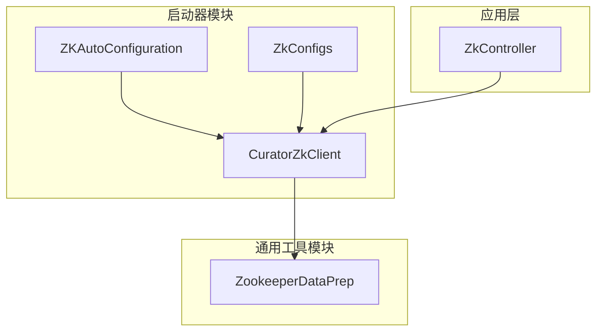
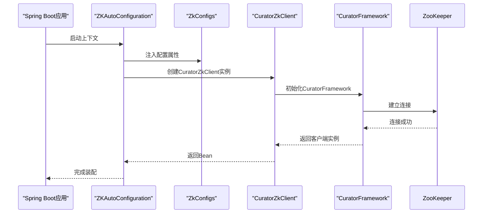
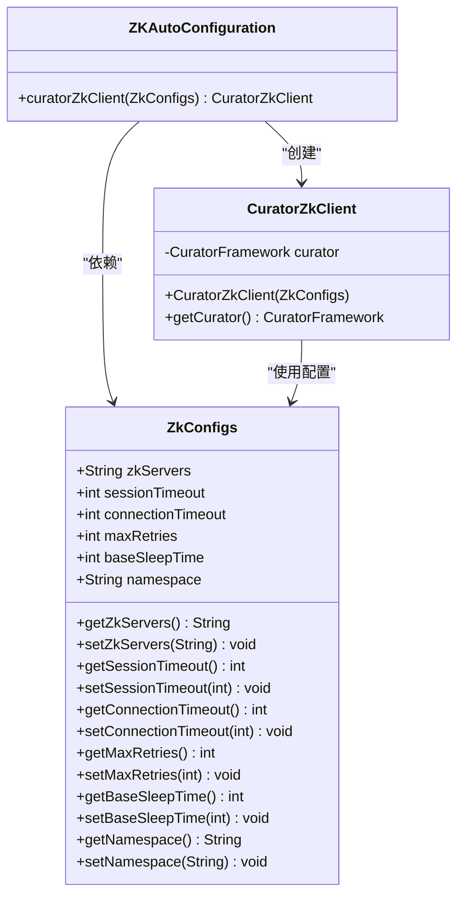
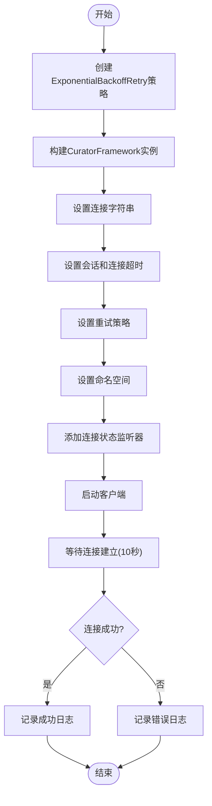

# ZooKeeper服务协调集成

<cite>
**本文档引用的文件**  
- [ZKAutoConfiguration.java](file://castile-system-center/cas-common-starters/cas-common-zookeeper-starter/src/main/java/com/castile/common/zk/config/ZKAutoConfiguration.java)
- [ZkConfigs.java](file://castile-system-center/cas-common-starters/cas-common-zookeeper-starter/src/main/java/com/castile/common/zk/config/ZkConfigs.java)
- [CuratorZkClient.java](file://castile-system-center/cas-common-starters/cas-common-zookeeper-starter/src/main/java/com/castile/common/zk/client/CuratorZkClient.java)
- [ZookeeperDataPrep.java](file://castile-system-center/cas-commons/src/main/java/com/castile/common/zk/ZookeeperDataPrep.java)
- [ZkController.java](file://castile-system-center/cas-spring-boot-web/src/main/java/com/castile/casspringbootweb/demos/zk/ZkController.java)
</cite>

## 目录
1. [引言](#引言)
2. [项目结构](#项目结构)
3. [核心组件](#核心组件)
4. [架构概述](#架构概述)
5. [详细组件分析](#详细组件分析)
6. [依赖分析](#依赖分析)
7. [性能与连接管理](#性能与连接管理)
8. [数据初始化实践](#数据初始化实践)
9. [使用示例与应用场景](#使用示例与应用场景)
10. [结论](#结论)

## 引言
本文档系统阐述了ZooKeeper集成模块的设计与实现，重点解析了基于Spring Boot的自动配置机制如何完成Curator客户端的初始化与装配。该模块通过封装Curator框架，为分布式系统提供稳定可靠的ZooKeeper访问能力，支持配置中心、服务注册、分布式锁等关键场景。

## 项目结构
ZooKeeper集成模块采用分层设计，核心功能分布在两个主要模块中：`cas-common-zookeeper-starter` 提供自动配置和客户端封装，`cas-commons` 提供通用工具类。这种设计实现了功能解耦与复用。



**图示来源**  
- [ZKAutoConfiguration.java](file://castile-system-center/cas-common-starters/cas-common-zookeeper-starter/src/main/java/com/castile/common/zk/config/ZKAutoConfiguration.java)
- [CuratorZkClient.java](file://castile-system-center/cas-common-starters/cas-common-zookeeper-starter/src/main/java/com/castile/common/zk/client/CuratorZkClient.java)
- [ZookeeperDataPrep.java](file://castile-system-center/cas-commons/src/main/java/com/castile/common/zk/ZookeeperDataPrep.java)

**本节来源**  
- [cas-common-zookeeper-starter](file://castile-system-center/cas-common-starters/cas-common-zookeeper-starter/)
- [cas-commons](file://castile-system-center/cas-commons/)

## 核心组件
本模块的核心组件包括配置类`ZkConfigs`、自动配置类`ZKAutoConfiguration`、客户端封装类`CuratorZkClient`以及数据准备工具`ZookeeperDataPrep`。这些组件协同工作，实现了ZooKeeper客户端的自动化装配与简化操作。

**本节来源**  
- [ZKAutoConfiguration.java](file://castile-system-center/cas-common-starters/cas-common-zookeeper-starter/src/main/java/com/castile/common/zk/config/ZKAutoConfiguration.java)
- [ZkConfigs.java](file://castile-system-center/cas-common-starters/cas-common-zookeeper-starter/src/main/java/com/castile/common/zk/config/ZkConfigs.java)
- [CuratorZkClient.java](file://castile-system-center/cas-common-starters/cas-common-zookeeper-starter/src/main/java/com/castile/common/zk/client/CuratorZkClient.java)
- [ZookeeperDataPrep.java](file://castile-system-center/cas-commons/src/main/java/com/castile/common/zk/ZookeeperDataPrep.java)

## 架构概述
该集成模块基于Spring Boot的自动配置原理，通过`@EnableConfigurationProperties`和`@ConditionalOnProperty`实现条件化装配。`ZkConfigs`承载配置属性，`ZKAutoConfiguration`负责创建`CuratorZkClient` Bean，最终由`CuratorZkClient`封装CuratorFramework实例，提供线程安全的ZooKeeper操作接口。



**图示来源**  
- [ZKAutoConfiguration.java](file://castile-system-center/cas-common-starters/cas-common-zookeeper-starter/src/main/java/com/castile/common/zk/config/ZKAutoConfiguration.java)
- [CuratorZkClient.java](file://castile-system-center/cas-common-starters/cas-common-zookeeper-starter/src/main/java/com/castile/common/zk/client/CuratorZkClient.java)

## 详细组件分析

### ZKAutoConfiguration分析
`ZKAutoConfiguration`是Spring Boot自动配置的核心类，它通过`@Configuration`声明为配置类，并使用`@EnableConfigurationProperties`启用`ZkConfigs`配置绑定。当配置项`com.castile.zk.enabled`为`true`时，才会创建`CuratorZkClient` Bean。



**图示来源**  
- [ZKAutoConfiguration.java](file://castile-system-center/cas-common-starters/cas-common-zookeeper-starter/src/main/java/com/castile/common/zk/config/ZKAutoConfiguration.java#L13-L23)
- [ZkConfigs.java](file://castile-system-center/cas-common-starters/cas-common-zookeeper-starter/src/main/java/com/castile/common/zk/config/ZkConfigs.java#L12-L69)

**本节来源**  
- [ZKAutoConfiguration.java](file://castile-system-center/cas-common-starters/cas-common-zookeeper-starter/src/main/java/com/castile/common/zk/config/ZKAutoConfiguration.java)
- [ZkConfigs.java](file://castile-system-center/cas-common-starters/cas-common-zookeeper-starter/src/main/java/com/castile/common/zk/config/ZkConfigs.java)

### CuratorZkClient分析
`CuratorZkClient`是对CuratorFramework的封装，确保了线程安全性和连接管理。它在构造函数中完成Curator客户端的初始化，并通过`start()`方法启动连接，使用`blockUntilConnected()`确保连接建立成功。

#### 初始化流程


**图示来源**  
- [CuratorZkClient.java](file://castile-system-center/cas-common-starters/cas-common-zookeeper-starter/src/main/java/com/castile/common/zk/client/CuratorZkClient.java#L27-L62)

**本节来源**  
- [CuratorZkClient.java](file://castile-system-center/cas-common-starters/cas-common-zookeeper-starter/src/main/java/com/castile/common/zk/client/CuratorZkClient.java)

## 依赖分析
该模块依赖Spring Boot的自动配置机制和Curator框架，通过starter方式集成到应用中。其依赖关系清晰，实现了配置与实现的分离。

```mermaid
graph TD
SpringBoot["Spring Boot"]
AutoConfig["ZKAutoConfiguration"]
Configs["ZkConfigs"]
Client["CuratorZkClient"]
Curator["CuratorFramework"]
Zookeeper["ZooKeeper Server"]
SpringBoot --> AutoConfig
AutoConfig --> Configs
AutoConfig --> Client
Client --> Curator
Curator --> Zookeeper
Configs -.-> AutoConfig : "配置注入"
Client -.-> Configs : "读取配置"
```

**图示来源**  
- [ZKAutoConfiguration.java](file://castile-system-center/cas-common-starters/cas-common-zookeeper-starter/src/main/java/com/castile/common/zk/config/ZKAutoConfiguration.java)
- [CuratorZkClient.java](file://castile-system-center/cas-common-starters/cas-common-zookeeper-starter/src/main/java/com/castile/common/zk/client/CuratorZkClient.java)

**本节来源**  
- [ZKAutoConfiguration.java](file://castile-system-center/cas-common-starters/cas-common-zookeeper-starter/src/main/java/com/castile/common/zk/config/ZKAutoConfiguration.java)
- [CuratorZkClient.java](file://castile-system-center/cas-common-starters/cas-common-zookeeper-starter/src/main/java/com/castile/common/zk/client/CuratorZkClient.java)

## 性能与连接管理
`CuratorZkClient`通过ExponentialBackoffRetry实现指数退避重试策略，有效应对网络抖动。连接状态监听器监控`CONNECTED`、`LOST`、`RECONNECTED`等状态，确保应用能及时感知连接变化。`blockUntilConnected()`方法保证客户端在完全连接前不会被使用，提高了系统的健壮性。

**本节来源**  
- [CuratorZkClient.java](file://castile-system-center/cas-common-starters/cas-common-zookeeper-starter/src/main/java/com/castile/common/zk/client/CuratorZkClient.java#L28-L58)

## 数据初始化实践
`ZookeeperDataPrep`工具类提供了ZooKeeper数据初始化的最佳实践，可在应用启动时预创建必要的节点结构，确保分布式系统的一致性起点。

**本节来源**  
- [ZookeeperDataPrep.java](file://castile-system-center/cas-commons/src/main/java/com/castile/common/zk/ZookeeperDataPrep.java)

## 使用示例与应用场景
该集成模块可广泛应用于微服务架构中，如实现配置中心（通过监听节点变化）、分布式锁（通过创建临时顺序节点）、服务注册与发现（通过注册服务节点）等。`ZkController`展示了基本的节点创建与更新操作。

**本节来源**  
- [ZkController.java](file://castile-system-center/cas-spring-boot-web/src/main/java/com/castile/casspringbootweb/demos/zk/ZkController.java)

## 结论
该ZooKeeper集成模块设计合理，通过Spring Boot自动配置简化了Curator客户端的使用，封装了连接管理与重试逻辑，提供了线程安全的操作接口。结合数据初始化工具，为构建稳定的分布式系统提供了坚实基础。