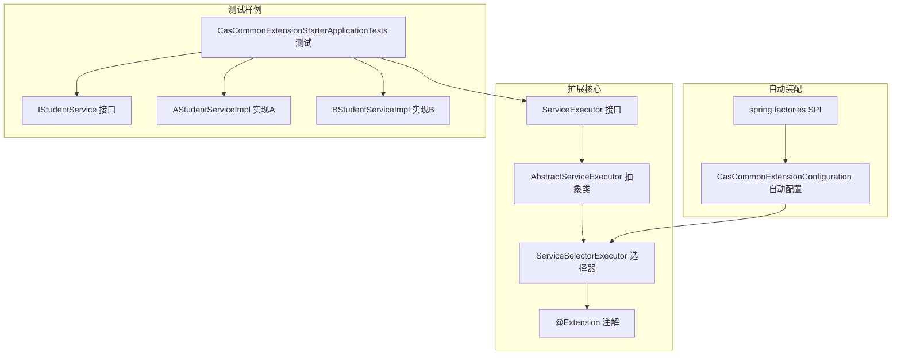
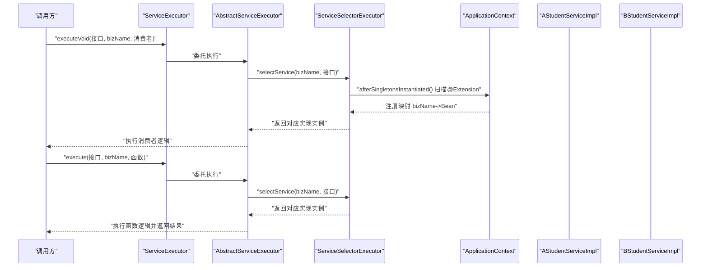
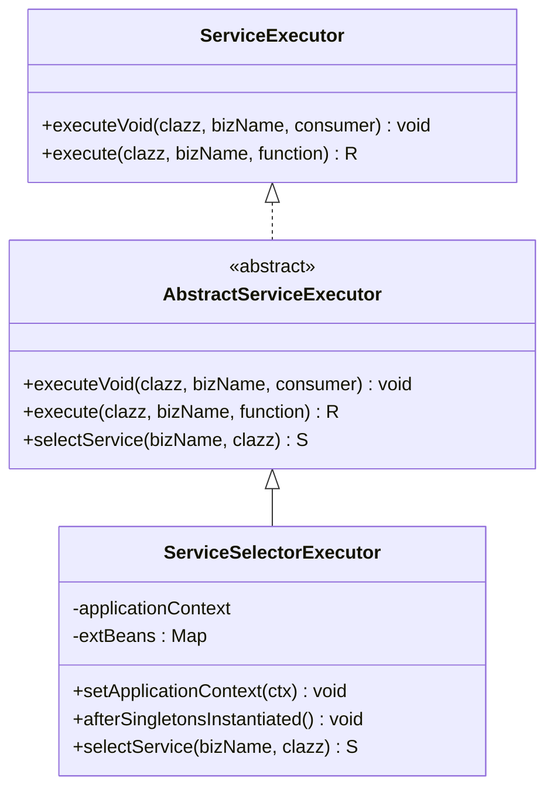
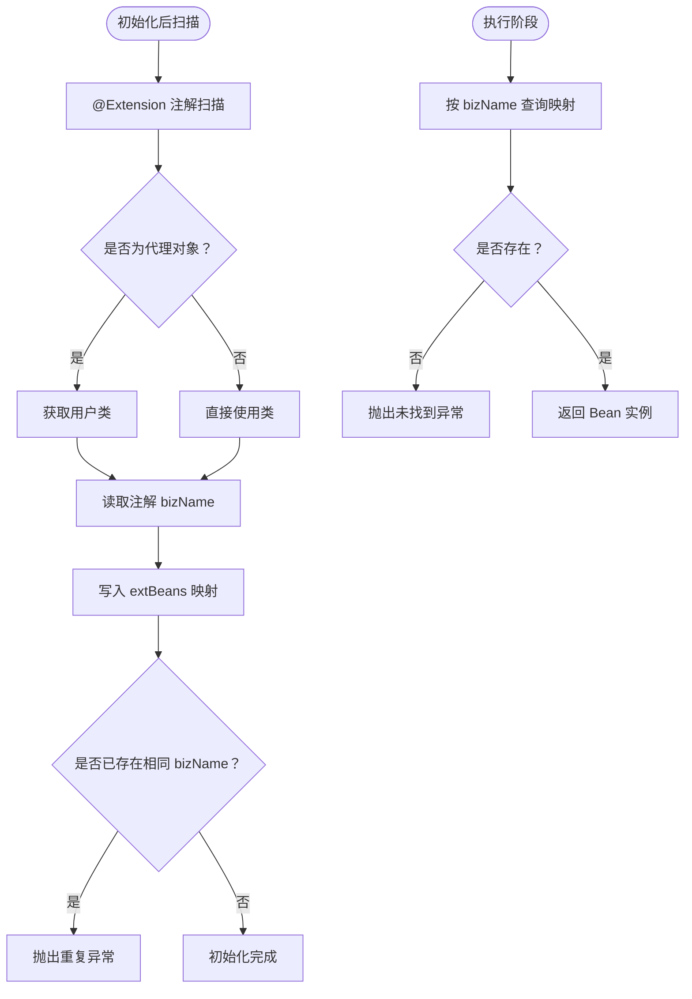
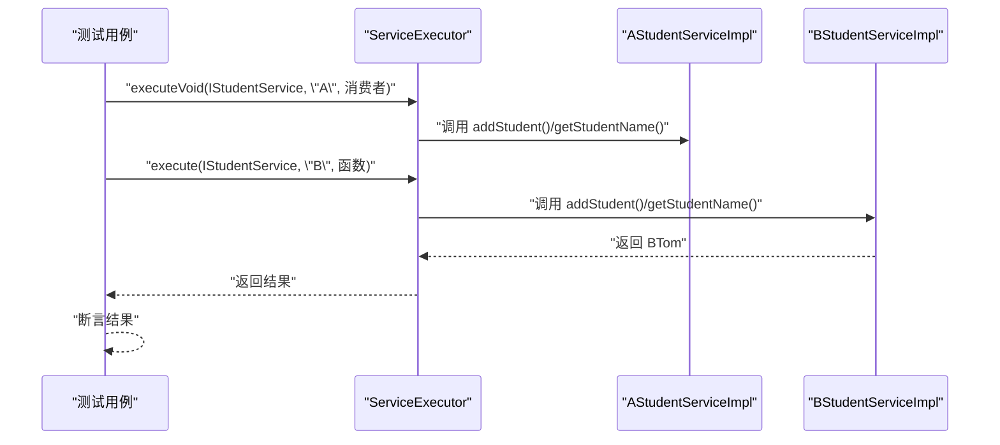
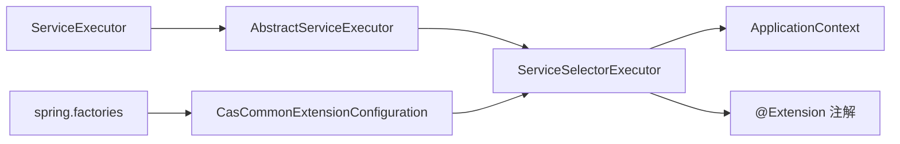

# 扩展服务机制

<cite>
**本文引用的文件**
- [ServiceExecutor.java](file://castile-system-center/cas-common-starters/cas-common-extension-starter/src/main/java/com/castile/common/extension/ServiceExecutor.java)
- [AbstractServiceExecutor.java](file://castile-system-center/cas-common-starters/cas-common-extension-starter/src/main/java/com/castile/common/extension/AbstractServiceExecutor.java)
- [ServiceSelectorExecutor.java](file://castile-system-center/cas-common-starters/cas-common-extension-starter/src/main/java/com/castile/common/extension/ServiceSelectorExecutor.java)
- [Extension.java](file://castile-system-center/cas-common-starters/cas-common-extension-starter/src/main/java/com/castile/common/extension/Extension.java)
- [CasCommonExtensionConfiguration.java](file://castile-system-center/cas-common-starters/cas-common-extension-starter/src/main/java/com/castile/common/extension/config/CasCommonExtensionConfiguration.java)
- [spring.factories](file://castile-system-center/cas-common-starters/cas-common-extension-starter/src/main/resources/META-INF/spring.factories)
- [IStudentService.java](file://castile-system-center/cas-common-starters/cas-common-extension-starter/src/test/java/com/castile/common/extension/IStudentService.java)
- [AStudentServiceImpl.java](file://castile-system-center/cas-common-starters/cas-common-extension-starter/src/test/java/com/castile/common/extension/AStudentServiceImpl.java)
- [BStudentServiceImpl.java](file://castile-system-center/cas-common-starters/cas-common-extension-starter/src/test/java/com/castile/common/extension/BStudentServiceImpl.java)
- [CasCommonExtensionStarterApplicationTests.java](file://castile-system-center/cas-common-starters/cas-common-extension-starter/src/test/java/com/castile/common/extension/CasCommonExtensionStarterApplicationTests.java)
</cite>

## 目录
1. [引言](#引言)
2. [项目结构](#项目结构)
3. [核心组件](#核心组件)
4. [架构总览](#架构总览)
5. [详细组件分析](#详细组件分析)
6. [依赖关系分析](#依赖关系分析)
7. [性能考量](#性能考量)
8. [故障排查指南](#故障排查指南)
9. [结论](#结论)
10. [附录：从零到一定义与注册扩展点示例](#附录从零到一定义与注册扩展点示例)

## 引言
本文件系统性解析扩展服务机制的设计原理与使用方式，围绕以下目标展开：
- 明确 ServiceExecutor 接口与 AbstractServiceExecutor 抽象类的职责划分
- 阐述 ServiceSelectorExecutor 如何基于业务标识（bizName）动态选择具体执行器
- 解释 @Extension 注解的作用机制及其与 Spring IOC 容器的集成方式
- 通过 IStudentService 及其多个实现类的测试案例，展示扩展点的实际调用流程
- 说明 CasCommonExtensionConfiguration 如何通过 Spring SPI 自动装配扩展组件
- 提供在实际项目中定义和注册业务扩展的完整示例，并讨论其在多租户、差异化服务等场景的应用价值

## 项目结构
该扩展能力位于“cas-common-extension-starter”模块中，采用“接口+抽象基类+选择器+注解+自动配置”的分层设计，配合 Spring SPI 实现自动装配。

图表来源
- [ServiceExecutor.java](file://castile-system-center/cas-common-starters/cas-common-extension-starter/src/main/java/com/castile/common/extension/ServiceExecutor.java#L1-L33)
- [AbstractServiceExecutor.java](file://castile-system-center/cas-common-starters/cas-common-extension-starter/src/main/java/com/castile/common/extension/AbstractServiceExecutor.java#L1-L36)
- [ServiceSelectorExecutor.java](file://castile-system-center/cas-common-starters/cas-common-extension-starter/src/main/java/com/castile/common/extension/ServiceSelectorExecutor.java#L1-L60)
- [Extension.java](file://castile-system-center/cas-common-starters/cas-common-extension-starter/src/main/java/com/castile/common/extension/Extension.java#L1-L21)
- [CasCommonExtensionConfiguration.java](file://castile-system-center/cas-common-starters/cas-common-extension-starter/src/main/java/com/castile/common/extension/config/CasCommonExtensionConfiguration.java#L1-L15)
- [spring.factories](file://castile-system-center/cas-common-starters/cas-common-extension-starter/src/main/resources/META-INF/spring.factories#L1-L3)
- [IStudentService.java](file://castile-system-center/cas-common-starters/cas-common-extension-starter/src/test/java/com/castile/common/extension/IStudentService.java#L1-L15)
- [AStudentServiceImpl.java](file://castile-system-center/cas-common-starters/cas-common-extension-starter/src/test/java/com/castile/common/extension/AStudentServiceImpl.java#L1-L25)
- [BStudentServiceImpl.java](file://castile-system-center/cas-common-starters/cas-common-extension-starter/src/test/java/com/castile/common/extension/BStudentServiceImpl.java#L1-L25)
- [CasCommonExtensionStarterApplicationTests.java](file://castile-system-center/cas-common-starters/cas-common-extension-starter/src/test/java/com/castile/common/extension/CasCommonExtensionStarterApplicationTests.java#L1-L38)

章节来源
- [ServiceExecutor.java](file://castile-system-center/cas-common-starters/cas-common-extension-starter/src/main/java/com/castile/common/extension/ServiceExecutor.java#L1-L33)
- [AbstractServiceExecutor.java](file://castile-system-center/cas-common-starters/cas-common-extension-starter/src/main/java/com/castile/common/extension/AbstractServiceExecutor.java#L1-L36)
- [ServiceSelectorExecutor.java](file://castile-system-center/cas-common-starters/cas-common-extension-starter/src/main/java/com/castile/common/extension/ServiceSelectorExecutor.java#L1-L60)
- [Extension.java](file://castile-system-center/cas-common-starters/cas-common-extension-starter/src/main/java/com/castile/common/extension/Extension.java#L1-L21)
- [CasCommonExtensionConfiguration.java](file://castile-system-center/cas-common-starters/cas-common-extension-starter/src/main/java/com/castile/common/extension/config/CasCommonExtensionConfiguration.java#L1-L15)
- [spring.factories](file://castile-system-center/cas-common-starters/cas-common-extension-starter/src/main/resources/META-INF/spring.factories#L1-L3)
- [IStudentService.java](file://castile-system-center/cas-common-starters/cas-common-extension-starter/src/test/java/com/castile/common/extension/IStudentService.java#L1-L15)
- [AStudentServiceImpl.java](file://castile-system-center/cas-common-starters/cas-common-extension-starter/src/test/java/com/castile/common/extension/AStudentServiceImpl.java#L1-L25)
- [BStudentServiceImpl.java](file://castile-system-center/cas-common-starters/cas-common-extension-starter/src/test/java/com/castile/common/extension/BStudentServiceImpl.java#L1-L25)
- [CasCommonExtensionStarterApplicationTests.java](file://castile-system-center/cas-common-starters/cas-common-extension-starter/src/test/java/com/castile/common/extension/CasCommonExtensionStarterApplicationTests.java#L1-L38)

## 核心组件
- ServiceExecutor 接口：定义两类统一入口方法，分别用于执行带返回值与不带返回值的服务调用，入参包含“服务类型 + 业务标识 + 具体调用逻辑”。该接口为上层屏蔽底层选择策略差异。
- AbstractServiceExecutor 抽象类：实现 ServiceExecutor，将“选择服务实例”与“执行调用”解耦；子类只需实现 selectService 即可完成不同策略的选择。
- ServiceSelectorExecutor 选择器：基于 Spring 容器扫描带有 @Extension 注解的 Bean，以 bizName 作为键缓存实例；在执行时按 bizName 查找并返回对应实现。
- @Extension 注解：声明式标记扩展实现，包含 bizName、version、description 等元数据，支持继承传播。
- CasCommonExtensionConfiguration 自动配置：通过 @ComponentScan 扫描扩展相关组件，并由 spring.factories 作为 SPI 自动装配。

章节来源
- [ServiceExecutor.java](file://castile-system-center/cas-common-starters/cas-common-extension-starter/src/main/java/com/castile/common/extension/ServiceExecutor.java#L1-L33)
- [AbstractServiceExecutor.java](file://castile-system-center/cas-common-starters/cas-common-extension-starter/src/main/java/com/castile/common/extension/AbstractServiceExecutor.java#L1-L36)
- [ServiceSelectorExecutor.java](file://castile-system-center/cas-common-starters/cas-common-extension-starter/src/main/java/com/castile/common/extension/ServiceSelectorExecutor.java#L1-L60)
- [Extension.java](file://castile-system-center/cas-common-starters/cas-common-extension-starter/src/main/java/com/castile/common/extension/Extension.java#L1-L21)
- [CasCommonExtensionConfiguration.java](file://castile-system-center/cas-common-starters/cas-common-extension-starter/src/main/java/com/castile/common/extension/config/CasCommonExtensionConfiguration.java#L1-L15)
- [spring.factories](file://castile-system-center/cas-common-starters/cas-common-extension-starter/src/main/resources/META-INF/spring.factories#L1-L3)

## 架构总览
下图展示了扩展服务机制的整体交互：上层通过 ServiceExecutor 发起调用，AbstractServiceExecutor 将“选择服务”与“执行逻辑”分离；ServiceSelectorExecutor 借助 Spring 容器与 @Extension 注解完成实例注册与选择；测试用例演示了基于不同 bizName 的动态路由。

图表来源
- [ServiceExecutor.java](file://castile-system-center/cas-common-starters/cas-common-extension-starter/src/main/java/com/castile/common/extension/ServiceExecutor.java#L1-L33)
- [AbstractServiceExecutor.java](file://castile-system-center/cas-common-starters/cas-common-extension-starter/src/main/java/com/castile/common/extension/AbstractServiceExecutor.java#L1-L36)
- [ServiceSelectorExecutor.java](file://castile-system-center/cas-common-starters/cas-common-extension-starter/src/main/java/com/castile/common/extension/ServiceSelectorExecutor.java#L1-L60)
- [IStudentService.java](file://castile-system-center/cas-common-starters/cas-common-extension-starter/src/test/java/com/castile/common/extension/IStudentService.java#L1-L15)
- [AStudentServiceImpl.java](file://castile-system-center/cas-common-starters/cas-common-extension-starter/src/test/java/com/castile/common/extension/AStudentServiceImpl.java#L1-L25)
- [BStudentServiceImpl.java](file://castile-system-center/cas-common-starters/cas-common-extension-starter/src/test/java/com/castile/common/extension/BStudentServiceImpl.java#L1-L25)
- [CasCommonExtensionStarterApplicationTests.java](file://castile-system-center/cas-common-starters/cas-common-extension-starter/src/test/java/com/castile/common/extension/CasCommonExtensionStarterApplicationTests.java#L1-L38)

## 详细组件分析

### ServiceExecutor 接口与 AbstractServiceExecutor 抽象类
- 职责划分
  - ServiceExecutor：对外暴露统一的执行入口，屏蔽选择策略细节，便于上层以“接口 + 业务标识”进行调用。
  - AbstractServiceExecutor：将“选择服务实例”与“执行逻辑”解耦，子类仅需实现 selectService 即可获得完整的执行链路。
- 设计要点
  - executeVoid 与 execute 方法分别处理有返回值与无返回值场景，内部均先通过 selectService 获取具体实现，再执行传入的消费者或函数。
  - selectService 为抽象方法，交由具体选择器实现，保证扩展性与可替换性。

图表来源
- [ServiceExecutor.java](file://castile-system-center/cas-common-starters/cas-common-extension-starter/src/main/java/com/castile/common/extension/ServiceExecutor.java#L1-L33)
- [AbstractServiceExecutor.java](file://castile-system-center/cas-common-starters/cas-common-extension-starter/src/main/java/com/castile/common/extension/AbstractServiceExecutor.java#L1-L36)
- [ServiceSelectorExecutor.java](file://castile-system-center/cas-common-starters/cas-common-extension-starter/src/main/java/com/castile/common/extension/ServiceSelectorExecutor.java#L1-L60)

章节来源
- [ServiceExecutor.java](file://castile-system-center/cas-common-starters/cas-common-extension-starter/src/main/java/com/castile/common/extension/ServiceExecutor.java#L1-L33)
- [AbstractServiceExecutor.java](file://castile-system-center/cas-common-starters/cas-common-extension-starter/src/main/java/com/castile/common/extension/AbstractServiceExecutor.java#L1-L36)

### ServiceSelectorExecutor：基于业务标识的动态选择
- 初始化阶段
  - 实现 SmartInitializingSingleton，在单例实例化完成后扫描所有带有 @Extension 注解的 Bean。
  - 使用 AopUtils 与 ClassUtils 处理代理对象，确保获取到原始类上的注解。
  - 读取注解中的 bizName，并将“bizName -> Bean 实例”写入内存映射表。
  - 若发现重复 bizName，抛出异常，避免歧义。
- 执行阶段
  - selectService 根据 bizName 从映射表中取出对应 Bean 并返回，供 AbstractServiceExecutor 统一执行。
- 错误处理
  - 若 bizName 不存在，抛出非法状态异常，提示未找到对应服务。

图表来源
- [ServiceSelectorExecutor.java](file://castile-system-center/cas-common-starters/cas-common-extension-starter/src/main/java/com/castile/common/extension/ServiceSelectorExecutor.java#L1-L60)
- [Extension.java](file://castile-system-center/cas-common-starters/cas-common-extension-starter/src/main/java/com/castile/common/extension/Extension.java#L1-L21)

章节来源
- [ServiceSelectorExecutor.java](file://castile-system-center/cas-common-starters/cas-common-extension-starter/src/main/java/com/castile/common/extension/ServiceSelectorExecutor.java#L1-L60)

### @Extension 注解与 Spring IOC 集成
- 注解语义
  - bizName：扩展点的业务标识，作为选择器的键。
  - version、description：扩展版本与描述信息，便于治理与追踪。
  - 支持继承传播，子类可复用父类的注解元数据。
- 与 Spring 集成
  - ServiceSelectorExecutor 实现 ApplicationContextAware，注入 ApplicationContext。
  - 在 afterSingletonsInstantiated 中扫描所有带 @Extension 的 Bean，完成自动注册。
  - 通过 spring.factories 将 CasCommonExtensionConfiguration 作为自动配置类启用，从而触发组件扫描。

章节来源
- [Extension.java](file://castile-system-center/cas-common-starters/cas-common-extension-starter/src/main/java/com/castile/common/extension/Extension.java#L1-L21)
- [ServiceSelectorExecutor.java](file://castile-system-center/cas-common-starters/cas-common-extension-starter/src/main/java/com/castile/common/extension/ServiceSelectorExecutor.java#L1-L60)
- [CasCommonExtensionConfiguration.java](file://castile-system-center/cas-common-starters/cas-common-extension-starter/src/main/java/com/castile/common/extension/config/CasCommonExtensionConfiguration.java#L1-L15)
- [spring.factories](file://castile-system-center/cas-common-starters/cas-common-extension-starter/src/main/resources/META-INF/spring.factories#L1-L3)

### 测试案例：IStudentService 及其实现
- 接口与实现
  - IStudentService：定义学生相关服务方法。
  - AStudentServiceImpl 与 BStudentServiceImpl：分别标注 @Extension(bizName="A"/"B")，实现同一接口的不同行为。
- 测试流程
  - 使用 ServiceExecutor.executeVoid 以 bizName="A" 调用无返回值场景。
  - 使用 ServiceExecutor.execute 以 bizName="B" 调用有返回值场景，并断言返回值符合预期。
- 关键验证点
  - 不同 bizName 对应不同实现被正确路由。
  - 有/无返回值两种调用模式均可正常工作。

图表来源
- [CasCommonExtensionStarterApplicationTests.java](file://castile-system-center/cas-common-starters/cas-common-extension-starter/src/test/java/com/castile/common/extension/CasCommonExtensionStarterApplicationTests.java#L1-L38)
- [IStudentService.java](file://castile-system-center/cas-common-starters/cas-common-extension-starter/src/test/java/com/castile/common/extension/IStudentService.java#L1-L15)
- [AStudentServiceImpl.java](file://castile-system-center/cas-common-starters/cas-common-extension-starter/src/test/java/com/castile/common/extension/AStudentServiceImpl.java#L1-L25)
- [BStudentServiceImpl.java](file://castile-system-center/cas-common-starters/cas-common-extension-starter/src/test/java/com/castile/common/extension/BStudentServiceImpl.java#L1-L25)

章节来源
- [CasCommonExtensionStarterApplicationTests.java](file://castile-system-center/cas-common-starters/cas-common-extension-starter/src/test/java/com/castile/common/extension/CasCommonExtensionStarterApplicationTests.java#L1-L38)
- [IStudentService.java](file://castile-system-center/cas-common-starters/cas-common-extension-starter/src/test/java/com/castile/common/extension/IStudentService.java#L1-L15)
- [AStudentServiceImpl.java](file://castile-system-center/cas-common-starters/cas-common-extension-starter/src/test/java/com/castile/common/extension/AStudentServiceImpl.java#L1-L25)
- [BStudentServiceImpl.java](file://castile-system-center/cas-common-starters/cas-common-extension-starter/src/test/java/com/castile/common/extension/BStudentServiceImpl.java#L1-L25)

### 自动装配：CasCommonExtensionConfiguration 与 spring.factories
- CasCommonExtensionConfiguration
  - 通过 @ComponentScan 扫描 com.castile.common.extension 包，注册 ServiceSelectorExecutor、@Extension 等组件。
- spring.factories
  - 以 EnableAutoConfiguration 形式自动装配上述配置类，无需手动引入即可生效。

章节来源
- [CasCommonExtensionConfiguration.java](file://castile-system-center/cas-common-starters/cas-common-extension-starter/src/main/java/com/castile/common/extension/config/CasCommonExtensionConfiguration.java#L1-L15)
- [spring.factories](file://castile-system-center/cas-common-starters/cas-common-extension-starter/src/main/resources/META-INF/spring.factories#L1-L3)

## 依赖关系分析
- 组件耦合
  - ServiceExecutor 与 AbstractServiceExecutor：接口与抽象实现的典型组合，降低上层对选择策略的感知。
  - AbstractServiceExecutor 与 ServiceSelectorExecutor：通过 selectService 抽象方法形成策略扩展点。
  - ServiceSelectorExecutor 与 Spring 容器：通过 ApplicationContextAware 与 SmartInitializingSingleton 实现自动装配与注册。
  - @Extension 注解与 ServiceSelectorExecutor：注解作为元数据载体，驱动选择器的注册与查找。
- 外部依赖
  - Spring AOP、注解工具、Bean 生命周期回调等。

图表来源
- [ServiceExecutor.java](file://castile-system-center/cas-common-starters/cas-common-extension-starter/src/main/java/com/castile/common/extension/ServiceExecutor.java#L1-L33)
- [AbstractServiceExecutor.java](file://castile-system-center/cas-common-starters/cas-common-extension-starter/src/main/java/com/castile/common/extension/AbstractServiceExecutor.java#L1-L36)
- [ServiceSelectorExecutor.java](file://castile-system-center/cas-common-starters/cas-common-extension-starter/src/main/java/com/castile/common/extension/ServiceSelectorExecutor.java#L1-L60)
- [Extension.java](file://castile-system-center/cas-common-starters/cas-common-extension-starter/src/main/java/com/castile/common/extension/Extension.java#L1-L21)
- [CasCommonExtensionConfiguration.java](file://castile-system-center/cas-common-starters/cas-common-extension-starter/src/main/java/com/castile/common/extension/config/CasCommonExtensionConfiguration.java#L1-L15)
- [spring.factories](file://castile-system-center/cas-common-starters/cas-common-extension-starter/src/main/resources/META-INF/spring.factories#L1-L3)

章节来源
- [ServiceSelectorExecutor.java](file://castile-system-center/cas-common-starters/cas-common-extension-starter/src/main/java/com/castile/common/extension/ServiceSelectorExecutor.java#L1-L60)
- [CasCommonExtensionConfiguration.java](file://castile-system-center/cas-common-starters/cas-common-extension-starter/src/main/java/com/castile/common/extension/config/CasCommonExtensionConfiguration.java#L1-L15)
- [spring.factories](file://castile-system-center/cas-common-starters/cas-common-extension-starter/src/main/resources/META-INF/spring.factories#L1-L3)

## 性能考量
- 选择器注册
  - 在单例初始化完成后一次性扫描并缓存映射，后续执行为 O(1) 查找。
- 代理对象处理
  - 使用 AopUtils 与 ClassUtils 获取用户类，避免重复代理层级导致的反射开销。
- 并发安全
  - 当前实现未显式加锁，若在运行时动态注册扩展，建议在选择器层面增加并发保护或只在启动期注册。
- 扩展数量
  - bizName 数量较多时，建议结合命名规范与分包策略，减少冲突与查找成本。

## 故障排查指南
- 未找到扩展
  - 现象：执行时报“未找到服务”错误。
  - 排查：确认 @Extension 注解是否正确标注，bizName 是否拼写一致；确认自动配置已生效。
- 重复扩展
  - 现象：启动时报“重复扩展”错误。
  - 排查：检查不同实现是否使用了相同的 bizName，确保每个业务标识唯一。
- 代理对象导致的注解缺失
  - 现象：扫描不到 @Extension 注解。
  - 排查：确认实现类是否被 Spring 正确代理；选择器会自动处理代理类，但需确保代理链完整。
- 返回值断言失败
  - 现象：测试断言失败。
  - 排查：核对 bizName 是否正确；确认实现类返回值是否符合预期。

章节来源
- [ServiceSelectorExecutor.java](file://castile-system-center/cas-common-starters/cas-common-extension-starter/src/main/java/com/castile/common/extension/ServiceSelectorExecutor.java#L1-L60)
- [CasCommonExtensionStarterApplicationTests.java](file://castile-system-center/cas-common-starters/cas-common-extension-starter/src/test/java/com/castile/common/extension/CasCommonExtensionStarterApplicationTests.java#L1-L38)

## 结论
该扩展服务机制通过“接口 + 抽象基类 + 注解 + 选择器 + 自动配置”的组合，实现了以业务标识为中心的动态路由与可插拔扩展。其优势在于：
- 上层调用简洁统一，屏蔽实现差异
- 选择策略可替换，易于扩展新实现
- 与 Spring 生态无缝集成，零样板代码
- 适用于多租户、差异化服务等复杂场景

## 附录：从零到一定义与注册扩展点示例
- 定义扩展接口
  - 创建业务接口，如 IStudentService，定义所需方法。
- 定义扩展实现
  - 编写多个实现类，分别标注 @Extension(bizName="...")，确保 bizName 唯一。
- 使用扩展
  - 注入 ServiceExecutor，调用 execute 或 executeVoid，传入接口类型与 bizName。
- 自动装配
  - 确保自动配置生效（spring.factories 已配置），或手动引入配置类。
- 场景应用
  - 多租户：为不同租户绑定不同的 bizName，实现租户隔离的差异化实现。
  - 差异化服务：针对不同渠道/地区/等级，提供不同实现并通过 bizName 动态路由。

章节来源
- [IStudentService.java](file://castile-system-center/cas-common-starters/cas-common-extension-starter/src/test/java/com/castile/common/extension/IStudentService.java#L1-L15)
- [AStudentServiceImpl.java](file://castile-system-center/cas-common-starters/cas-common-extension-starter/src/test/java/com/castile/common/extension/AStudentServiceImpl.java#L1-L25)
- [BStudentServiceImpl.java](file://castile-system-center/cas-common-starters/cas-common-extension-starter/src/test/java/com/castile/common/extension/BStudentServiceImpl.java#L1-L25)
- [ServiceExecutor.java](file://castile-system-center/cas-common-starters/cas-common-extension-starter/src/main/java/com/castile/common/extension/ServiceExecutor.java#L1-L33)
- [ServiceSelectorExecutor.java](file://castile-system-center/cas-common-starters/cas-common-extension-starter/src/main/java/com/castile/common/extension/ServiceSelectorExecutor.java#L1-L60)
- [CasCommonExtensionConfiguration.java](file://castile-system-center/cas-common-starters/cas-common-extension-starter/src/main/java/com/castile/common/extension/config/CasCommonExtensionConfiguration.java#L1-L15)
- [spring.factories](file://castile-system-center/cas-common-starters/cas-common-extension-starter/src/main/resources/META-INF/spring.factories#L1-L3)