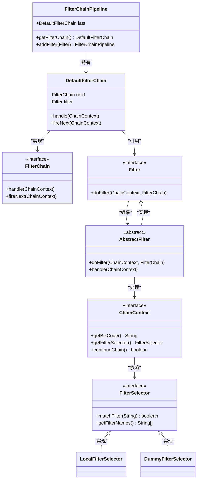
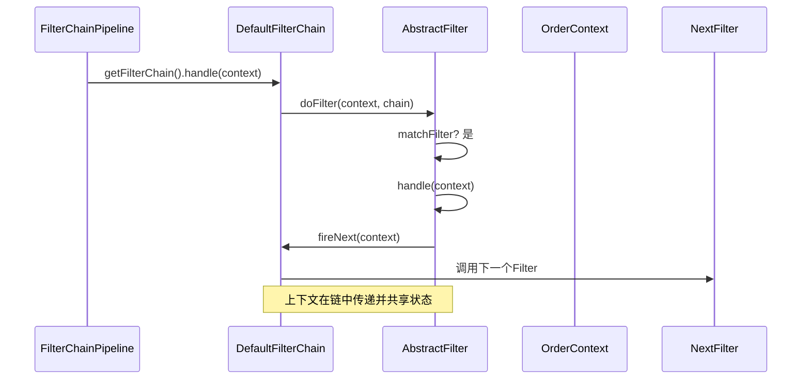
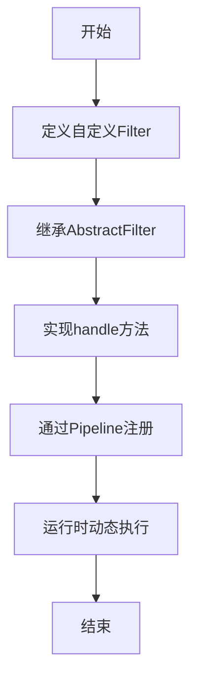

# 核心组件

<cite>
**本文档引用文件**  
- [FilterChainPipeline.java](file://castile-system-center/cas-common-chain/src/main/java/com/castile/common/chain/FilterChainPipeline.java)
- [AbstractFilter.java](file://castile-system-center/cas-common-chain/src/main/java/com/castile/common/chain/AbstractFilter.java)
- [FilterChain.java](file://castile-system-center/cas-common-chain/src/main/java/com/castile/common/chain/FilterChain.java)
- [ChainContext.java](file://castile-system-center/cas-common-chain/src/main/java/com/castile/common/chain/ChainContext.java)
- [DefaultFilterChain.java](file://castile-system-center/cas-common-chain/src/main/java/com/castile/common/chain/DefaultFilterChain.java)
- [Filter.java](file://castile-system-center/cas-common-chain/src/main/java/com/castile/common/chain/Filter.java)
- [FilterSelector.java](file://castile-system-center/cas-common-chain/src/main/java/com/castile/common/chain/selector/FilterSelector.java)
- [LocalFilterSelector.java](file://castile-system-center/cas-common-chain/src/main/java/com/castile/common/chain/selector/LocalFilterSelector.java)
- [DummyFilterSelector.java](file://castile-system-center/cas-common-chain/src/main/java/com/castile/common/chain/selector/DummyFilterSelector.java)
- [CalculateValidAmountFilter.java](file://castile-system-center/cas-common-starters/cas-common-extension-starter/src/test/java/com/castile/common/chain/filter/CalculateValidAmountFilter.java)
- [EnterpriseRouterFilter.java](file://castile-system-center/cas-common-starters/cas-common-extension-starter/src/test/java/com/castile/common/chain/filter/EnterpriseRouterFilter.java)
- [SaveRegisterLogFilter.java](file://castile-system-center/cas-common-starters/cas-common-extension-starter/src/test/java/com/castile/common/chain/filter/SaveRegisterLogFilter.java)
- [OrderRegisterModel.java](file://castile-system-center/cas-common-starters/cas-common-extension-starter/src/test/java/com/castile/common/chain/model/OrderRegisterModel.java)
- [OrderContext.java](file://castile-system-center/cas-common-starters/cas-common-extension-starter/src/test/java/com/castile/common/chain/OrderContext.java)
- [PipelineConfig.java](file://castile-system-center/cas-common-starters/cas-common-extension-starter/src/test/java/com/castile/common/chain/PipelineConfig.java)
</cite>

## 目录
1. [责任链模式概述](#责任链模式概述)
2. [核心类职责与协作机制](#核心类职责与协作机制)
3. [过滤器链的构建过程](#过滤器链的构建过程)
4. [上下文传递机制](#上下文传递机制)
5. [动态扩展能力](#动态扩展能力)
6. [过滤器选择策略分析](#过滤器选择策略分析)
7. [实际业务场景应用](#实际业务场景应用)
8. [系统可维护性与灵活性提升](#系统可维护性与灵活性提升)

## 责任链模式概述

责任链模式（FilterChainPipeline）是一种行为设计模式，用于将请求沿着处理链进行传递，直到被某个处理器处理为止。该模式在复杂流程编排中具有显著优势，如订单处理、权限校验等场景。通过解耦请求发送者与接收者，系统具备更高的灵活性和可扩展性。

## 核心类职责与协作机制

责任链模式的核心由多个关键组件构成，各组件职责明确，协同工作以实现完整的过滤流程。

**图示来源**  
- [FilterChainPipeline.java](file://castile-system-center/cas-common-chain/src/main/java/com/castile/common/chain/FilterChainPipeline.java#L7-L19)
- [FilterChain.java](file://castile-system-center/cas-common-chain/src/main/java/com/castile/common/chain/FilterChain.java#L7-L22)
- [DefaultFilterChain.java](file://castile-system-center/cas-common-chain/src/main/java/com/castile/common/chain/DefaultFilterChain.java#L9-L36)
- [Filter.java](file://castile-system-center/cas-common-chain/src/main/java/com/castile/common/chain/Filter.java#L7-L17)
- [AbstractFilter.java](file://castile-system-center/cas-common-chain/src/main/java/com/castile/common/chain/AbstractFilter.java#L7-L21)
- [ChainContext.java](file://castile-system-center/cas-common-chain/src/main/java/com/castile/common/chain/ChainContext.java#L11-L33)
- [FilterSelector.java](file://castile-system-center/cas-common-chain/src/main/java/com/castile/common/chain/selector/FilterSelector.java#L11-L26)

**本节来源**  
- [FilterChainPipeline.java](file://castile-system-center/cas-common-chain/src/main/java/com/castile/common/chain/FilterChainPipeline.java#L1-L19)
- [AbstractFilter.java](file://castile-system-center/cas-common-chain/src/main/java/com/castile/common/chain/AbstractFilter.java#L1-L21)
- [FilterChain.java](file://castile-system-center/cas-common-chain/src/main/java/com/castile/common/chain/FilterChain.java#L1-L22)
- [ChainContext.java](file://castile-system-center/cas-common-chain/src/main/java/com/castile/common/chain/ChainContext.java#L1-L33)
- [DefaultFilterChain.java](file://castile-system-center/cas-common-chain/src/main/java/com/castile/common/chain/DefaultFilterChain.java#L1-L36)
- [Filter.java](file://castile-system-center/cas-common-chain/src/main/java/com/castile/common/chain/Filter.java#L1-L17)

## 过滤器链的构建过程

过滤器链通过 `FilterChainPipeline` 类进行构建，采用链式调用方式逐个添加过滤器。每次调用 `addFilter()` 方法时，都会创建一个新的 `DefaultFilterChain` 实例，并将其作为前一个链节点的“下一个处理链”，从而形成一个反向连接的链表结构。

该构建方式支持动态扩展，开发者可在运行时根据业务需求灵活添加或移除过滤器，无需修改已有代码，符合开闭原则。

**本节来源**  
- [FilterChainPipeline.java](file://castile-system-center/cas-common-chain/src/main/java/com/castile/common/chain/FilterChainPipeline.java#L7-L19)
- [DefaultFilterChain.java](file://castile-system-center/cas-common-chain/src/main/java/com/castile/common/chain/DefaultFilterChain.java#L18-L21)

## 上下文传递机制

上下文对象（`ChainContext`）贯穿整个过滤链的执行过程，用于在各个过滤器之间共享数据和控制流程。每个具体的上下文实现类（如 `OrderContext`）可携带特定业务数据（如订单信息），并通过 `getFilterSelector()` 决定当前过滤器是否应被执行。

此外，`continueChain()` 方法控制是否继续执行后续过滤器，为流程中断提供了支持，例如在验证失败时提前终止链式调用。

**图示来源**  
- [DefaultFilterChain.java](file://castile-system-center/cas-common-chain/src/main/java/com/castile/common/chain/DefaultFilterChain.java#L24-L35)
- [AbstractFilter.java](file://castile-system-center/cas-common-chain/src/main/java/com/castile/common/chain/AbstractFilter.java#L10-L16)
- [OrderContext.java](file://castile-system-center/cas-common-starters/cas-common-extension-starter/src/test/java/com/castile/common/chain/OrderContext.java#L12-L25)

**本节来源**  
- [ChainContext.java](file://castile-system-center/cas-common-chain/src/main/java/com/castile/common/chain/ChainContext.java#L11-L33)
- [OrderContext.java](file://castile-system-center/cas-common-starters/cas-common-extension-starter/src/test/java/com/castile/common/chain/OrderContext.java#L1-L25)
- [AbstractFilter.java](file://castile-system-center/cas-common-chain/src/main/java/com/castile/common/chain/AbstractFilter.java#L10-L16)

## 动态扩展能力

系统支持通过实现 `Filter` 接口定义自定义过滤器，并通过 `FilterChainPipeline` 注册到处理链中。例如，`CalculateValidAmountFilter`、`EnterpriseRouterFilter` 和 `SaveRegisterLogFilter` 均为具体业务过滤器，分别负责金额计算、企业路由和日志保存。

通过组合不同的过滤器并配合选择器策略，可在不修改核心逻辑的前提下实现多样化的业务流程编排。

**图示来源**  
- [CalculateValidAmountFilter.java](file://castile-system-center/cas-common-starters/cas-common-extension-starter/src/test/java/com/castile/common/chain/filter/CalculateValidAmountFilter.java#L1-L21)
- [EnterpriseRouterFilter.java](file://castile-system-center/cas-common-starters/cas-common-extension-starter/src/test/java/com/castile/common/chain/filter/EnterpriseRouterFilter.java#L1-L19)
- [SaveRegisterLogFilter.java](file://castile-system-center/cas-common-starters/cas-common-extension-starter/src/test/java/com/castile/common/chain/filter/SaveRegisterLogFilter.java#L1-L19)
- [PipelineConfig.java](file://castile-system-center/cas-common-starters/cas-common-extension-starter/src/test/java/com/castile/common/chain/PipelineConfig.java#L23-L27)

**本节来源**  
- [CalculateValidAmountFilter.java](file://castile-system-center/cas-common-starters/cas-common-extension-starter/src/test/java/com/castile/common/chain/filter/CalculateValidAmountFilter.java#L1-L21)
- [EnterpriseRouterFilter.java](file://castile-system-center/cas-common-starters/cas-common-extension-starter/src/test/java/com/castile/common/chain/filter/EnterpriseRouterFilter.java#L1-L19)
- [SaveRegisterLogFilter.java](file://castile-system-center/cas-common-starters/cas-common-extension-starter/src/test/java/com/castile/common/chain/filter/SaveRegisterLogFilter.java#L1-L19)
- [PipelineConfig.java](file://castile-system-center/cas-common-starters/cas-common-extension-starter/src/test/java/com/castile/common/chain/PipelineConfig.java#L1-L50)

## 过滤器选择策略分析

系统提供了两种过滤器选择策略：`LocalFilterSelector` 和 `DummyFilterSelector`。

- **LocalFilterSelector**：基于本地配置的过滤器名称列表进行匹配，若当前过滤器名存在于列表中，则执行该过滤器。支持动态添加过滤器名称，适用于大多数业务场景。
- **DummyFilterSelector**：始终返回不匹配（`matchFilter` 恒为 `false`），用于禁用所有过滤器的执行，常用于测试或临时关闭流程。

通过上下文注入不同的选择器实例，可实现灵活的过滤器启用/禁用机制。

**本节来源**  
- [LocalFilterSelector.java](file://castile-system-center/cas-common-chain/src/main/java/com/castile/common/chain/selector/LocalFilterSelector.java#L1-L38)
- [DummyFilterSelector.java](file://castile-system-center/cas-common-chain/src/main/java/com/castile/common/chain/selector/DummyFilterSelector.java#L1-L22)
- [PipelineConfig.java](file://castile-system-center/cas-common-starters/cas-common-extension-starter/src/test/java/com/castile/common/chain/PipelineConfig.java#L42-L48)

## 实际业务场景应用

该责任链模式适用于多种复杂流程编排场景：

- **订单处理**：通过 `OrderContext` 携带订单数据，依次执行金额校验、路由分发、日志记录等操作。
- **权限校验**：构建多层安全过滤链，如身份认证、角色校验、资源权限检查等。
- **数据预处理**：在数据入库前进行清洗、转换、验证等操作。

示例代码中展示了如何通过 `PipelineConfig` 构建订单注册流程的完整过滤链，并通过 `LocalFilterSelector` 精确控制哪些过滤器参与执行。

**本节来源**  
- [PipelineConfig.java](file://castile-system-center/cas-common-starters/cas-common-extension-starter/src/test/java/com/castile/common/chain/PipelineConfig.java#L19-L50)
- [OrderContext.java](file://castile-system-center/cas-common-starters/cas-common-extension-starter/src/test/java/com/castile/common/chain/OrderContext.java#L1-L25)
- [OrderRegisterModel.java](file://castile-system-center/cas-common-starters/cas-common-extension-starter/src/test/java/com/castile/common/chain/model/OrderRegisterModel.java#L1-L20)

## 系统可维护性与灵活性提升

通过责任链模式的应用，系统实现了以下优势：

- **高内聚低耦合**：每个过滤器仅关注自身业务逻辑，彼此独立。
- **易于扩展**：新增功能只需添加新过滤器并注册到链中，无需修改现有代码。
- **灵活控制**：通过选择器机制动态启用/禁用特定过滤器，适应不同环境或业务需求。
- **便于测试**：单个过滤器可独立测试，上下文模拟简单。

该设计显著提升了系统的可维护性和灵活性，特别适合需要频繁变更或扩展业务流程的中大型系统。

**本节来源**  
- [AbstractFilter.java](file://castile-system-center/cas-common-chain/src/main/java/com/castile/common/chain/AbstractFilter.java#L7-L21)
- [FilterChainPipeline.java](file://castile-system-center/cas-common-chain/src/main/java/com/castile/common/chain/FilterChainPipeline.java#L7-L19)
- [PipelineConfig.java](file://castile-system-center/cas-common-starters/cas-common-extension-starter/src/test/java/com/castile/common/chain/PipelineConfig.java#L1-L50)