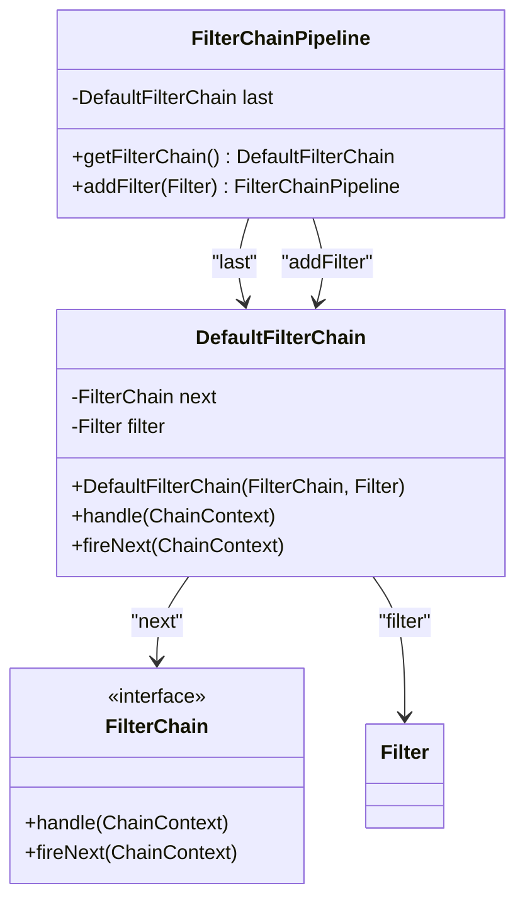
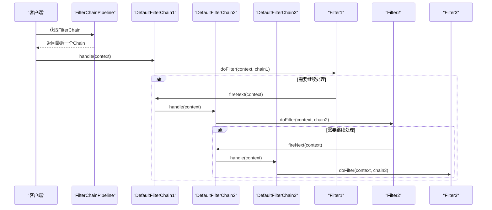
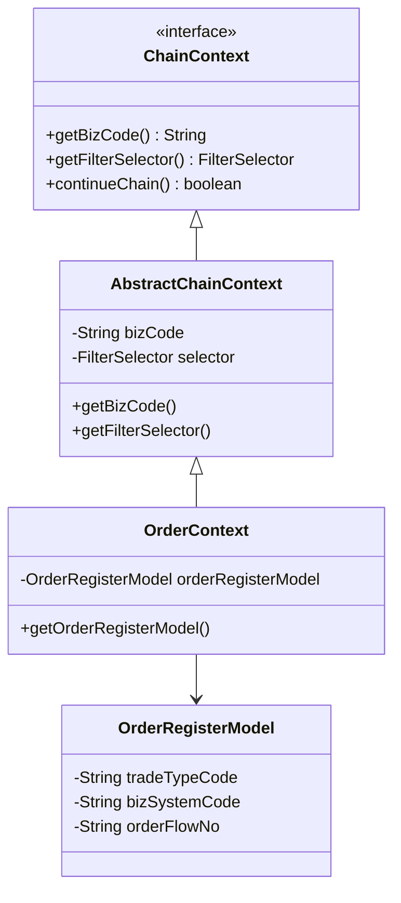
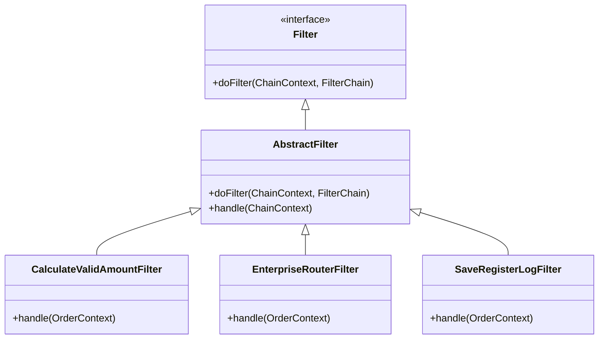
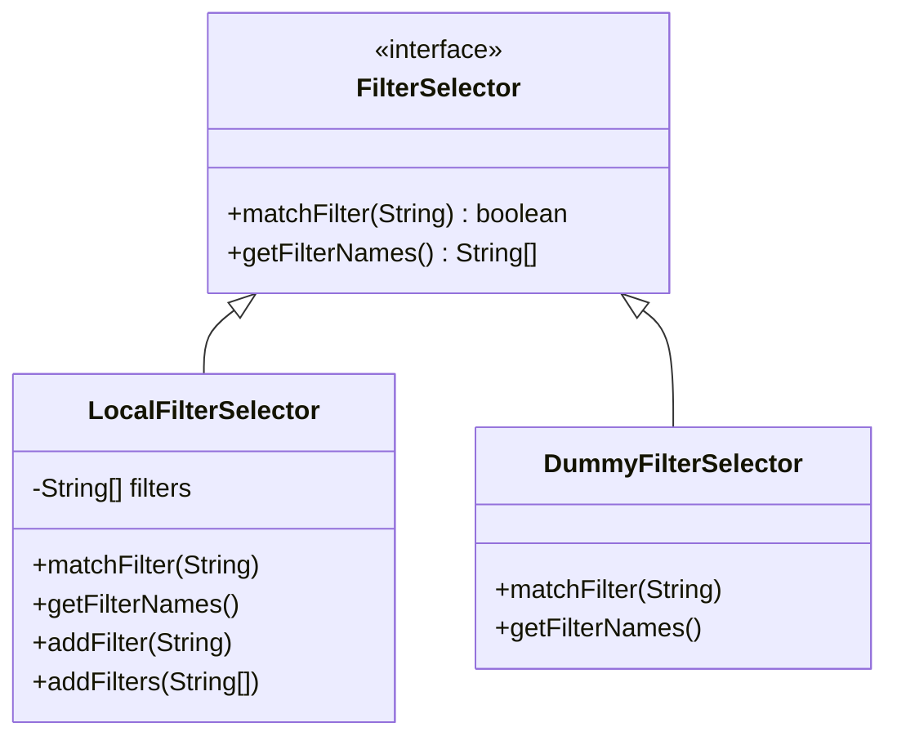
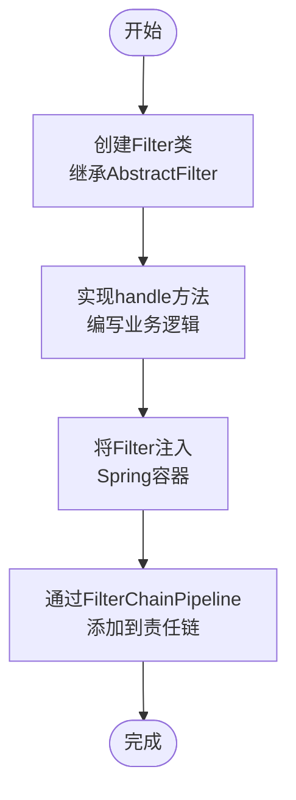
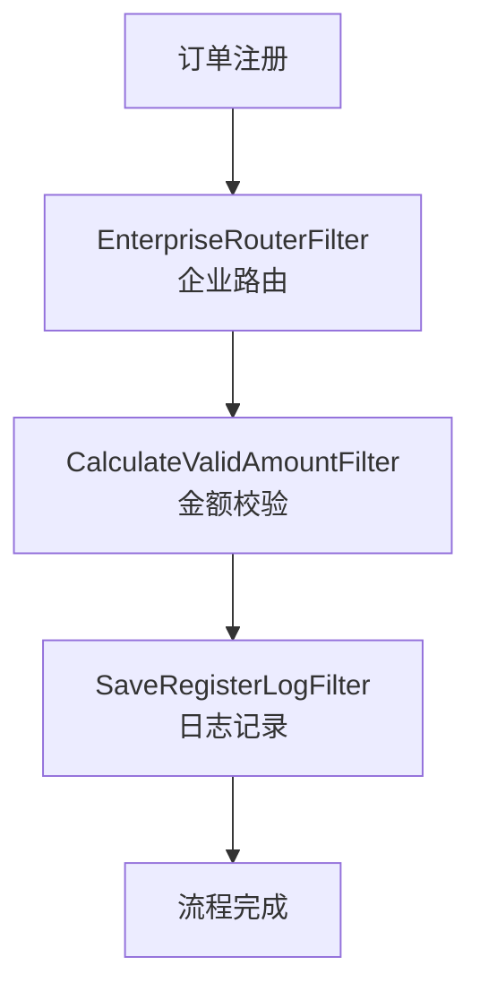

# 责任链模式

<cite>
**本文档引用的文件**  
- [FilterChainPipeline.java](file://castile-system-center/cas-common-chain/src/main/java/com/castile/common/chain/FilterChainPipeline.java)
- [DefaultFilterChain.java](file://castile-system-center/cas-common-chain/src/main/java/com/castile/common/chain/DefaultFilterChain.java)
- [ChainContext.java](file://castile-system-center/cas-common-chain/src/main/java/com/castile/common/chain/ChainContext.java)
- [Filter.java](file://castile-system-center/cas-common-chain/src/main/java/com/castile/common/chain/Filter.java)
- [AbstractFilter.java](file://castile-system-center/cas-common-chain/src/main/java/com/castile/common/chain/AbstractFilter.java)
- [FilterChain.java](file://castile-system-center/cas-common-chain/src/main/java/com/castile/common/chain/FilterChain.java)
- [LocalFilterSelector.java](file://castile-system-center/cas-common-chain/src/main/java/com/castile/common/chain/selector/LocalFilterSelector.java)
- [DummyFilterSelector.java](file://castile-system-center/cas-common-chain/src/main/java/com/castile/common/chain/selector/DummyFilterSelector.java)
- [FilterSelector.java](file://castile-system-center/cas-common-chain/src/main/java/com/castile/common/chain/selector/FilterSelector.java)
- [CalculateValidAmountFilter.java](file://castile-system-center/cas-common-starters/cas-common-extension-starter/src/test/java/com/castile/common/chain/filter/CalculateValidAmountFilter.java)
- [EnterpriseRouterFilter.java](file://castile-system-center/cas-common-starters/cas-common-extension-starter/src/test/java/com/castile/common/chain/filter/EnterpriseRouterFilter.java)
- [SaveRegisterLogFilter.java](file://castile-system-center/cas-common-starters/cas-common-extension-starter/src/test/java/com/castile/common/chain/filter/SaveRegisterLogFilter.java)
- [OrderRegisterModel.java](file://castile-system-center/cas-common-starters/cas-common-extension-starter/src/test/java/com/castile/common/chain/model/OrderRegisterModel.java)
- [AbstractChainContext.java](file://castile-system-center/cas-common-starters/cas-common-extension-starter/src/test/java/com/castile/common/chain/AbstractChainContext.java)
- [OrderContext.java](file://castile-system-center/cas-common-starters/cas-common-extension-starter/src/test/java/com/castile/common/chain/OrderContext.java)
- [PipelineConfig.java](file://castile-system-center/cas-common-starters/cas-common-extension-starter/src/test/java/com/castile/common/chain/PipelineConfig.java)
</cite>

## 目录
1. [简介](#简介)
2. [核心组件](#核心组件)
3. [责任链构建与管理](#责任链构建与管理)
4. [DefaultFilterChain执行流程](#defaultfilterchain执行流程)
5. [ChainContext数据共享机制](#chaincontext数据共享机制)
6. [Filter扩展机制](#filter扩展机制)
7. [FilterSelector策略分析](#filterselector策略分析)
8. [自定义Filter开发示例](#自定义filter开发示例)
9. [业务应用场景](#业务应用场景)
10. [系统解耦与可维护性](#系统解耦与可维护性)

## 简介
责任链模式是一种行为设计模式，它允许多个对象有机会处理请求，从而避免请求的发送者和接收者之间的耦合。在本系统中，通过FilterChainPipeline、DefaultFilterChain、ChainContext等组件实现了灵活的责任链机制，广泛应用于订单注册、金额校验等业务流程中。

## 核心组件

本系统中的责任链模式由多个核心组件构成，包括FilterChainPipeline、DefaultFilterChain、ChainContext、Filter等，它们共同协作完成请求的链式处理。

**本节来源**  
- [FilterChainPipeline.java](file://castile-system-center/cas-common-chain/src/main/java/com/castile/common/chain/FilterChainPipeline.java)
- [DefaultFilterChain.java](file://castile-system-center/cas-common-chain/src/main/java/com/castile/common/chain/DefaultFilterChain.java)
- [ChainContext.java](file://castile-system-center/cas-common-chain/src/main/java/com/castile/common/chain/ChainContext.java)
- [Filter.java](file://castile-system-center/cas-common-chain/src/main/java/com/castile/common/chain/Filter.java)

## 责任链构建与管理

FilterChainPipeline是责任链的构建器，负责管理Filter链的创建和组装。它通过addFilter方法将Filter逐个添加到链中，并维护一个指向最后一个DefaultFilterChain的引用。

**图示来源**  
- [FilterChainPipeline.java](file://castile-system-center/cas-common-chain/src/main/java/com/castile/common/chain/FilterChainPipeline.java#L7-L18)
- [DefaultFilterChain.java](file://castile-system-center/cas-common-chain/src/main/java/com/castile/common/chain/DefaultFilterChain.java#L9-L35)

**本节来源**  
- [FilterChainPipeline.java](file://castile-system-center/cas-common-chain/src/main/java/com/castile/common/chain/FilterChainPipeline.java)
- [DefaultFilterChain.java](file://castile-system-center/cas-common-chain/src/main/java/com/castile/common/chain/DefaultFilterChain.java)

## DefaultFilterChain执行流程

DefaultFilterChain实现了FilterChain接口，是责任链中的基本执行单元。每个DefaultFilterChain包含一个Filter和指向下一个FilterChain的引用，形成了链式结构。

执行流程如下：
1. 调用当前Filter的doFilter方法
2. Filter根据条件决定是否处理当前请求
3. 如果需要继续链式处理，则调用fireNext方法传递到下一个节点

**图示来源**  
- [DefaultFilterChain.java](file://castile-system-center/cas-common-chain/src/main/java/com/castile/common/chain/DefaultFilterChain.java#L23-L34)

**本节来源**  
- [DefaultFilterChain.java](file://castile-system-center/cas-common-chain/src/main/java/com/castile/common/chain/DefaultFilterChain.java)

## ChainContext数据共享机制

ChainContext是责任链中各Filter之间共享数据的上下文对象。它不仅携带业务数据，还包含了过滤器选择器和业务编码等元信息。

**图示来源**  
- [ChainContext.java](file://castile-system-center/cas-common-chain/src/main/java/com/castile/common/chain/ChainContext.java#L11-L32)
- [AbstractChainContext.java](file://castile-system-center/cas-common-starters/cas-common-extension-starter/src/test/java/com/castile/common/chain/AbstractChainContext.java#L9-L27)
- [OrderContext.java](file://castile-system-center/cas-common-starters/cas-common-extension-starter/src/test/java/com/castile/common/chain/OrderContext.java)

**本节来源**  
- [ChainContext.java](file://castile-system-center/cas-common-chain/src/main/java/com/castile/common/chain/ChainContext.java)
- [AbstractChainContext.java](file://castile-system-center/cas-common-starters/cas-common-extension-starter/src/test/java/com/castile/common/chain/AbstractChainContext.java)
- [OrderContext.java](file://castile-system-center/cas-common-starters/cas-common-extension-starter/src/test/java/com/castile/common/chain/OrderContext.java)

## Filter扩展机制

系统提供了两种Filter扩展方式：直接实现Filter接口或继承AbstractFilter抽象类。其中AbstractFilter提供了默认的过滤逻辑，简化了子类的实现。

**图示来源**  
- [Filter.java](file://castile-system-center/cas-common-chain/src/main/java/com/castile/common/chain/Filter.java#L7-L16)
- [AbstractFilter.java](file://castile-system-center/cas-common-chain/src/main/java/com/castile/common/chain/AbstractFilter.java#L7-L20)
- [CalculateValidAmountFilter.java](file://castile-system-center/cas-common-starters/cas-common-extension-starter/src/test/java/com/castile/common/chain/filter/CalculateValidAmountFilter.java)
- [EnterpriseRouterFilter.java](file://castile-system-center/cas-common-starters/cas-common-extension-starter/src/test/java/com/castile/common/chain/filter/EnterpriseRouterFilter.java)
- [SaveRegisterLogFilter.java](file://castile-system-center/cas-common-starters/cas-common-extension-starter/src/test/java/com/castile/common/chain/filter/SaveRegisterLogFilter.java)

**本节来源**  
- [Filter.java](file://castile-system-center/cas-common-chain/src/main/java/com/castile/common/chain/Filter.java)
- [AbstractFilter.java](file://castile-system-center/cas-common-chain/src/main/java/com/castile/common/chain/AbstractFilter.java)

## FilterSelector策略分析

FilterSelector接口定义了过滤器选择策略，系统提供了两种实现：LocalFilterSelector和DummyFilterSelector。

**图示来源**  
- [FilterSelector.java](file://castile-system-center/cas-common-chain/src/main/java/com/castile/common/chain/selector/FilterSelector.java#L11-L25)
- [LocalFilterSelector.java](file://castile-system-center/cas-common-chain/src/main/java/com/castile/common/chain/selector/LocalFilterSelector.java#L10-L37)
- [DummyFilterSelector.java](file://castile-system-center/cas-common-chain/src/main/java/com/castile/common/chain/selector/DummyFilterSelector.java#L10-L21)

**本节来源**  
- [FilterSelector.java](file://castile-system-center/cas-common-chain/src/main/java/com/castile/common/chain/selector/FilterSelector.java)
- [LocalFilterSelector.java](file://castile-system-center/cas-common-chain/src/main/java/com/castile/common/chain/selector/LocalFilterSelector.java)
- [DummyFilterSelector.java](file://castile-system-center/cas-common-chain/src/main/java/com/castile/common/chain/selector/DummyFilterSelector.java)

## 自定义Filter开发示例

开发自定义Filter的步骤如下：
1. 创建Filter类继承AbstractFilter
2. 实现handle方法编写业务逻辑
3. 将Filter注入Spring容器
4. 通过FilterChainPipeline添加到责任链中

**本节来源**  
- [CalculateValidAmountFilter.java](file://castile-system-center/cas-common-starters/cas-common-extension-starter/src/test/java/com/castile/common/chain/filter/CalculateValidAmountFilter.java)
- [PipelineConfig.java](file://castile-system-center/cas-common-starters/cas-common-extension-starter/src/test/java/com/castile/common/chain/PipelineConfig.java)

## 业务应用场景

责任链模式在以下业务场景中得到应用：
- 订单注册流程：通过EnterpriseRouterFilter进行企业路由
- 金额校验：通过CalculateValidAmountFilter计算有效金额
- 日志记录：通过SaveRegisterLogFilter保存注册日志

**本节来源**  
- [CalculateValidAmountFilter.java](file://castile-system-center/cas-common-starters/cas-common-extension-starter/src/test/java/com/castile/common/chain/filter/CalculateValidAmountFilter.java)
- [EnterpriseRouterFilter.java](file://castile-system-center/cas-common-starters/cas-common-extension-starter/src/test/java/com/castile/common/chain/filter/EnterpriseRouterFilter.java)
- [SaveRegisterLogFilter.java](file://castile-system-center/cas-common-starters/cas-common-extension-starter/src/test/java/com/castile/common/chain/filter/SaveRegisterLogFilter.java)

## 系统解耦与可维护性

责任链模式通过以下方式提升了系统的解耦性和可维护性：
1. **松耦合**：每个Filter只关注自己的职责，不依赖其他Filter
2. **可扩展**：新增Filter只需实现接口并添加到链中
3. **可配置**：通过FilterSelector动态控制Filter的执行
4. **易测试**：每个Filter可以独立测试

**本节来源**  
- [FilterChainPipeline.java](file://castile-system-center/cas-common-chain/src/main/java/com/castile/common/chain/FilterChainPipeline.java)
- [AbstractFilter.java](file://castile-system-center/cas-common-chain/src/main/java/com/castile/common/chain/AbstractFilter.java)
- [FilterSelector.java](file://castile-system-center/cas-common-chain/src/main/java/com/castile/common/chain/selector/FilterSelector.java)