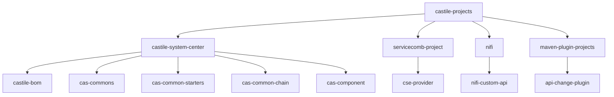
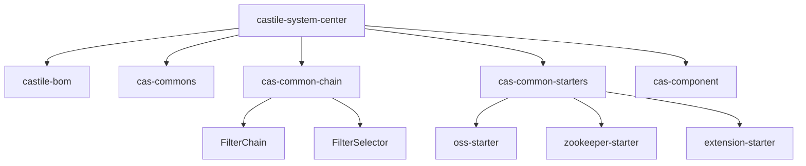
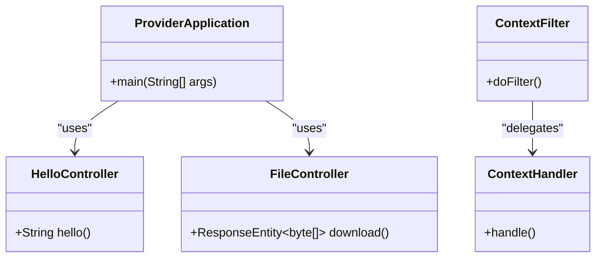
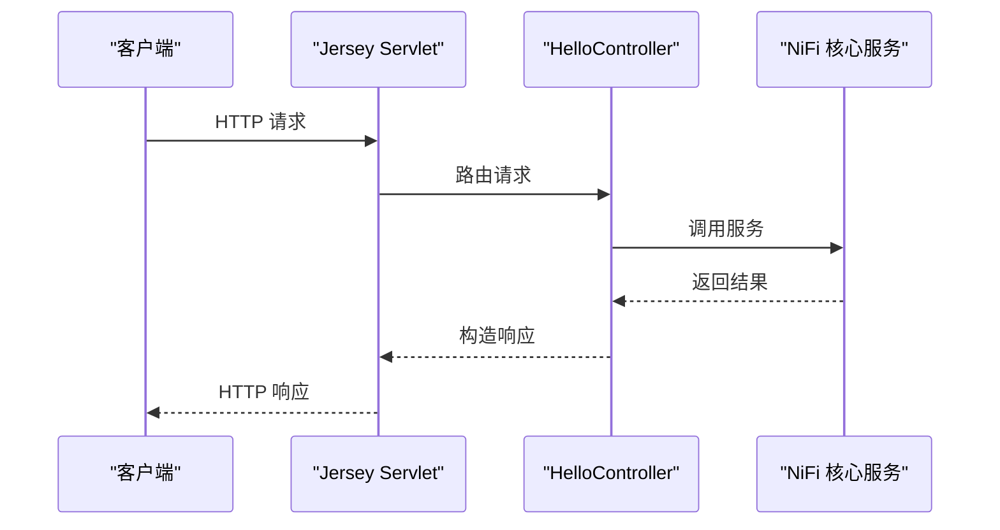
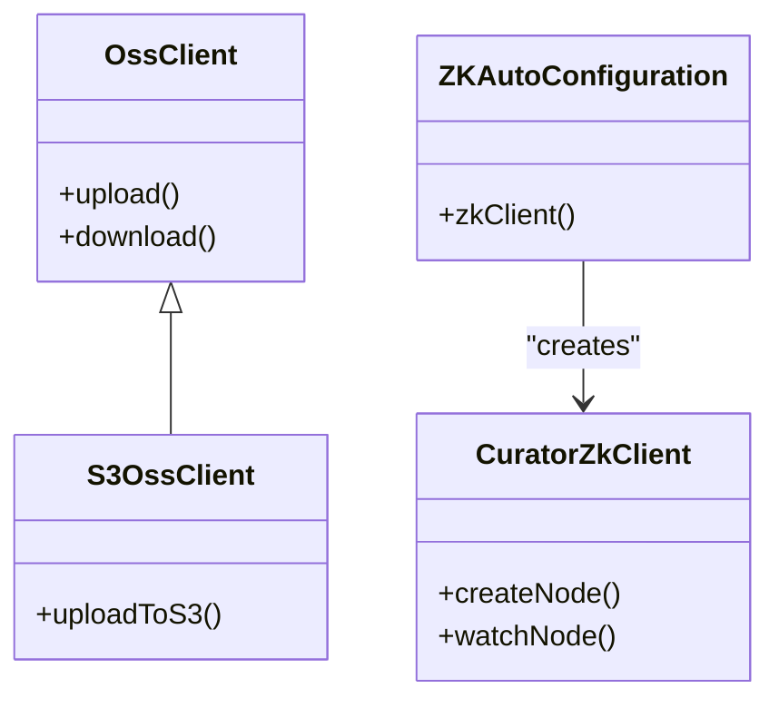
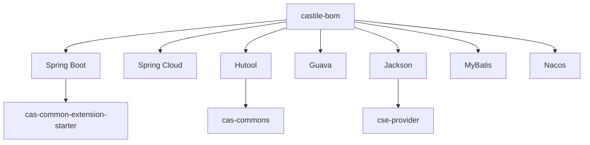

# 项目概述

<cite>
**本文档引用文件**  
- [pom.xml](file://pom.xml)
- [castile-system-center/pom.xml](file://castile-system-center/pom.xml)
- [servicecomb-project/pom.xml](file://servicecomb-project/pom.xml)
- [nifi/pom.xml](file://nifi/pom.xml)
- [maven-plugin-projects/pom.xml](file://maven-plugin-projects/pom.xml)
- [castile-system-center/castile-bom/pom.xml](file://castile-system-center/castile-bom/pom.xml)
- [castile-system-center/cas-common-chain/pom.xml](file://castile-system-center/cas-common-chain/pom.xml)
- [castile-system-center/cas-common-starters/pom.xml](file://castile-system-center/cas-common-starters/pom.xml)
- [castile-system-center/cas-commons/pom.xml](file://castile-system-center/cas-commons/pom.xml)
- [castile-system-center/cas-component/pom.xml](file://castile-system-center/cas-component/pom.xml)
- [servicecomb-project/cse-provider/pom.xml](file://servicecomb-project/cse-provider/pom.xml)
- [nifi/nifi-custom-api/pom.xml](file://nifi/nifi-custom-api/pom.xml)
</cite>

## 目录
1. [项目简介](#项目简介)
2. [多模块Maven架构](#多模块maven架构)
3. [核心系统中心](#核心系统中心)
4. [ServiceComb服务提供者](#servicecomb服务提供者)
5. [NiFi扩展模块](#nifi扩展模块)
6. [Maven插件项目](#maven插件项目)
7. [关键技术特征](#关键技术特征)
8. [依赖管理与技术栈](#依赖管理与技术栈)

## 项目简介

castile-projects 是一个基于 Java 和 Spring 生态的后端微服务集合，采用多模块 Maven 架构进行组织。该项目旨在构建一个可扩展、模块化、高内聚低耦合的微服务基础设施平台，支持多种服务框架（如 ServiceComb）、分布式协调（ZooKeeper）、对象存储（OSS）集成以及自定义 NiFi 扩展能力。项目整体结构清晰，通过 BOM（Bill of Materials）统一管理依赖版本，确保各模块间的技术栈一致性。

**Section sources**
- [pom.xml](file://pom.xml#L1-L52)

## 多模块Maven架构

项目采用典型的多层级 Maven 聚合架构，顶层 `pom.xml` 定义了六大子模块：`my-test`、`castile-system-center`、`servicecomb-project`、`nifi`、`maven-plugin-projects`。其中 `castile-system-center` 作为核心基础设施中心，进一步聚合了多个子系统模块。

**Diagram sources**
- [pom.xml](file://pom.xml#L11-L17)
- [castile-system-center/pom.xml](file://castile-system-center/pom.xml#L13-L19)
- [servicecomb-project/pom.xml](file://servicecomb-project/pom.xml#L14-L16)
- [nifi/pom.xml](file://nifi/pom.xml#L15-L19)
- [maven-plugin-projects/pom.xml](file://maven-plugin-projects/pom.xml#L14-L16)

**Section sources**
- [pom.xml](file://pom.xml#L1-L52)
- [castile-system-center/pom.xml](file://castile-system-center/pom.xml#L1-L46)
- [servicecomb-project/pom.xml](file://servicecomb-project/pom.xml#L1-L70)
- [nifi/pom.xml](file://nifi/pom.xml#L1-L112)
- [maven-plugin-projects/pom.xml](file://maven-plugin-projects/pom.xml#L1-L22)

## 核心系统中心

`castile-system-center` 是整个项目的基础设施核心，包含多个关键子模块：

- **castile-bom**：定义统一依赖版本的 BOM 模块，集中管理 Spring Boot、Spring Cloud、Hutool、Jackson 等主流框架的版本。
- **cas-commons**：基础工具类库，集成 Guava、Hutool、Jackson 等常用工具，提供 ZooKeeper 客户端封装。
- **cas-common-chain**：基于责任链模式实现的通用过滤器链框架，支持动态选择器（FilterSelector）和可扩展的过滤器（Filter）机制。
- **cas-common-starters**：Spring Boot 自动配置 Starter 集合，包含 OSS、ZooKeeper 和扩展执行器等自动装配模块。
- **cas-component**：组件化模块容器，用于组织测试工具等通用组件。

**Diagram sources**
- [castile-system-center/pom.xml](file://castile-system-center/pom.xml#L13-L19)
- [castile-system-center/castile-bom/pom.xml](file://castile-system-center/castile-bom/pom.xml#L1-L147)
- [castile-system-center/cas-common-chain/pom.xml](file://castile-system-center/cas-common-chain/pom.xml#L1-L25)
- [castile-system-center/cas-common-starters/pom.xml](file://castile-system-center/cas-common-starters/pom.xml#L1-L19)

**Section sources**
- [castile-system-center/pom.xml](file://castile-system-center/pom.xml#L1-L46)
- [castile-system-center/castile-bom/pom.xml](file://castile-system-center/castile-bom/pom.xml#L1-L147)
- [castile-system-center/cas-commons/pom.xml](file://castile-system-center/cas-commons/pom.xml#L1-L75)
- [castile-system-center/cas-common-chain/pom.xml](file://castile-system-center/cas-common-chain/pom.xml#L1-L25)
- [castile-system-center/cas-common-starters/pom.xml](file://castile-system-center/cas-common-starters/pom.xml#L1-L19)
- [castile-system-center/cas-component/pom.xml](file://castile-system-center/cas-component/pom.xml#L1-L34)

## ServiceComb服务提供者

`servicecomb-project` 模块展示了基于 Apache ServiceComb 的微服务实现。其核心模块 `cse-provider` 集成 Java Chassis 框架，支持服务注册与发现（对接 Service Center）、RESTful API 提供、Swagger 接口验证等功能。该模块通过 Spring Boot 启动器方式集成，体现了 ServiceComb 与 Spring 生态的融合能力。

**Diagram sources**
- [servicecomb-project/cse-provider/pom.xml](file://servicecomb-project/cse-provider/pom.xml#L1-L68)
- [servicecomb-project/cse-provider/src/main/java/com/castile/ProviderApplication.java](file://servicecomb-project/cse-provider/src/main/java/com/castile/ProviderApplication.java)
- [servicecomb-project/cse-provider/src/main/java/com/castile/samples/HelloController.java](file://servicecomb-project/cse-provider/src/main/java/com/castile/samples/HelloController.java)

**Section sources**
- [servicecomb-project/pom.xml](file://servicecomb-project/pom.xml#L1-L70)
- [servicecomb-project/cse-provider/pom.xml](file://servicecomb-project/cse-provider/pom.xml#L1-L68)

## NiFi扩展模块

`nifi` 模块包含对 Apache NiFi 的自定义扩展支持，主要通过 `nifi-custom-api` 实现自定义 Web API。该模块打包为 WAR 文件，依赖 NiFi 的 Jetty 容器运行，使用 Jersey 实现 JAX-RS 接口，并通过 Spring 集成上下文管理。此设计允许在 NiFi 服务内部暴露 REST 接口，实现与外部系统的集成。

**Diagram sources**
- [nifi/pom.xml](file://nifi/pom.xml#L1-L112)
- [nifi/nifi-custom-api/pom.xml](file://nifi/nifi-custom-api/pom.xml#L1-L116)
- [nifi/nifi-custom-api/src/main/java/org/apache/nifi/api/HelloController.java](file://nifi/nifi-custom-api/src/main/java/org/apache/nifi/api/HelloController.java)

**Section sources**
- [nifi/pom.xml](file://nifi/pom.xml#L1-L112)
- [nifi/nifi-custom-api/pom.xml](file://nifi/nifi-custom-api/pom.xml#L1-L116)

## Maven插件项目

`maven-plugin-projects` 模块包含自定义 Maven 插件 `api-change-plugin`，用于在构建过程中执行特定逻辑（如 API 变更检测）。该模块遵循 Maven 插件开发规范，支持集成测试（IT）和 Groovy 验证脚本，体现了项目对构建流程自动化的重视。

**Section sources**
- [maven-plugin-projects/pom.xml](file://maven-plugin-projects/pom.xml#L1-L22)

## 关键技术特征

### 责任链模式
`cas-common-chain` 模块实现了典型的职责链设计模式，通过 `FilterChainPipeline` 组织多个 `Filter` 执行，支持运行时动态选择（`FilterSelector`），适用于订单处理、权限校验等场景。

### 自动配置Starter组件
`cas-common-starters` 提供多个 Spring Boot Starter：
- `cas-common-oss-starter`：集成 AWS S3 客户端，支持对象存储操作
- `cas-common-zookeeper-starter`：基于 Curator 封装 ZooKeeper 客户端，实现自动配置
- `cas-common-extension-starter`：提供服务执行器扩展机制，支持策略模式

### OSS/ZooKeeper集成
通过 Starter 模块实现与外部中间件的无缝集成：
- OSS 模块使用 `aws-java-sdk-s3` 实现对象存储客户端
- ZooKeeper 模块使用 `curator-framework` 和 `curator-recipes` 实现分布式协调

**Diagram sources**
- [castile-system-center/cas-common-starters/cas-common-oss-starter/pom.xml](file://castile-system-center/cas-common-starters/cas-common-oss-starter/pom.xml#L1-L64)
- [castile-system-center/cas-common-starters/cas-common-zookeeper-starter/pom.xml](file://castile-system-center/cas-common-starters/cas-common-zookeeper-starter/pom.xml#L1-L83)

**Section sources**
- [castile-system-center/cas-common-chain/pom.xml](file://castile-system-center/cas-common-chain/pom.xml#L1-L25)
- [castile-system-center/cas-common-starters/cas-common-extension-starter/pom.xml](file://castile-system-center/cas-common-starters/cas-common-extension-starter/pom.xml#L1-L87)
- [castile-system-center/cas-common-starters/cas-common-oss-starter/pom.xml](file://castile-system-center/cas-common-starters/cas-common-oss-starter/pom.xml#L1-L64)
- [castile-system-center/cas-common-starters/cas-common-zookeeper-starter/pom.xml](file://castile-system-center/cas-common-starters/cas-common-zookeeper-starter/pom.xml#L1-L83)

## 依赖管理与技术栈

项目通过 `castile-bom` 统一管理依赖版本，涵盖：
- **Spring 生态**：Spring Boot 3.3.3、Spring Cloud 2021.0.5
- **工具库**：Hutool 5.8.22、Guava 33.3.1-jre、Jackson 2.18.1
- **中间件**：Nacos 配置中心、MyBatis
- **开发工具**：Lombok、Swagger 2.9.2

各模块通过 `<dependencyManagement>` 导入 BOM，确保版本一致性。同时，项目支持 Java 21 编译，体现了对现代 Java 版本的支持。

**Diagram sources**
- [castile-system-center/castile-bom/pom.xml](file://castile-system-center/castile-bom/pom.xml#L1-L147)

**Section sources**
- [castile-system-center/castile-bom/pom.xml](file://castile-system-center/castile-bom/pom.xml#L1-L147)
- [castile-system-center/cas-commons/pom.xml](file://castile-system-center/cas-commons/pom.xml#L1-L75)
- [castile-system-center/cas-common-starters/cas-common-extension-starter/pom.xml](file://castile-system-center/cas-common-starters/cas-common-extension-starter/pom.xml#L1-L87)
- [servicecomb-project/cse-provider/pom.xml](file://servicecomb-project/cse-provider/pom.xml#L1-L68)